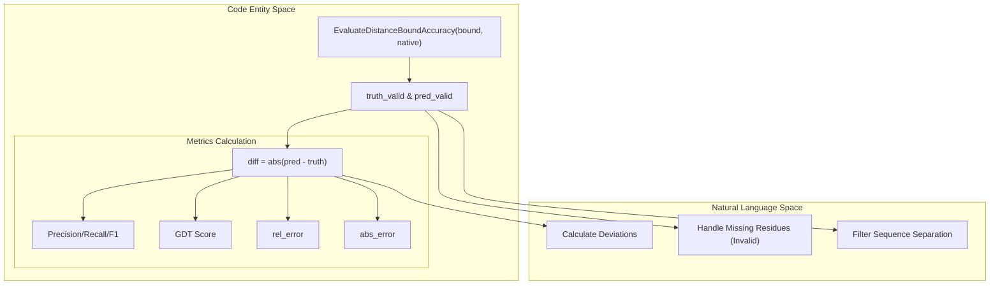

# Distance Utility Functions

> **Relevant source files**
> * [DL4DistancePrediction2/DistanceUtils.py](https://github.com/j3xugit/RaptorX-Contact/blob/7c9de508/DL4DistancePrediction2/DistanceUtils.py)

The `DistanceUtils.py` module provides a comprehensive suite of utility functions for handling distance-based data in RaptorX-Contact. This includes loading predicted probability distributions, discretizing continuous distance matrices into categorical bins, evaluating prediction accuracy against native structures using metrics like GDT, and performing statistical corrections for range-based bias.

### Core Data Structures and Formats

Distance data is typically handled in three formats:

1. **Continuous Matrices**: $L \times L$ matrices containing raw distance values in Angstroms.
2. **Discrete Probabilities**: $L \times L \times N$ tensors where $N$ represents distance bins (e.g., 25C, 52C).
3. **Distance Bounds**: Dictionaries containing estimated distance values (usually the first bin of a probability distribution) and sequence information.

Sources: `DL4DistancePrediction2/DistanceUtils.py` [10-26](https://github.com/j3xugit/RaptorX-Contact/blob/7c9de508/10-26)

 [156-170](https://github.com/j3xugit/RaptorX-Contact/blob/7c9de508/156-170)

---

### Distance Discretization and Binning

The system supports various binning schemes defined in `config.py`. The `DiscretizeDistMatrix` function transforms raw atomic distances into discrete labels based on these predefined thresholds.

| Function | Role | Implementation Details |
| --- | --- | --- |
| `DiscretizeDistMatrix` | Continuous to Discrete | Uses `np.digitize` to map distances to bin indices. Handles invalid distances (e.g., < 0) by either merging them into the last bin or separating them. |
| `MergeDistanceBins` | Bin Reduction | Aggregates a high-resolution probability matrix (e.g., 52 bins) into a lower-resolution one (e.g., 25 bins) by summing probabilities across index ranges. |
| `LabelsOfOneDistance` | Distance to Index | Maps a specific float distance to its corresponding bin index based on a provided cutoff list. |

**Natural Language to Code Entity Space: Discretization Flow**

Sources: `DL4DistancePrediction2/DistanceUtils.py` [133-152](https://github.com/j3xugit/RaptorX-Contact/blob/7c9de508/133-152)

 [156-171](https://github.com/j3xugit/RaptorX-Contact/blob/7c9de508/156-171)

 [213-222](https://github.com/j3xugit/RaptorX-Contact/blob/7c9de508/213-222)

---

### Statistical Weighting and Probability Correction

Because distance distributions vary significantly based on sequence separation (Near, Short, Medium, Long, Extra-Long), the system applies range-based corrections to predicted probabilities.

#### FixDistProb

This function corrects the `originalProb` matrix using training-time `labelWeight` and `refProb` (background distribution). It ensures that the predicted probabilities are adjusted for the specific range-based bias introduced during model training.

1. Calculates `newRefProb` by element-wise multiplication of weights and background probabilities.
2. Iterates through every residue pair $(i, j)$.
3. Identifies the `rangeIndex` via `config.GetRangeIndex(abs(i-j))`.
4. Applies the correction formula: `tmpProb = originalProb * refProb / newRefProb`.
5. Normalizes the resulting vector so it sums to 1.

#### CalcLabelWeight

Calculates the statistical weights for each label across different separation ranges. It uses the inverse of the label frequency (`1/freq`) and applies a power-law scaling (default `power=0.5`) to prevent extreme weights from dominating the loss function.

Sources: `DL4DistancePrediction2/DistanceUtils.py` [110-129](https://github.com/j3xugit/RaptorX-Contact/blob/7c9de508/110-129)

 [201-211](https://github.com/j3xugit/RaptorX-Contact/blob/7c9de508/201-211)

---

### Evaluation Metrics and Accuracy

The `EvaluateDistanceBoundAccuracy` function is the primary entry point for benchmarking distance predictions against native structures.

#### Sequence Separation Categories

Evaluation is categorized by the distance between residues in the sequence:

* **Near-range**: $1 \leq |i-j| < 6$
* **Short-range**: $6 \leq |i-j| < 12$
* **Medium-range**: $12 \leq |i-j| < 24$
* **Long-range**: $|i-j| \geq 24$

#### Computed Metrics

For a predicted distance $d_p$ and native distance $d_t$:

* **Absolute Error**: $\frac{\sum |d_p - d_t|}{\text{valid_count}}$
* **Relative Error**: $\frac{\sum (|d_p - d_t| / \text{avg_dist})}{\text{valid_count}}$
* **GDT-like Score**: A similarity metric where pairs are rewarded based on distance thresholds: * Score 1.0 if $|d_p - d_t| < 1\text{Å}$ * Score 0.5 if $|d_p - d_t| < 2\text{Å}$ * Score 0.25 if $|d_p - d_t| < 4\text{Å}$ * Score 0.125 if $|d_p - d_t| < 8\text{Å}$

**Distance Evaluation Logic**

Sources: `DL4DistancePrediction2/DistanceUtils.py` [27-101](https://github.com/j3xugit/RaptorX-Contact/blob/7c9de508/27-101)

 [189-199](https://github.com/j3xugit/RaptorX-Contact/blob/7c9de508/189-199)

---

### Utility Function Summary

| Function | File:Lines | Description |
| --- | --- | --- |
| `LoadRawDistProbFile` | `DistanceUtils.py:10-23` | Deserializes `.predictedDistMatrix.pkl` files using `cPickle`. |
| `FixDistProb` | `DistanceUtils.py:110-129` | Adjusts predicted probabilities based on background distributions and training weights. |
| `MergeDistanceBins` | `DistanceUtils.py:133-152` | Down-samples distance bin resolution (e.g., 52 bins to 25 bins). |
| `DiscretizeDistMatrix` | `DistanceUtils.py:156-171` | Converts continuous distance values into categorical labels for classification tasks. |
| `LogDistMatrix` | `DistanceUtils.py:173-177` | Computes the natural logarithm of a distance matrix with a floor of $1/e$. |
| `CalcLabelProb` | `DistanceUtils.py:189-199` | Calculates label frequency distributions across sequence separation ranges. |
| `CalcLabelWeight` | `DistanceUtils.py:201-211` | Derives training weights from label frequencies to handle class imbalance. |

Sources: `DL4DistancePrediction2/DistanceUtils.py` [1-222](https://github.com/j3xugit/RaptorX-Contact/blob/7c9de508/1-222)