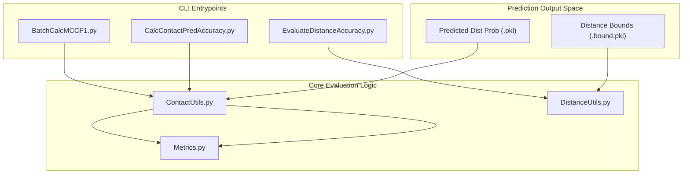

# Evaluation and Metrics

> **Relevant source files**
> * [DL4DistancePrediction2/ContactUtils.py](https://github.com/j3xugit/RaptorX-Contact/blob/7c9de508/DL4DistancePrediction2/ContactUtils.py)
> * [DL4DistancePrediction2/Metrics.py](https://github.com/j3xugit/RaptorX-Contact/blob/7c9de508/DL4DistancePrediction2/Metrics.py)

The **RaptorX-Contact** evaluation framework provides a comprehensive suite of tools for assessing the quality of predicted protein contact and distance maps. The system compares predicted probability distributions or discrete values against ground-truth structures (typically derived from PDB files) using standard bioinformatics metrics such as Top-L precision, Matthew’s Correlation Coefficient (MCC), and F1 scores.

The framework is divided into two primary domains: **Contact Evaluation**, which focuses on binary classification (residues within 8Å), and **Distance Evaluation**, which assesses the accuracy of predicted inter-residue distance bounds and continuous distributions.

## Evaluation Workflow Overview

The evaluation pipeline typically ingests predicted probability matrices (often in `.pkl` or `.bound.pkl` formats) and compares them to native distance matrices. The following diagram illustrates the relationship between the core evaluation modules and the prediction outputs.

### Evaluation System Architecture



**Sources:** [DL4DistancePrediction2/ContactUtils.py L189-L206](https://github.com/j3xugit/RaptorX-Contact/blob/7c9de508/DL4DistancePrediction2/ContactUtils.py#L189-L206)

 [DL4DistancePrediction2/Metrics.py L1-L16](https://github.com/j3xugit/RaptorX-Contact/blob/7c9de508/DL4DistancePrediction2/Metrics.py#L1-L16)

---

## Contact Prediction Evaluation

Contact evaluation focuses on the binary prediction of whether two residues are within a specific distance threshold (usually 8Å). The system supports standard CASP (Critical Assessment of Structure Prediction) formats and computes precision based on sequence separation categories.

### Key Capabilities:

* **Top-L/k Accuracy:** Computes precision for the top $L/k$ predicted contacts (where $L$ is sequence length).
* **Sequence Separation:** Metrics are broken down into Short-range (6-11 residues), Medium-range (12-23), Long-range ($\ge$ 24), and Extra-long-range categories.
* **Format Conversion:** Tools for loading and saving matrices in CASP RR format.

For implementation details on precision calculation and CASP formatting, see **[Contact Prediction Evaluation](/j3xugit/RaptorX-Contact/6.1-contact-prediction-evaluation)**.

**Sources:** [DL4DistancePrediction2/ContactUtils.py L106-L186](https://github.com/j3xugit/RaptorX-Contact/blob/7c9de508/DL4DistancePrediction2/ContactUtils.py#L106-L186)

 [DL4DistancePrediction2/ContactUtils.py L206-L221](https://github.com/j3xugit/RaptorX-Contact/blob/7c9de508/DL4DistancePrediction2/ContactUtils.py#L206-L221)

---

## Distance Bound Accuracy Evaluation

Unlike binary contacts, distance evaluation assesses the accuracy of predicted distance ranges or specific bounds. This is critical for downstream folding algorithms like CNS or Rosetta that require precise spatial constraints.

### Key Metrics:

* **Absolute and Relative Error:** Measuring the deviation of predicted means from native distances.
* **GDT-like Scores:** Assessing the percentage of residue pairs predicted within specific error tolerances.
* **Bound Accuracy:** Evaluating how often the native distance falls within the predicted $[lower, upper]$ bounds.

For details on error metrics and distance bin handling, see **[Distance Bound Accuracy Evaluation](/j3xugit/RaptorX-Contact/6.2-distance-bound-accuracy-evaluation)**.

**Sources:** [DL4DistancePrediction2/DistanceUtils.py L1-L20](https://github.com/j3xugit/RaptorX-Contact/blob/7c9de508/DL4DistancePrediction2/DistanceUtils.py#L1-L20)

 (implied by file role).

---

## Core Metrics Library

The `Metrics.py` module serves as the low-level mathematical engine for the evaluation framework. It provides numerically stable implementations of fundamental statistical metrics used across both contact and distance evaluation.

### Metrics Implementation

| Metric | Function | Inputs | Description |
| --- | --- | --- | --- |
| **F1 Score** | `F1()` | TP, FP, TN, FN | Harmonic mean of precision and recall. |
| **MCC** | `MCC()` | TP, FP, TN, FN | Matthews Correlation Coefficient for binary classification quality. |
| **Precision** | Derived in `F1()` | TP, FP | Ratio of true positives to all positive predictions. |
| **Recall** | Derived in `F1()` | TP, FN | Ratio of true positives to all actual positives. |

### Mathematical Stability

The library uses an `epsilon` value ($10^{-6}$) to prevent division-by-zero errors during calculation:

```python
# Example from Metrics.pyprecision = TP*1./(TP+FP + epsilon)
```

For the complete API reference of the metrics library, see **[Core Metrics Library](/j3xugit/RaptorX-Contact/6.3-core-metrics-library)**.

**Sources:** [DL4DistancePrediction2/Metrics.py L3-L16](https://github.com/j3xugit/RaptorX-Contact/blob/7c9de508/DL4DistancePrediction2/Metrics.py#L3-L16)

---

## CLI Tools for Evaluation

The codebase provides several command-line interfaces for running evaluations on single proteins or entire datasets.

### Primary CLI Utilities

| Script | Purpose |
| --- | --- |
| `CalcContactPredAccuracy.py` | Evaluates Top-L precision for a single prediction. |
| `BatchEvaluateContactAccuracy.py` | Aggregates precision metrics across a list of proteins. |
| `CalcMCCF1.py` | Computes MCC and F1 scores at a specific probability cutoff. |
| `EvaluateDistanceAccuracy.py` | Evaluates bound accuracy and absolute error for distance predictions. |

**Sources:** [DL4DistancePrediction2/ContactUtils.py L11-L23](https://github.com/j3xugit/RaptorX-Contact/blob/7c9de508/DL4DistancePrediction2/ContactUtils.py#L11-L23)

 [DL4DistancePrediction2/ContactUtils.py L206-L215](https://github.com/j3xugit/RaptorX-Contact/blob/7c9de508/DL4DistancePrediction2/ContactUtils.py#L206-L215)