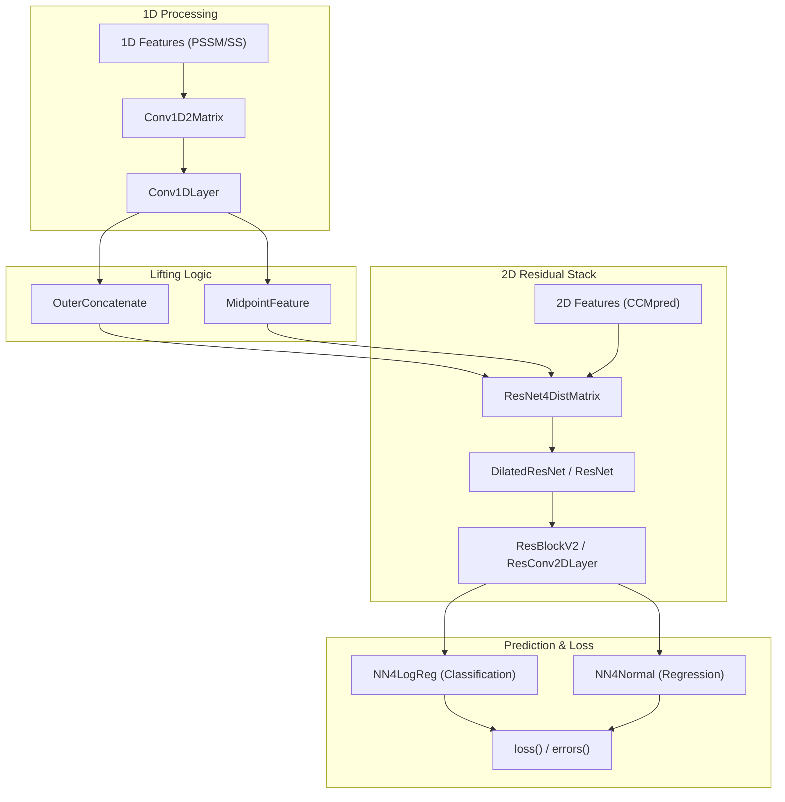
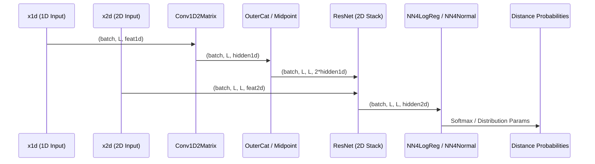

# Full Model Assembly: ResNet4DistMatrix

> **Relevant source files**
> - [DL4DistancePrediction2/Model4DistancePrediction\.py](https://github.com/j3xugit/RaptorX-Contact/blob/7c9de508/DL4DistancePrediction2/Model4DistancePrediction.py)

 The `ResNet4DistMatrix` model is the central neural architecture of RaptorX\-Contact, responsible for transforming 1D sequence\-based features and 2D evolutionary coupling data into spatial distance maps\. It implements a hybrid architecture that performs 1D convolutions, lifts sequence features into a 2D representation, and applies deep residual learning for final distance prediction\.

## Model Factory: BuildModel\(\)

 The `BuildModel()` function serves as the entrypoint for instantiating the distance prediction network\. It determines which architectural variant to use based on the `modelSpecs` configuration [Model4DistancePrediction\.py L651-L665](https://github.com/j3xugit/RaptorX-Contact/blob/7c9de508/DL4DistancePrediction2/Model4DistancePrediction.py#L651-L665)

| Parameter | Role |
| --- | --- |
| modelSpecs | A dictionary containing architecture hyperparameters \(e\.g\., n\_blocks, n\_hiddens, conv1d\_hiddens\)\. |
| x1d | Theano tensor3 representing 1D features \(batch, length, features\)\. |
| x2d | Theano tensor4 representing 2D features \(batch, length, length, features\)\. |
| y | Theano tensor for distance labels\. |
| w | Theano tensor for sample/pixel weights\. |

 Sources: [Model4DistancePrediction\.py L651-L665](https://github.com/j3xugit/RaptorX-Contact/blob/7c9de508/DL4DistancePrediction2/Model4DistancePrediction.py#L651-L665)

## ResNet4DistMatrix Architecture

 The `ResNet4DistMatrix` class manages the end\-to\-end data flow, regularization, and multi\-task loss calculation\.

### 1D\-to\-2D Dimensionality Lifting

 The model processes 1D features \(like PSSM or secondary structure\) through `Conv1D2Matrix` [Model4DistancePrediction\.py L24-L69](https://github.com/j3xugit/RaptorX-Contact/blob/7c9de508/DL4DistancePrediction2/Model4DistancePrediction.py#L24-L69) and lifts them to 2D using one of two methods:

 1. **OuterConcatenate**: For every pair of residues $\(i, j\)$, it concatenates the 1D features at position $i$ and position $j$ [utils\.py L16-L29](https://github.com/j3xugit/RaptorX-Contact/blob/7c9de508/DL4DistancePrediction2/utils.py#L16-L29)
2. **MidpointFeature**: Captures features from the midpoint between residues $i$ and $j$ to provide context for long\-range interactions [utils\.py L31-L48](https://github.com/j3xugit/RaptorX-Contact/blob/7c9de508/DL4DistancePrediction2/utils.py#L31-L48)

### Residual Learning Stack

 The 2D representation \(lifted 1D features \+ raw 2D features\) is passed through a stack of Residual Blocks\. The implementation supports two primary variants:

 - **Standard ResNet**: Uses `ResNet4Distance.py` with blocks containing 2D convolutions, batch normalization, and ReLU activations [ResNet4Distance\.py L265-L316](https://github.com/j3xugit/RaptorX-Contact/blob/7c9de508/DL4DistancePrediction2/ResNet4Distance.py#L265-L316)
- **Dilated ResNet**: Uses `DilatedResNet4Distance.py` to increase the receptive field without increasing parameter count, which is crucial for capturing long\-range spatial constraints in large proteins [DilatedResNet4Distance\.py L461-L512](https://github.com/j3xugit/RaptorX-Contact/blob/7c9de508/DL4DistancePrediction2/DilatedResNet4Distance.py#L461-L512)

### Prediction Heads

 The final layer of the ResNet stack is fed into one or more prediction heads defined in `self.logreg_layers` [Model4DistancePrediction\.py L389-L405](https://github.com/j3xugit/RaptorX-Contact/blob/7c9de508/DL4DistancePrediction2/Model4DistancePrediction.py#L389-L405) These heads support:

 - **Discrete Classification**: Uses `NN4LogReg` to predict distance bins \(e\.g\., 25\-class or 52\-class\) [NN4LogReg\.py L11-L46](https://github.com/j3xugit/RaptorX-Contact/blob/7c9de508/DL4DistancePrediction2/NN4LogReg.py#L11-L46)
- **Continuous Regression**: Uses `NN4Normal` to predict the parameters of a Normal or Log\-Normal distribution for atom distances [NN4Normal\.py L14-L61](https://github.com/j3xugit/RaptorX-Contact/blob/7c9de508/DL4DistancePrediction2/NN4Normal.py#L14-L61)

 Sources: [Model4DistancePrediction\.py L309-L405](https://github.com/j3xugit/RaptorX-Contact/blob/7c9de508/DL4DistancePrediction2/Model4DistancePrediction.py#L309-L405) [utils\.py L16-L48](https://github.com/j3xugit/RaptorX-Contact/blob/7c9de508/DL4DistancePrediction2/utils.py#L16-L48) [ResNet4Distance\.py L265-L316](https://github.com/j3xugit/RaptorX-Contact/blob/7c9de508/DL4DistancePrediction2/ResNet4Distance.py#L265-L316)

## Entity Mapping: Logic to Code

 The following diagram maps the high\-level architectural components to their specific class implementations within the codebase\.

### Architecture Entity Map

 Sources: [Model4DistancePrediction\.py L24-L82](https://github.com/j3xugit/RaptorX-Contact/blob/7c9de508/DL4DistancePrediction2/Model4DistancePrediction.py#L24-L82) [ResNet4Distance\.py L265-L316](https://github.com/j3xugit/RaptorX-Contact/blob/7c9de508/DL4DistancePrediction2/ResNet4Distance.py#L265-L316) [NN4LogReg\.py L11-L20](https://github.com/j3xugit/RaptorX-Contact/blob/7c9de508/DL4DistancePrediction2/NN4LogReg.py#L11-L20)

## Loss Calculation and Regularization

 The model aggregates parameters from all constituent layers to facilitate global regularization and multi\-task optimization\.

### Parameter Aggregation

 The `ResNet4DistMatrix` class maintains `self.params`, `self.paramL1`, and `self.paramL2` by recursively summing the parameters and norms from the 1D convolution layers, the ResNet stack, and the logistic regression heads [Model4DistancePrediction\.py L408-L419](https://github.com/j3xugit/RaptorX-Contact/blob/7c9de508/DL4DistancePrediction2/Model4DistancePrediction.py#L408-L419)

### Masking Strategy

 To handle variable\-length sequences in a batch, the model uses a masking strategy\. Masks are applied during:

 - **1D Convolution**: Zeroing out padding positions in `Conv1DLayer` [Conv1d\.py L53-L57](https://github.com/j3xugit/RaptorX-Contact/blob/7c9de508/DL4DistancePrediction2/Conv1d.py#L53-L57)
- **2D Convolution**: The `Conv2D4DistMatrix` class applies masks to both horizontal and vertical dimensions of the 2D feature map to ensure padding does not influence the gradients [Model4DistancePrediction\.py L143-L156](https://github.com/j3xugit/RaptorX-Contact/blob/7c9de508/DL4DistancePrediction2/Model4DistancePrediction.py#L143-L156)

### Performance Evaluation

 The `TopAccuracyByRange()` method computes the precision of contact predictions \(Top\-L, Top\-L/2, etc\.\) across different sequence separation ranges:

 - **Short\-range**: $6 \\le \|i\-j\| < 12$
- **Medium\-range**: $12 \\le \|i\-j\| < 24$
- **Long\-range**: $\|i\-j\| \\ge 24$

 This evaluation is performed by identifying the bin corresponding to the 8Å threshold in the discrete distance distribution [Model4DistancePrediction\.py L536-L559](https://github.com/j3xugit/RaptorX-Contact/blob/7c9de508/DL4DistancePrediction2/Model4DistancePrediction.py#L536-L559)

 Sources: [Model4DistancePrediction\.py L408-L419](https://github.com/j3xugit/RaptorX-Contact/blob/7c9de508/DL4DistancePrediction2/Model4DistancePrediction.py#L408-L419) [Model4DistancePrediction\.py L143-L156](https://github.com/j3xugit/RaptorX-Contact/blob/7c9de508/DL4DistancePrediction2/Model4DistancePrediction.py#L143-L156) [Model4DistancePrediction\.py L536-L559](https://github.com/j3xugit/RaptorX-Contact/blob/7c9de508/DL4DistancePrediction2/Model4DistancePrediction.py#L536-L559)

## Data Flow: Feature to Prediction

 The following diagram illustrates the transformation of input tensors through the network layers\.

### Data Flow Diagram

 Sources: [Model4DistancePrediction\.py L346-L387](https://github.com/j3xugit/RaptorX-Contact/blob/7c9de508/DL4DistancePrediction2/Model4DistancePrediction.py#L346-L387) [utils\.py L16-L29](https://github.com/j3xugit/RaptorX-Contact/blob/7c9de508/DL4DistancePrediction2/utils.py#L16-L29) [ResNet4Distance\.py L328-L350](https://github.com/j3xugit/RaptorX-Contact/blob/7c9de508/DL4DistancePrediction2/ResNet4Distance.py#L328-L350)

