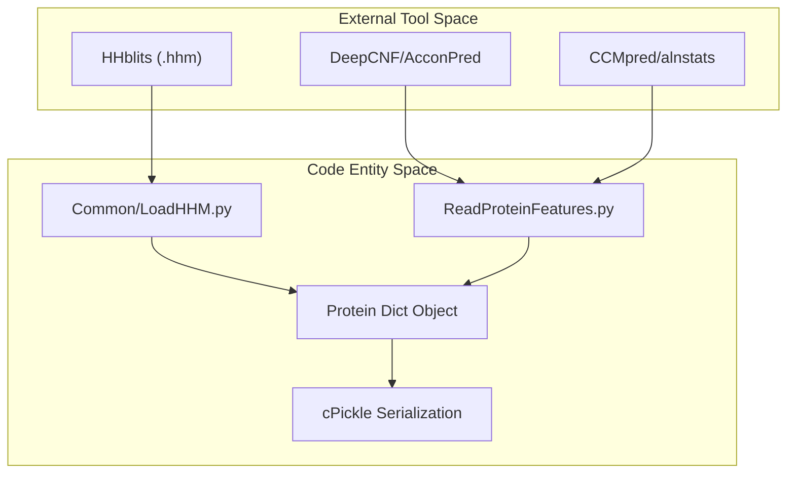
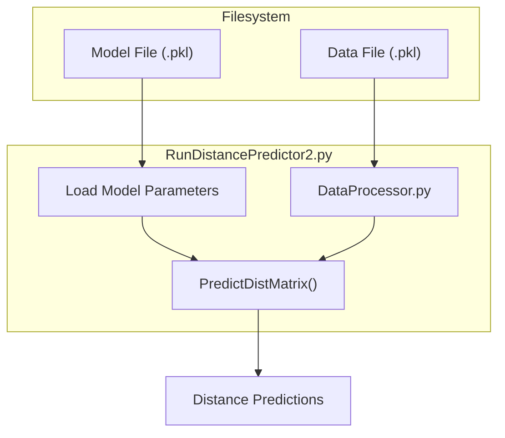

# Getting Started: Installation and Input Requirements

> **Relevant source files**
> * [LICENSE](https://github.com/j3xugit/RaptorX-Contact/blob/7c9de508/LICENSE)
> * [README.md](https://github.com/j3xugit/RaptorX-Contact/blob/7c9de508/README.md?plain=1)

This page details the environment setup and data prerequisites for RaptorX-Contact, a deep residual neural network system for protein contact and distance prediction. It covers the necessary software stack, external bioinformatics tools for feature generation, and the internal data structures required for the model to process protein sequences.

## 1. Environment Setup

RaptorX-Contact is built on the **Theano** deep learning framework and requires a specific legacy environment. While the core logic is implemented in Python 2.7, community efforts have explored Python 3 compatibility, but the official repository targets the following stack [README.md L6](https://github.com/j3xugit/RaptorX-Contact/blob/7c9de508/README.md?plain=1#L6-L6)

:

* **Operating System:** Linux (recommended for GPU support and external tool compatibility).
* **Python Environment:** Anaconda for **Python 2.7** [README.md L6](https://github.com/j3xugit/RaptorX-Contact/blob/7c9de508/README.md?plain=1#L6-L6)
* **Deep Learning Framework:** **Theano** [README.md L6](https://github.com/j3xugit/RaptorX-Contact/blob/7c9de508/README.md?plain=1#L6-L6)
* **Bioinformatics Libraries:** **BioPython** [README.md L6](https://github.com/j3xugit/RaptorX-Contact/blob/7c9de508/README.md?plain=1#L6-L6)
* **Hardware:** NVIDIA GPU is highly recommended for both training and inference.

### 1.1 External Dependencies

The system relies on several external tools to generate the 1D and 2D features that serve as input to the ResNet models:

| Tool | Purpose | Source/Reference |
| --- | --- | --- |
| **CCMpred** | Generates 2D residue co-variation matrices. | [README.md L32](https://github.com/j3xugit/RaptorX-Contact/blob/7c9de508/README.md?plain=1#L32-L32) |
| **MetaPSICOV** | Provides `alnstats` for generating pairwise relationship matrices. | [README.md L33](https://github.com/j3xugit/RaptorX-Contact/blob/7c9de508/README.md?plain=1#L33-L33) |
| **DeepCNF** | Predicts 3-state secondary structure confidence scores. | [README.md L30](https://github.com/j3xugit/RaptorX-Contact/blob/7c9de508/README.md?plain=1#L30-L30) |
| **AcconPred** | Predicts solvent accessibility (ACC) scores. | [README.md L31](https://github.com/j3xugit/RaptorX-Contact/blob/7c9de508/README.md?plain=1#L31-L31) |
| **HHblits/PSI-BLAST** | Generates Multiple Sequence Alignments (MSA) and HHM files. | [README.md L29](https://github.com/j3xugit/RaptorX-Contact/blob/7c9de508/README.md?plain=1#L29-L29) |

**Sources:**
[README.md L6](https://github.com/j3xugit/RaptorX-Contact/blob/7c9de508/README.md?plain=1#L6-L6)

 [README.md L29-L33](https://github.com/j3xugit/RaptorX-Contact/blob/7c9de508/README.md?plain=1#L29-L33)

---

## 2. Input Feature Requirements

The model does not operate directly on raw sequences but on a pre-processed feature set. Each protein's data is stored in a Python `dict()` [README.md L35](https://github.com/j3xugit/RaptorX-Contact/blob/7c9de508/README.md?plain=1#L35-L35)

### 2.1 Feature Components

The following features must be generated and aggregated into the input dictionary:

1. **Primary Sequence:** A string of uppercase amino acid letters [README.md L28](https://github.com/j3xugit/RaptorX-Contact/blob/7c9de508/README.md?plain=1#L28-L28)
2. **PSSM/PSFM (1D):** A $L \times 20$ matrix representing position-specific scoring. These can be derived from HHM files using `Common/LoadHHM.py` [README.md L29](https://github.com/j3xugit/RaptorX-Contact/blob/7c9de508/README.md?plain=1#L29-L29)
3. **Secondary Structure (1D):** A $L \times 3$ matrix of confidence scores for Helix, Beta, and Loop [README.md L30](https://github.com/j3xugit/RaptorX-Contact/blob/7c9de508/README.md?plain=1#L30-L30)
4. **Solvent Accessibility (1D):** A $L \times 3$ matrix of confidence scores for solvent exposure [README.md L31](https://github.com/j3xugit/RaptorX-Contact/blob/7c9de508/README.md?plain=1#L31-L31)
5. **CCMpred (2D):** A $L \times L$ matrix normalized by its mean and standard deviation [README.md L32](https://github.com/j3xugit/RaptorX-Contact/blob/7c9de508/README.md?plain=1#L32-L32)
6. **Alnstats (2D):** Three $L \times L$ matrices generated by MetaPSICOV's `alnstats` utility [README.md L33](https://github.com/j3xugit/RaptorX-Contact/blob/7c9de508/README.md?plain=1#L33-L33)

### 2.2 Data Flow: From Raw Tools to Code Entities

The following diagram illustrates how external tool outputs are mapped to the internal data structures and code modules.

**Data Ingestion Pipeline**

**Sources:**
[README.md L27-L36](https://github.com/j3xugit/RaptorX-Contact/blob/7c9de508/README.md?plain=1#L27-L36)

 [Common/LoadHHM.py L1-L10](https://github.com/j3xugit/RaptorX-Contact/blob/7c9de508/Common/LoadHHM.py#L1-L10)

 (implied by path)

---

## 3. Data Dictionary Format

The input to the system, particularly for batch processing and training, is a list of dictionaries saved as a `cPickle` file [README.md L35](https://github.com/j3xugit/RaptorX-Contact/blob/7c9de508/README.md?plain=1#L35-L35)

### 3.1 Key-Value Mappings

| Key | Type | Description |
| --- | --- | --- |
| `name` | String | Protein identifier (e.g., PDB ID) |
| `seqLen` | Integer | Length of the sequence ($L$) |
| `sequence` | String | Amino acid sequence |
| `PSSM` | Array ($L, 20$) | Position Specific Scoring Matrix |
| `SS3` | Array ($L, 3$) | Predicted Secondary Structure (H, E, L) |
| `ACC` | Array ($L, 3$) | Predicted Solvent Accessibility |
| `ccmpredZ` | Array ($L, L$) | Normalized CCMpred matrix |
| `psicovZ` | Array ($L, L$) | Pairwise features from alnstats |

> **Note:** Keys related to disorder information or legacy PSICOV formats are generally not required for the modern ResNet models [README.md L35](https://github.com/j3xugit/RaptorX-Contact/blob/7c9de508/README.md?plain=1#L35-L35)

**Sources:**
[README.md L35-L36](https://github.com/j3xugit/RaptorX-Contact/blob/7c9de508/README.md?plain=1#L35-L36)

---

## 4. Downloading Pre-trained Models

RaptorX-Contact provides pre-trained models for contact and distance prediction. These are essential for users who wish to perform inference without training a new ResNet from scratch.

* **Download Location:** [http://raptorx.uchicago.edu/download/](http://raptorx.uchicago.edu/download/) [README.md L26](https://github.com/j3xugit/RaptorX-Contact/blob/7c9de508/README.md?plain=1#L26-L26)
* **Documentation:** Refer to `0README.models4ContactDistancePrediction.txt` at the download site for specific model versions and their intended use cases [README.md L27](https://github.com/j3xugit/RaptorX-Contact/blob/7c9de508/README.md?plain=1#L27-L27)
* **Model Files:** These are typically provided as serialized Theano parameter files or full model pickles that are loaded by `RunDistancePredictor2.py`.

### 4.1 Model Loading Logic

The inference entry point, `RunDistancePredictor2.py`, handles the initialization of the model architecture and the loading of these pre-trained weights.

**Model Initialization Flow**

**Sources:**
[README.md L26-L27](https://github.com/j3xugit/RaptorX-Contact/blob/7c9de508/README.md?plain=1#L26-L27)

 [RunDistancePredictor2.py L1-L50](https://github.com/j3xugit/RaptorX-Contact/blob/7c9de508/RunDistancePredictor2.py#L1-L50)

 (implied by logic)