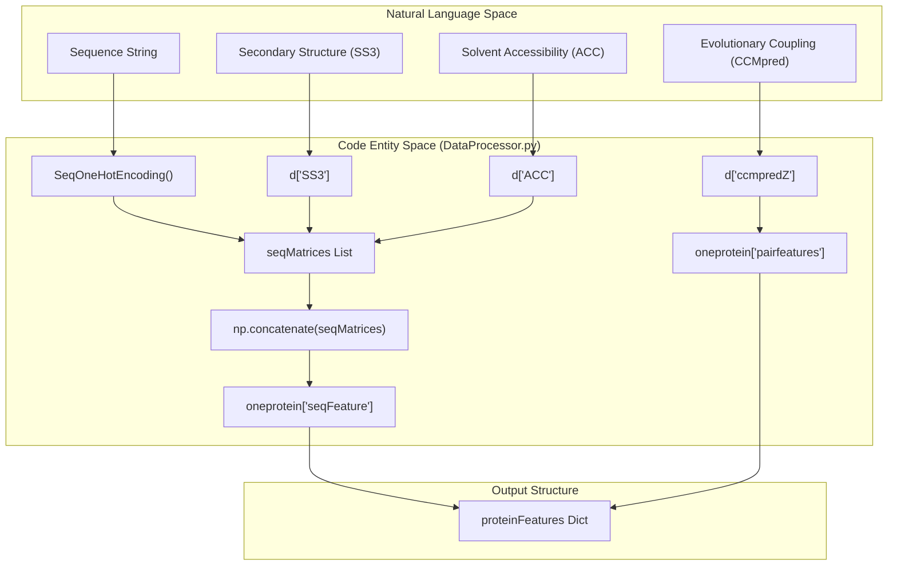
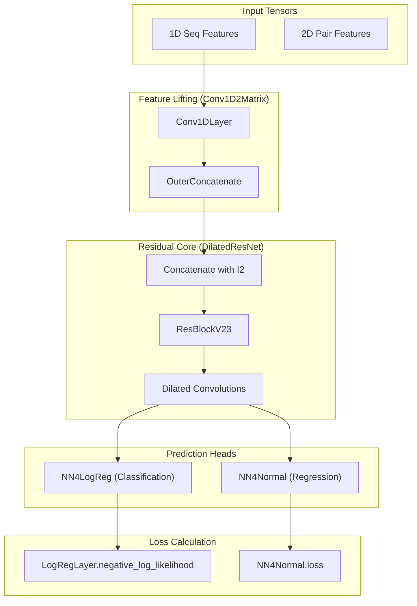

# Glossary

> **Relevant source files**
> * [Common/LoadHHM.py](https://github.com/j3xugit/RaptorX-Contact/blob/7c9de508/Common/LoadHHM.py)
> * [DL4DistancePrediction2/ContactUtils.py](https://github.com/j3xugit/RaptorX-Contact/blob/7c9de508/DL4DistancePrediction2/ContactUtils.py)
> * [DL4DistancePrediction2/DataProcessor.py](https://github.com/j3xugit/RaptorX-Contact/blob/7c9de508/DL4DistancePrediction2/DataProcessor.py)
> * [DL4DistancePrediction2/DistanceUtils.py](https://github.com/j3xugit/RaptorX-Contact/blob/7c9de508/DL4DistancePrediction2/DistanceUtils.py)
> * [DL4DistancePrediction2/Model4DistancePrediction.py](https://github.com/j3xugit/RaptorX-Contact/blob/7c9de508/DL4DistancePrediction2/Model4DistancePrediction.py)
> * [DL4DistancePrediction2/ResNet4Distance.py](https://github.com/j3xugit/RaptorX-Contact/blob/7c9de508/DL4DistancePrediction2/ResNet4Distance.py)
> * [DL4DistancePrediction2/config.py](https://github.com/j3xugit/RaptorX-Contact/blob/7c9de508/DL4DistancePrediction2/config.py)
> * [LICENSE](https://github.com/j3xugit/RaptorX-Contact/blob/7c9de508/LICENSE)
> * [README.md](https://github.com/j3xugit/RaptorX-Contact/blob/7c9de508/README.md?plain=1)

This page provides definitions for the domain-specific terminology, architectural components, and data conventions used within the **RaptorX-Contact** codebase. It serves as a technical reference for onboarding engineers to understand the mapping between structural biology concepts and their implementation in Theano-based deep learning models.

## Domain Concepts and Abbreviations

| Term | Definition | Code Reference |
| --- | --- | --- |
| **APT** | **Atom Pair Type**. Refers to the specific atoms between two residues for which distance is being predicted (e.g., Cb-Cb, Ca-Ca). | [DL4DistancePrediction2/config.py L22-L24](https://github.com/j3xugit/RaptorX-Contact/blob/7c9de508/DL4DistancePrediction2/config.py#L22-L24) |
| **CASP RR** | Critical Assessment of Protein Structure Prediction - Residue Range format. A standard text format for contact prediction submissions. | [DL4DistancePrediction2/ContactUtils.py L118-L123](https://github.com/j3xugit/RaptorX-Contact/blob/7c9de508/DL4DistancePrediction2/ContactUtils.py#L118-L123) |
| **CCMpred** | A tool for calculating evolutionary coupling via pseudo-likelihood maximization. Its output is a key 2D feature. | [README.md L32](https://github.com/j3xugit/RaptorX-Contact/blob/7c9de508/README.md?plain=1#L32-L32) |
| **Contact** | Defined in this system as two residues having a $C\beta$ distance $\le 8.0\text{\AA}$. | [DL4DistancePrediction2/config.py L192-L194](https://github.com/j3xugit/RaptorX-Contact/blob/7c9de508/DL4DistancePrediction2/config.py#L192-L194) |
| **L** | The length of the protein primary sequence. Often used to denote tensor dimensions (e.g., $L \times L$ for pairwise features). | [README.md L29](https://github.com/j3xugit/RaptorX-Contact/blob/7c9de508/README.md?plain=1#L29-L29) |
| **Range** | Classification of residue pairs based on sequence separation ($ | i - j |
| **TGT/TPL** | Template-related files containing structural information from homologous proteins used for threading/homology modeling. | [DL4DistancePrediction2/DataProcessor.py L176-L186](https://github.com/j3xugit/RaptorX-Contact/blob/7c9de508/DL4DistancePrediction2/DataProcessor.py#L176-L186) |

**Sources:** [DL4DistancePrediction2/config.py L22-L154](https://github.com/j3xugit/RaptorX-Contact/blob/7c9de508/DL4DistancePrediction2/config.py#L22-L154)

 [README.md L29-L32](https://github.com/j3xugit/RaptorX-Contact/blob/7c9de508/README.md?plain=1#L29-L32)

 [DL4DistancePrediction2/ContactUtils.py L118-L123](https://github.com/j3xugit/RaptorX-Contact/blob/7c9de508/DL4DistancePrediction2/ContactUtils.py#L118-L123)

---

## Architectural Entities

### Feature Transformation

The system transforms 1D sequence features into 2D spatial features using specific lifting operations.

* **OuterConcatenate**: A function that takes a 1D tensor of shape `(batch, seqLen, n_in)` and produces a 2D tensor of shape `(batch, seqLen, seqLen, 2 * n_in)` by concatenating features of residue $i$ and residue $j$. * *Implementation:* [DL4DistancePrediction2/Model4DistancePrediction.py L62-L63](https://github.com/j3xugit/RaptorX-Contact/blob/7c9de508/DL4DistancePrediction2/Model4DistancePrediction.py#L62-L63)
* **MidpointFeature**: An alternative lifting operation that calculates features for the pair $(i, j)$ based on the 1D feature at the sequence midpoint $\frac{i+j}{2}$. * *Reference:* [DL4DistancePrediction2/Model4DistancePrediction.py L18](https://github.com/j3xugit/RaptorX-Contact/blob/7c9de508/DL4DistancePrediction2/Model4DistancePrediction.py#L18-L18)

### Layer Classes

* **ResConv1DLayer / ResConv2DLayer**: The building blocks of the Residual Network. These include convolution, optional activation, and padding-aware masking to ensure that padded zeros do not influence the gradient. * *Implementation:* [DL4DistancePrediction2/ResNet4Distance.py L6-L71](https://github.com/j3xugit/RaptorX-Contact/blob/7c9de508/DL4DistancePrediction2/ResNet4Distance.py#L6-L71)  (1D), [DL4DistancePrediction2/ResNet4Distance.py L74-L146](https://github.com/j3xugit/RaptorX-Contact/blob/7c9de508/DL4DistancePrediction2/ResNet4Distance.py#L74-L146)  (2D).
* **batch_norm**: A custom Batch Normalization implementation that is "mask-aware," meaning it calculates mean and variance only over the valid (non-padded) residues in a batch. * *Implementation:* [DL4DistancePrediction2/ResNet4Distance.py L148-L161](https://github.com/j3xugit/RaptorX-Contact/blob/7c9de508/DL4DistancePrediction2/ResNet4Distance.py#L148-L161)

**Sources:** [DL4DistancePrediction2/Model4DistancePrediction.py L18-L63](https://github.com/j3xugit/RaptorX-Contact/blob/7c9de508/DL4DistancePrediction2/Model4DistancePrediction.py#L18-L63)

 [DL4DistancePrediction2/ResNet4Distance.py L6-L161](https://github.com/j3xugit/RaptorX-Contact/blob/7c9de508/DL4DistancePrediction2/ResNet4Distance.py#L6-L161)

---

## Data Flow: Feature Ingestion to Matrix

The following diagram illustrates the transition from raw biological data formats to the internal `proteinFeatures` dictionary used by `DataProcessor.py`.

### Natural Language to Code Entity Space: Data Ingestion

**Sources:** [DL4DistancePrediction2/DataProcessor.py L124-L205](https://github.com/j3xugit/RaptorX-Contact/blob/7c9de508/DL4DistancePrediction2/DataProcessor.py#L124-L205)

 [README.md L27-L35](https://github.com/j3xugit/RaptorX-Contact/blob/7c9de508/README.md?plain=1#L27-L35)

---

## Model Anatomy: ResNet4DistMatrix

The core model `ResNet4DistMatrix` orchestrates the conversion of 1D features into a 2D distance probability distribution.

### Natural Language to Code Entity Space: Model Architecture

**Sources:** [DL4DistancePrediction2/Model4DistancePrediction.py L24-L68](https://github.com/j3xugit/RaptorX-Contact/blob/7c9de508/DL4DistancePrediction2/Model4DistancePrediction.py#L24-L68)

 [DL4DistancePrediction2/ResNet4Distance.py L240-L300](https://github.com/j3xugit/RaptorX-Contact/blob/7c9de508/DL4DistancePrediction2/ResNet4Distance.py#L240-L300)

 [DL4DistancePrediction2/NN4LogReg.py L65-L75](https://github.com/j3xugit/RaptorX-Contact/blob/7c9de508/DL4DistancePrediction2/NN4LogReg.py#L65-L75)

---

## File Conventions

| Pattern | Description |
| --- | --- |
| `*.predictedDistMatrix.pkl` | A pickled tuple containing `(targetName, sequence, distanceProbDict)`. |
| `*.atomDistMatrix.pkl` | Ground truth distance matrices extracted from PDB files. |
| `*.bound.pkl` | Predicted distance bounds (upper/lower) used for structural realization. |
| `config.py` | Central registry for `distCutoffs` (e.g., 52C, 25C) and `RangeBoundaries`. |

**Sources:** [DL4DistancePrediction2/DistanceUtils.py L10-L23](https://github.com/j3xugit/RaptorX-Contact/blob/7c9de508/DL4DistancePrediction2/DistanceUtils.py#L10-L23)

 [DL4DistancePrediction2/DataProcessor.py L89-L109](https://github.com/j3xugit/RaptorX-Contact/blob/7c9de508/DL4DistancePrediction2/DataProcessor.py#L89-L109)

 [DL4DistancePrediction2/config.py L62-L87](https://github.com/j3xugit/RaptorX-Contact/blob/7c9de508/DL4DistancePrediction2/config.py#L62-L87)

---

## Mathematical Definitions in Code

### Distance Discretization

Distances are converted to discrete labels using `np.digitize` against cutoffs defined in `config.py`.

* **Plus Convention**: If a label type ends in "Plus" (e.g., `25CPlus`), the invalid distance value (-1) is treated as a separate class. Otherwise, it is merged into the maximum distance bin.
* *Code:* [DL4DistancePrediction2/DistanceUtils.py L156-L170](https://github.com/j3xugit/RaptorX-Contact/blob/7c9de508/DL4DistancePrediction2/DistanceUtils.py#L156-L170)

### Range-Based Weighting

During training, loss is weighted by the sequence separation of the residue pair to prioritize long-range contacts.

* **Formula**: $Loss = \sum w_{range} \cdot NLL$
* *Weights:* `[3.0, 2.5, 1.0, 0.5]` for Long, Medium, Short, and Near ranges respectively.
* *Code:* [DL4DistancePrediction2/config.py L156](https://github.com/j3xugit/RaptorX-Contact/blob/7c9de508/DL4DistancePrediction2/config.py#L156-L156)

**Sources:** [DL4DistancePrediction2/DistanceUtils.py L156-L170](https://github.com/j3xugit/RaptorX-Contact/blob/7c9de508/DL4DistancePrediction2/DistanceUtils.py#L156-L170)

 [DL4DistancePrediction2/config.py L141-L156](https://github.com/j3xugit/RaptorX-Contact/blob/7c9de508/DL4DistancePrediction2/config.py#L141-L156)