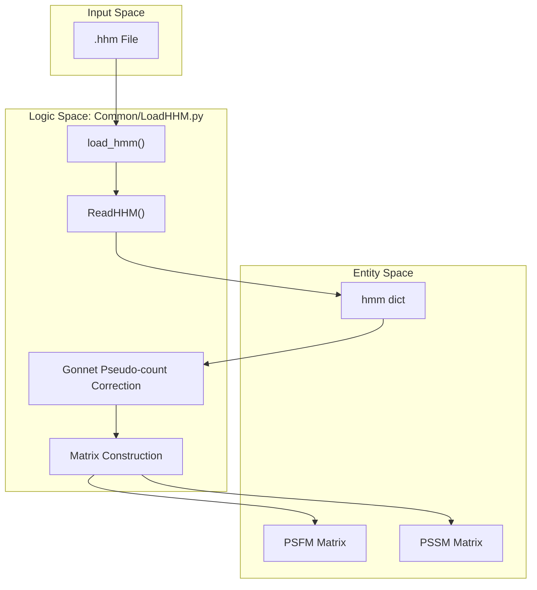
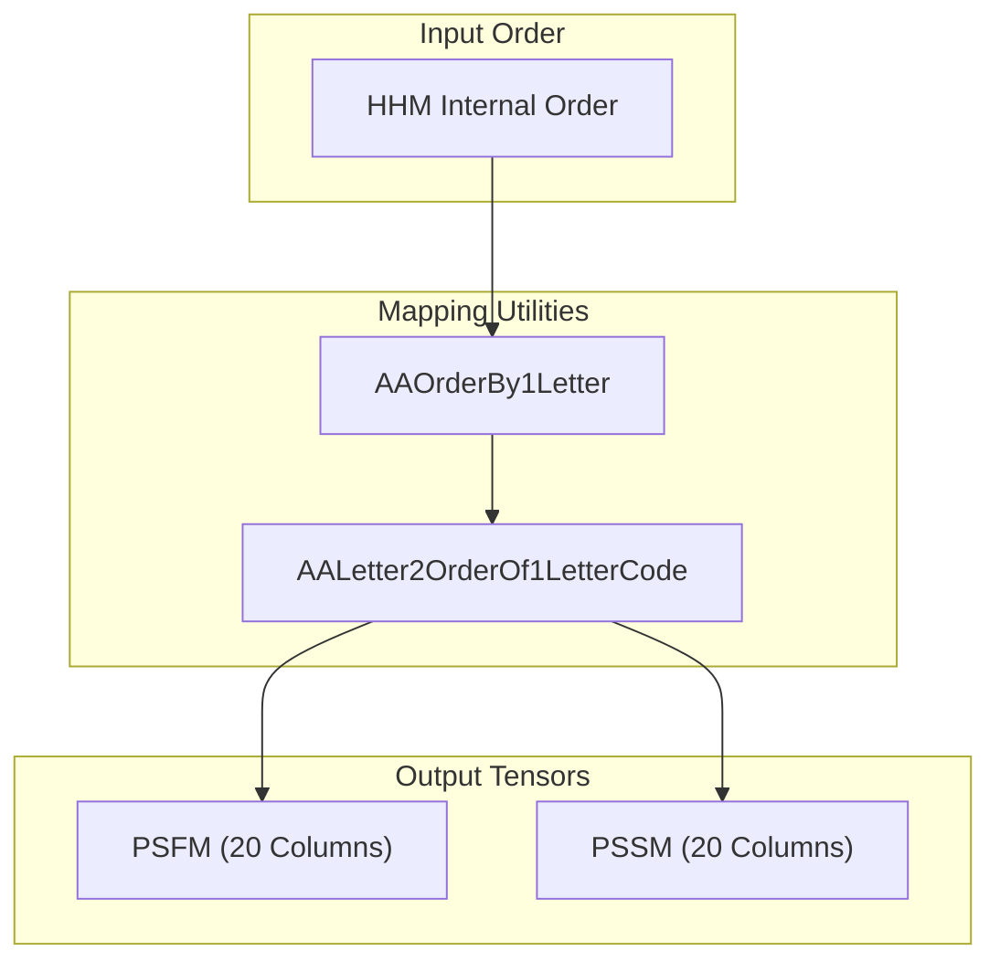

# HHM File Parsing and Profile Generation

> **Relevant source files**
> * [Common/LoadHHM.py](https://github.com/j3xugit/RaptorX-Contact/blob/7c9de508/Common/LoadHHM.py)

This page documents the technical implementation of `Common/LoadHHM.py`, which is responsible for parsing Profile Hidden Markov Model (HMM) files generated by the HHpred/HHblits package. The module transforms raw HHM data into structured position-specific scoring matrices (PSSM) and position-specific frequency matrices (PSFM), incorporating evolutionary information and secondary structure mappings for downstream neural network consumption [Common/LoadHHM.py L6-L15](https://github.com/j3xugit/RaptorX-Contact/blob/7c9de508/Common/LoadHHM.py#L6-L15)

## System Overview and Data Flow

The HHM parsing pipeline acts as a bridge between evolutionary sequence analysis tools and the RaptorX-Contact feature engineering pipeline. It handles file I/O, state transition parsing, and amino acid frequency normalization using pseudo-counts.

### Data Flow Diagram: HHM to Profile

The following diagram illustrates how raw HHM text is transformed into numerical tensors.

"HHM Processing Pipeline"

Sources: [Common/LoadHHM.py L6-L15](https://github.com/j3xugit/RaptorX-Contact/blob/7c9de508/Common/LoadHHM.py#L6-L15)

 [Common/LoadHHM.py L118-L124](https://github.com/j3xugit/RaptorX-Contact/blob/7c9de508/Common/LoadHHM.py#L118-L124)

 [Common/LoadHHM.py L218-L230](https://github.com/j3xugit/RaptorX-Contact/blob/7c9de508/Common/LoadHHM.py#L218-L230)

## Key Functions and Entrypoints

### load_hmm(hhmfile)

The primary entrypoint for the module. It reads the HHM file and returns a dictionary containing the protein sequence, HMM transitions, and the generated profiles [Common/LoadHHM.py L218-L230](https://github.com/j3xugit/RaptorX-Contact/blob/7c9de508/Common/LoadHHM.py#L218-L230)

* **Logic**: It first calls `ReadHHM()` to extract raw data.
* **Post-processing**: It calculates the PSFM (Position-Specific Frequency Matrix) and PSSM (Position-Specific Scoring Matrix) using the Gonnet substitution matrix for pseudo-count correction [Common/LoadHHM.py L246-L270](https://github.com/j3xugit/RaptorX-Contact/blob/7c9de508/Common/LoadHHM.py#L246-L270)

### ReadHHM(hhmfile)

The internal parser that iterates through the HHM file format. It extracts several key components:

1. **Sequence Data**: Extracts the primary amino acid sequence [Common/LoadHHM.py L165-L170](https://github.com/j3xugit/RaptorX-Contact/blob/7c9de508/Common/LoadHHM.py#L165-L170)
2. **Emission Probabilities**: Parses the 20 amino acid emission scores for each position [Common/LoadHHM.py L175-L185](https://github.com/j3xugit/RaptorX-Contact/blob/7c9de508/Common/LoadHHM.py#L175-L185)
3. **Transition Probabilities**: Captures 7 state transitions per position (M->M, M->I, M->D, I->M, I->I, D->M, D->D) [Common/LoadHHM.py L186-L200](https://github.com/j3xugit/RaptorX-Contact/blob/7c9de508/Common/LoadHHM.py#L186-L200)

Sources: [Common/LoadHHM.py L118-L216](https://github.com/j3xugit/RaptorX-Contact/blob/7c9de508/Common/LoadHHM.py#L118-L216)

 [Common/LoadHHM.py L218-L280](https://github.com/j3xugit/RaptorX-Contact/blob/7c9de508/Common/LoadHHM.py#L218-L280)

## HMM State Transitions and Mappings

The HHM file records transitions between Match (M), Insertion (I), and Deletion (D) states. These are indexed internally in the `hmm['trans']` array.

| Index | Symbol | Description |
| --- | --- | --- |
| 0 | `M_M` | Match to Match transition |
| 1 | `M_I` | Match to Insertion transition |
| 2 | `M_D` | Match to Deletion transition |
| 3 | `I_M` | Insertion to Match transition |
| 4 | `I_I` | Insertion to Insertion transition |
| 5 | `D_M` | Deletion to Match transition |
| 6 | `D_D` | Deletion to Deletion transition |

Sources: [Common/LoadHHM.py L90](https://github.com/j3xugit/RaptorX-Contact/blob/7c9de508/Common/LoadHHM.py#L90-L90)

 [Common/LoadHHM.py L186-L200](https://github.com/j3xugit/RaptorX-Contact/blob/7c9de508/Common/LoadHHM.py#L186-L200)

## Profile Generation and Normalization

The generation of `PSFM` and `PSSM` involves converting HHM integer scores (log-odds) back into probabilities and applying background frequency corrections.

### Gonnet Pseudo-count Correction

To handle sparse data in the HHM, the system uses the `gonnet` matrix [Common/LoadHHM.py L65-L88](https://github.com/j3xugit/RaptorX-Contact/blob/7c9de508/Common/LoadHHM.py#L65-L88)

 This matrix represents mutation probabilities and is used to adjust the observed frequencies.

### Amino Acid Ordering

A critical detail in `LoadHHM.py` is the reordering of amino acids. HHM files typically use a specific internal order, but RaptorX-Contact standardizes these into alphabetical order by 1-letter code for the final tensors [Common/LoadHHM.py L32-L33](https://github.com/j3xugit/RaptorX-Contact/blob/7c9de508/Common/LoadHHM.py#L32-L33)

"Amino Acid Mapping Logic"

Sources: [Common/LoadHHM.py L32-L33](https://github.com/j3xugit/RaptorX-Contact/blob/7c9de508/Common/LoadHHM.py#L32-L33)

 [Common/LoadHHM.py L42-L43](https://github.com/j3xugit/RaptorX-Contact/blob/7c9de508/Common/LoadHHM.py#L42-L43)

 [Common/LoadHHM.py L56-L57](https://github.com/j3xugit/RaptorX-Contact/blob/7c9de508/Common/LoadHHM.py#L56-L57)

## Secondary Structure Mappings

The module provides utility dictionaries to map secondary structure letters to numerical codes, supporting both 8-state (SS8) and 3-state (SS3) classifications.

* **SS8 mapping**: `SS8Letter2Code` maps H, G, I, E, B, T, S, L, C to values 0-7 [Common/LoadHHM.py L17](https://github.com/j3xugit/RaptorX-Contact/blob/7c9de508/Common/LoadHHM.py#L17-L17)
* **SS3 mapping**: `SS8Letter2SS3Code` collapses these into Helix (0), Beta (1), and Loop (2) [Common/LoadHHM.py L20](https://github.com/j3xugit/RaptorX-Contact/blob/7c9de508/Common/LoadHHM.py#L20-L20)

## CLI Usage

While primarily used as a library, `LoadHHM.py` can be executed directly to parse an HHM file and save the resulting dictionary as a `.pkl` file for inspection or caching.

**Command:**
`python LoadHHM.py input.hhm output.pkl`

Sources: [Common/LoadHHM.py L284-L295](https://github.com/j3xugit/RaptorX-Contact/blob/7c9de508/Common/LoadHHM.py#L284-L295)