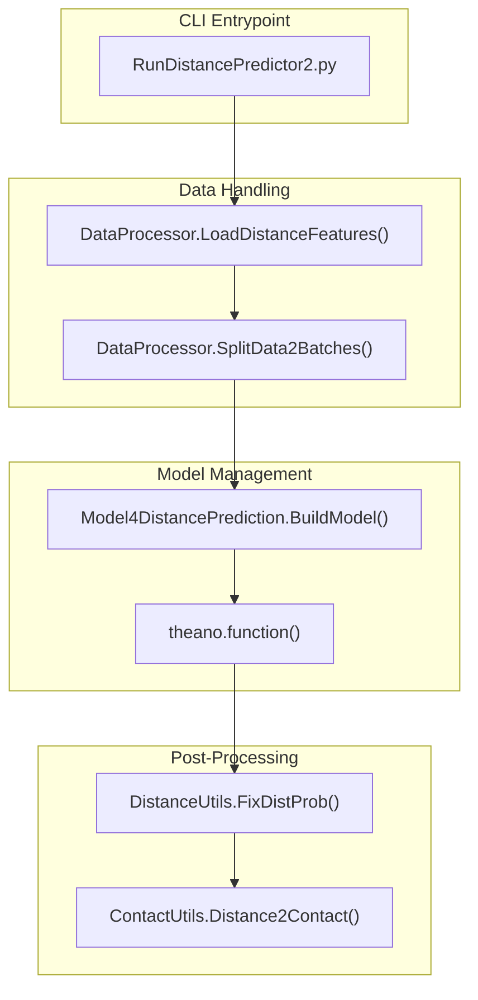
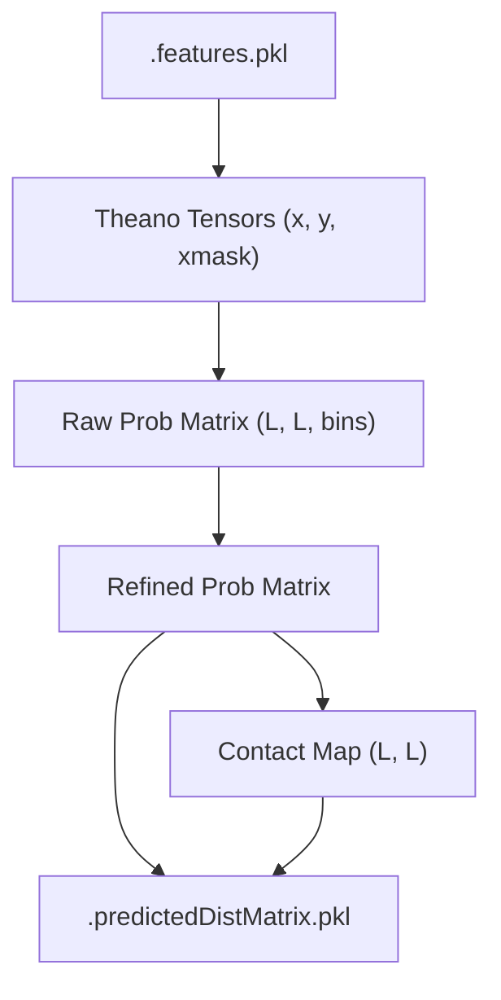

# Inference Pipeline

> **Relevant source files**
> * [DL4DistancePrediction2/DistanceUtils.py](https://github.com/j3xugit/RaptorX-Contact/blob/7c9de508/DL4DistancePrediction2/DistanceUtils.py)
> * [DL4DistancePrediction2/RunDistancePredictor2.py](https://github.com/j3xugit/RaptorX-Contact/blob/7c9de508/DL4DistancePrediction2/RunDistancePredictor2.py)

The inference pipeline in RaptorX-Contact manages the transition from raw protein features to final distance and contact probability maps. It leverages pre-trained Theano models to perform batch inference, ensembles predictions from multiple model architectures, and applies post-processing steps such as symmetry correction and probability weighting to ensure physical consistency.

## End-to-End Prediction Workflow

The workflow is orchestrated by the `RunDistancePredictor2.py` entrypoint. It coordinates the loading of model specifications, feature extraction, Theano graph execution, and the final output generation.

### High-Level Inference Sequence

1. **Model Initialization**: Loads one or more model files (`.pkl`) containing network architectures and trained parameter values [DL4DistancePrediction2/RunDistancePredictor2.py L38-L44](https://github.com/j3xugit/RaptorX-Contact/blob/7c9de508/DL4DistancePrediction2/RunDistancePredictor2.py#L38-L44)
2. **Feature Loading**: Calls `DataProcessor.LoadDistanceFeatures` to read and normalize input features (PSSM, HHM, CCMpred, etc.) based on the model's specific requirements [DL4DistancePrediction2/RunDistancePredictor2.py L90-L91](https://github.com/j3xugit/RaptorX-Contact/blob/7c9de508/DL4DistancePrediction2/RunDistancePredictor2.py#L90-L91)
3. **Batch Inference**: Assemblies proteins into batches, executes the Theano computational graph, and removes padding/masking from the resulting tensors [DL4DistancePrediction2/RunDistancePredictor2.py L112-L144](https://github.com/j3xugit/RaptorX-Contact/blob/7c9de508/DL4DistancePrediction2/RunDistancePredictor2.py#L112-L144)
4. **Ensembling**: Averages the predicted probability matrices across all loaded models for each protein and response type (e.g., Cb-Cb, Ca-Ca) [DL4DistancePrediction2/RunDistancePredictor2.py L163-L167](https://github.com/j3xugit/RaptorX-Contact/blob/7c9de508/DL4DistancePrediction2/RunDistancePredictor2.py#L163-L167)
5. **Post-Processing**: Applies symmetry correction ($P_{i,j} = P_{j,i}$) and, if applicable, probability correction using background reference distributions [DL4DistancePrediction2/RunDistancePredictor2.py L171-L181](https://github.com/j3xugit/RaptorX-Contact/blob/7c9de508/DL4DistancePrediction2/RunDistancePredictor2.py#L171-L181)
6. **Contact Extraction**: Converts distance distribution bins into scalar contact probabilities (typically $d < 8\text{\AA}$) [DL4DistancePrediction2/RunDistancePredictor2.py L192-L200](https://github.com/j3xugit/RaptorX-Contact/blob/7c9de508/DL4DistancePrediction2/RunDistancePredictor2.py#L192-L200)

### Inference System Mapping

The following diagram maps the logical inference steps to the primary code entities responsible for their execution.

Inference Pipeline Entity Mapping

Sources: [DL4DistancePrediction2/RunDistancePredictor2.py L37-L80](https://github.com/j3xugit/RaptorX-Contact/blob/7c9de508/DL4DistancePrediction2/RunDistancePredictor2.py#L37-L80)

 [DL4DistancePrediction2/DistanceUtils.py L110-L129](https://github.com/j3xugit/RaptorX-Contact/blob/7c9de508/DL4DistancePrediction2/DistanceUtils.py#L110-L129)

 [DL4DistancePrediction2/ContactUtils.py L255-L265](https://github.com/j3xugit/RaptorX-Contact/blob/7c9de508/DL4DistancePrediction2/ContactUtils.py#L255-L265)

## Model Ensembling and Consistency

The pipeline supports ensembling multiple models to improve prediction robustness. Before execution, the system performs consistency checks to ensure that all models use the same label types for the same atom pair responses [DL4DistancePrediction2/RunDistancePredictor2.py L46-L56](https://github.com/j3xugit/RaptorX-Contact/blob/7c9de508/DL4DistancePrediction2/RunDistancePredictor2.py#L46-L56)

* **Averaging**: Results from different models are summed and divided by the model count to produce an averaged probability distribution [DL4DistancePrediction2/RunDistancePredictor2.py L163-L167](https://github.com/j3xugit/RaptorX-Contact/blob/7c9de508/DL4DistancePrediction2/RunDistancePredictor2.py#L163-L167)
* **Memory Management**: To handle large protein sets and deep ensembles, the system accumulates sums rather than storing all raw tensors, followed by explicit garbage collection [DL4DistancePrediction2/RunDistancePredictor2.py L147-L159](https://github.com/j3xugit/RaptorX-Contact/blob/7c9de508/DL4DistancePrediction2/RunDistancePredictor2.py#L147-L159)

For details on CLI flags and the batch inference loop, see [RunDistancePredictor2: Inference Entrypoint](/j3xugit/RaptorX-Contact/5.1-rundistancepredictor2:-inference-entrypoint).

## Distance Utility and Post-Processing

The `DistanceUtils.py` module provides the mathematical foundation for handling distance probability tensors. This includes discretization, merging bins, and evaluating accuracy against native structures.

### Probability Refinement

Predicted probabilities can be adjusted using `FixDistProb`, which weights the output based on sequence separation ranges (Near, Short, Medium, Long, Extra-long) and background reference probabilities [DL4DistancePrediction2/DistanceUtils.py L110-L129](https://github.com/j3xugit/RaptorX-Contact/blob/7c9de508/DL4DistancePrediction2/DistanceUtils.py#L110-L129)

### Bin Operations

The system supports multiple discretization schemes (e.g., 25-bin or 52-bin). `MergeDistanceBins` allows for down-sampling a fine-grained distance matrix into a coarser one by summing adjacent probability bins [DL4DistancePrediction2/DistanceUtils.py L133-L152](https://github.com/j3xugit/RaptorX-Contact/blob/7c9de508/DL4DistancePrediction2/DistanceUtils.py#L133-L152)

### Evaluation Logic

The `EvaluateDistanceBoundAccuracy` function computes several metrics to validate predictions against ground truth:

* **Absolute/Relative Error**: Direct distance differences [DL4DistancePrediction2/DistanceUtils.py L73-L79](https://github.com/j3xugit/RaptorX-Contact/blob/7c9de508/DL4DistancePrediction2/DistanceUtils.py#L73-L79)
* **Precision/Recall/F1**: Based on a $15\text{\AA}$ validity threshold [DL4DistancePrediction2/DistanceUtils.py L81-L88](https://github.com/j3xugit/RaptorX-Contact/blob/7c9de508/DL4DistancePrediction2/DistanceUtils.py#L81-L88)
* **GDT-like Score**: A similarity metric based on distance thresholds at $1, 2, 4,$ and $8\text{\AA}$ [DL4DistancePrediction2/DistanceUtils.py L90-L96](https://github.com/j3xugit/RaptorX-Contact/blob/7c9de508/DL4DistancePrediction2/DistanceUtils.py#L90-L96)

For details on distance bin schemes and statistical weighting, see [Distance Utility Functions](/j3xugit/RaptorX-Contact/5.2-distance-utility-functions).

## Data Flow and File Formats

The pipeline consumes feature files and produces `.predictedDistMatrix.pkl` files. These output files contain a tuple of six items:

1. Protein Name
2. Protein Sequence
3. Predicted Distance Matrix Probability (3D tensor)
4. Predicted Contact Matrix (2D matrix)
5. Label Weight Matrix
6. Label Distribution Matrix

[DL4DistancePrediction2/RunDistancePredictor2.py L31-L32](https://github.com/j3xugit/RaptorX-Contact/blob/7c9de508/DL4DistancePrediction2/RunDistancePredictor2.py#L31-L32)

### Data Transformation Diagram

This diagram illustrates the transformation of data from input features to the final serialized output.

Inference Data Flow

Sources: [DL4DistancePrediction2/RunDistancePredictor2.py L112-L225](https://github.com/j3xugit/RaptorX-Contact/blob/7c9de508/DL4DistancePrediction2/RunDistancePredictor2.py#L112-L225)

 [DL4DistancePrediction2/DistanceUtils.py L10-L23](https://github.com/j3xugit/RaptorX-Contact/blob/7c9de508/DL4DistancePrediction2/DistanceUtils.py#L10-L23)