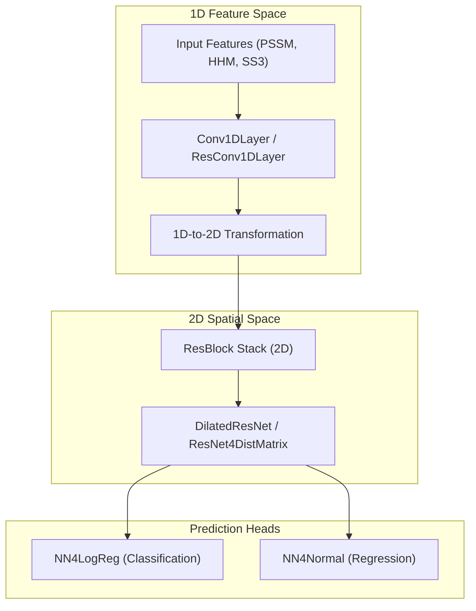
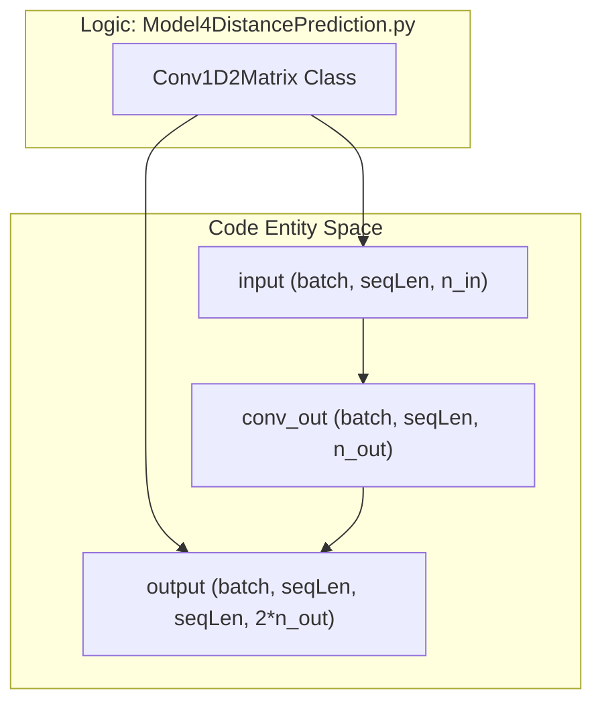
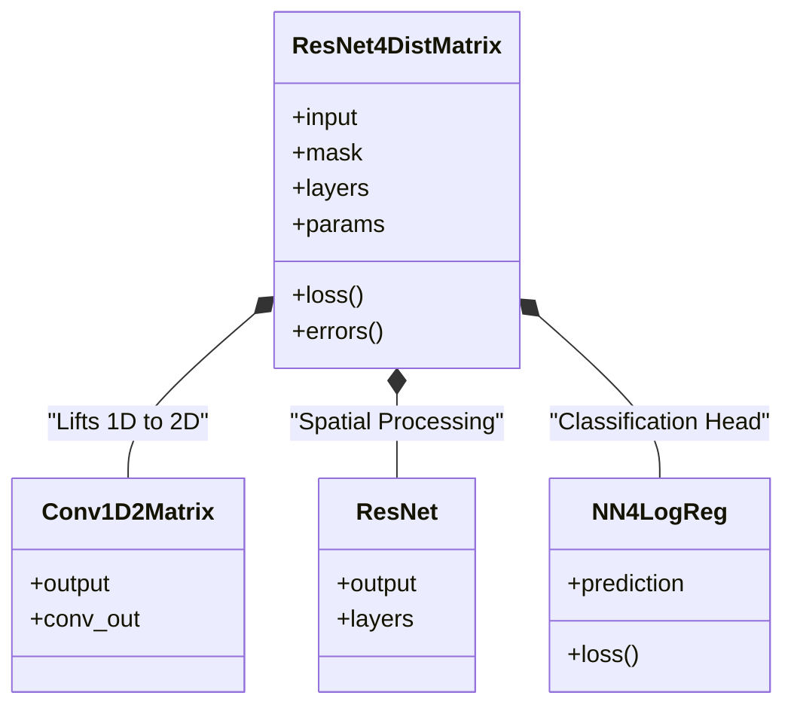

# Neural Network Architecture

> **Relevant source files**
> * [DL4DistancePrediction2/Model4DistancePrediction.py](https://github.com/j3xugit/RaptorX-Contact/blob/7c9de508/DL4DistancePrediction2/Model4DistancePrediction.py)
> * [DL4DistancePrediction2/ResNet4Distance.py](https://github.com/j3xugit/RaptorX-Contact/blob/7c9de508/DL4DistancePrediction2/ResNet4Distance.py)

This page provides a high-level overview of the deep learning architecture used for protein distance prediction. The system utilizes a deep Residual Network (ResNet) stack that processes 1D sequence features, lifts them into 2D space, and performs spatial reasoning to predict inter-residue distances.

### Architectural Overview

The RaptorX-Contact model follows a hierarchical structure where low-level convolutional primitives are composed into residual blocks, which are then stacked to form a global prediction model. The architecture is designed to handle variable-length sequences through consistent masking and padding strategies.

**Sources:** [DL4DistancePrediction2/Model4DistancePrediction.py L24-L64](https://github.com/j3xugit/RaptorX-Contact/blob/7c9de508/DL4DistancePrediction2/Model4DistancePrediction.py#L24-L64)

 [DL4DistancePrediction2/ResNet4Distance.py L6-L146](https://github.com/j3xugit/RaptorX-Contact/blob/7c9de508/DL4DistancePrediction2/ResNet4Distance.py#L6-L146)

---

### 3.1 Residual Network Implementations

The core of the architecture is the Residual Network, implemented in two primary variants: standard ResNet and Dilated ResNet. These implementations utilize `ResBlock` structures (V1, V2, V22, V23) to facilitate deep learning without vanishing gradients. A key feature is the mask-aware `batch_norm` function, which ensures that padding at the sequence boundaries does not pollute the statistics of the batch normalization layers.

For details, see [Residual Network Implementations (ResNet and DilatedResNet)](/j3xugit/RaptorX-Contact/3.1-residual-network-implementations-(resnet-and-dilatedresnet)).

**Sources:** [DL4DistancePrediction2/ResNet4Distance.py L148-L161](https://github.com/j3xugit/RaptorX-Contact/blob/7c9de508/DL4DistancePrediction2/ResNet4Distance.py#L148-L161)

 [DL4DistancePrediction2/DilatedResNet4Distance.py L1-L100](https://github.com/j3xugit/RaptorX-Contact/blob/7c9de508/DL4DistancePrediction2/DilatedResNet4Distance.py#L1-L100)

---

### 3.2 1D Convolutional and Embedding Layers

Before spatial processing, the model extracts local patterns from protein sequences using 1D layers. This includes `Conv1DLayer` for sequence-level features and various embedding layers for categorical data. A critical step in the pipeline is the transformation of 1D sequence information into 2D residue-pair information, achieved via `OuterConcatenate` and `MidpointFeature` operations.

For details, see [1D Convolutional and Embedding Layers](/j3xugit/RaptorX-Contact/3.2-1d-convolutional-and-embedding-layers).

**Sources:** [DL4DistancePrediction2/Model4DistancePrediction.py L24-L70](https://github.com/j3xugit/RaptorX-Contact/blob/7c9de508/DL4DistancePrediction2/Model4DistancePrediction.py#L24-L70)

 [DL4DistancePrediction2/utils.py L1-L50](https://github.com/j3xugit/RaptorX-Contact/blob/7c9de508/DL4DistancePrediction2/utils.py#L1-L50)

---

### 3.3 Prediction Head Layers

The final layers of the network translate the 2D feature maps into biological predictions. The system supports two modes:

1. **Classification:** `NN4LogReg` uses a Multi-Layer Perceptron (MLP) to classify distances into discrete bins (e.g., 25C or 52C).
2. **Regression:** `NN4Normal` predicts the parameters of a probability distribution (Normal or LogNormal) for inter-atom distances.

For details, see [Prediction Head Layers (Classification and Regression)](/j3xugit/RaptorX-Contact/3.3-prediction-head-layers-(classification-and-regression)).

**Sources:** [DL4DistancePrediction2/NN4LogReg.py L10-L50](https://github.com/j3xugit/RaptorX-Contact/blob/7c9de508/DL4DistancePrediction2/NN4LogReg.py#L10-L50)

 [DL4DistancePrediction2/NN4Normal.py L5-L40](https://github.com/j3xugit/RaptorX-Contact/blob/7c9de508/DL4DistancePrediction2/NN4Normal.py#L5-L40)

---

### 3.4 Full Model Assembly: ResNet4DistMatrix

The `ResNet4DistMatrix` class serves as the top-level orchestrator. It integrates the 1D feature extraction, the 2D residual stack, and the prediction heads into a single Theano symbolic graph. It handles multi-task learning by aggregating losses from multiple prediction heads (e.g., Cb-Cb distances and Ca-Ca distances) and implements the `BuildModel()` factory for easy instantiation.

For details, see [Full Model Assembly: ResNet4DistMatrix](/j3xugit/RaptorX-Contact/3.4-full-model-assembly:-resnet4distmatrix).

**Sources:** [DL4DistancePrediction2/Model4DistancePrediction.py L250-L400](https://github.com/j3xugit/RaptorX-Contact/blob/7c9de508/DL4DistancePrediction2/Model4DistancePrediction.py#L250-L400)

 [DL4DistancePrediction2/Model4DistancePrediction.py L879](https://github.com/j3xugit/RaptorX-Contact/blob/7c9de508/DL4DistancePrediction2/Model4DistancePrediction.py#L879-L879)