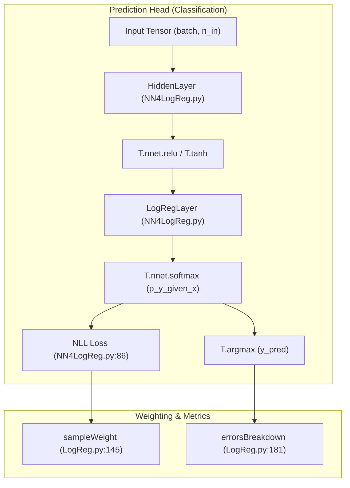
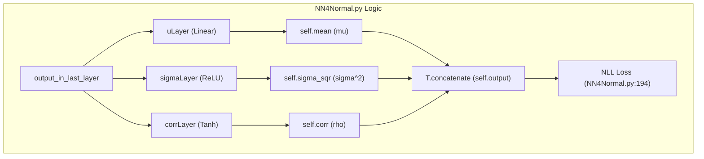

# Prediction Head Layers (Classification and Regression)

> **Relevant source files**
> * [DL4DistancePrediction2/LogReg.py](https://github.com/j3xugit/RaptorX-Contact/blob/7c9de508/DL4DistancePrediction2/LogReg.py)
> * [DL4DistancePrediction2/NN4LogReg.py](https://github.com/j3xugit/RaptorX-Contact/blob/7c9de508/DL4DistancePrediction2/NN4LogReg.py)
> * [DL4DistancePrediction2/NN4Normal.py](https://github.com/j3xugit/RaptorX-Contact/blob/7c9de508/DL4DistancePrediction2/NN4Normal.py)
> * [DL4DistancePrediction2/mlLogReg.py](https://github.com/j3xugit/RaptorX-Contact/blob/7c9de508/DL4DistancePrediction2/mlLogReg.py)
> * [DL4DistancePrediction2/resnet.py](https://github.com/j3xugit/RaptorX-Contact/blob/7c9de508/DL4DistancePrediction2/resnet.py)

This section documents the terminal layers of the RaptorX-Contact neural network architectures. These layers transform high-dimensional latent representations into physical distance predictions, either as discrete probability distributions across distance bins (Classification) or as continuous probability density functions (Regression).

## Classification Heads (Discrete Distance Prediction)

The primary method for distance prediction in RaptorX-Contact involves discretizing distances into bins (e.g., 25, 52, or 3 bins). The `NN4LogReg.py` and `LogReg.py` modules implement the Multi-Layer Perceptron (MLP) and Logistic Regression layers required for this task.

### Multi-Layer Perceptron (NN4LogReg)

The `NN4LogReg` class builds a feed-forward network consisting of multiple `HiddenLayer` instances followed by a final `LogRegLayer` [DL4DistancePrediction2/NN4LogReg.py L115-L152](https://github.com/j3xugit/RaptorX-Contact/blob/7c9de508/DL4DistancePrediction2/NN4LogReg.py#L115-L152)

* **HiddenLayer**: Implements $activation(W \cdot x + b)$. Weights are initialized using a uniform distribution scaled by the input/output dimensions [DL4DistancePrediction2/NN4LogReg.py L18-L52](https://github.com/j3xugit/RaptorX-Contact/blob/7c9de508/DL4DistancePrediction2/NN4LogReg.py#L18-L52)
* **LogRegLayer**: The final classification layer that applies a `softmax` to the linear projection of the previous layer's output to produce class-membership probabilities [DL4DistancePrediction2/NN4LogReg.py L55-L83](https://github.com/j3xugit/RaptorX-Contact/blob/7c9de508/DL4DistancePrediction2/NN4LogReg.py#L55-L83)
* **Loss Function**: Negative Log-Likelihood (NLL) is used, supporting `sampleWeight` to handle imbalanced data or prioritize specific residue ranges [DL4DistancePrediction2/NN4LogReg.py L86-L92](https://github.com/j3xugit/RaptorX-Contact/blob/7c9de508/DL4DistancePrediction2/NN4LogReg.py#L86-L92)

### Logistic Regression Base (LogReg)

The `LogisticRegression` class in `LogReg.py` provides the fundamental symbolic logic for multi-class classification [DL4DistancePrediction2/LogReg.py L50-L112](https://github.com/j3xugit/RaptorX-Contact/blob/7c9de508/DL4DistancePrediction2/LogReg.py#L50-L112)

 A key feature is `errorsBreakdown`, which calculates the error rate for specific distance categories (e.g., Short, Medium, and Long range) [DL4DistancePrediction2/LogReg.py L181-L192](https://github.com/j3xugit/RaptorX-Contact/blob/7c9de508/DL4DistancePrediction2/LogReg.py#L181-L192)

### Classification Data Flow

| Entity | Role | Source |
| --- | --- | --- |
| `p_y_given_x` | Softmax probability matrix of shape `(batch, n_out)` | [DL4DistancePrediction2/NN4LogReg.py L76](https://github.com/j3xugit/RaptorX-Contact/blob/7c9de508/DL4DistancePrediction2/NN4LogReg.py#L76-L76) |
| `y_pred` | Argmax of `p_y_given_x`, representing the predicted bin | [DL4DistancePrediction2/NN4LogReg.py L77](https://github.com/j3xugit/RaptorX-Contact/blob/7c9de508/DL4DistancePrediction2/NN4LogReg.py#L77-L77) |
| `NLL()` | Calculates cross-entropy loss with optional weighting | [DL4DistancePrediction2/NN4LogReg.py L176-L187](https://github.com/j3xugit/RaptorX-Contact/blob/7c9de508/DL4DistancePrediction2/NN4LogReg.py#L176-L187) |

**Sources:** [DL4DistancePrediction2/NN4LogReg.py L1-L200](https://github.com/j3xugit/RaptorX-Contact/blob/7c9de508/DL4DistancePrediction2/NN4LogReg.py#L1-L200)

 [DL4DistancePrediction2/LogReg.py L50-L200](https://github.com/j3xugit/RaptorX-Contact/blob/7c9de508/DL4DistancePrediction2/LogReg.py#L50-L200)

---

## Regression Heads (Distribution Prediction)

For continuous distance estimation, the system predicts parameters of a Normal or Log-Normal distribution. This is handled by `NN4Normal.py`.

### Distribution Parameters

The `NN4Normal` class predicts the mean ($\mu$), variance ($\sigma^2$), and optionally the correlation ($\rho$) for bivariate distributions [DL4DistancePrediction2/NN4Normal.py L78-L190](https://github.com/j3xugit/RaptorX-Contact/blob/7c9de508/DL4DistancePrediction2/NN4Normal.py#L78-L190)

* **Mean ($\mu$)**: Linear output from a `HiddenLayer` [DL4DistancePrediction2/NN4Normal.py L151-L153](https://github.com/j3xugit/RaptorX-Contact/blob/7c9de508/DL4DistancePrediction2/NN4Normal.py#L151-L153)
* **Variance ($\sigma^2$)**: Output from a `ReLU` activation to ensure positivity, plus a small `sigma_sqr_min` (default 0.0001) for numerical stability [DL4DistancePrediction2/NN4Normal.py L157-L159](https://github.com/j3xugit/RaptorX-Contact/blob/7c9de508/DL4DistancePrediction2/NN4Normal.py#L157-L159)
* **Correlation ($\rho$)**: Output from a `tanh` activation scaled by `rho_abs_max` (default 0.99) to ensure values stay within $(-1, 1)$ [DL4DistancePrediction2/NN4Normal.py L167-L169](https://github.com/j3xugit/RaptorX-Contact/blob/7c9de508/DL4DistancePrediction2/NN4Normal.py#L167-L169)

### Bivariate NLL Loss

The regression head minimizes the Negative Log-Likelihood of the target distance $y$ under the predicted distribution [DL4DistancePrediction2/NN4Normal.py L194-L220](https://github.com/j3xugit/RaptorX-Contact/blob/7c9de508/DL4DistancePrediction2/NN4Normal.py#L194-L220)

 For two variables, it implements the full bivariate normal density function log-likelihood [DL4DistancePrediction2/NN4Normal.py L210-L235](https://github.com/j3xugit/RaptorX-Contact/blob/7c9de508/DL4DistancePrediction2/NN4Normal.py#L210-L235)

**Sources:** [DL4DistancePrediction2/NN4Normal.py L78-L250](https://github.com/j3xugit/RaptorX-Contact/blob/7c9de508/DL4DistancePrediction2/NN4Normal.py#L78-L250)

---

## Specialized Architectures

### Hessian-Free Support (mlLogReg)

The `MLLogReg` class in `mlLogReg.py` is a variant of the MLP classifier designed to interface with Hessian-Free (HF) optimizers. It mirrors the structure of `NN4LogReg` but uses `LogReg.py`'s implementation for the final layer and provides specific hooks for second-order optimization [DL4DistancePrediction2/mlLogReg.py L89-L166](https://github.com/j3xugit/RaptorX-Contact/blob/7c9de508/DL4DistancePrediction2/mlLogReg.py#L89-L166)

### ResNet Prediction Head

The `resnet.py` module contains a `build_resnet` function that concludes with a global average pooling layer followed by a `log_softmax` head for classification [DL4DistancePrediction2/resnet.py L61-L90](https://github.com/j3xugit/RaptorX-Contact/blob/7c9de508/DL4DistancePrediction2/resnet.py#L61-L90)

* **log_softmax**: Implemented manually for numerical stability, subtracting the max log-sum-exp [DL4DistancePrediction2/resnet.py L11-L16](https://github.com/j3xugit/RaptorX-Contact/blob/7c9de508/DL4DistancePrediction2/resnet.py#L11-L16)

**Sources:** [DL4DistancePrediction2/mlLogReg.py L89-L170](https://github.com/j3xugit/RaptorX-Contact/blob/7c9de508/DL4DistancePrediction2/mlLogReg.py#L89-L170)

 [DL4DistancePrediction2/resnet.py L1-L90](https://github.com/j3xugit/RaptorX-Contact/blob/7c9de508/DL4DistancePrediction2/resnet.py#L1-L90)

---

## System Mapping: Code to Entity Space

### Classification Logic Mapping

This diagram shows how the classification classes relate to the mathematical operations and data structures in the code.

**Sources:** [DL4DistancePrediction2/NN4LogReg.py L17-L161](https://github.com/j3xugit/RaptorX-Contact/blob/7c9de508/DL4DistancePrediction2/NN4LogReg.py#L17-L161)

 [DL4DistancePrediction2/LogReg.py L144-L181](https://github.com/j3xugit/RaptorX-Contact/blob/7c9de508/DL4DistancePrediction2/LogReg.py#L144-L181)

### Regression Parameter Mapping

This diagram illustrates how `NN4Normal` maps neural network outputs to statistical distribution parameters.

**Sources:** [DL4DistancePrediction2/NN4Normal.py L147-L190](https://github.com/j3xugit/RaptorX-Contact/blob/7c9de508/DL4DistancePrediction2/NN4Normal.py#L147-L190)

---

## Summary Table of Prediction Heads

| Class Name | Module | Prediction Type | Key Activation | Loss Function |
| --- | --- | --- | --- | --- |
| `NN4LogReg` | `NN4LogReg.py` | Discrete Bins | `softmax` | `NLL` (Cross-Entropy) |
| `NN4Normal` | `NN4Normal.py` | Normal/Log-Normal | `ReLU` (Var), `Tanh` (Corr) | `NLL` (Gaussian) |
| `MLLogReg` | `mlLogReg.py` | Discrete Bins | `softmax` | `negative_log_likelihood` |
| `LogisticRegression` | `LogReg.py` | Linear Classifier | `softmax` | `negative_log_likelihood` |

**Sources:** [DL4DistancePrediction2/NN4LogReg.py L115](https://github.com/j3xugit/RaptorX-Contact/blob/7c9de508/DL4DistancePrediction2/NN4LogReg.py#L115-L115)

 [DL4DistancePrediction2/NN4Normal.py L78](https://github.com/j3xugit/RaptorX-Contact/blob/7c9de508/DL4DistancePrediction2/NN4Normal.py#L78-L78)

 [DL4DistancePrediction2/mlLogReg.py L89](https://github.com/j3xugit/RaptorX-Contact/blob/7c9de508/DL4DistancePrediction2/mlLogReg.py#L89-L89)

 [DL4DistancePrediction2/LogReg.py L50](https://github.com/j3xugit/RaptorX-Contact/blob/7c9de508/DL4DistancePrediction2/LogReg.py#L50-L50)