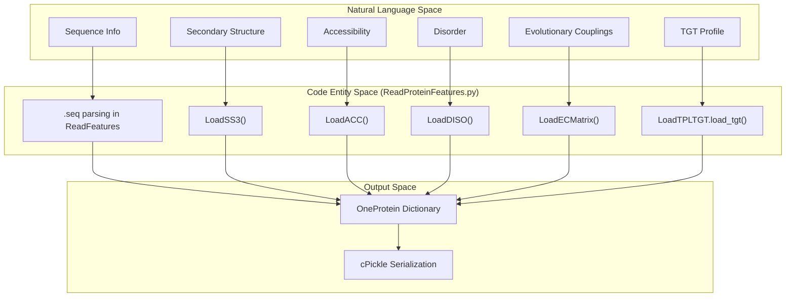

# Protein Feature Reading and Aggregation

> **Relevant source files**
> * [DL4DistancePrediction2/ReadOneProteinFeatures.py](https://github.com/j3xugit/RaptorX-Contact/blob/7c9de508/DL4DistancePrediction2/ReadOneProteinFeatures.py)
> * [DL4DistancePrediction2/ReadProteinFeatures.py](https://github.com/j3xugit/RaptorX-Contact/blob/7c9de508/DL4DistancePrediction2/ReadProteinFeatures.py)

This page documents the technical implementation of protein feature discovery, parsing, and aggregation within the RaptorX-Contact system. The primary responsibility of this subsystem is to locate raw feature files (SS3, ACC, DISO, PSSM, and evolutionary couplings) in a directory structure, validate their integrity, and serialize them into a unified format for neural network consumption.

## Overview of Feature Ingestion

The ingestion process is handled primarily by `ReadProteinFeatures.py`, which provides low-level loaders for various bioinformatics file formats, and `ReadOneProteinFeatures.py`, which acts as a CLI wrapper to aggregate multiple feature sources into a single `cPickle` file.

The system processes two main categories of features:

1. **1D Features**: Sequence-level properties such as Secondary Structure (SS3), Solvent Accessibility (ACC), and Disorder (DISO).
2. **2D Features**: Residue-residue relationship data, including evolutionary coupling scores from `CCMpred` and `PSICOV`, and potential-based features.

### System Entity Map

The following diagram maps the high-level data requirements to the specific functions and file loaders implemented in the codebase.

**Diagram: Feature Loading Entity Mapping**



**Sources:** `DL4DistancePrediction2/ReadProteinFeatures.py` [1-228](https://github.com/j3xugit/RaptorX-Contact/blob/7c9de508/1-228)

 `DL4DistancePrediction2/ReadOneProteinFeatures.py` [18-40](https://github.com/j3xugit/RaptorX-Contact/blob/7c9de508/18-40)

## Implementation Details

### 1D Feature Loaders

The 1D loaders (`LoadSS3`, `LoadACC`, `LoadDISO`) follow a consistent pattern: they skip a fixed number of header lines, parse numerical probabilities for each residue, and perform validation against the protein sequence length.

* **LoadSS3**: Parses 3-state secondary structure probabilities [DL4DistancePrediction2/ReadProteinFeatures.py L15-L38](https://github.com/j3xugit/RaptorX-Contact/blob/7c9de508/DL4DistancePrediction2/ReadProteinFeatures.py#L15-L38)
* **LoadACC**: Parses solvent accessibility probabilities (typically 3 states: Buried, Intermediate, Exposed) [DL4DistancePrediction2/ReadProteinFeatures.py L40-L62](https://github.com/j3xugit/RaptorX-Contact/blob/7c9de508/DL4DistancePrediction2/ReadProteinFeatures.py#L40-L62)
* **LoadDISO**: Parses protein disorder probabilities [DL4DistancePrediction2/ReadProteinFeatures.py L64-L86](https://github.com/j3xugit/RaptorX-Contact/blob/7c9de508/DL4DistancePrediction2/ReadProteinFeatures.py#L64-L86)

All 1D loaders include a `NaN` validation check using `np.isnan(np.sum(probs))` to ensure data integrity before training [DL4DistancePrediction2/ReadProteinFeatures.py L34-L36](https://github.com/j3xugit/RaptorX-Contact/blob/7c9de508/DL4DistancePrediction2/ReadProteinFeatures.py#L34-L36)

### 2D Feature Handling and Symmetrization

Evolutionary coupling matrices (e.g., from CCMpred or PSICOV) are loaded via `LoadECMatrix` [DL4DistancePrediction2/ReadProteinFeatures.py L140-L159](https://github.com/j3xugit/RaptorX-Contact/blob/7c9de508/DL4DistancePrediction2/ReadProteinFeatures.py#L140-L159)

 For other pair-based features, `LoadOtherPairFeatures` is used, which enforces matrix symmetry—a critical requirement for 2D ResNet inputs.

**Key Implementation Logic for Symmetry:**
The function reads sparse or dense pair values and ensures that for any residue pair $(i, j)$, the feature value is identical to $(j, i)$ [DL4DistancePrediction2/ReadProteinFeatures.py L187-L188](https://github.com/j3xugit/RaptorX-Contact/blob/7c9de508/DL4DistancePrediction2/ReadProteinFeatures.py#L187-L188)

### TGT File Handling via LoadTPLTGT

The system heavily utilizes `.tgt` files, which contain template information and sequence profiles. Instead of re-implementing the parser, `ReadFeatures` imports `LoadTPLTGT` [DL4DistancePrediction2/ReadProteinFeatures.py L8](https://github.com/j3xugit/RaptorX-Contact/blob/7c9de508/DL4DistancePrediction2/ReadProteinFeatures.py#L8-L8)

 and calls `LoadTPLTGT.load_tgt(tgtf)` [DL4DistancePrediction2/ReadProteinFeatures.py L259](https://github.com/j3xugit/RaptorX-Contact/blob/7c9de508/DL4DistancePrediction2/ReadProteinFeatures.py#L259-L259)

 This integration extracts:

* **PSSM**: Position-Specific Scoring Matrices.
* **PSFM**: Position-Specific Frequency Matrices.
* **Sequence Profiles**: Derived from HMM models.

## Data Flow: From Files to Aggregated PKL

The `ReadOneProteinFeatures.py` script serves as the entry point for preparing a single protein's dataset. It iterates through multiple feature directories, allowing the user to combine different versions or types of features for the same protein.

**Diagram: Aggregation Data Flow**

```mermaid
sequenceDiagram
  participant ReadOneProteinFeatures.py
  participant ReadProteinFeatures.ReadFeatures()
  participant LoadTPLTGT.load_tgt()
  participant cPickle Output

  ReadOneProteinFeatures.py->>ReadProteinFeatures.ReadFeatures(): Call with proteinName & dir
  ReadProteinFeatures.ReadFeatures()->>ReadProteinFeatures.ReadFeatures(): Read .seq file
  ReadProteinFeatures.ReadFeatures()->>ReadProteinFeatures.ReadFeatures(): LoadSS3/ACC/DISO
  ReadProteinFeatures.ReadFeatures()->>LoadTPLTGT.load_tgt(): Load .tgt profile
  ReadProteinFeatures.ReadFeatures()->>ReadProteinFeatures.ReadFeatures(): LoadECMatrix (.ccmpred_zscore)
  ReadProteinFeatures.ReadFeatures()->>ReadProteinFeatures.ReadFeatures(): LoadECMatrix (.psicov_zscore)
  ReadProteinFeatures.ReadFeatures()-->>ReadOneProteinFeatures.py: Return OneProtein dict
  ReadOneProteinFeatures.py->>cPickle Output: Serialize list of dicts to .distanceFeatures.pkl
```

**Sources:** `DL4DistancePrediction2/ReadOneProteinFeatures.py` [26-39](https://github.com/j3xugit/RaptorX-Contact/blob/7c9de508/26-39)

 `DL4DistancePrediction2/ReadProteinFeatures.py` [197-265](https://github.com/j3xugit/RaptorX-Contact/blob/7c9de508/197-265)

## Summary of Feature Components

The resulting `OneProtein` dictionary contains the following keys, which are subsequently consumed by the `DataProcessor`:

| Key | Source Function | Data Type | Description |
| --- | --- | --- | --- |
| `name` | `ReadFeatures` | String | Protein identifier |
| `sequence` | `ReadFeatures` | String | Amino acid sequence |
| `SS3` | `LoadSS3` | Matrix (L x 3) | 3-state secondary structure probabilities |
| `ACC` | `LoadACC` | Matrix (L x 3) | Solvent accessibility probabilities |
| `DISO` | `LoadDISO` | Matrix (L x 2) | Disorder probabilities |
| `PSSM` | `load_tgt` | Matrix (L x 20) | Position-specific scoring matrix |
| `ccmpredZ` | `LoadECMatrix` | Matrix (L x L) | CCMpred Z-scores |
| `psicovZ` | `LoadECMatrix` | Matrix (L x L) | PSICOV Z-scores |

**Sources:** `DL4DistancePrediction2/ReadProteinFeatures.py` [208-265](https://github.com/j3xugit/RaptorX-Contact/blob/7c9de508/208-265)