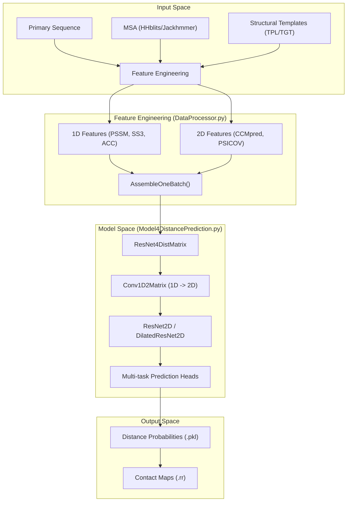
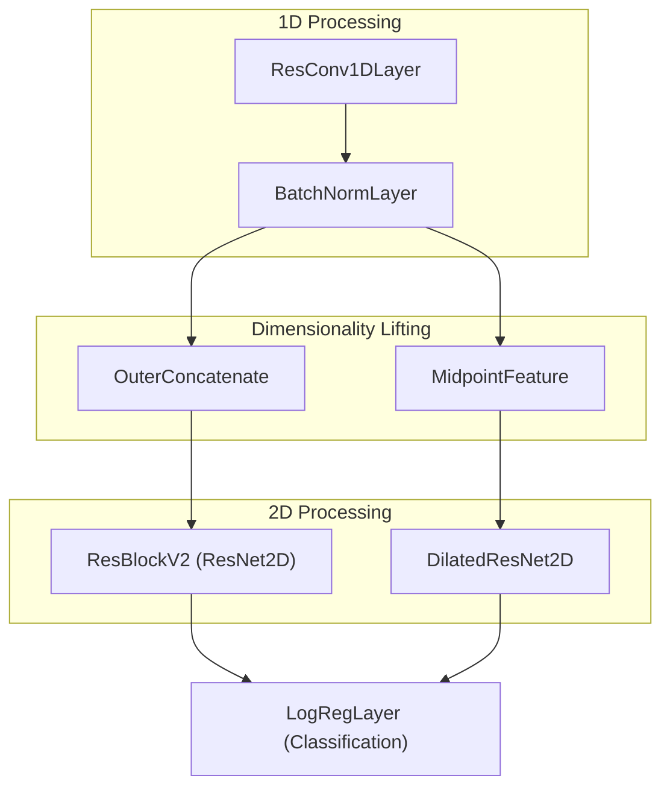

# RaptorX-Contact Overview

> **Relevant source files**
> * [DL4DistancePrediction2/config.py](https://github.com/j3xugit/RaptorX-Contact/blob/7c9de508/DL4DistancePrediction2/config.py)
> * [LICENSE](https://github.com/j3xugit/RaptorX-Contact/blob/7c9de508/LICENSE)
> * [README.md](https://github.com/j3xugit/RaptorX-Contact/blob/7c9de508/README.md?plain=1)

RaptorX-Contact is a deep learning system designed for high-accuracy protein contact and distance prediction. It leverages ultra-deep residual neural networks (ResNet) to transform 1D sequence information and 2D evolutionary coupling data into spatial distance distributions between residue pairs. These predictions serve as the foundation for distance-based protein folding, significantly outperforming traditional contact-only methods in CASP competitions and de novo structure modeling.

### Scientific Context and Capabilities

The system represents a transition from binary contact prediction (determining if two residues are within 8Å) to fine-grained distance distribution prediction [README.md L9-L11](https://github.com/j3xugit/RaptorX-Contact/blob/7c9de508/README.md?plain=1#L9-L11)

 By predicting the probability of residue pairs falling into specific distance bins (e.g., 25 or 52 discrete bins), the model provides a richer energy landscape for tertiary structure reconstruction [DL4DistancePrediction2/config.py L64-L87](https://github.com/j3xugit/RaptorX-Contact/blob/7c9de508/DL4DistancePrediction2/config.py#L64-L87)

Key capabilities include:

* **Multi-Atom Prediction**: Supports various atom pair types including $C_\beta-C_\beta$, $C_\alpha-C_\alpha$, $C_\gamma-C_\gamma$, $N-O$, and hydrogen bonding (HB) [DL4DistancePrediction2/config.py L22-L24](https://github.com/j3xugit/RaptorX-Contact/blob/7c9de508/DL4DistancePrediction2/config.py#L22-L24)
* **Deep Residual Architectures**: Utilizes both standard and dilated 2D ResNets to capture long-range spatial correlations [DL4DistancePrediction2/config.py L11-L16](https://github.com/j3xugit/RaptorX-Contact/blob/7c9de508/DL4DistancePrediction2/config.py#L11-L16)
* **Evolutionary Integration**: Incorporates features from multiple sequence alignments (MSA), including PSSM, HMM profiles, and direct coupling analysis (DCA) from tools like CCMpred and MetaPSICOV [README.md L28-L33](https://github.com/j3xugit/RaptorX-Contact/blob/7c9de508/README.md?plain=1#L28-L33)

### High-Level System Architecture

The following diagram illustrates the flow of data from raw protein sequences through the feature engineering pipeline to the final neural network inference.

**System Data Flow and Code Entity Mapping**

Sources: [README.md L27-L35](https://github.com/j3xugit/RaptorX-Contact/blob/7c9de508/README.md?plain=1#L27-L35)

 [DL4DistancePrediction2/config.py L11-L24](https://github.com/j3xugit/RaptorX-Contact/blob/7c9de508/DL4DistancePrediction2/config.py#L11-L24)

### Subsystem Relationships

The RaptorX-Contact codebase is organized into functional modules that handle the lifecycle of a prediction:

| Subsystem | Primary Responsibility | Key Code Entities |
| --- | --- | --- |
| **Configuration** | Defines architecture variants, distance bins, and atom types. | `config.py` |
| **Data Ingestion** | Parses HHM, PSSM, and structural features into tensors. | `LoadHHM.py`, `DataProcessor.py` |
| **Model Core** | Implements the ResNet layers and 1D-to-2D dimensionality lifting. | `ResNet4Distance.py`, `Model4DistancePrediction.py` |
| **Optimization** | Provides custom Theano-based optimizers for training. | `Adams.py`, `Optimizers.py` |
| **Inference** | Orchestrates model loading, ensembling, and probability extraction. | `RunDistancePredictor2.py` |
| **Evaluation** | Computes Top-L accuracy and MCC/F1 metrics. | `ContactUtils.py`, `Metrics.py` |

**Neural Network Structural Overview**
The model architecture bridges 1D sequence-level features and 2D residue-pair features.

Sources: [DL4DistancePrediction2/config.py L11-L16](https://github.com/j3xugit/RaptorX-Contact/blob/7c9de508/DL4DistancePrediction2/config.py#L11-L16)

 [README.md L21-L23](https://github.com/j3xugit/RaptorX-Contact/blob/7c9de508/README.md?plain=1#L21-L23)

### Detailed Documentation Links

For more specific information on the subsystems mentioned above, refer to the following child pages:

* **[Getting Started: Installation and Input Requirements](/j3xugit/RaptorX-Contact/1.1-getting-started:-installation-and-input-requirements)**: Detailed guide on setting up the Python 2.7/Theano environment and preparing the dictionary-based input features (PSSM, SS3, ACC, CCMpred).
* **[System Configuration and Global Parameters](/j3xugit/RaptorX-Contact/1.2-system-configuration-and-global-parameters)**: Deep dive into `config.py`, covering the mathematical definitions of distance bins (e.g., `52C`, `25C`), range-based weighting (`weight4range`), and available network architectures.

---

Sources: [README.md L1-L37](https://github.com/j3xugit/RaptorX-Contact/blob/7c9de508/README.md?plain=1#L1-L37)

 [DL4DistancePrediction2/config.py L1-L161](https://github.com/j3xugit/RaptorX-Contact/blob/7c9de508/DL4DistancePrediction2/config.py#L1-L161)