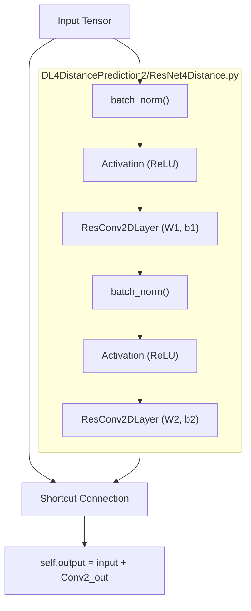
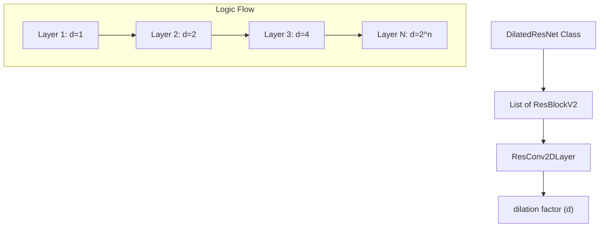

# Residual Network Implementations (ResNet and DilatedResNet)

> **Relevant source files**
> * [DL4DistancePrediction2/DilatedResNet4Distance.py](https://github.com/j3xugit/RaptorX-Contact/blob/7c9de508/DL4DistancePrediction2/DilatedResNet4Distance.py)
> * [DL4DistancePrediction2/ResNet4Distance.py](https://github.com/j3xugit/RaptorX-Contact/blob/7c9de508/DL4DistancePrediction2/ResNet4Distance.py)

This page documents the core residual network components used for protein distance prediction. The implementation is split between standard residual architectures and dilated variants, providing the foundation for the `ResNet4DistMatrix` model. These modules handle both 1D sequence-level features and 2D residue-residue interaction maps, incorporating specialized logic for mask-aware normalization and dimensionality projection.

### Core Convolutional Primitives

The system implements custom 1D and 2D convolutional layers designed to handle the variable-length nature of protein sequences through explicit masking.

* **`ResConv1DLayer`**: Implements 1D convolution by reshuffling the input `(batchSize, n_in, seqLen)` into a 4D tensor `(batchSize, n_in, 1, seqLen)` to utilize Theano's `conv2d` engine [DL4DistancePrediction2/ResNet4Distance.py L6-L24](https://github.com/j3xugit/RaptorX-Contact/blob/7c9de508/DL4DistancePrediction2/ResNet4Distance.py#L6-L24)  It supports dilation in the `DilatedResNet4Distance.py` version [DL4DistancePrediction2/DilatedResNet4Distance.py L45-L48](https://github.com/j3xugit/RaptorX-Contact/blob/7c9de508/DL4DistancePrediction2/DilatedResNet4Distance.py#L45-L48)
* **`ResConv2DLayer`**: Standard 2D convolution for residue-residue matrices. It applies a mask to both horizontal and vertical dimensions to ensure padding does not influence the hidden states [DL4DistancePrediction2/ResNet4Distance.py L123-L136](https://github.com/j3xugit/RaptorX-Contact/blob/7c9de508/DL4DistancePrediction2/ResNet4Distance.py#L123-L136)

#### Weight Initialization Strategies

Initialization depends on the activation function:

* **ReLU**: Uses He initialization with a scale of $\sqrt{2 / (fan_in + fan_out)}$ [DL4DistancePrediction2/ResNet4Distance.py L28-L30](https://github.com/j3xugit/RaptorX-Contact/blob/7c9de508/DL4DistancePrediction2/ResNet4Distance.py#L28-L30)
* **Sigmoid/Other**: Uses Xavier/Glorot uniform initialization [DL4DistancePrediction2/ResNet4Distance.py L31-L34](https://github.com/j3xugit/RaptorX-Contact/blob/7c9de508/DL4DistancePrediction2/ResNet4Distance.py#L31-L34)  If Sigmoid is used, weights are scaled by 4 [DL4DistancePrediction2/ResNet4Distance.py L35-L37](https://github.com/j3xugit/RaptorX-Contact/blob/7c9de508/DL4DistancePrediction2/ResNet4Distance.py#L35-L37)

**Sources:**

* [DL4DistancePrediction2/ResNet4Distance.py L6-L146](https://github.com/j3xugit/RaptorX-Contact/blob/7c9de508/DL4DistancePrediction2/ResNet4Distance.py#L6-L146)
* [DL4DistancePrediction2/DilatedResNet4Distance.py L6-L155](https://github.com/j3xugit/RaptorX-Contact/blob/7c9de508/DL4DistancePrediction2/DilatedResNet4Distance.py#L6-L155)

### Mask-Aware Batch Normalization

Standard Batch Normalization fails when inputs contain zero-padded regions. The `batch_norm` function calculates mean and variance by explicitly excluding masked positions.

| Feature | Implementation Detail |
| --- | --- |
| **Effective Count** | `x_num` is calculated by summing the mask [DL4DistancePrediction2/ResNet4Distance.py L161-L163](https://github.com/j3xugit/RaptorX-Contact/blob/7c9de508/DL4DistancePrediction2/ResNet4Distance.py#L161-L163) |
| **Mean Calculation** | `x_mean = x_sum / x_num` [DL4DistancePrediction2/ResNet4Distance.py L167](https://github.com/j3xugit/RaptorX-Contact/blob/7c9de508/DL4DistancePrediction2/ResNet4Distance.py#L167-L167) |
| **Variance Calculation** | `x_var = (x**2).sum(...) / x_num - x_mean**2` [DL4DistancePrediction2/ResNet4Distance.py L169-L170](https://github.com/j3xugit/RaptorX-Contact/blob/7c9de508/DL4DistancePrediction2/ResNet4Distance.py#L169-L170) |
| **Normalization** | Applied as `(x - x_mean) / sqrt(x_var + eps)` followed by `gamma` and `bias` scaling [DL4DistancePrediction2/ResNet4Distance.py L173-L174](https://github.com/j3xugit/RaptorX-Contact/blob/7c9de508/DL4DistancePrediction2/ResNet4Distance.py#L173-L174) |

**Sources:**

* [DL4DistancePrediction2/ResNet4Distance.py L148-L185](https://github.com/j3xugit/RaptorX-Contact/blob/7c9de508/DL4DistancePrediction2/ResNet4Distance.py#L148-L185)
* [DL4DistancePrediction2/DilatedResNet4Distance.py L156-L193](https://github.com/j3xugit/RaptorX-Contact/blob/7c9de508/DL4DistancePrediction2/DilatedResNet4Distance.py#L156-L193)

### Residual Block Variants

The codebase implements several versions of the Residual Block, allowing for architectural experimentation.

#### ResBlockV2 (Standard 2D Residual Block)

This is the primary building block for 2D feature processing. It follows the "Identity Shortcut" pattern.

**Code to System Mapping: ResBlockV2**

*Sources: [DL4DistancePrediction2/ResNet4Distance.py L285-L350](https://github.com/j3xugit/RaptorX-Contact/blob/7c9de508/DL4DistancePrediction2/ResNet4Distance.py#L285-L350)*

#### Dimension Increase Methods

When the number of input filters `n_in` does not match the output filters `n_out`, the shortcut connection must be projected:

1. **`partial_projection`**: Pads the input with zeros to match the output dimension [DL4DistancePrediction2/ResNet4Distance.py L265-L267](https://github.com/j3xugit/RaptorX-Contact/blob/7c9de508/DL4DistancePrediction2/ResNet4Distance.py#L265-L267)
2. **`full_projection`**: Uses a 1x1 convolution to transform the input dimensions [DL4DistancePrediction2/ResNet4Distance.py L269-L271](https://github.com/j3xugit/RaptorX-Contact/blob/7c9de508/DL4DistancePrediction2/ResNet4Distance.py#L269-L271)

### Dilated Residual Networks

`DilatedResNet` (found in `DilatedResNet4Distance.py`) increases the receptive field without increasing the number of parameters by using dilated convolutions.

**Entity Association: DilatedResNet Logic**

In `DilatedResNet`, the `dilation` parameter is passed through the `ResBlockV2` constructor to the underlying `ResConv2DLayer` [DL4DistancePrediction2/DilatedResNet4Distance.py L293-L300](https://github.com/j3xugit/RaptorX-Contact/blob/7c9de508/DL4DistancePrediction2/DilatedResNet4Distance.py#L293-L300)

 This allows the model to capture long-range residue contacts more effectively than standard convolutions.

### Summary of Block Classes

| Class | File | Purpose |
| --- | --- | --- |
| `ResBlockV1` | `ResNet4Distance.py` | Basic residual block with BN after convolution. |
| `ResBlockV2` | `ResNet4Distance.py` | Pre-activation residual block (BN -> ReLU -> Conv). |
| `ResBlockV22` | `ResNet4Distance.py` | Variant with different internal activation placement. |
| `BottleneckBlock` | `ResNet4Distance.py` | 1x1 -> 3x3 -> 1x1 conv structure for deep networks. |
| `DilatedResNet` | `DilatedResNet4Distance.py` | High-level wrapper for stacking dilated blocks. |

**Sources:**

* [DL4DistancePrediction2/ResNet4Distance.py L187-L500](https://github.com/j3xugit/RaptorX-Contact/blob/7c9de508/DL4DistancePrediction2/ResNet4Distance.py#L187-L500)
* [DL4DistancePrediction2/DilatedResNet4Distance.py L285-L500](https://github.com/j3xugit/RaptorX-Contact/blob/7c9de508/DL4DistancePrediction2/DilatedResNet4Distance.py#L285-L500)