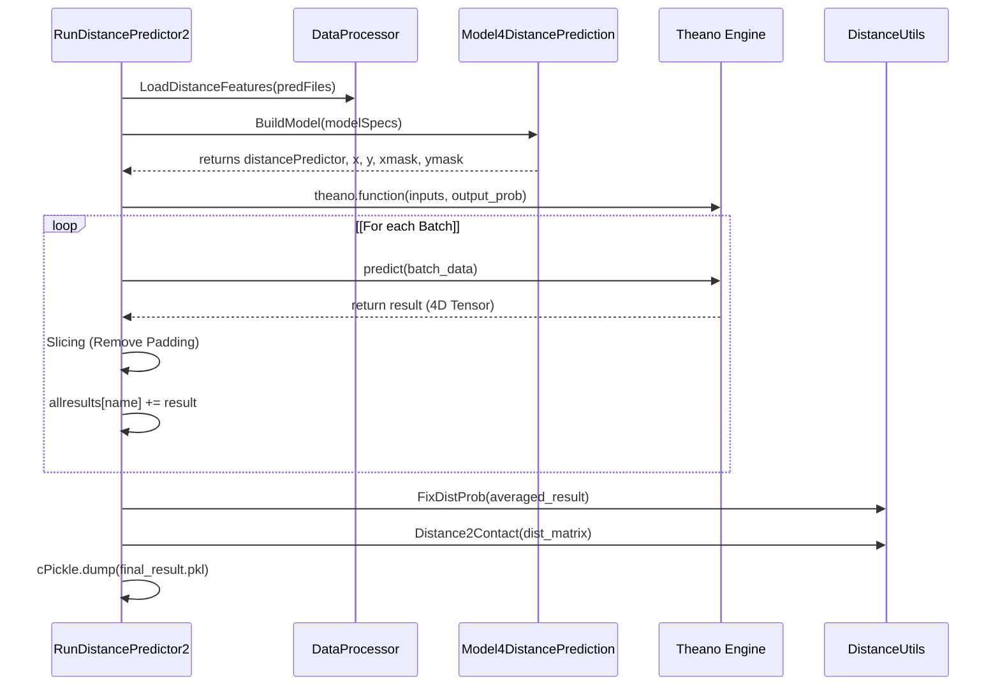

# RunDistancePredictor2: Inference Entrypoint

> **Relevant source files**
> - [DL4DistancePrediction2/RunDistancePredictor2\.py](https://github.com/j3xugit/RaptorX-Contact/blob/7c9de508/DL4DistancePrediction2/RunDistancePredictor2.py)

 `RunDistancePredictor2.py` serves as the primary inference engine for RaptorX\-Contact\. It implements a memory\-efficient pipeline for loading multiple pre\-trained residual network models, performing batch inference on protein feature sets, and ensembling the results into final distance and contact probability matrices\.

### Overview and CLI Interface

 The entrypoint handles command\-line arguments to coordinate model files and input features\. It is designed to support ensembling where multiple models \(potentially with different architectures or training seeds\) predict distances for the same protein set\.

 **Command Line Arguments:**

 - `-p`: Semicolon\-separated list of PKL files containing protein features \(generated by `DataProcessor`\)\. [RunDistancePredictor2\.py L29](https://github.com/j3xugit/RaptorX-Contact/blob/7c9de508/DL4DistancePrediction2/RunDistancePredictor2.py#L29-L29)
- `-m`: Semicolon\-separated list of PKL files containing trained model specifications and parameter values\. [RunDistancePredictor2\.py L30](https://github.com/j3xugit/RaptorX-Contact/blob/7c9de508/DL4DistancePrediction2/RunDistancePredictor2.py#L30-L30)
- `-d`: Output directory for the resulting `.predictedDistMatrix.pkl` files\. [RunDistancePredictor2\.py L31](https://github.com/j3xugit/RaptorX-Contact/blob/7c9de508/DL4DistancePrediction2/RunDistancePredictor2.py#L31-L31)
- `-g`: \(Optional\) Path to ground truth folder for real\-time accuracy evaluation during inference\. [RunDistancePredictor2\.py L33-L34](https://github.com/j3xugit/RaptorX-Contact/blob/7c9de508/DL4DistancePrediction2/RunDistancePredictor2.py#L33-L34)

### System Data Flow: From Model to Prediction

 The inference process bridges the gap between stored model weights and the final spatial probability distributions\.

#### Logic Flow: Code Entity Mapping

 The following diagram illustrates how the script orchestrates the Theano graph and data processing utilities\.

### The PredictDistMatrix Function

 The core logic resides in `PredictDistMatrix()`, which executes a multi\-step pipeline to ensure model consistency and efficient memory usage\.

#### 1\. Model Loading and Consistency Checks

 The script iterates through provided model files, loading the architecture specifications and checking that all models use the same `labelType` for a given atom pair \(e\.g\., Cb\-Cb\)\. It uses `config.Response2LabelName` and `config.Response2LabelType` to validate these mappings\. [RunDistancePredictor2\.py L40-L56](https://github.com/j3xugit/RaptorX-Contact/blob/7c9de508/DL4DistancePrediction2/RunDistancePredictor2.py#L40-L56)

#### 2\. Theano Graph Construction

 For each model, the script calls `Model4DistancePrediction.BuildModel()` to instantiate the symbolic graph\. [RunDistancePredictor2\.py L73](https://github.com/j3xugit/RaptorX-Contact/blob/7c9de508/DL4DistancePrediction2/RunDistancePredictor2.py#L73-L73)

 - It defines `inputVariables` including 1D features \(`x`\), 2D features \(`y`\), and their respective masks \(`xmask`, `ymask`\)\. [RunDistancePredictor2\.py L75-L77](https://github.com/j3xugit/RaptorX-Contact/blob/7c9de508/DL4DistancePrediction2/RunDistancePredictor2.py#L75-L77)
- The `theano.function` compiles the graph to output `pred_prob`\. [RunDistancePredictor2\.py L79-L80](https://github.com/j3xugit/RaptorX-Contact/blob/7c9de508/DL4DistancePrediction2/RunDistancePredictor2.py#L79-L80)
- Weights are loaded into the shared variables via `p.set_value(v)` after a compatibility check\. [RunDistancePredictor2\.py L83-L87](https://github.com/j3xugit/RaptorX-Contact/blob/7c9de508/DL4DistancePrediction2/RunDistancePredictor2.py#L83-L87)

#### 3\. Batch Inference and Padding Removal

 Data is processed in batches to maximize GPU utilization\. Because Theano requires fixed\-size tensors within a batch, sequences are padded\.

 - `DataProcessor.SplitData2Batches` organizes the proteins\. [RunDistancePredictor2\.py L112](https://github.com/j3xugit/RaptorX-Contact/blob/7c9de508/DL4DistancePrediction2/RunDistancePredictor2.py#L112-L112)
- After the forward pass, the script calculates the original sequence length using `seqLens = x1d.shape[1] - x1dmask.shape[1] + np.sum(x1dmask, axis=1)`\. [RunDistancePredictor2\.py L120](https://github.com/j3xugit/RaptorX-Contact/blob/7c9de508/DL4DistancePrediction2/RunDistancePredictor2.py#L120-L120)
- Masked positions are sliced out to return the matrix to its native protein size: `probMatrix[ maxSeqLen-seqLen:, maxSeqLen-seqLen:, : ]`\. [RunDistancePredictor2\.py L144](https://github.com/j3xugit/RaptorX-Contact/blob/7c9de508/DL4DistancePrediction2/RunDistancePredictor2.py#L144-L144)

### Multi\-Model Averaging and Post\-Processing

 To reduce memory overhead during ensembling, `RunDistancePredictor2` stores a running sum of probabilities rather than individual model outputs\.

| Step | Action | Code Reference |
| --- | --- | --- |
| Summation | Accumulate res4one into allresults\[name\]\[response\]\. | DL4DistancePrediction2/RunDistancePredictor2\.py152\-153 |
| Averaging | Divide the sum by numModels\[name\]\[response\]\. | DL4DistancePrediction2/RunDistancePredictor2\.py165\-170 |
| Symmetry | Average the matrix with its transpose: \(m \+ m\.transpose\(1, 0, 2\)\) / 2\.0\. | DL4DistancePrediction2/RunDistancePredictor2\.py175\-176 |
| Correction | Apply DistanceUtils\.FixDistProb to ensure probability constraints\. | DL4DistancePrediction2/RunDistancePredictor2\.py180 |

### Contact Probability Extraction

 The script extracts contact probabilities \(distance < 8\.0Å\) based on the model's output type:

 - **Discrete Labels \(Classification\):** Sums the bins corresponding to distances less than 8\.0Å using `DistanceUtils.Distance2Contact`\. [RunDistancePredictor2\.py L183-L184](https://github.com/j3xugit/RaptorX-Contact/blob/7c9de508/DL4DistancePrediction2/RunDistancePredictor2.py#L183-L184)
- **Normal/LogNormal \(Regression\):** Calculates the Cumulative Distribution Function \(CDF\) at 8\.0 using `DistanceUtils.CalcLabelProb`\. [RunDistancePredictor2\.py L186-L187](https://github.com/j3xugit/RaptorX-Contact/blob/7c9de508/DL4DistancePrediction2/RunDistancePredictor2.py#L186-L187)

### Output Format

 The final output for each protein is a PKL file containing a tuple of 6 items:

 1. `proteinName`: The identifier\.
2. `proteinSequence`: The primary amino acid sequence\.
3. `predictedDistMatrixProb`: A dictionary where keys are responses \(e\.g\., `CbCb`\) and values are the probability tensors\.
4. `predictedContactMatrix`: A dictionary of contact maps \(distance < 8Å\)\.
5. `labelWeightMatrix`: Weights used for evaluation \(if ground truth was provided\)\.
6. `labelDistributionMatrix`: The native distribution \(if ground truth was provided\)\.

 [RunDistancePredictor2\.py L200-L208](https://github.com/j3xugit/RaptorX-Contact/blob/7c9de508/DL4DistancePrediction2/RunDistancePredictor2.py#L200-L208)

### Inference Pipeline Diagram

 Sources: [RunDistancePredictor2\.py L37-L210](https://github.com/j3xugit/RaptorX-Contact/blob/7c9de508/DL4DistancePrediction2/RunDistancePredictor2.py#L37-L210) [Model4DistancePrediction\.py L657-L670](https://github.com/j3xugit/RaptorX-Contact/blob/7c9de508/DL4DistancePrediction2/Model4DistancePrediction.py#L657-L670)
