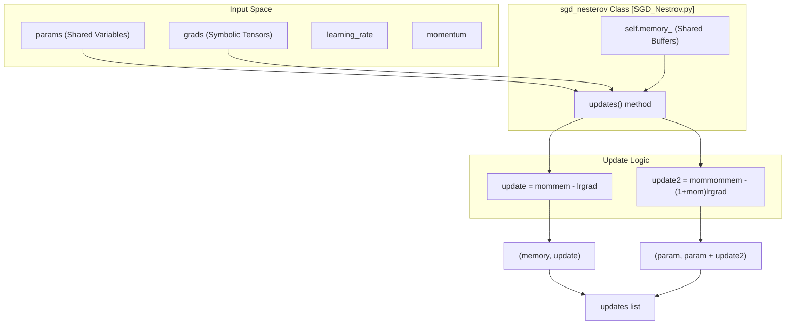
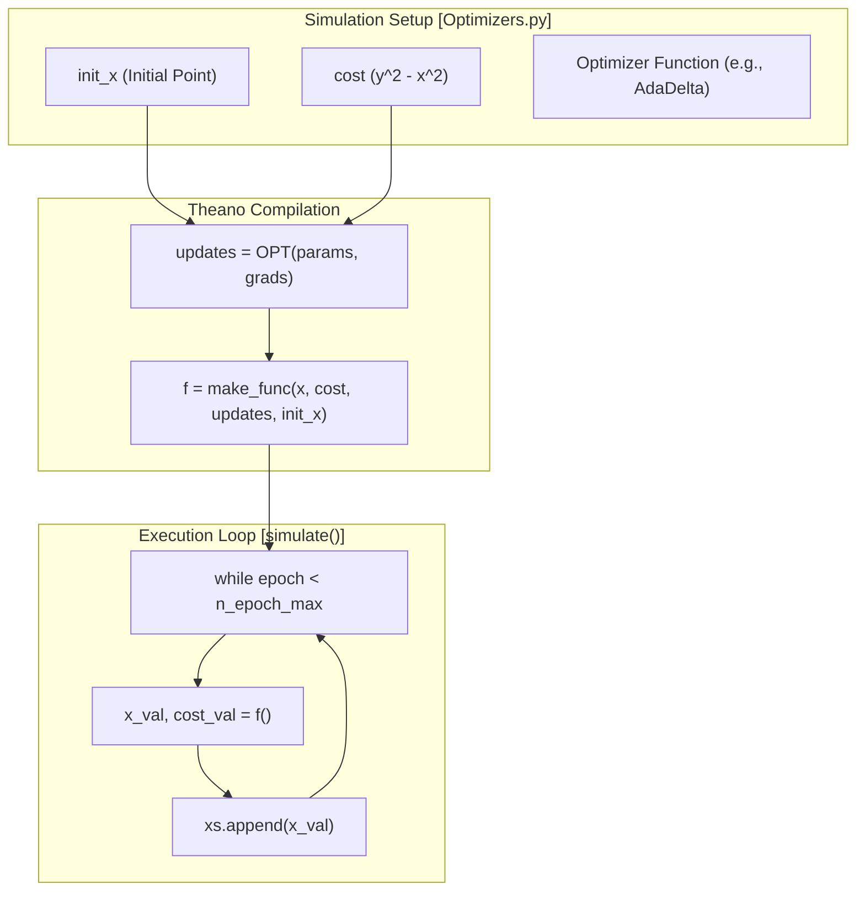

# SGD-Family and Adaptive Optimizers

> **Relevant source files**
> * [DL4DistancePrediction2/Optimizers.py](https://github.com/j3xugit/RaptorX-Contact/blob/7c9de508/DL4DistancePrediction2/Optimizers.py)
> * [DL4DistancePrediction2/SGD_Nestrov.py](https://github.com/j3xugit/RaptorX-Contact/blob/7c9de508/DL4DistancePrediction2/SGD_Nestrov.py)

This page documents the optimization algorithms available in the RaptorX-Contact codebase for training deep residual networks. It covers both standard stochastic gradient descent variants and adaptive schemes that adjust learning rates based on historical gradient statistics.

## Overview of Optimizers

The codebase provides a variety of optimization strategies located in `DL4DistancePrediction2/Optimizers.py` and `DL4DistancePrediction2/SGD_Nestrov.py`. These optimizers are implemented as symbolic Theano update generators, which produce a list of tuples representing the transformation of shared variables (parameters and buffers) for each training step.

### Key Classes and Functions

| Entity | Location | Purpose |
| --- | --- | --- |
| `AdaDelta` | [DL4DistancePrediction2/Optimizers.py L40-L82](https://github.com/j3xugit/RaptorX-Contact/blob/7c9de508/DL4DistancePrediction2/Optimizers.py#L40-L82) | Implements the AdaDelta algorithm (no manual learning rate required). |
| `AdaGrad` | [DL4DistancePrediction2/Optimizers.py L88-L117](https://github.com/j3xugit/RaptorX-Contact/blob/7c9de508/DL4DistancePrediction2/Optimizers.py#L88-L117) | Implements Adaptive Gradient algorithm with cumulative squared gradients. |
| `SGDM` | [DL4DistancePrediction2/Optimizers.py L130-L161](https://github.com/j3xugit/RaptorX-Contact/blob/7c9de508/DL4DistancePrediction2/Optimizers.py#L130-L161) | Standard SGD with momentum (velocity-based). |
| `SGDM2` | [DL4DistancePrediction2/Optimizers.py L164-L195](https://github.com/j3xugit/RaptorX-Contact/blob/7c9de508/DL4DistancePrediction2/Optimizers.py#L164-L195) | An alternative popular implementation of SGD momentum. |
| `Nesterov` | [DL4DistancePrediction2/Optimizers.py L198-L213](https://github.com/j3xugit/RaptorX-Contact/blob/7c9de508/DL4DistancePrediction2/Optimizers.py#L198-L213) | SGD with Nesterov Accelerated Gradient (NAG). |
| `sgd_nesterov` | [DL4DistancePrediction2/SGD_Nestrov.py L1-L15](https://github.com/j3xugit/RaptorX-Contact/blob/7c9de508/DL4DistancePrediction2/SGD_Nestrov.py#L1-L15) | A class-based wrapper for Nesterov updates with persistent memory buffers. |
| `GD` | [DL4DistancePrediction2/Optimizers.py L123-L128](https://github.com/j3xugit/RaptorX-Contact/blob/7c9de508/DL4DistancePrediction2/Optimizers.py#L123-L128) | Basic vanilla Gradient Descent with a constant learning rate. |

Sources: [DL4DistancePrediction2/Optimizers.py L1-L213](https://github.com/j3xugit/RaptorX-Contact/blob/7c9de508/DL4DistancePrediction2/Optimizers.py#L1-L213)

 [DL4DistancePrediction2/SGD_Nestrov.py L1-L15](https://github.com/j3xugit/RaptorX-Contact/blob/7c9de508/DL4DistancePrediction2/SGD_Nestrov.py#L1-L15)

## Adaptive Optimizers

Adaptive optimizers reduce the need for manual learning rate tuning by tracking the magnitude of recent gradients.

### AdaDelta

`AdaDelta` uses two primary state variables for each parameter: `egs` (expected gradient squared) and `exs` (expected update squared) [DL4DistancePrediction2/Optimizers.py L41-L57](https://github.com/j3xugit/RaptorX-Contact/blob/7c9de508/DL4DistancePrediction2/Optimizers.py#L41-L57)

 It uses a decay rate `rho` (default 0.95) to calculate a running average of these values [DL4DistancePrediction2/Optimizers.py L60-L71](https://github.com/j3xugit/RaptorX-Contact/blob/7c9de508/DL4DistancePrediction2/Optimizers.py#L60-L71)

### AdaGrad

`AdaGrad` maintains `grad_hists`, which accumulates the square of all historical gradients for each parameter [DL4DistancePrediction2/Optimizers.py L90-L103](https://github.com/j3xugit/RaptorX-Contact/blob/7c9de508/DL4DistancePrediction2/Optimizers.py#L90-L103)

 The effective learning rate for a parameter is scaled by $1/\sqrt{G_t + \epsilon}$, where $G_t$ is the sum of squared gradients [DL4DistancePrediction2/Optimizers.py L107-L108](https://github.com/j3xugit/RaptorX-Contact/blob/7c9de508/DL4DistancePrediction2/Optimizers.py#L107-L108)

Sources: [DL4DistancePrediction2/Optimizers.py L40-L117](https://github.com/j3xugit/RaptorX-Contact/blob/7c9de508/DL4DistancePrediction2/Optimizers.py#L40-L117)

## SGD with Momentum and Nesterov

The codebase provides multiple implementations of momentum-based SGD to accelerate training and dampen oscillations.

### Nesterov Accelerated Gradient (NAG)

The Nesterov implementation in this codebase uses a "look-ahead" update formula. Instead of evaluating the gradient at the current position, it effectively evaluates it at the point where the momentum would take the parameter.

In `DL4DistancePrediction2/SGD_Nestrov.py`, the `sgd_nesterov` class manages `memory_` buffers [DL4DistancePrediction2/SGD_Nestrov.py L3-L4](https://github.com/j3xugit/RaptorX-Contact/blob/7c9de508/DL4DistancePrediction2/SGD_Nestrov.py#L3-L4)

 The update logic is defined as:

1. `update = momentum * memory - learning_rate * grad` [DL4DistancePrediction2/SGD_Nestrov.py L10](https://github.com/j3xugit/RaptorX-Contact/blob/7c9de508/DL4DistancePrediction2/SGD_Nestrov.py#L10-L10)
2. `update2 = momentum * momentum * memory - (1 + momentum) * learning_rate * grad` [DL4DistancePrediction2/SGD_Nestrov.py L11-L12](https://github.com/j3xugit/RaptorX-Contact/blob/7c9de508/DL4DistancePrediction2/SGD_Nestrov.py#L11-L12)
3. The parameter is updated by `param + update2` [DL4DistancePrediction2/SGD_Nestrov.py L14](https://github.com/j3xugit/RaptorX-Contact/blob/7c9de508/DL4DistancePrediction2/SGD_Nestrov.py#L14-L14)

### Optimizer Data Flow: Parameters to Updates

The following diagram illustrates how the `sgd_nesterov` class interacts with Theano shared variables to produce the symbolic update graph.

**Diagram: Nesterov Update Generation**

Sources: [DL4DistancePrediction2/SGD_Nestrov.py L1-L15](https://github.com/j3xugit/RaptorX-Contact/blob/7c9de508/DL4DistancePrediction2/SGD_Nestrov.py#L1-L15)

 [DL4DistancePrediction2/Optimizers.py L198-L213](https://github.com/j3xugit/RaptorX-Contact/blob/7c9de508/DL4DistancePrediction2/Optimizers.py#L198-L213)

## Simulation and Visualization Utilities

`DL4DistancePrediction2/Optimizers.py` includes a test suite for visualizing optimizer behavior on a saddle-point function ($y^2 - x^2$) [DL4DistancePrediction2/Optimizers.py L2-L6](https://github.com/j3xugit/RaptorX-Contact/blob/7c9de508/DL4DistancePrediction2/Optimizers.py#L2-L6)

### Simulation Workflow

The `simulate` function [DL4DistancePrediction2/Optimizers.py L20-L33](https://github.com/j3xugit/RaptorX-Contact/blob/7c9de508/DL4DistancePrediction2/Optimizers.py#L20-L33)

 executes a Theano function `f` repeatedly to track the trajectory of parameters across `n_epoch_max`. The `make_func` helper [DL4DistancePrediction2/Optimizers.py L11-L18](https://github.com/j3xugit/RaptorX-Contact/blob/7c9de508/DL4DistancePrediction2/Optimizers.py#L11-L18)

 compiles these symbolic updates into an executable Theano function.

**Diagram: Optimizer Simulation Logic**

Sources: [DL4DistancePrediction2/Optimizers.py L11-L33](https://github.com/j3xugit/RaptorX-Contact/blob/7c9de508/DL4DistancePrediction2/Optimizers.py#L11-L33)

## Hyperparameter Summary

| Parameter | Optimizer | Description |
| --- | --- | --- |
| `rho` | `AdaDelta` | Decay rate for moving averages of gradients and updates [DL4DistancePrediction2/Optimizers.py L40](https://github.com/j3xugit/RaptorX-Contact/blob/7c9de508/DL4DistancePrediction2/Optimizers.py#L40-L40) |
| `epsilon` | `AdaDelta`, `AdaGrad` | Small constant for numerical stability in division [DL4DistancePrediction2/Optimizers.py L40-L88](https://github.com/j3xugit/RaptorX-Contact/blob/7c9de508/DL4DistancePrediction2/Optimizers.py#L40-L88) |
| `gamma` | `AdaGrad` | Base learning rate for the adaptive scaling [DL4DistancePrediction2/Optimizers.py L88](https://github.com/j3xugit/RaptorX-Contact/blob/7c9de508/DL4DistancePrediction2/Optimizers.py#L88-L88) |
| `momentum` | `SGDM`, `Nesterov` | Fraction of the previous update to retain [DL4DistancePrediction2/Optimizers.py L130-L198](https://github.com/j3xugit/RaptorX-Contact/blob/7c9de508/DL4DistancePrediction2/Optimizers.py#L130-L198) |
| `lr` | `SGDM`, `SGDM2`, `Nesterov` | Step size for gradient updates [DL4DistancePrediction2/Optimizers.py L130-L198](https://github.com/j3xugit/RaptorX-Contact/blob/7c9de508/DL4DistancePrediction2/Optimizers.py#L130-L198) |

Sources: [DL4DistancePrediction2/Optimizers.py L40-L213](https://github.com/j3xugit/RaptorX-Contact/blob/7c9de508/DL4DistancePrediction2/Optimizers.py#L40-L213)