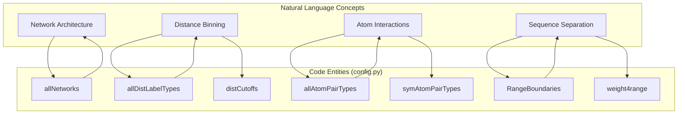
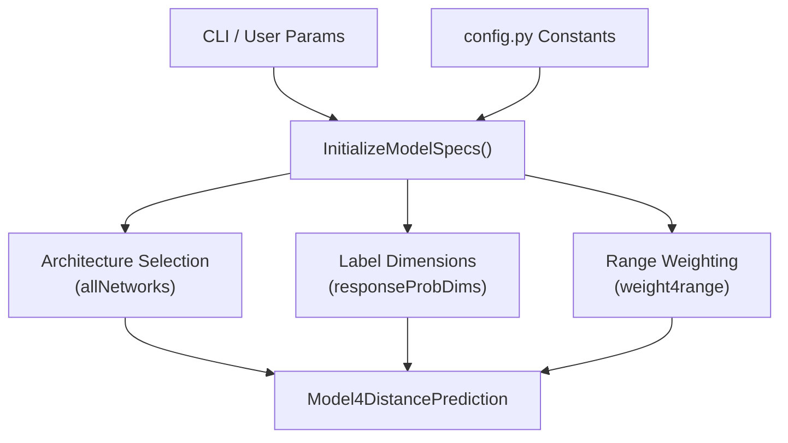

# System Configuration and Global Parameters

> **Relevant source files**
> * [DL4DistancePrediction2/config.py](https://github.com/j3xugit/RaptorX-Contact/blob/7c9de508/DL4DistancePrediction2/config.py)

This page documents the central configuration infrastructure of RaptorX-Contact, primarily managed through `config.py`. It defines the model architecture variants, distance discretization schemes, atom pair types, and the global parameters that govern loss weighting and sequence encoding.

## 1. Overview of config.py

The `config.py` file serves as the global registry for the system. it defines available neural network architectures, distance label types, and atom-specific parameters. It also contains the logic for range-based weighting, which is critical for balancing the importance of long-range contacts during training.

### Key Global Constants

* **ProbScaleFactor**: A scaling factor derived as `np.log(0.5)/np.log(0.4)` used to adjust predicted contact probabilities when generating CASP-formatted output to maximize MCC and F1 scores [DL4DistancePrediction2/config.py L4-L9](https://github.com/j3xugit/RaptorX-Contact/blob/7c9de508/DL4DistancePrediction2/config.py#L4-L9)
* **MaxBetaDistance / MaxHBDistance**: Defines the physical thresholds for Beta-pairing (8.0 Å) and Hydrogen-bonding (9.5 Å) [DL4DistancePrediction2/config.py L55-L56](https://github.com/j3xugit/RaptorX-Contact/blob/7c9de508/DL4DistancePrediction2/config.py#L55-L56)

## 2. Model Architectures and Embedding Modes

RaptorX-Contact supports several variants of Residual Networks (ResNet) for 2D distance prediction.

| Architecture | Description |
| --- | --- |
| `ResNet2D` | The standard 2D Residual Network implementation [DL4DistancePrediction2/config.py L16](https://github.com/j3xugit/RaptorX-Contact/blob/7c9de508/DL4DistancePrediction2/config.py#L16-L16) |
| `ResNet2DV22` | Features two batch normalization layers per residual block [DL4DistancePrediction2/config.py L14-L16](https://github.com/j3xugit/RaptorX-Contact/blob/7c9de508/DL4DistancePrediction2/config.py#L14-L16) |
| `ResNet2DV23` | Recommended variant; identical to ResNet2D but with unused batch normalization layers and parameters removed [DL4DistancePrediction2/config.py L12-L16](https://github.com/j3xugit/RaptorX-Contact/blob/7c9de508/DL4DistancePrediction2/config.py#L12-L16) |
| `DilatedResNet2D` | Utilizes dilated convolutions to increase the receptive field [DL4DistancePrediction2/config.py L16](https://github.com/j3xugit/RaptorX-Contact/blob/7c9de508/DL4DistancePrediction2/config.py#L16-L16) |

### Embedding Modes

The system supports different ways to encode sequence and profile information:

* `SeqOnly`: Uses only the primary sequence.
* `Seq+SS`: Combines sequence with secondary structure information.
* `OuterCat`: Utilizes the outer concatenation operation to lift 1D features into 2D space [DL4DistancePrediction2/config.py L45](https://github.com/j3xugit/RaptorX-Contact/blob/7c9de508/DL4DistancePrediction2/config.py#L45-L45)

## 3. Distance Labeling and Discretization

The system treats distance prediction as a multi-class classification problem by discretizing inter-residue distances into bins.

### Discrete Label Types

Distance bins are defined by a naming convention (e.g., `25C`, `52C`, `NCPlus`). The `Plus` suffix indicates that invalid distances (marked as -1 in the data) are treated as a separate category from the maximum distance bin [DL4DistancePrediction2/config.py L58-L60](https://github.com/j3xugit/RaptorX-Contact/blob/7c9de508/DL4DistancePrediction2/config.py#L58-L60)

| Label Type | Number of Bins | Cutoff Range (Å) |
| --- | --- | --- |
| `52C` | 52 | 4.0 to 16.5 (0.25Å steps) [DL4DistancePrediction2/config.py L64](https://github.com/j3xugit/RaptorX-Contact/blob/7c9de508/DL4DistancePrediction2/config.py#L64-L64) |
| `25C` | 25 | 4.5 to 16.0 [DL4DistancePrediction2/config.py L70-L71](https://github.com/j3xugit/RaptorX-Contact/blob/7c9de508/DL4DistancePrediction2/config.py#L70-L71) |
| `12C` | 12 | 5.0 to 15.0 [DL4DistancePrediction2/config.py L79-L80](https://github.com/j3xugit/RaptorX-Contact/blob/7c9de508/DL4DistancePrediction2/config.py#L79-L80) |
| `3C` | 3 | 8.0, 15.0 [DL4DistancePrediction2/config.py L82-L83](https://github.com/j3xugit/RaptorX-Contact/blob/7c9de508/DL4DistancePrediction2/config.py#L82-L83) |

### Continuous Label Types

Besides discrete bins, the system supports distribution parameters:

* `Normal`: Predicts mean and variance [DL4DistancePrediction2/config.py L121](https://github.com/j3xugit/RaptorX-Contact/blob/7c9de508/DL4DistancePrediction2/config.py#L121-L121)
* `LogNormal`: Predicts parameters for log-normal distribution [DL4DistancePrediction2/config.py L126](https://github.com/j3xugit/RaptorX-Contact/blob/7c9de508/DL4DistancePrediction2/config.py#L126-L126)

## 4. Atom Pair Types and Symmetry

The system predicts distances between different atom types in the protein backbone and sidechains.

* **Supported Pairs**: `CbCb` (C-beta), `CaCa` (C-alpha), `CgCg` (C-gamma), `CaCg`, and `NO` [DL4DistancePrediction2/config.py L22](https://github.com/j3xugit/RaptorX-Contact/blob/7c9de508/DL4DistancePrediction2/config.py#L22-L22)
* **Symmetry**: Pairs like `CbCb`, `CaCa`, and `CgCg` are inherently symmetric. The function `IsSymmetricAPT(apt)` is used to check this property [DL4DistancePrediction2/config.py L34-L35](https://github.com/j3xugit/RaptorX-Contact/blob/7c9de508/DL4DistancePrediction2/config.py#L34-L35)

### Natural Language to Code Entity Mapping: Configurations

The following diagram maps high-level configuration concepts to their specific implementation constants in `config.py`.

**Sources:** [DL4DistancePrediction2/config.py L16-L24](https://github.com/j3xugit/RaptorX-Contact/blob/7c9de508/DL4DistancePrediction2/config.py#L16-L24)

 [DL4DistancePrediction2/config.py L62-L87](https://github.com/j3xugit/RaptorX-Contact/blob/7c9de508/DL4DistancePrediction2/config.py#L62-L87)

 [DL4DistancePrediction2/config.py L141-L156](https://github.com/j3xugit/RaptorX-Contact/blob/7c9de508/DL4DistancePrediction2/config.py#L141-L156)

## 5. Range-Based Weighting Strategy

To prioritize biologically significant long-range contacts, the system applies different weights to the loss function based on the sequence separation (distance in the primary sequence) between residue pairs.

* **Boundaries**: Long-range (≥24), Medium-range (12-23), Short-range (6-11), and Near-range (2-5) [DL4DistancePrediction2/config.py L141](https://github.com/j3xugit/RaptorX-Contact/blob/7c9de508/DL4DistancePrediction2/config.py#L141-L141)
* **Weights**: Defined in `weight4range`, typically giving higher priority to long-range pairs (e.g., 3.0 for long-range vs 0.5 for near-range) [DL4DistancePrediction2/config.py L156](https://github.com/j3xugit/RaptorX-Contact/blob/7c9de508/DL4DistancePrediction2/config.py#L156-L156)

## 6. Model Specification Initialization

The `InitializeModelSpecs()` function serves as the entry point for configuring a model's hyperparameters and data requirements.

### Data Flow for Model Initialization

This diagram illustrates how parameters from `config.py` and user input flow into the model specification.

**Sources:** [DL4DistancePrediction2/config.py L16](https://github.com/j3xugit/RaptorX-Contact/blob/7c9de508/DL4DistancePrediction2/config.py#L16-L16)

 [DL4DistancePrediction2/config.py L131-L135](https://github.com/j3xugit/RaptorX-Contact/blob/7c9de508/DL4DistancePrediction2/config.py#L131-L135)

 [DL4DistancePrediction2/config.py L156](https://github.com/j3xugit/RaptorX-Contact/blob/7c9de508/DL4DistancePrediction2/config.py#L156-L156)

### Key Helper Functions

* **ParseAtomPairTypes(aptStr)**: Splits a string of atom pairs (e.g., "CbCb+CaCa") into a list [DL4DistancePrediction2/config.py L26-L31](https://github.com/j3xugit/RaptorX-Contact/blob/7c9de508/DL4DistancePrediction2/config.py#L26-L31)
* **GetRangeIndex(offset)**: Determines which range category a residue pair belongs to based on its sequence offset [DL4DistancePrediction2/config.py L144-L154](https://github.com/j3xugit/RaptorX-Contact/blob/7c9de508/DL4DistancePrediction2/config.py#L144-L154)
* **Response2LabelType / Response2LabelName**: Parses combined response strings (e.g., "CbCb_Discrete25C") into their constituent atom pair and label type components [DL4DistancePrediction2/config.py L93-L100](https://github.com/j3xugit/RaptorX-Contact/blob/7c9de508/DL4DistancePrediction2/config.py#L93-L100)

**Sources:**

* `DL4DistancePrediction2/config.py`: [1-161](https://github.com/j3xugit/RaptorX-Contact/blob/7c9de508/1-161)