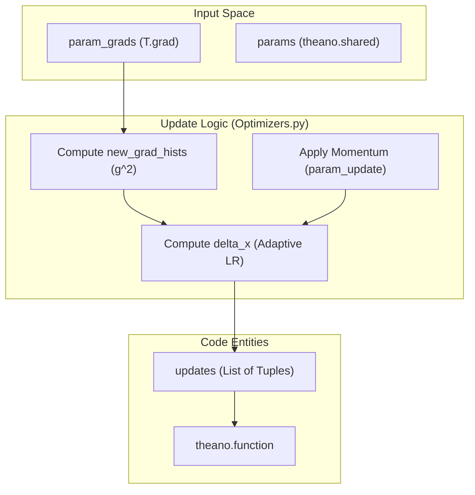

# Training and Optimization

> **Relevant source files**
> * [DL4DistancePrediction2/Adams.py](https://github.com/j3xugit/RaptorX-Contact/blob/7c9de508/DL4DistancePrediction2/Adams.py)
> * [DL4DistancePrediction2/Optimizers.py](https://github.com/j3xugit/RaptorX-Contact/blob/7c9de508/DL4DistancePrediction2/Optimizers.py)

The training infrastructure in RaptorX-Contact is built upon Theano's symbolic graph, utilizing a variety of gradient-based optimization algorithms. The system decouples the model architecture from the optimization logic, allowing for flexible experimentation with different update rules (Adam, SGD, Nesterov, etc.) while maintaining a consistent interface for weight updates and checkpointing.

### Optimization Workflow

Training involves computing symbolic gradients of the cost function with respect to model parameters and applying update rules to generate a list of `(shared_variable, new_value)` pairs for `theano.function`. The optimization process is managed through specialized modules that handle state variables (like momentum or moving averages) and hyperparameter scheduling.

Training Lifecycle Overview:

1. **Gradient Computation**: The model (e.g., `ResNet4DistMatrix`) provides a list of parameters and their corresponding gradients.
2. **Update Generation**: An optimizer function (from `Adams.py` or `Optimizers.py`) consumes these gradients and produces symbolic updates.
3. **State Management**: Optimizers track auxiliary variables (e.g., `m`, `v` in Adam) which are returned as `other_params` to facilitate full model checkpointing.
4. **Execution**: The updates are passed to the Theano training function, which is executed per batch.

**Optimization Component Architecture**

**Sources:** [DL4DistancePrediction2/Adams.py L30-L58](https://github.com/j3xugit/RaptorX-Contact/blob/7c9de508/DL4DistancePrediction2/Adams.py#L30-L58)

 [DL4DistancePrediction2/Optimizers.py L11-L18](https://github.com/j3xugit/RaptorX-Contact/blob/7c9de508/DL4DistancePrediction2/Optimizers.py#L11-L18)

 [DL4DistancePrediction2/Optimizers.py L130-L161](https://github.com/j3xugit/RaptorX-Contact/blob/7c9de508/DL4DistancePrediction2/Optimizers.py#L130-L161)

---

### Adam-Family Optimizers

The `Adams.py` module contains the primary optimizers used for deep residual learning in this codebase. It includes standard Adam, AMSGrad, and variants that implement decoupled weight decay (AdamW).

Key features include:

* **Bias Correction**: Implements `fix1` and `fix2` terms to account for initialization bias in the first and second moments [DL4DistancePrediction2/Adams.py L39-L41](https://github.com/j3xugit/RaptorX-Contact/blob/7c9de508/DL4DistancePrediction2/Adams.py#L39-L41)
* **Decoupled Weight Decay**: `AdamW` and `AdamWAMS` separate the L2 regularization from the gradient update, which is critical for the generalization of deep ResNets [DL4DistancePrediction2/Adams.py L96-L132](https://github.com/j3xugit/RaptorX-Contact/blob/7c9de508/DL4DistancePrediction2/Adams.py#L96-L132)
* **State Persistence**: All Adam variants return `other_params`, a list of shared variables containing the iteration count `i`, first moment `m`, and second moment `v` [DL4DistancePrediction2/Adams.py L32-L58](https://github.com/j3xugit/RaptorX-Contact/blob/7c9de508/DL4DistancePrediction2/Adams.py#L32-L58)

For detailed implementation details on bias correction and weight decay logic, see **[Adam-Family Optimizers](/j3xugit/RaptorX-Contact/4.1-adam-family-optimizers)**.

**Sources:** [DL4DistancePrediction2/Adams.py L60-L93](https://github.com/j3xugit/RaptorX-Contact/blob/7c9de508/DL4DistancePrediction2/Adams.py#L60-L93)

 [DL4DistancePrediction2/Adams.py L135-L175](https://github.com/j3xugit/RaptorX-Contact/blob/7c9de508/DL4DistancePrediction2/Adams.py#L135-L175)

---

### SGD and Adaptive Optimizers

The `Optimizers.py` and `SGD_Nestrov.py` modules provide classical optimization algorithms and utilities for analyzing optimization landscapes (such as saddle point tests).

Available algorithms include:

* **Stochastic Gradient Descent (SGD)**: Includes standard GD, SGDM (Momentum), and SGDM2 (a common alternative implementation) [DL4DistancePrediction2/Optimizers.py L123-L195](https://github.com/j3xugit/RaptorX-Contact/blob/7c9de508/DL4DistancePrediction2/Optimizers.py#L123-L195)
* **Nesterov Accelerated Gradient**: Implemented both in the general `Optimizers.py` and as a specialized `sgd_nesterov` class that manages memory buffers for look-ahead updates [DL4DistancePrediction2/Optimizers.py L198-L213](https://github.com/j3xugit/RaptorX-Contact/blob/7c9de508/DL4DistancePrediction2/Optimizers.py#L198-L213)
* **Adaptive Methods**: Includes `AdaDelta` and `AdaGrad`, which adjust learning rates per-parameter based on historical gradient magnitudes [DL4DistancePrediction2/Optimizers.py L40-L81](https://github.com/j3xugit/RaptorX-Contact/blob/7c9de508/DL4DistancePrediction2/Optimizers.py#L40-L81)  [DL4DistancePrediction2/Optimizers.py L88-L116](https://github.com/j3xugit/RaptorX-Contact/blob/7c9de508/DL4DistancePrediction2/Optimizers.py#L88-L116)

For information on hyperparameter tuning for `rho`, `gamma`, and momentum, see **[SGD-Family and Adaptive Optimizers](/j3xugit/RaptorX-Contact/4.2-sgd-family-and-adaptive-optimizers)**.

**Sources:** [DL4DistancePrediction2/Optimizers.py L1-L6](https://github.com/j3xugit/RaptorX-Contact/blob/7c9de508/DL4DistancePrediction2/Optimizers.py#L1-L6)

 [DL4DistancePrediction2/Optimizers.py L198-L213](https://github.com/j3xugit/RaptorX-Contact/blob/7c9de508/DL4DistancePrediction2/Optimizers.py#L198-L213)

---

### Integration and Visualization

The infrastructure includes a `simulate` utility to test optimizer behavior on synthetic functions (like the saddle point $y^2 - x^2$) before applying them to the full protein distance prediction task. This allows for verifying that the symbolic updates correctly traverse difficult loss landscapes.

**Optimizer Data Flow**

**Sources:** [DL4DistancePrediction2/Optimizers.py L1-L33](https://github.com/j3xugit/RaptorX-Contact/blob/7c9de508/DL4DistancePrediction2/Optimizers.py#L1-L33)

 [DL4DistancePrediction2/Optimizers.py L218-L220](https://github.com/j3xugit/RaptorX-Contact/blob/7c9de508/DL4DistancePrediction2/Optimizers.py#L218-L220)