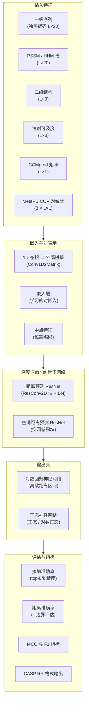

---
slug:1-overview
blog_type:normal
---


**RaptorX-Contact** 是一个开源软件包，由深度卷积残差神经网络驱动，用于**蛋白质接触和距离预测**。该软件包由芝加哥大学的 Jinbo Xu 及其合作者开发，实现了一种开创性的方法，该方法首次证明了超深残差网络可以在预测残基间距离方面达到业界领先的准确率——并且这些预测出的距离比仅使用传统的接触图能产生显著更好的 3D 结构折叠效果。该项目基于 **GNU GPL v3** 许可证发布，并在 **Theano** 深度学习框架和 Python 2.7 环境下构建。

来源: [README.md](/README.md#L1-L38), [LICENSE](/LICENSE#L1-L5)

## RaptorX-Contact 的功能

蛋白质结构预测的关键在于理解氨基酸残基之间的空间关系。RaptorX-Contact 从两种粒度解决这个问题：**接触预测**（二分类：两个残基间距是否在约 8Å 以内？）和**距离预测**（多分类回归：残基对属于哪个距离区间？）。PNAS 2019 论文所展示的核心洞见是，**由深度 ResNet 预测的距离分布比来自同一网络的二元接触能产生更好的 3D 折叠效果**。该软件包支持预测多种原子对（Cβ–Cβ、Cα–Cα、Cγ–Cγ、Cα–Cγ）之间的距离、氢键以及 β-配对——所有这些均仅从序列衍生特征中进行预测。

来源: [README.md](/README.md#L1-L12)

## 架构一览

该系统遵循经典的深度学习流程：**特征提取 → 嵌入 → 深度 ResNet 骨干网络 → 输出头 → 评估**。下图展示了端到端的数据流和主要模块间的交互。



来源: [Model4DistancePrediction.py](/DL4DistancePrediction2/Model4DistancePrediction.py#L1-L50), [config.py](/DL4DistancePrediction2/config.py#L1-L50)

## 项目结构

```
RaptorX-Contact/
├── Common/
│   └── LoadHHM.py                  # HHM → PSSM/PSFM 解析器
├── DL4DistancePrediction2/
│   ├── config.py                    # 核心配置与距离区间
│   ├── Model4DistancePrediction.py  # 模型组装与训练循环
│   ├── RunDistancePredictor2.py     # 推理流水线入口
│   ├── ResNet4Distance.py           # 标准 2D ResNet 骨干网络
│   ├── DilatedResNet4Distance.py    # 空洞卷积 ResNet 变体
│   ├── EmbeddingLayer.py           # 序列与谱嵌入层
│   ├── Conv1d.py                    # 一维卷积原语
│   ├── DataProcessor.py            # 特征加载、批处理与增强
│   ├── ReadProteinFeatures.py      # 多蛋白质特征读取器
│   ├── ReadOneProteinFeatures.py   # 单蛋白质特征读取器
│   ├── NN4LogReg.py                # 逻辑回归输出头
│   ├── NN4Normal.py                # 正态分布输出头
│   ├── Optimizers.py               # AdaDelta, SGD-Momentum, AdaGrad
│   ├── Adams.py                    # Adam, AdamW, AMSGrad 优化器
│   ├── DistanceUtils.py            # 距离矩阵 I/O 与转换
│   ├── ContactUtils.py             # 接触矩阵 I/O 与 CASP 格式
│   ├── Metrics.py                  # F1 和 MCC 计算
│   ├── BatchEvaluateContactAccuracy.py
│   ├── BatchEvaluateDistanceAccuracy.py
│   ├── CalcContactPredAccuracy.py
│   ├── CalcMCCF1.py
│   ├── BatchCalcMCCF1.py
│   ├── CalcCASPContactPredAccuracy.py
│   ├── EvaluateDistanceAccuracy.py
│   ├── LogReg.py                   # 独立逻辑回归
│   ├── mlLogReg.py                 # 多标签逻辑回归
│   ├── resnet.py                   # 备选 ResNet 工具
│   ├── SGD_Nestrov.py              # Nesterov SGD 实现
│   └── utils.py                    # 外部拼接、中点特征等
├── LICENSE                          # GNU GPL v3
└── README.md
```

来源: [README.md](/README.md#L1-L38)

## 核心架构组件

下表总结了主要模块、它们的作用以及它们在预测流水线中如何相互连接。

| 模块 | 作用 | 关键类 / 函数 |
|---|---|---|
| **config.py** | 核心配置中心 | 距离区间定义 (`distCutoffs`)，权重调度 (`weight4range`, `weight43C`)，网络/算法注册表，`InitializeModelSpecs()` |
| **Model4DistancePrediction.py** | 模型组装与训练 | `Conv1D2Matrix`, `Conv2D4DistMatrix`, `BuildModel()`, `TrainModel()` |
| **RunDistancePredictor2.py** | 推理协调器 | `PredictDistMatrix()` — 加载模型，运行预测，平均集成结果，保存结果 |
| **ResNet4Distance.py** | 标准 ResNet 骨干网络 | `ResConv1DLayer`, `ResConv2DLayer`, `batch_norm()`, `ResNet` |
| **DilatedResNet4Distance.py** | 空洞 ResNet 骨干网络 | `ResConv1DLayer`, `ResConv2DLayer` (带空洞)，`DilatedResNet` |
| **EmbeddingLayer.py** | 学习的对嵌入 | `EmbeddingLayer`, `MetaEmbeddingLayer` (范围感知)，`ProfileEmbeddingLayer` |
| **DataProcessor.py** | 特征工程与批处理 | `LoadDistanceFeatures()`, `SplitData2Batches()`, `PriorDistancePotential()`, `LocationFeature()` |
| **NN4LogReg.py** | 分类输出头 | `HiddenLayer`, `LogRegLayer`, `NN4LogReg` |
| **NN4Normal.py** | 回归输出头 | `HiddenLayer`, `NN4Normal` (预测正态/对数正态分布的 μ, σ) |
| **Adams.py** | Adam 族优化器 | `Adam()`, `AdamW()`, `AMSGrad()` |
| **LoadHHM.py** | HHM 谱解析 | `ReadHHM()` — 将 HHblits `.hhm` 文件转换为 PSSM/PSFM 矩阵 |

来源: [config.py](/DL4DistancePrediction2/config.py#L1-L200), [Model4DistancePrediction.py](/DL4DistancePrediction2/Model4DistancePrediction.py#L1-L50), [RunDistancePredictor2.py](/DL4DistancePrediction2/RunDistancePredictor2.py#L1-L60)

## 输入特征

RaptorX-Contact 消耗六类基于序列衍生的特征——输入时无需 3D 结构。特征按蛋白质存储为 Python `dict()`，且具有 `DataProcessor.LoadDistanceFeatures()` 所期望的特定键。

| 特征 | 形状 | 来源工具 | 描述 |
|---|---|---|---|
| **一级序列** | 单字母代码字符串 | — | 内部独热编码为 L×20 |
| **PSSM** | L × 20 | PSI-BLAST / HHblits | 位置特异性评分矩阵；通过 `LoadHHM.py` 从 `.hhm` 生成 |
| **二级结构** | L × 3 | DeepCNF_SS_Con | 3 状态置信度分数（螺旋、折叠、环） |
| **溶剂可及度** | L × 3 | AcconPred | 3 状态可及性置信度分数 |
| **CCMpred** | L × L | CCMpred (使用 `-R -d GPU`) | 归一化协同变异矩阵 |
| **MetaPSICOV 对统计** | 3 × L × L | alnstats (MetaPSICOV) | 三个两两关系矩阵 |

<CgxTip>在准备自己的数据时，请确保螺旋/折叠/环和可及性标签的顺序与示例测试数据完全匹配——顺序不匹配会导致预测准确率悄然下降。</CgxTip>

来源: [README.md](/README.md#L24-L36), [DataProcessor.py](/DL4DistancePrediction2/DataProcessor.py#L111-L200), [LoadHHM.py](/Common/LoadHHM.py#L1-L30)

## 距离离散化区间

一个核心设计选择是如何将连续的残基间距离离散化为分类目标。`config.py` 模块定义了 **16 种分箱方案**，范围从粗粒度（2 个区间：接触与非接触）到细粒度（52 个区间，跨越 4.0–16.5Å）。命名约定遵循 `Discrete{N}C`（N 个区间，无效距离合并至最后一个区间）和 `Discrete{N}CPlus`（无效距离分离至专用区间）的模式。

| 方案 | 区间数 | 范围 | 间距 | 典型用途 |
|---|---|---|---|---|
| `Discrete52C` | 52 | 4.0–16.5 Å | ~0.25 Å | 高分辨率距离图 |
| `Discrete25C` | 25 | 4.5–16.0 Å | ~0.48 Å | Cβ–Cβ 预测的默认方案 |
| `Discrete12C` | 12 | 5–15 Å | 1.0 Å | 平衡速度/准确率 |
| `Discrete3C` | 3 | 0–8, 8–15, >15 Å | — | 粗粒度类接触区间 |
| `Discrete2C` | 2 | 0–8, >8 Å | — | 二元接触分类 |

来源: [config.py](/DL4DistancePrediction2/config.py#L50-L120)

## 范围感知损失加权

并非所有残基对都提供同等的信息量。该系统应用**范围感知加权**，为长距离对（序列间隔 ≥ 24）分配较高的损失权重，并逐渐降低中距离（≥12）、短距离（≥6）和近距离对的权重。此外，在每个范围内，**距离感知权重**进一步强调近距离区间（0–8Å）而非远距离区间。这种双层加权方案对于长距离接触的训练稳定性和预测质量至关重要——长距离接触是结构信息最丰富的残基对。

| 范围 | 间隔 | 范围权重 | 近距离权重 (0–8Å) | 中距离权重 (8–15Å) | 远距离权重 (>15Å) |
|---|---|---|---|---|---|
| 长 | ≥ 24 | 3.0 | 17 | 4 | 1 |
| 中 | ≥ 12 | 2.5 | 5 | 2 | 1 |
| 短 | ≥ 6 | 1.0 | 2.5 | 0.6 | 1 |
| 近 | ≥ 2 | 0.5 | 0.2 | 0.3 | 1 |

来源: [config.py](/DL4DistancePrediction2/config.py#L145-L175)

## 神经网络变体

提供两种 ResNet 架构，均在带有批归一化和 ReLU 激活的 2D L×L 特征图上运行：

- **ResNet2D** (`ResNet4Distance.py`)：标准空洞无关残差块，包含 1D 和 2D 卷积层、批归一化，以及用于可变长度序列的可选掩码。
- **DilatedResNet2D** (`DilatedResNet4Distance.py`)：使用**空洞卷积**扩展标准 ResNet，在不增加参数量的情况下指数级扩大感受野——这对于捕获大型距离矩阵中的长距离依赖关系至关重要。

两种变体均通过填充与掩码策略支持可变长度输入：较短序列在右侧/底部用零填充，二进制掩码在每次卷积和批归一化步骤后重置填充位置，以防止噪声传播。

来源: [ResNet4Distance.py](/DL4DistancePrediction2/ResNet4Distance.py#L1-L146), [DilatedResNet4Distance.py](/DL4DistancePrediction2/DilatedResNet4Distance.py#L1-L80)

## 预测流水线

推理过程由 `RunDistancePredictor2.py` 协调。`PredictDistMatrix()` 函数支持**模型集成**：加载多个模型文件（可能使用不同的分箱方案或随机种子进行训练），并将其预测的概率矩阵按响应进行平均。该流水线：

1. 从 `.pkl` 文件加载模型规格和参数值
2. 通过 `Model4DistancePrediction.BuildModel()` 构建 Theano 计算图
3. 通过 `DataProcessor.LoadDistanceFeatures()` 加载和批处理预测数据
4. 对每批数据运行前向传播，跨模型累积预测结果
5. 平均集成预测结果，并为对称原子对（Cβ–Cβ、Cα–Cα、Cγ–Cγ）对称化输出
6. 将距离概率矩阵转换为接触矩阵并保存结果

<CgxTip>在集成中使用多个模型时，所有模型必须在每种原子对类型的标签类型（例如 `Discrete25C`）上保持一致——配置不匹配会导致推理时发生致命错误。</CgxTip>

来源: [RunDistancePredictor2.py](/DL4DistancePrediction2/RunDistancePredictor2.py#L30-L120)

## 研究基础

该软件包实现了来自七篇主要出版物的方法，勾勒出从接触预测到基于距离的折叠的演进历程：

| 年份 | 发表载体 | 贡献 |
|---|---|---|
| 2017 | PLoS CB | 首个用于接触图预测的超深度学习模型 |
| 2017 | Cell Systems | 用于膜蛋白折叠的深度迁移学习 |
| 2018 | PROTEINS (CASP12) | 盲测接触预测深度学习方法的分析 |
| 2018 | NAR | ComplexContact：基于深度学习的蛋白质间接触预测 |
| 2018 | ISMB/Bioinformatics | 应用于蛋白质穿线/比对的距离预测 |
| 2019 | PNAS | **由深度学习驱动的基于距离的折叠**（关键成果） |
| 2019 | PROTEINS (CASP13) | CASP13 中基于距离的结构预测分析 |

来源: [README.md](/README.md#L7-L30)

## 技术栈

| 组件 | 技术 | 备注 |
|---|---|---|
| 深度学习框架 | **Theano** | 支持 GPU 的符号张量计算 |
| 编程语言 | **Python 2.7** | 推荐使用 Anaconda 发行版 |
| 序列化 | **cPickle** | 模型和特征文件使用 `.pkl` 格式 |
| 外部依赖 | **BioPython** (可选) | 用于序列/结构工具 |
| 谱生成 | **HHblits / HHpred** | 生成由 `LoadHHM.py` 解析的 `.hhm` 文件 |
| 协同变异 | **CCMpred** | 使用 `-R -d GPU` 标志进行 GPU 加速 |
| 两两统计 | **MetaPSICOV alnstats** | 生成 3 个补充 L×L 矩阵 |

来源: [README.md](/README.md#L5-L6), [Adams.py](/DL4DistancePrediction2/Adams.py#L1-L30)

## 后续阅读

现在你已经对 RaptorX-Contact 有了宏观的认识，请按照以下阅读顺序加深你的理解：

1. **[快速开始](2-quick-start)** — 使用你自己的蛋白质序列运行该软件包
2. **[架构概览](3-architecture-overview)** — 模型组装与数据流的详细拆解
3. **[输入特征规范](7-input-feature-specification)** — 按模型期望的准确格式准备输入数据
4. **[用于距离预测的深度 ResNet](4-deep-resnet-for-distance)** — 理解核心网络骨干
5. **[距离预测流水线](12-distance-prediction-pipeline)** — 逐步推理与输出解释
6. **[接触准确率评估](13-contact-accuracy-evaluation)** — 衡量并解释预测质量