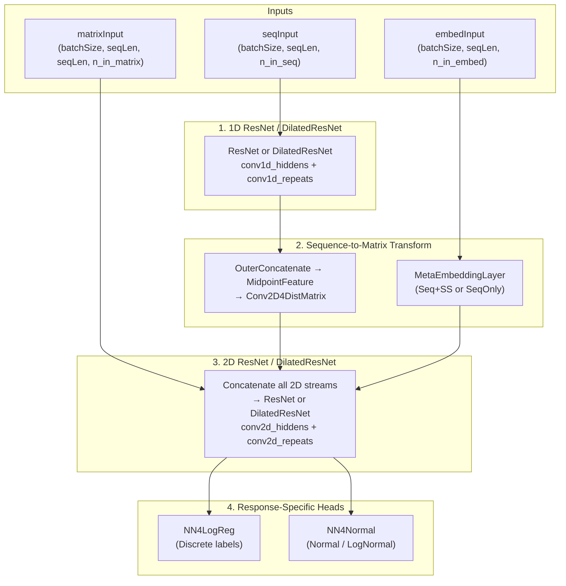
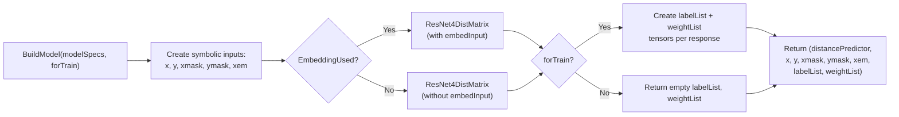

---
slug:10-model-building-and-loss
blog_type:normal
---


RaptorX-Contact 模型构建框架在 Theano 中组装了一个多阶段深度学习计算图，将 1D 序列特征和 2D 成对特征转换为预测的残基间距离分布。损失系统在用于离散（分箱）距离标签的**交叉熵**和用于连续距离回归的**高斯负对数似然**之间进行分派，两者均通过范围感知和距离区间感知的样本加权来应对严重的类别不平衡。

## 架构组成：ResNet4DistMatrix

核心类 `ResNet4DistMatrix` 负责编排完整的计算图。它接收三个输入流——序列特征（`seqInput`）、成对矩阵特征（`matrixInput`）和可选的嵌入特征（`embedInput`）——并将它们通过四个不同的处理阶段，最后分派到特定响应的预测头。



**阶段 1** 将 1D ResNet（或 DilatedResNet）应用于序列输入，生成逐位置的隐藏表示。网络变体由 `modelSpecs['network']` 选择——可以是 `ResNet2D`/`ResNet2DV2x` 或 `DilatedResNet2D`。**阶段 2** 通过两条互补路径将 1D 输出提升到 2D 成对空间：一条是 `OuterConcatenate → MidpointFeature` 路径，通过设置 `halfWinSize=0` 的 `Conv2D4DistMatrix` 进行压缩；另一条是可选的 `MetaEmbeddingLayer`，将主序列（以及可选的预测二级结构）嵌入到成对表示中。**阶段 3** 沿特征轴将原始矩阵特征与所有阶段 2 的输出拼接，并将结果馈入 2D ResNet 或 DilatedResNet。**阶段 4** 将每个位置对的 2D 卷积输出展平，并将其路由到每个响应对应的预测头。

来源: [Model4DistancePrediction.py](/DL4DistancePrediction2/Model4DistancePrediction.py#L219-L399), [config.py](/DL4DistancePrediction2/config.py#L181-L259)

## 响应分派：离散 vs. 正态

`ResNet4DistMatrix` 构造函数遍历 `modelSpecs['responses']`，并根据 `Response2LabelType()` 解析的标签类型实例化不同的预测器类：

| 标签类型模式 | 预测器类 | 输出语义 |
|---|---|---|
| `Discrete*`（如 `Discrete25C`, `Discrete12C`） | `NN4LogReg` | 距离分箱上的 Softmax 概率 |
| `Normal` 或 `LogNormal` | `NN4Normal` | 高斯分布的均值 ± 方差（± 相关系数） |

对于离散标签，输出类的数量等于 `responseProbDims[labelType]`，该值源自标签名称中编码的分箱数（例如 `Discrete25C` → 25 个类）。对于连续标签，`n_variables` 和 `n_out` 决定了网络是仅预测均值，还是预测均值 + 方差，亦或预测均值 + 方差 + 相关系数（针对 2D 相关高斯分布）。

```python
if labelType.startswith('Discrete'):
    predictor = NN4LogReg(rng=rng, input=selected, n_in=n_in4logreg,
                          n_out=config.responseProbDims[labelType],
                          n_hiddens=n_hiddens_logreg)
elif labelType.startswith('LogNormal') or labelType.startswith('Normal'):
    predictor = NN4Normal(rng=rng, input=selected, n_in=n_in4logreg,
                          n_variables=config.responseValueDims[labelType],
                          n_out=config.responseProbDims[labelType],
                          n_hiddens=n_hiddens_logreg)
```

每个预测器的输出被重新塑形为 `(batchSize, seqLen, seqLen, valueDims)`，并在所有响应上进行拼接，形成模型最终的 `output` 和 `output_prob` 张量。

来源: [Model4DistancePrediction.py](/DL4DistancePrediction2/Model4DistancePrediction.py#L350-L382), [config.py](/DL4DistancePrediction2/config.py#L93-L138)

## 损失函数

### 离散标签的交叉熵 (NN4LogReg)

`NN4LogReg` 类堆叠了 `HiddenLayer` 块，其后连接一个 `LogRegLayer`。`LogRegLayer` 计算 `p_y_given_x = softmax(W·x + b)` 以及**负对数似然**损失：

$$\mathcal{L}_{\text{NLL}} = -\frac{1}{N}\sum_{i=1}^{N} \log\, p(y_i \mid x_i)$$

当提供 `sampleWeight` 时，损失变为**加权平均**：

$$\mathcal{L}_{\text{NLL}} = -\frac{\sum_i w_i \cdot \log\, p(y_i \mid x_i)}{\sum_i w_i}$$

这种加权机制对距离预测至关重要：由于近程残基对的数量远超长程接触，权重向量会上调长程接触的权重（权重 3.0–28.0）并下调近程对的权重（权重 0.2–0.5），正如 `config.weight4range` 和 `config.weight43C` 中所定义的那样。

来源: [NN4LogReg.py](/DL4DistancePrediction2/NN4LogReg.py#L55-L111), [NN4LogReg.py](/DL4DistancePrediction2/NN4LogReg.py#L173-L203)

### 连续标签的高斯 NLL (NN4Normal)

`NN4Normal` 类将响应变量的条件分布建模为高斯分布（或二元高斯分布）。它最多输出五个参数：均值、方差和相关系数。该架构通过激活函数的选择来强制执行物理约束：

| 参数 | 激活函数 | 约束 |
|---|---|---|
| 均值 (μ) | 无（线性） | 无约束 |
| 方差 (σ²) | ReLU + σ²_min | 严格正数 (≥ 0.0001) |
| 相关系数 (ρ) | tanh × ρ_max | 有界于 [−0.99, 0.99] |

**一元 NLL**（`n_variables=1`）：

$$\mathcal{L} = \frac{1}{2}\log(2\pi) + \frac{1}{2}\log\sigma^2 + \frac{(y - \mu)^2}{2\sigma^2}$$

当 `useMeanOnly=True` 或不估计方差时，损失退化为平方误差加一个常数。

**二元 NLL**（`n_variables=2`）：

$$\mathcal{L} = \frac{1}{2}\sum_{k}\left(\log\sigma_k^2 + \log 2\pi\right) + \frac{1}{2}\log(1-\rho^2) + \frac{1}{2(1-\rho^2)}\left[\sum_k\frac{(y_k - \mu_k)^2}{\sigma_k^2} - 2\rho\prod_k\frac{y_k - \mu_k}{\sigma_k}\right]$$

二元公式允许模型捕获来自同一残基对的两个距离相关变量（例如 Cβ–Cβ 距离和 N–O 距离）之间的相关性。

来源: [NN4Normal.py](/DL4DistancePrediction2/NN4Normal.py#L78-L190), [NN4Normal.py](/DL4DistancePrediction2/NN4Normal.py#L194-L241)

### ResNet4DistMatrix 中的复合损失

顶层 `ResNet4DistMatrix.loss()` 方法计算一个**各响应损失向量**，每个响应对应一个标量。每个真值张量 `z` 被展平为 `(N_pairs, valueDims)`，每个权重张量 `w` 被展平为 `(N_pairs, 1)`，然后分派到相应预测器的 `.loss()` 方法：

```python
def loss(self, zList, weightList=None, useMeanOnly=False):
    losses = []
    for predictor, z, w in zip(self.predictors, zList, weightList):
        zflat = flatten(z)   # (N_pairs, valueDims)
        wflat = flatten(w)   # (N_pairs, 1)
        losses.append( predictor.loss(zflat, useMeanOnly=useMeanOnly, sampleWeight=wflat) )
    return T.stack(losses)   # vector of scalars
```

调用该方法的训练循环（参见[距离预测流水线](12-distance-prediction-pipeline)）使用 `modelSpecs` 中的 `w4responses` 系数组合这些各响应损失，并添加 L2 正则化：`cost = Σ w_r · loss_r + L2reg · paramL2`。

来源: [Model4DistancePrediction.py](/DL4DistancePrediction2/Model4DistancePrediction.py#L401-L435)

## 样本加权策略

加权系统同时解决类别不平衡的两个轴：**序列分离范围**和**距离区间**。

### 基于范围的权重

残基对根据序列分离距离 |i − j| 被划分为四个范围：

| 范围 | 分离距离 | 默认权重 |
|---|---|---|
| 长程 (LR) | ≥ 24 | 3.0 |
| 中程 (MR) | 12 ≤ sep < 24 | 2.5 |
| 短程 (SR) | 6 ≤ sep < 12 | 1.0 |
| 近程 (NR) | 2 ≤ sep < 6 | 0.5 |

### 距离区间权重（3 类）

在每个范围内，残基对还会根据其距离类别（接触 < 8Å，中等 8–15Å，无相互作用 > 15Å）进一步加权。共有五个预设级别：

| 预设 | LR 接触 | LR 中等 | LR 无相互作用 | MR 接触 | MR 中等 |
|---|---|---|---|---|---|
| `low` | 17 | 4 | 1 | 5 | 2 |
| `mid` | 20.5 | 5.4 | 1 | 5.4 | 1.89 |
| `high` | 23 | 6 | 1 | 6 | 2.5 |
| `veryhigh` | 25 | 6 | 1 | 7 | 2.5 |
| `exhigh` | 28 | 6 | 1 | 8 | 2.5 |

预设由 `modelSpecs['LRbias']` 选择。较高的预设会放大长程对中的接触信号，这是对 3D 结构确定最具生物学意义的类别。

### 针对 HB 和 Beta 的专用权重

氢键和 β-配对使用专用的 2 类权重矩阵，具有极高的正类权重（例如，HB：长程接触为 600，而负类为 1），以应对这些相互作用类型的极度稀疏性。

来源: [config.py](/DL4DistancePrediction2/config.py#L140-L173)

## 模型工厂：BuildModel

`BuildModel()` 函数是构建完整 Theano 计算图的入口点。它创建符号输入变量，实例化 `ResNet4DistMatrix`，并可选择为训练定义标签和权重张量：



标签张量的数据类型根据标签类型选择：`Discrete` 标签使用整数张量（`wtensor3`/`wtensor4`），而 `Normal`/`LogNormal` 标签使用浮点张量（`tensor3`/`tensor4`）。维度数量取决于 `responseValueDims[labelType]`——标量值为 3D 张量，向量值为 4D 张量。仅当 `modelSpecs['UseSampleWeight']` 为 `True` 时，才会创建权重张量。

来源: [Model4DistancePrediction.py](/DL4DistancePrediction2/Model4DistancePrediction.py#L728-L774)

## 误差指标与 Top 准确率

除训练损失外，`ResNet4DistMatrix` 还提供了两个评估接口：

- **`errors()`**：计算各响应的 0-1 错误率（离散）或 RMSE（连续），可选择使用样本加权。对于细粒度的离散标签（如 12C、25C），预测结果在计算误差前会被折叠为 3 类系统（接触 / 中等 / 无相互作用），使结果更易于解释。
- **`TopAccuracyByRange()`**：评估排在前 L/2 个预测接触（其中 L 为蛋白质长度）的接触预测准确率，并按长程、中程和短程进行细分。它使用 `theano.scan` 独立处理批次中的每个蛋白质，然后取平均值。对于离散多类响应，将接触分箱和非接触分箱的预测概率分别求和，以生成用于排序的 2 类得分。

来源: [Model4DistancePrediction.py](/DL4DistancePrediction2/Model4DistancePrediction.py#L437-L725)

## 正则化

所有层类都跟踪 `paramL1` 和 `paramL2`（其参数的 L1 和 L2 范数）。`ResNet4DistMatrix` 跨所有子层聚合这些值。训练代价函数将加权损失与 L2 正则化项结合：

$$\text{cost} = \sum_r w_r \cdot \mathcal{L}_r + \lambda_{L2} \cdot \|\theta\|_2^2$$

默认的 `L2reg` 系数为 `0.0001`。此外，方差特定参数通过 `params4var`、`paramL14var` 和 `paramL24var` 单独跟踪，允许在[优化器实现](11-optimizer-implementations)中描述的两阶段训练过程中，对均值和方差估计采用独立的正则化计划。

<CgxTip>`Conv2D4DistMatrix` 在每次 2D 卷积后应用基于掩码的噪声抑制：使用 `T.set_subtensor` 结合二进制 `mask_matrix` 显式地将填充位置置零，防止零填充区域的梯度污染。此操作沿行和列独立应用。</CgxTip>

<CgxTip>当向 `NN4Normal.loss()` 传入 `useMeanOnly=True` 时，高斯 NLL 退化为 MSE（所有方差和相关系数项均被丢弃）。这用于两阶段训练的第一阶段，即在微调方差/相关系数头之前，单独训练均值预测头。</CgxTip>

来源: [Model4DistancePrediction.py](/DL4DistancePrediction2/Model4DistancePrediction.py#L384-L399), [NN4Normal.py](/DL4DistancePrediction2/NN4Normal.py#L260-L264), [config.py](/DL4DistancePrediction2/config.py#L230)

## 后续步骤

- **[优化器实现](11-optimizer-implementations)** — 了解 Adam、AMSGrad 以及两阶段训练计划如何与此处定义的损失和正则化项相互作用。
- **[距离预测流水线](12-distance-prediction-pipeline)** — 查看 `BuildModel()` 如何与数据加载、检查点保存及完整训练循环相集成。
- **[配置与距离分箱](16-configuration-and-distance-bins)** — 探索定义 `NN4LogReg` 分类目标的距离分箱离散化方案（从 2C 到 52C）。