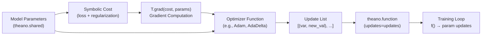
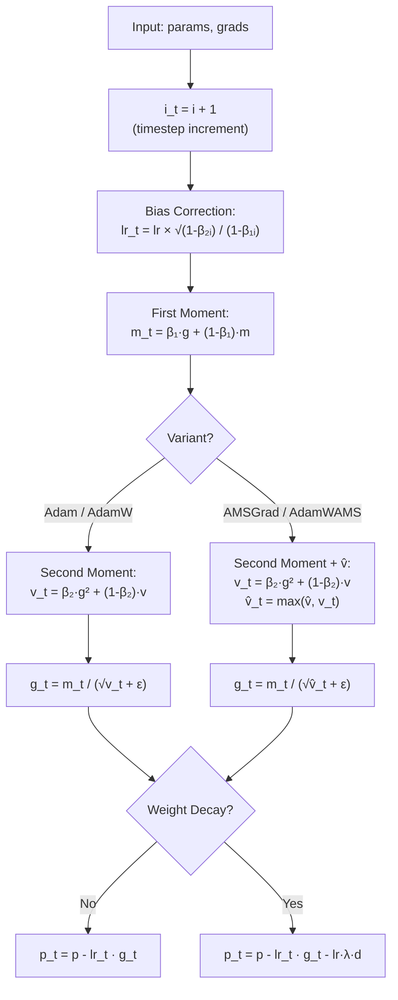

---
slug:11-optimizer-implementations
blog_type:normal
---


RaptorX-Contact 实现了一套完整的基于梯度的优化器，这些优化器构建在 **Theano** 符号计算框架之上。这些优化器分布在三个模块中 — `Optimizers.py`、`Adams.py` 和 `SGD_Nestrov.py` — 提供了从原始梯度下降到带有权重衰减和 Nesterov 加速的高级自适应方法的所有功能。每个优化器都会生成 **Theano 更新列表**（由共享变量及其新符号表达式组成的元组），这些列表在训练期间被 `theano.function` 直接消费，这使得它们成为计算图中不可或缺的组成部分，而非事后的参数修改器。

来源: [Optimizers.py](DL4DistancePrediction2/Optimizers.py#L1-L291), [Adams.py](DL4DistancePrediction2/Adams.py#L1-L177), [SGD_Nestrov.py](DL4DistancePrediction2/SGD_Nestrov.py#L1-L16)

## 架构：更新列表模式

此代码库中的所有优化器都遵循统一的架构约定：它们接受模型参数及其符号梯度，然后返回一个 **`(shared_variable, new_value)` 元组列表**，Theano 在每次前向-反向传播后使用该列表来原子地更新状态。这是标准的 Theano 优化接口。下图展示了优化器的输出如何流入训练函数的组装过程：



其核心含义是，**优化器状态**（动量缓冲区、梯度平方的移动平均值、时间步计数器）本身被存储为在优化器函数内部创建的 Theano 共享变量。这些变量在训练迭代之间持久存在，而无需任何显式的 Python 端簿记 — Theano 在编译后的函数中自动管理其生命周期。

<CgxTip>在训练中途切换优化器时，所有先前创建的内部共享变量（动量、方差、时间步）都会变为孤立状态。新的优化器调用会创建初始化为零的新状态变量，这实际上重置了自适应学习率的历史。这就是为什么模型检查点文件必须同时保存 `params` 和优化器的 `other_params` 或 `param_updates`，以实现真正的训练恢复。</CgxTip>

来源: [Optimizers.py](DL4DistancePrediction2/Optimizers.py#L11-L18), [Adams.py](DL4DistancePrediction2/Adams.py#L30-L58)

## 自适应学习率优化器 (Optimizers.py)

`Optimizers.py` 模块提供了四个优化器，外加两个 SGD 动量变体和一个 Nesterov 实现。自适应方法 — **AdaDelta** 和 **AdaGrad** — 利用历史梯度信息自动调整每个参数的学习率，使其非常适合蛋白质距离预测中典型的稀疏、高维特征场景。

### AdaDelta

AdaDelta 通过维护两个指数衰减累加器来消除手动调整全局学习率的需求：一个用于平方梯度 (`Eg`)，另一个用于平方参数更新 (`Ex`)。每个参数的更新规则为：

$$\Delta x_t = -\frac{\sqrt{E_{x,t-1} + \epsilon}}{\sqrt{E_{g,t} + \epsilon}} \cdot g_t$$

其中 `Eg` 和 `Ex` 以衰减率 `rho`（默认为 0.95）进行更新。`epsilon`（默认为 1e-5）用于防止除以零。该函数创建两个共享变量列表 — `egs` 和 `exs` — 与输入参数的形状相匹配，并返回所有拼接的更新：梯度累加器更新、参数更新累加器更新以及参数更新本身。

| 参数 | 默认值 | 作用 |
|-----------|---------|------|
| `rho` | 0.95 | 运行平均值的指数衰减率 |
| `epsilon` | 1e-5 | 数值稳定性常量 |
| `params` | — | 待优化的 Theano 共享变量列表 |
| `param_shapes` | — | 每个参数对应的形状 |
| `param_grads` | — | 每个参数的符号梯度表达式 |

来源: [Optimizers.py](DL4DistancePrediction2/Optimizers.py#L40-L81)

### AdaGrad

AdaGrad 累加**平方梯度之和**（而非指数移动平均），并按照该累加和的平方根的倒数来缩放每个参数的学习率。这为不常出现的特征产生了更大的更新 — 这对于蛋白质结构预测至关重要，因为某些残基对模式很少出现但携带强烈信号。每个参数的更新为：

$$\Delta x_t = -\frac{\gamma}{\sqrt{\sum_{\tau=1}^{t} g_\tau^2 + \epsilon}} \cdot g_t$$

与 AdaDelta 不同，AdaGrad 保留了一个全局缩放因子 `gamma`（默认为 0.1），作为基础学习率。该函数返回更新列表和 `grad_hists` 共享变量，从而允许外部检查或持久化梯度历史。

| 参数 | 默认值 | 作用 |
|-----------|---------|------|
| `gamma` | 0.1 | 基础学习率标量 |
| `epsilon` | 1e-4 | 数值稳定性常量 |

<CgxTip>AdaGrad 单调累加的分母导致学习率只会不断减小，这可能会在具有数百层的深度 ResNet 上过早地使训练停滞。AdaDelta 的指数窗口避免了这一点 — 对于像 `DilatedResNet` 这样的极深架构，推荐使用 AdaDelta。</CgxTip>

来源: [Optimizers.py](DL4DistancePrediction2/Optimizers.py#L88-L116)

## 带动量的 SGD 变体 (Optimizers.py)

### GD — 原始梯度下降

最简单的优化器：`param -= const_lr * param_grad`。以固定的标量学习率均匀应用于所有参数。可作为基线使用，或用于在接近收敛时的微调，因为此时自适应方法在学习率上的噪声可能会导致越过极小值。

来源: [Optimizers.py](DL4DistancePrediction2/Optimizers.py#L123-L128)

### SGDM — 动量（衰减梯度形式）

SGDM 实现了**梯度的指数加权移动平均**公式，其中速度更新为 `v_t = momentum * v_{t-1} + (1 - momentum) * g_t`，参数更新为 `param -= lr * v_t`。当 `momentum=0.95`（默认值）时，这能极大地平滑梯度噪声 — 这对于在可变长度蛋白质序列上训练时遇到的噪声损失场景非常有益。`(1 - momentum)` 归一化确保了无论动量值如何，速度的幅度都与原始梯度幅度相当。

该函数返回更新列表和 `param_updates` 共享变量（速度缓冲区），从而支持检查点持久化。

| 参数 | 默认值 | 作用 |
|-----------|---------|------|
| `momentum` | 0.95 | 速度衰减系数；必须在 [0, 1) 范围内 |
| `lr` | 0.01 | 学习率 |

来源: [Optimizers.py](DL4DistancePrediction2/Optimizers.py#L130-L161)

### SGDM2 — 动量（经典形式）

SGDM2 使用**经典动量公式**：`v_t = momentum * v_{t-1} - lr * g_t`，并执行 `param += v_t`。这是深度学习文献中更广泛使用的变体。与 SGDM 的关键区别在于，学习率是在原始梯度进入速度缓冲区之前应用于它的，而不是在参数更新步骤中缩放速度。这改变了有效的步长动态：在收敛时，SGDM2 的有效学习率按 `lr / (1 - momentum)` 缩放，而 SGDM 的缩放比例为 `lr`。

来源: [Optimizers.py](DL4DistancePrediction2/Optimizers.py#L163-L195)

### Nesterov — Nesterov 加速梯度

Nesterov 变体在**前瞻位置**计算梯度 — 实际上是在评估如果当前速度继续，参数*将会到达*的位置的梯度。该实现使用了避免显式前瞻步骤的高效重新公式化：

```
update  = momentum * v_{t-1} - lr * g_t
update2 = momentum² * v_{t-1} - (1 + momentum) * lr * g_t
param  += update2
```

这种“在前瞻位置评估梯度”的特性使得 Nesterov 动量在凸问题上具有理论上更优的收敛速率（对于标准 SGD 为 O(1/k²) 对比 O(1/k)），并且在经验上能更快地逃离鞍点 — 这是距离预测网络中富含鞍点的损失曲面上一种常见的失败模式。

来源: [Optimizers.py](DL4DistancePrediction2/Optimizers.py#L198-L213)

## Nesterov SGD — 面向对象变体 (SGD_Nestrov.py)

`sgd_nesterov` 类为 `Optimizers.py` 中的函数式 Nesterov 实现提供了一种**面向对象**的替代方案。它将速度记忆 (`self.memory_`) 封装为实例状态，初始化为与每个参数形状相匹配的零填充 Theano 共享变量。`updates()` 方法通过显式的类接口计算相同的 Nesterov 加速逻辑：

```
update  = momentum * memory - learning_rate * grad
update2 = momentum² * memory - (1 + momentum) * learning_rate * grad
```

当优化器需要**独立序列化**（例如，保存到模型检查点）或当多个参数组需要独立的动量状态时，基于类的设计更具优势。`Optimizers.py` 中的函数式变体会创建匿名的共享变量，这些变量很难从外部引用。

| 方法 | 签名 | 返回值 |
|--------|-----------|---------|
| `__init__` | `(self, params)` | 初始化 `self.memory_` 列表 |
| `updates` | `(self, params, grads, learning_rate, momentum)` | Theano 更新列表 |

来源: [SGD_Nestrov.py](DL4DistancePrediction2/SGD_Nestrov.py#L1-L16)

## Adam 家族优化器 (Adams.py)

`Adams.py` 模块实现了 Adam 优化器的四种变体，均采用 MIT 许可证（原作者 Alec Radford，2015 年）。这些是**生产训练流程中使用的主要优化器** — `NN4LogReg.py` 直接从此模块导入 `Adam`。Adam 结合了动量（一阶矩）与自适应的逐参数学习率（二阶矩），并针对早期训练步骤包含了**偏差校正**，因为此时指数移动平均值会偏向于零。

### 核心 Adam 更新机制

这四种变体共享相同的基础更新结构，仅在二阶矩的处理方式以及是否应用权重衰减上有所不同：



### Adam

带有偏差校正学习率的标准 Adam 优化器。其默认超参数（`lr=0.0002`、`b1=0.1`、`b2=0.001`）与常见的 Kingma 默认值（`b1=0.9`、`b2=0.999`）显著不同：较小的 `b1` 和 `b2` 值为**当前梯度赋予更多权重**，而不是历史平均值，从而以更嘈杂的更新为代价产生了更快的适应性。这符合距离预测的需求，因为当不同蛋白质长度主导不同的迷你批次时，梯度统计信息会发生变化。

该函数返回 `(updates, other_params)`，其中 `other_params` 包含时间步计数器 `i`，以及每个参数的一阶矩 (`m`) 和二阶矩 (`v`) 共享变量 — 这些都是模型检查点持久化所必需的。

| 参数 | 默认值 | 作用 |
|-----------|---------|------|
| `lr` | 0.0002 | 步长 |
| `b1` | 0.1 | 一阶矩衰减率（梯度动量） |
| `b2` | 0.001 | 二阶矩衰减率（平方梯度） |
| `e` | 1e-8 | 数值稳定性常量 |

来源: [Adams.py](DL4DistancePrediction2/Adams.py#L30-L58)

### AMSGrad

AMSGrad 通过维护一个 `v_hat` 变量来解决 Adam 的**非收敛问题**，该变量是所有历史二阶矩估计的逐元素最大值：`v_hat_t = max(v_hat_{t-1}, v_t)`。这保证了自适应学习率是单调非递增的，恢复了标准 Adam 可能违反的收敛保证。`v_hat` 共享变量被初始化为零，并通过 `T.maximum(v_hat, v_t)` 进行更新。现在，每个参数携带三个状态变量：`m`、`v` 和 `v_hat`。

来源: [Adams.py](DL4DistancePrediction2/Adams.py#L60-L93)

### AdamW — 带有解耦权重衰减的 Adam

AdamW 将**L2 正则化作为解耦的权重衰减**实现，而不是将其添加到梯度中。参数更新变为 `p_t = p - lr_t * g_t - lr * l2reg * d`，其中 `d` 是参数本身（当 `pdecay` 为 `None` 时）或自定义衰减掩码。与将 L2 添加到损失中的关键区别在于，解耦的权重衰减**均匀应用，不受自适应学习率的影响**，避免了有充分记录的交互作用，即 Adam 的自适应缩放会削弱对具有大梯度的参数的有效正则化。

`pdecay` 参数允许选择性权重衰减：当提供该参数时，每个元素为 `0`（对该参数无衰减，例如偏置项）或参数本身（对权重完全衰减）。当 `pdecay` 为 `None` 时，所有参数均同等衰减。

| 参数 | 默认值 | 作用 |
|-----------|---------|------|
| `pdecay` | None | 逐参数衰减掩码（0 = 无衰减，param = 完全衰减） |
| `l2reg` | 0.1 | 权重衰减系数 |

来源: [Adams.py](DL4DistancePrediction2/Adams.py#L96-L132)

### AdamWAMS — AdamW + AMSGrad

功能最完备的变体，结合了**AMSGrad 的收敛保证**（最大二阶矩跟踪）与**AdamW 的解耦权重衰减**。这是理论上最强的选择：它避免了 Adam 的非收敛病态，同时保持了适当的正则化缩放。每个参数跟踪四个状态变量：`m`、`v`、`v_hat` 以及全局时间步 `i`。代价是与标准 Adam 相比，每个参数的内存增加约 33%（四个共享变量对比三个），这对于 RaptorX-Contact 中可能包含数百万参数的大型 ResNet 模型来说意义重大。

来源: [Adams.py](DL4DistancePrediction2/Adams.py#L135-L175)

## 优化器对比矩阵

| 优化器 | 模块 | 自适应 LR | 动量 | 偏差校正 | 权重衰减 | 收敛保证 | 返回类型 |
|-----------|--------|-------------|----------|-----------------|--------------|----------------------|-------------|
| **GD** | Optimizers | ✗ | ✗ | — | ✗ | ✗ (凸) | `updates` |
| **SGDM** | Optimizers | ✗ | ✓ (0.95) | — | ✗ | ✗ (凸) | `updates, param_updates` |
| **SGDM2** | Optimizers | ✗ | ✓ (0.90) | — | ✗ | ✗ (凸) | `updates, param_updates` |
| **Nesterov** | Optimizers | ✗ | ✓ (Nesterov) | — | ✗ | ✓ O(1/k²) 凸 | `updates, param_updates` |
| **sgd_nesterov** | SGD_Nestrov | ✗ | ✓ (Nesterov) | — | ✗ | ✓ O(1/k²) 凸 | `updates` |
| **AdaGrad** | Optimizers | ✓ (累加) | ✗ | — | ✗ | ✗ | `updates, grad_hists` |
| **AdaDelta** | Optimizers | ✓ (窗口化) | ✗ | — | ✗ | — | `updates` |
| **Adam** | Adams | ✓ (EMA) | ✓ | ✓ | ✗ | ✗ | `updates, other_params` |
| **AMSGrad** | Adams | ✓ (EMA+max) | ✓ | ✓ | ✗ | ✓ | `updates, other_params` |
| **AdamW** | Adams | ✓ (EMA) | ✓ | ✓ | ✓ (解耦) | ✗ | `updates, other_params` |
| **AdamWAMS** | Adams | ✓ (EMA+max) | ✓ | ✓ | ✓ (解耦) | ✓ | `updates, other_params` |

来源: [Optimizers.py](DL4DistancePrediction2/Optimizers.py#L1-L291), [Adams.py](DL4DistancePrediction2/Adams.py#L1-L177), [SGD_Nestrov.py](DL4DistancePrediction2/SGD_Nestrov.py#L1-L16)

## 与训练流程的集成

在 RaptorX-Contact 训练架构中，优化器在两个不同层级被消费。在**高层模型组装**阶段，`mlLogReg.py` 从 `Optimizers.py` 导入 `AdaGrad`、`AdaDelta`、`SGDMomentum`（引用为 `SGDM`）和 `GD`，用于其多层逻辑回归训练函数。在**生产级距离预测层**，`NN4LogReg.py` 从 `Adams.py` 导入 `Adam` — 这是在训练驱动最终距离矩阵预测的深度 ResNet 和 DilatedResNet 架构时使用的优化器。

集成模式遵循以下顺序：(1) `Model4DistancePrediction.BuildModel()` 构建符号计算图并返回带有 `params` 属性的模型对象；(2) 由模型的损失加上 L1/L2 正则化构成代价表达式；(3) `T.grad(cost, params)` 计算符号梯度；(4) 选定的优化器函数将 `(params, grads)` 转换为更新列表；(5) `theano.function(inputs, outputs, updates=updates)` 编译训练函数。这在第一节的架构图中已说明。

来源: [mlLogReg.py](DL4DistancePrediction2/mlLogReg.py#L14-L14), [NN4LogReg.py](DL4DistancePrediction2/NN4LogReg.py#L15-L15), [Model4DistancePrediction.py](DL4DistancePrediction2/Model4DistancePrediction.py#L728-L774)

## 模拟与可视化工具

`Optimizers.py` 包含内置的模拟工具，用于经验性地比较优化器行为。`make_func()` 辅助函数编译一个 Theano 函数，在给定参数、代价和更新的情况下执行一步优化。`simulate()` 函数运行此编译后的函数 `n_epoch_max` 次迭代（默认为 100），收集参数轨迹。`testGDVariants()` 函数展示了完整的比较工作流：它定义了**鞍点函数** `y² - x²`，在其上运行 AdaDelta、AdaGrad 和恒定学习率的 GD，并使用 matplotlib 并排绘制结果轨迹。选择鞍点曲面的原因是，它暴露了不同优化器如何沿一个轴在梯度指向远离极小值的区域中导航 — 这是深度网络训练挑战的一个缩影。

来源: [Optimizers.py](DL4DistancePrediction2/Optimizers.py#L11-L33), [Optimizers.py](DL4DistancePrediction2/Optimizers.py#L216-L291)

## 为距离预测选择优化器

对于深度 ResNet 或 DilatedResNet 距离模型的**初始训练**，带有默认 `b1=0.1, b2=0.001` 的 **Adam**（来自 `Adams.py`）是经过验证的主力 — 这正是 `NN4LogReg.py` 直接导入并使用的优化器。对于收敛保证至关重要的**长时训练运行**，请升级到 **AdamWAMS**，它结合了 AMSGrad 单调学习率的安全性与适当的解耦权重衰减。对于**微调**或在过拟合风险较高的小数据集上训练时，带有非平凡 `l2reg` 的 **AdamW** 提供了比将 L2 添加到损失中更好的正则化控制。SGD 动量变体（`SGDM2`、`Nesterov`）最好保留用于基于 Adam 预训练后的**最终收敛精炼**，此时它们更简单的动态可以找到更尖锐的极小值。

要了解优化器选择如何与损失函数和模型架构交互，请参阅[模型构建与损失](10-model-building-and-loss)和[用于距离预测的深度 ResNet](4-deep-resnet-for-distance)。有关端到端的训练工作流，请参阅[距离预测流程](12-distance-prediction-pipeline)。