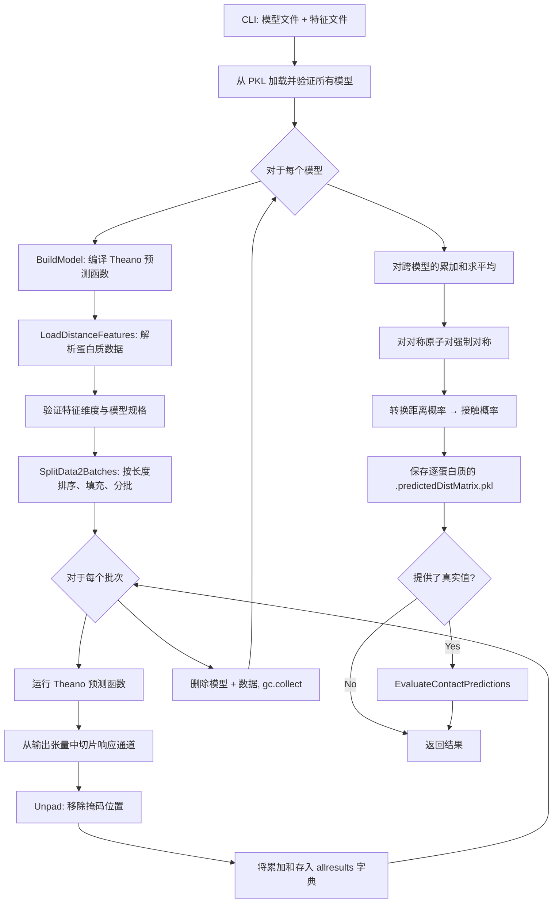

---
slug:12-distance-prediction-pipeline
blog_type:normal
---


距离预测流水线是生产推理路径，它将原始蛋白质特征文件转换为预测的残基间距离概率矩阵和接触图。该流水线由 `RunDistancePredictor2.py` 编排，集成了模型反序列化、Theano 计算图编译、逐批次预测、多模型集成平均以及距离到接触概率的转换，形成了一个内存高效的工作流。此流水线是在新蛋白质序列上部署已训练的 RaptorX-Contact 模型的主要入口点。

## 流水线架构概述

该流水线遵循从特征文件经编译的 Theano 函数到每个蛋白质结果文件的线性数据流。关键的架构决策是**模型优先迭代**：每个模型被加载、编译并执行完毕后，再处理下一个模型，以确保在任一时刻内存中仅驻留一个模型的权重和计算图。来自多个模型的预测结果以累加和的形式收集，并在最后进行平均，使得该方法能够扩展到大型模型集成，而不会导致内存成比例增长。



来源: [RunDistancePredictor2.py](DL4DistancePrediction2/RunDistancePredictor2.py#L1-L323), [Model4DistancePrediction.py](DL4DistancePrediction2/Model4DistancePrediction.py#L728-L774)

## 命令行界面

该流水线作为独立脚本调用，带有四个标志。模型文件和预测特征文件是必需的；保存文件夹和真实值文件夹是可选的。

| 标志 | 长格式 | 是否必需 | 描述 |
|------|-----------|----------|-------------|
| `-m` | `--model` | 是 | 一个或多个模型 PKL 文件，用分号分隔 |
| `-p` | `--predictfile` | 是 | 一个或多个蛋白质特征 PKL 文件，用分号分隔 |
| `-d` | `--savefolder` | 否 | 输出文件的目录（默认：当前工作目录） |
| `-g` | `--nativefolder` | 否 | 用于精度评估的天然距离矩阵目录 |

**调用示例:**
```bash
python RunDistancePredictor2.py \
  -m model1.pkl;model2.pkl;model3.pkl \
  -p features.pkl \
  -d ./results \
  -g ./native_distances
```

多个模型文件实现了一种**集成策略**，而无需所有模型共享相同的响应集——不同的模型可以预测不同的原子对类型或距离标签类型，流水线通过响应键将它们合并。

来源: [RunDistancePredictor2.py](DL4DistancePrediction2/RunDistancePredictor2.py#L26-L35), [RunDistancePredictor2.py](DL4DistancePrediction2/RunDistancePredictor2.py#L250-L321)

## 阶段 1: 模型加载与验证

`PredictDistMatrix` 函数首先通过 `cPickle` 反序列化所有模型文件。每个模型文件是一个字典，包含网络架构规格 (`model['network']`)、响应变量列表 (`model['responses']`)、已学习的参数值 (`model['paramValues']`)、标签参考概率 (`model['labelRefProbs']`) 和标签权重 (`model['weight4labels']`)。

**跨模型一致性检查**验证所有模型是否将相同的标签类型分配给相同的原子对类型。例如，如果一个模型对 Cβ–Cβ 对预测 `CbCb_Discrete25C`，而另一个模型预测 `CbCb_Discrete12C`，流水线将发出警告并退出——对同一响应混合标签类型会使平均无定义。

来源: [RunDistancePredictor2.py](DL4DistancePrediction2/RunDistancePredictor2.py#L37-L56)

## 阶段 2: 模型编译与推理

对于每个模型，流水线执行一个五步序列：

1. **构建计算图** — `Model4DistancePrediction.BuildModel(model, forTrain=False)` 构造一个 `ResNet4DistMatrix` 实例并返回符号 Theano 变量 `(distancePredictor, x, y, xmask, ymask, xem, labelList, weightList)`。当 `forTrain=False` 时，标签和权重列表为空，从而生成一个纯推理图。

2. **编译预测函数** — `theano.function(inputVariables, pred_prob)` 编译该图。输入变量为 `[x, y, xmask, ymask]` 加上可选的 `xem`（嵌入输入）。输出 `pred_prob` 是所有响应的拼接预测概率参数。

3. **加载参数值** — 通过 `utils.Compatible()` 进行兼容性检查，确保模型的参数形状与网络架构匹配，然后 `[p.set_value(v) for p, v in zip(distancePredictor.params, model['paramValues'])]` 注入已学习的权重。

4. **加载并验证特征** — `DataProcessor.LoadDistanceFeatures()` 根据模型的规格解析蛋白质特征 PKL 文件。随机抽查验证 `model['n_in_seq']` 是否与序列特征维度匹配，`model['n_in_matrix']` 是否与成对特征维度匹配，以及 `model['n_in_embed']` 是否与嵌入维度匹配。

5. **分批与预测** — `DataProcessor.SplitData2Batches()` 按序列长度（降序）对蛋白质排序，将它们分组成批次，其中每个批次的总数据点（`batchSize × seqLen²`）保持在阈值（默认 624）以下，并在每个批次内以右下对齐方式填充较短的序列。编译好的 Theano 函数按批次调用。

来源: [RunDistancePredictor2.py](DL4DistancePrediction2/RunDistancePredictor2.py#L67-L159), [Model4DistancePrediction.py](DL4DistancePrediction2/Model4DistancePrediction.py#L728-L774)

### 响应通道切片

Theano 预测函数返回一个形状为 `(batchSize, seqLen, seqLen, sum_of_prob_dims)` 的 4D 张量，其中最后一个维度拼接了所有响应的概率参数。流水线基于 `config.responseProbDims[Response2LabelType(res)]` 计算每个响应的累积起始和结束位置，并据此对输出张量进行切片：

```python
dims = [ config.responseProbDims[ Response2LabelType(res) ] for res in model['responses'] ]
endPositions = np.cumsum(dims)
startPositions = endPositions - dims
batchres = result[:, :, :, start:end ]
```

此设计允许单次前向传播同时预测多种原子对类型（例如 CbCb, CaCa, CgCg），而无需单独调用模型。

来源: [RunDistancePredictor2.py](DL4DistancePrediction2/RunDistancePredictor2.py#L123-L153)

### 掩码移除与累加

切片后，通过索引未掩码区域 `probMatrix[maxSeqLen-seqLen:, maxSeqLen-seqLen:, :]` 移除填充位置。每个蛋白质的清理结果作为**运行总和**累加到 `allresults[name][response]` 中，而不是以列表形式存储——这是关键的内存优化，允许许多深度模型的集成实现扩展。并行计数器 `numModels[name][response]` 跟踪对每个总和贡献的模型数量。

来源: [RunDistancePredictor2.py](DL4DistancePredictor2/RunDistancePredictor2.py#L143-L153)

### 垃圾回收

在一个模型的所有批次处理完毕后，预测函数、特征数据和批次数据将被显式删除，并调用 `gc.collect()`。这确保在加载下一个模型之前释放 Theano 函数图及相关的 GPU/CPU 内存，使该流水线适合在 GPU 内存有限的情况下进行大规模批量预测。

来源: [RunDistancePredictor2.py](DL4DistancePredictor2/RunDistancePredictor2.py#L156-L159)

## 阶段 3: 集成平均与对称化

所有模型迭代完毕后，累加和除以其模型计数，生成最终的平均概率矩阵：

```python
finalresults[name][response] = allresults[name][response] / numModels[name][response]
```

对于对称原子对类型（`CbCb`, `CaCa`, `CgCg`, `Beta`），流水线通过与转置矩阵平均来强制矩阵对称：

```python
if config.IsSymmetricAPT(apt):
    finalresults[name][response] = (
        finalresults[name][response] + 
        np.transpose(finalresults[name][response], (1, 0, 2))
    ) / 2.
```

这种事后对称化通过调和位置 (i, j) 和 (j, i) 处的独立预测，略微提高了预测精度。

来源: [RunDistancePredictor2.py](DL4DistancePredictor2/RunDistancePredictor2.py#L162-L176), [config.py](DL4DistancePrediction2/config.py#L34-L35)

## 阶段 4: 距离到接触的转换

流水线将预测的距离概率矩阵转换为二值接触概率矩阵。转换策略取决于每个响应的标签类型：

| 标签类型 | 转换方法 | 公式 |
|------------|-------------------|---------|
| `Discrete*` (例如 25C, 12C) | 对接触阈值以下的区间求和 | `∑ prob[:, :, :labelOf8]` |
| `Normal*` | 拟合正态分布的 CDF | `norm(μ, σ).cdf(8.0)` |
| `LogNormal*` | 拟合对数正态分布的 CDF | `norm(μ, σ).cdf(ln(8.0))` |
| `HB` / `Beta` | 直接概率 | `prob[:, :, 0]` |

对于离散标签，`DistanceUtils.LabelsOfOneDistance(config.ContactDefinition, config.distCutoffs[subType])` 确定哪些区间对应于接触截断值（8.0 Å）以下的距离。接触概率即为这些区间中概率的总和。对于连续分布，`scipy.stats.norm.cdf()` 提供累积概率。

来源: [RunDistancePredictor2.py](DL4DistancePrediction2/RunDistancePredictor2.py#L200-L231), [DistanceUtils.py](DL4DistancePrediction2/DistanceUtils.py#L237-L239)

## 阶段 5: 结果序列化

对于每个蛋白质，流水线写入一个名为 `{proteinName}.predictedDistMatrix.pkl` 的 PKL 文件，包含一个 6 元组：

| 索引 | 内容 | 类型 | 描述 |
|-------|---------|------|-------------|
| 0 | `name` | str | 蛋白质标识符 |
| 1 | `sequence` | str | 主氨基酸序列 |
| 2 | `results` | dict | `{response: L×L×numProbDims ndarray}` 平均距离概率 |
| 3 | `contactMatrices` | dict | `{apt: L×L ndarray}` 预测的接触概率 |
| 4 | `finalLabelWeights` | dict | `{apt: weight_array}` 平均标签权重 |
| 5 | `finalLabelDistributions` | dict | `{apt: prob_array}` 平均参考标签分布 |

标签权重和分布是在预测每个响应的所有模型中求平均的，提供了下游距离势能生成或 CASP 格式输出所需的校准信息。

来源: [RunDistancePredictor2.py](DL4DistancePredictor2/RunDistancePredictor2.py#L178-L247)

## 阶段 6: 可选的接触评估

当 `-g` 标志提供真实值文件夹时，流水线调用 `ContactUtils.EvaluateContactPredictions()` 将预测的接触矩阵与天然距离矩阵进行比较。这计算了每个范围（长、中、短）的 top-L/k 精度指标，提供了对预测质量的即时反馈，而无需单独的评估步骤。

来源: [RunDistancePredictor2.py](DL4DistancePredictor2/RunDistancePredictor2.py#L310-L317), [ContactUtils.py](DL4DistancePrediction2/ContactUtils.py#L1-L200)

## 流水线内的数据处理

### 特征组装

`DataProcessor.LoadDistanceFeatures()` 将原始特征字典转换为模型可使用的格式。组装过程为每个蛋白质构建两类特征：

**序列特征**沿特征轴拼接：独热编码 → SS3（如果 `UseSS`）→ ACC（如果 `UseACC`）→ PSSM（如果 `UsePSSM`）→ DISO（如果 `UseDisorder`）→ 膜特异性特征（如果 `UseMPSpecificFeatures`）→ 模板相似性得分（如果 `UseTemplate`）。

**成对特征**沿通道轴堆叠：位置特征 (`min(1, |i−j|/30)`) → 立方根特征 (`∛|i−j|`) → CCMpred Z-得分（如果 `UseCCM`）→ PSICOV Z-得分（如果 `UsePSICOV`）→ 其他成对特征 → 模板距离矩阵（如果 `UseTemplate`）。

当 `config.EmbeddingUsed()` 为真时，嵌入特征将单独准备，可以是单独的独热编码（`SeqOnly` 模式），也可以是通过逐行外积与二级结构组合（`Seq+SS` 模式）。

来源: [DataProcessor.py](DL4DistancePrediction2/DataProcessor.py#L111-L337)

### 批处理策略

`SplitData2Batches()` 实现了**按长度排序的打包**策略。蛋白质按序列长度从大到小排序，然后被分组成批次，其中 `batchSize = min(remaining, numDataPoints / seqLen²)`。这确保每个批次的总元素大致保持恒定，在不同长度蛋白质的批次间平衡 GPU 利用率。

在每个批次内，`AssembleOneBatch()` 将所有矩阵以最大序列长度进行右下对齐，左/上填充用零填充。二值掩码矩阵 `M1d` 和 `M2d` 指示哪些位置包含真实数据，哪些是填充，从而允许网络的卷积层抑制来自填充位置的噪声。

来源: [DataProcessor.py](DL4DistancePrediction2/DataProcessor.py#L558-L667)

## 推理时的模型构建

`BuildModel(modelSpecs, forTrain=False)` 构造 `ResNet4DistMatrix` 类，该类将完整的网络架构连接在一起：

1. **1D 序列 ResNet** — 根据 `model['network']` 类型，通过 `ResNet` 或 `DilatedResNet` 处理序列特征
2. **序列到矩阵的转换** — 通过 `MidpointFeature` + `OuterCat` 压缩和/或用于序列/二级结构嵌入的 `MetaEmbeddingLayer`，将 1D 特征转换为 2D 成对特征
3. **2D 矩阵 ResNet** — 通过深度 2D 残差块处理拼接的成对特征（输入成对 + 转换后的序列）
4. **逐响应预测头** — 每个响应都有自己的头：离散标签使用 `NN4LogReg`（距离区间的 softmax 分类），连续标签使用 `NN4Normal`（高斯/对数高斯参数预测）

输出概率张量沿最后一个维度拼接所有响应头，使单次前向传播能够同时预测所有响应。

来源: [Model4DistancePrediction.py](DL4DistancePrediction2/Model4DistancePrediction.py#L219-L399), [Model4DistancePrediction.py](DL4DistancePrediction2/Model4DistancePrediction.py#L728-L774)

<CgxTip>流水线以运行总和的形式累加预测结果（`allresults[name][response] += res4one`），而不是追加到列表中。在大型蛋白质集上集成多个模型时，这会将峰值内存从 O(models × proteins × L²) 降低到 O(proteins × L²)，这是生产级推理的关键优化。</CgxTip>

<CgxTip>`SplitData2Batches` 函数按长度降序对蛋白质排序，并计算 `batchSize = numDataPoints / seqLen²`。由于第一个（最长的）蛋白质决定了批次大小，后续较短的蛋白质可能允许每个批次容纳更多序列。如果你的蛋白质集长度变化很大，考虑将其拆分为按长度分层的组，以提高 GPU 利用率。</CgxTip>

## 流水线数据流摘要

下表追踪了单个蛋白质的数据流经所有流水线阶段的过程：

| 阶段 | 输入形状 | 输出形状 | 操作 |
|-------|-------------|--------------|-----------|
| 特征加载 | PKL 字典 | `seqFeatures: (L, F_seq)`, `matrixFeatures: (L, L, F_mat)` | 拼接原始特征 |
| 批次组装 | 变长蛋白质 | `X1d: (B, L_max, F_seq)`, `X2d: (B, L_max, L_max, F_mat)` | 填充 + 掩码 |
| Theano 预测 | 批处理张量 | `result: (B, L_max, L_max, ΣprobDims)` | 完整前向传播 |
| 通道切片 | 拼接的输出 | `batchres: (B, L_max, L_max, probDims_r)` | 逐响应切片 |
| 掩码移除 | 填充结果 | `res4one: (L, L, probDims_r)` | 索引有效区域 |
| 模型平均 | 预测列表 | `final: (L, L, probDims_r)` | 总和 ÷ 计数 |
| 对称化 | 非对称矩阵 | `symmetric: (L, L, probDims_r)` | (M + Mᵀ) / 2 |
| 接触转换 | 距离概率 | `contact: (L, L)` | 区间求和 / CDF |

## 相关页面

关于流水线实例化的神经网络架构，请参阅 [Deep ResNet for Distance](4-deep-resnet-for-distance) 和 [Dilated ResNet Variants](5-dilated-resnet-variants)。有关输入特征如何构建的详细信息，请参阅 [Input Feature Specification](7-input-feature-specification) 和 [Data Loading and Processing](8-data-loading-and-processing)。关于模型构建和损失函数设计，请参阅 [Model Building and Loss](10-model-building-and-loss)。有关预测后的精度评估，请参阅 [Contact Accuracy Evaluation](13-contact-accuracy-evaluation) 和 [Distance Accuracy and MCC](14-distance-accuracy-and-mcc)。