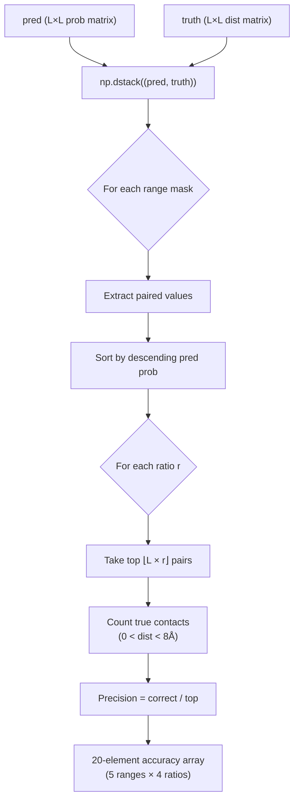
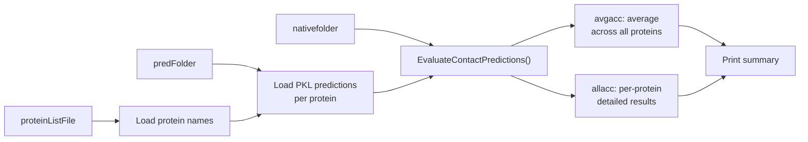

---
slug:13-contact-accuracy-evaluation
blog_type:normal
---


RaptorX-Contact 为接触预测准确性实现了一个**双指标评估框架**：**Top-L 精度**（CASP 和 CAMEO 基准测试中的主要指标）和 **MCC/F1 二分类**指标。两者均基于预测接触概率矩阵与真实距离矩阵之间的基本比较，但它们回答了不同的问题——Top-L 问的是“*在你最自信的预测中，有多少是正确的？*”，而 MCC/F1 问的是“*在所有残基对中，你的二分类在给定阈值下的表现如何？*”。整个评估流程由 `ContactUtils.py` 编排，核心指标计算委托给 `Metrics.py`。

## 接触定义与序列间距范围

**接触**被定义为一对 Cβ–Cβ 距离低于 **8.0 Å** 的残基（在配置中设定为 `ContactDefinition = 8.001`）。对于氢键（HB）预测，截断距离扩展至 `MaxHBDistance = 9.5` Å，对于 β-配对预测扩展至 `MaxBetaDistance = 8.0` Å。真实距离矩阵使用 **−1** 标记无效条目（缺乏 3D 坐标的残基），任何低于截断值的正值均被视为真实接触。

残基对被划分为四种**序列间距范围**，这至关重要，因为长程接触对 3D 结构确定的信息量最大，但也最难预测：

| 范围 | 分隔符 | 偏移边界 | CASP 惯例 |
|-------|-----------|----------------|-----------------|
| **超长** | `mask_ER` | \|i − j\| ≥ 48 | 非标准 CASP 范围 |
| **长** | `mask_LR` | \|i − j\| ≥ 24 | 长程 |
| **中** | `mask_MR` | 12 ≤ \|i − j\| < 24 | 中程 |
| **短** | `mask_SR` | 6 ≤ \|i − j\| < 12 | 短程 |

\|i − j\| < 6 的残基对（**近程**）被完全排除在评估之外，因为这些简单共定位的残基不具有结构信息量。这些边界与训练和评估中使用的 `RangeBoundaries = [24, 12, 6, 2]` 配置保持一致。

来源：[ContactUtils.py](/DL4DistancePrediction2/ContactUtils.py#L221-L250), [config.py](/DL4DistancePrediction2/config.py#L137-L142)

## Top-L 精度：核心准确性指标

**`TopAccuracy`** 函数是主要的评估方法，用于计算所有间距范围下多个 Top-L 分数的精度。给定预测接触概率矩阵 `pred` (L × L) 和真实距离矩阵 `truth` (L × L)，算法步骤如下：

1. 通过 `np.dstack((pred, truth))` 将预测值和真实值**堆叠**成配对数组
2. 使用带有适当对角线偏移量的 `np.triu`，为每个间距范围（ER, LR, MR, MLR, SR）**构建二进制掩码**
3. 对于每个掩码，**提取**配对值，然后按预测概率降序**排序**
4. 对于每个比率 *r* ∈ {1, 0.5, 0.2, 0.1}，取前 ⌊L × r⌋ 个预测并计算**精度** = (真实接触数) / (顶部预测数)

这会生成一个 **20 元素精度数组**——5 个范围 × 4 个比率——编码了预测质量的丰富多分辨率视图。默认评估顺序为：超长 → 长 → 中 → 长+中 → 短，每个均在 Top-L/1、Top-L/2、Top-L/5 和 Top-L/10 下评估。



实际的调用模式非常简单：`CalcContactPredAccuracy.py` 加载两个文本格式的矩阵（预测和真实值），调用 `TopAccuracy`，并打印包含目标名称、序列长度和所有 20 个精度值的格式化结果字符串。

来源：[ContactUtils.py](/DL4DistancePrediction2/ContactUtils.py#L248-L290), [CalcContactPredAccuracy.py](/DL4DistancePrediction2/CalcContactPredAccuracy.py#L1-L44)

## MCC 和 F1：二分类指标

**`CalcMCCF1`** 函数在给定的概率截断值下，将接触预测作为二分类问题进行评估。它计算 **Matthews 相关系数（MCC）** 和 **F1 分数**，以及它们的组件统计量（TP、FP、TN、FN、精度、召回率），针对三种间距范围：长（≥24）、长+中（≥12）和 短+中+长（≥6）。

分类逻辑使用了一种巧妙的编码技巧：计算 `pred_truth = pred_binary * 2 + truth_binary`，产生四个不同的整数值（0=TN, 1=FN, 2=FP, 3=TP），可以通过 `np.bincount` 高效计数。这避免了显式基于循环的列联表构建。

**`Metrics.py`** 中的原始指标计算遵循标准公式，并在分母中添加了一个小常数 ε = 0.000001 以保证数值稳定性：

| 指标 | 公式 |
|--------|---------|
| **MCC** | (TP·TN − FP·FN) / √((TP+FP)(TP+FN)(TN+FP)(TN+FN) + ε) |
| **精度** | TP / (TP + FP + ε) |
| **召回率** | TP / (TP + FN + ε) |
| **F1** | 2·精度·召回率 / (精度 + 召回率 + ε) |

`CalcMCCF1` 函数返回一个 **24 元素数组**：对于 3 个范围中的每一个，输出 [MCC, TP, FP, TN, FN, F1, 精度, 召回率]。批处理变体（`BatchCalcMCCF1.py`）以 0.01 的步长将概率截断值从 0.20 扫描至 0.59，同时计算**逐目标平均**（跨蛋白质的平均 MCC/F1）和**逐对平均**（由平均的 TP/FP/TN/FN 计数计算出的 MCC/F1）——这两种聚合策略可能会产生不同的排名。

来源：[ContactUtils.py](/DL4DistancePrediction2/ContactUtils.py#L203-L246), [Metrics.py](/DL4DistancePrediction2/Metrics.py#L1-L17), [BatchCalcMCCF1.py](/DL4DistancePrediction2/BatchCalcMCCF1.py#L1-L63)

## 距离到接触概率的转换

接触概率矩阵不是直接训练的——它们是**从预测的距离概率分布中推导出来的**。`Distance2Contact` 函数通过对所有对应于接触的距离区间求和概率质量来执行此转换：

```python
contactProb = np.sum(distProb[:, :, :labelOf8], axis=2)
```

此处 `labelOf8` 默认为 **1**，意味着只有第一个距离区间（代表距离 < 8 Å）对接触概率有贡献。距离概率矩阵 `distProb` 的形状为 (L, L, numBins)，生成的 `contactProb` 形状为 (L, L)。此转换在批处理评估流程读取 `.predictedDistMatrix.pkl` 文件时自动应用，提取 `pred[3]`（预测元组的第 4 个元素，即预计算的接触概率矩阵）。

来源：[ContactUtils.py](/DL4DistancePrediction2/ContactUtils.py#L157-L163), [BatchEvaluateContactAccuracy.py](/DL4DistancePrediction2/BatchEvaluateContactAccuracy.py#L62-L69)

## 批处理评估流程

**`BatchEvaluateContactAccuracy`** 脚本编排了整个蛋白质列表的评估。其工作流分为三个阶段进行：



该脚本通过 `fileSuffix` 参数支持两种预测文件格式：

| 文件后缀 | 格式 | 接触矩阵提取 |
|-------------|--------|--------------------------|
| `.predictedDistMatrix.pkl`（默认） | 包含 6 个项目的元组 | `pred[3]` — 元组的第 4 个元素 |
| `.predictedContactMatrix.pkl` | 字典 | `pred['predContactMatrix']` — 键值访问 |

核心 `EvaluateContactPredictions` 函数通过 `DataProcessor.LoadNativeDistMatrix` 加载原生距离矩阵，然后遍历预测中的所有**原子对类型**（CbCb, CaCa, CgCg, CaCg, NO, HB, Beta），使用适当的接触截断值（标准对为 8.0 Å，HB 为 9.5 Å）应用 `TopAccuracy`。它返回**逐蛋白质精度**和数据集上的**平均精度**，平均值通过对每种原子对类型的所有蛋白质精度数组执行 `np.average` 计算得出。

来源：[BatchEvaluateContactAccuracy.py](/DL4DistancePrediction2/BatchEvaluateContactAccuracy.py#L1-L100), [ContactUtils.py](/DL4DistancePrediction2/ContactUtils.py#L292-L383)

## CASP 格式评估

**CASP RR 格式**是社区评估中接触预测的标准交换格式。`CalcCASPContactPredAccuracy.py` 提供了专用的评估路径：它使用 `LoadContactMatrixInCASPFormat` 解析 CASP 格式的预测文件，从 (i, j, prob) 三元组重建对称接触矩阵，然后使用 `EvaluateSingleCbCbContactPrediction` 进行评估。

CASP 解析器严格验证文件结构——检查 `PFRMAT RR` 标头、`TARGET` 行、`MODEL 1` 约束，以及所有置信度分数是否在 [0, 1] 范围内。残基索引根据序列长度进行验证，解析器强制执行 i < j 的顺序。重建的矩阵通过赋值 `contactMatrix[i,j] = contactMatrix[j,i] = prob` 变为对称矩阵。

相反，`SaveContactMatrixInCASPFormat` 以 CASP RR 格式写入预测，应用**概率缩放因子**（`ProbScaleFactor = log(0.5)/log(0.4) ≈ 1.16`）来提升原始概率，以改善 0.5 截断值下的 MCC/F1。输出上限为 300,000 个残基对，并保证至少有 3×L 个长程对，在写入 160,000 个对之后，低于 0.05 阈值的对将被排除。

来源：[CalcCASPContactPredAccuracy.py](/DL4DistancePrediction2/CalcCASPContactPredAccuracy.py#L1-L26), [ContactUtils.py](/DL4DistancePrediction2/ContactUtils.py#L30-L155), [config.py](/DL4DistancePrediction2/config.py#L7-L11)

## CLI 入口点总结

| 脚本 | 输入 | 指标 | 输出 |
|--------|-------|--------|--------|
| `CalcContactPredAccuracy.py` | 预测矩阵 + 真实矩阵 (文本) | Top-L 精度 | 20 个精度值 |
| `BatchEvaluateContactAccuracy.py` | 蛋白质列表 + PKL 文件夹 + 原生文件夹 | Top-L 精度 | 逐蛋白质 + 平均值 |
| `CalcCASPContactPredAccuracy.py` | CASP RR 文件 + 原生 PKL | Top-L 精度 | 20 个精度值 |
| `CalcMCCF1.py` | 预测矩阵 + 真实矩阵 (文本) | 截断值 0.20–0.58 下的 MCC/F1 | 每个截断值 24 个指标 |
| `BatchCalcMCCF1.py` | 蛋白质列表 + 预测目录 + 真实目录 | 截断值 0.20–0.59 下的 MCC/F1 | 逐目标 + 逐对平均值 |

<CgxTip>在评估接触精度时，请务必检查你正在评估哪种**原子对类型**——CbCb 是默认且最常报告的，但 CaCa、CgCg 和 NO 各自有不同的物理意义。HB 和 Beta 使用不同的距离截断值（分别为 9.5 Å 和 8.0 Å），并在评估代码中需要特殊处理。</CgxTip>

<CgxTip>`TopAccuracy` 函数评估**五**种间距范围（ER, LR, MR, MLR, SR），但标准 CASP 报告惯例仅使用**三**种（LR, MR, SR）。超长（≥48）和组合的长+中（≥12）范围是 RaptorX 特定的扩展，为最具结构信息量的预测提供了更细粒度的评估。</CgxTip>

来源：[CalcContactPredAccuracy.py](/DL4DistancePrediction2/CalcContactPredAccuracy.py#L1-L44), [BatchEvaluateContactAccuracy.py](/DL4DistancePrediction2/BatchEvaluateContactAccuracy.py#L1-L100), [CalcCASPContactPredAccuracy.py](/DL4DistancePrediction2/CalcCASPContactPredAccuracy.py#L1-L26), [CalcMCCF1.py](/DL4DistancePrediction2/CalcMCCF1.py#L1-L38), [BatchCalcMCCF1.py](/DL4DistancePrediction2/BatchCalcMCCF1.py#L1-L63)

## 与更广泛流程的关系

接触精度评估位于预测流程的**终端**。它所消耗的预测接触概率矩阵由[距离预测流程](12-distance-prediction-pipeline)生成，该流程生成距离概率分布，然后通过 `Distance2Contact` 转换将其折叠为接触概率。[距离精度与 MCC](14-distance-accuracy-and-mcc) 页面涵盖了距离预测本身的互补评估（绝对误差、相对误差、类 GDT 分数），而 [CASP 格式输出](15-casp-format-output) 详细说明了用于社区基准测试提交的序列化格式。[配置与距离区间](16-configuration-and-distance-bins) 中的距离区间配置决定了在距离到接触转换期间求和多少个概率区间，这直接影响生成的接触概率值，进而影响所有下游的精度指标。