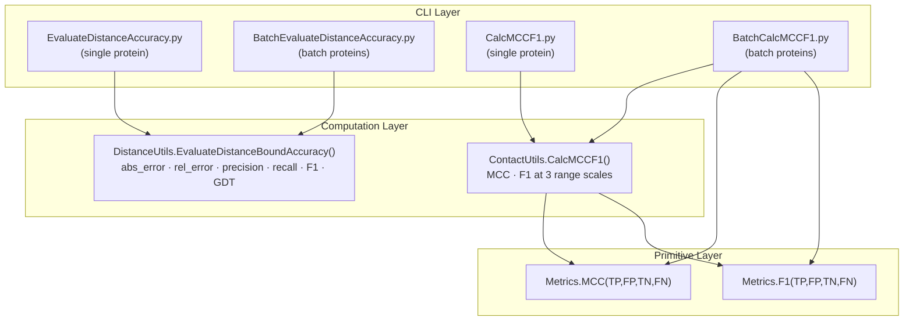

---
slug:14-distance-accuracy-and-mcc
blog_type:normal
---


RaptorX-Contact 实现了一个双度量评估框架，从两个互补的角度评估预测的残基间距：**连续距离精度**（绝对误差、相对误差、类 GDT 相似度）和**离散分类质量**（MCC、F1、精确率、召回率）。这些度量指标作用于相同的 L×L 距离矩阵，但回答了截然不同的问题——*预测距离与真实值有多接近？* 对比 *模型将残基对分类为接触与非接触的能力有多强？* 该框架包含四个执行模块（每个度量族各有单蛋白和批量变体）以及三个核心计算库，构成了从原始数学运算到 CLI 入口点的分层架构。

来源: [EvaluateDistanceAccuracy.py](/DL4DistancePrediction2/EvaluateDistanceAccuracy.py#L1-L65), [DistanceUtils.py](/DL4DistancePrediction2/DistanceUtils.py#L1-L101), [Metrics.py](/DL4DistancePrediction2/Metrics.py#L1-L17), [ContactUtils.py](/DL4DistancePrediction2/ContactUtils.py#L204-L261)

## 度量架构概述

评估子系统被组织为三个层级：`Metrics.py` 中的**基础公式**，`DistanceUtils.py` 和 `ContactUtils.py` 中的**领域特定聚合器**，以及处理文件 I/O 和批量平均的 **CLI 编排器**。下图展示了数据流和委托关系：



关键的架构洞察是，`ContactUtils.CalcMCCF1()` 将其各范围计算委托给 `Metrics.MCC()` 和 `Metrics.F1()`，而 `DistanceUtils.EvaluateDistanceBoundAccuracy()` 则内联计算精确率/召回率/F1，不调用 `Metrics.py`——这两个度量族独立演进，并使用了略有不同的 epsilon 保护约定（内联的 `0.000001` 与 `Metrics.py` 中的 `0.000001`）。

来源: [Metrics.py](/DL4DistancePrediction2/Metrics.py#L1-L17), [DistanceUtils.py](/DL4DistancePrediction2/DistanceUtils.py#L27-L101), [ContactUtils.py](/DL4DistancePrediction2/ContactUtils.py#L204-L261)

## 基础度量：MCC 和 F1

`Metrics` 模块提供了整个评估流程中使用的基础二元分类公式。这两个函数都接受四个混淆矩阵计数值，并应用 epsilon 保护（`ε = 0.000001`）以防止除以零。

**马修斯相关系数 (MCC)** 产生一个 [-1, 1] 范围内的值，它平衡了混淆矩阵的所有四个象限，使其对类别不平衡具有鲁棒性——这是接触预测的一个关键属性，因为在接触预测中非接触数量远多于接触数量：

```
MCC = (TP·TN − FP·FN) / √(ε + (TP+FP)(TP+FN)(TN+FP)(TN+FN))
```

**F1 分数** 是精确率和召回率的调和平均值，强调了模型正确识别接触而不产生过多假阳性的能力：

```
precision = TP / (TP + FP + ε)
recall    = TP / (TP + FN + ε)
F1        = 2·precision·recall / (precision + recall + ε)
```

| 度量 | 范围 | 类别不平衡敏感度 | 在 RaptorX 中的主要用途 |
|--------|-------|---------------------------|----------------------|
| MCC | [-1, 1] | **低** — 四个象限权重相等 | 二元接触分类质量 |
| F1 | [0, 1] | 中等 — 忽略 TN | 强调接触检测 |

<CgxTip>epsilon 常量 `0.000001` 同时出现在 `Metrics.py` 和 `DistanceUtils.EvaluateDistanceBoundAccuracy()` 中。如果你扩展此评估框架，请集中定义此值以避免两个模块之间产生分歧。</CgxTip>

来源: [Metrics.py](/DL4DistancePrediction2/Metrics.py#L1-L17)

## 距离边界精度：每个原子对的六个度量

`DistanceUtils.EvaluateDistanceBoundAccuracy()` 是用于连续距离评估的核心函数。它操作**预测距离边界**（一个以原子对类型为键的字典，例如 `CbCb`、`CaCa`）和**真实距离矩阵**。对于每种原子对类型，它生成一个 6 元素向量：`[abs_error, rel_error, precision, recall, F1, GDT]`。

### 序列比对和有效性掩码

该函数首先在真实序列中定位查询序列（由于 PDB 链选择，真实序列可能是一个超集）。然后它构建两个二进制有效性掩码：

- **`truth_valid`**：将真实距离 ≥ 0.1 标记为有效（负值表示 PDB 文件中缺少坐标）
- **`pred_valid`**：将预测距离在 (0, 15] 内标记为有效——预测 ≤ 0 或 > 15Å 被认为是不可靠的

然后通过**将序列间隔 < `minSeqSep`（默认为 12）的短程对置零**来精炼这两个掩码。这是通过在两个方向上填充偏移量 0 到 `minSeqSep−1` 的对角线来完成的：

```python
for offset in range(0, minSeqSep):
    np.fill_diagonal(truth_valid[:-offset, offset:], 0)
    np.fill_diagonal(pred_valid[:-offset, offset:], 0)
```

来源: [DistanceUtils.py](/DL4DistancePrediction2/DistanceUtils.py#L27-L68)

### 六个精度度量

给定 `diff = |pred − truth|` 和 `diff_valid = truth_valid × pred_valid`，六个度量的计算方式如下：

| 索引 | 度量 | 公式 | 解释 |
|-------|--------|---------|---------------|
| 0 | **绝对误差** | Σ(diff × diff_valid) / (ε + Σ diff_valid) | 有效对的平均 Å 偏差 |
| 1 | **相对误差** | Σ( diff / ((|pred+truth|/2)+ε) × diff_valid ) / (ε + Σ diff_valid) | 尺寸归一化的平均偏差 |
| 2 | **精确率** | TP / (ε + Σ(pred_valid × truth_valid)) | 真实距离 < 15Å 的有效预测所占比例 |
| 3 | **召回率** | TP / (ε + Σ truth_valid_15) | 具有有效预测的真实接触 (< 15Å) 所占比例 |
| 4 | **F1** | 2·precision·recall / (precision + recall + ε) | 精确率和召回率的调和平均值 |
| 5 | **GDT** | Σ(sim × diff_valid) / (ε + Σ diff_valid) | 多阈值相似度得分 |

**类 GDT 得分** 对绝对差值使用分段相似度函数，为较小的偏差分配较高的分数：

| diff 阈值 | 相似度贡献 |
|---------------|----------------------|
| < 1Å | 1.0 |
| < 2Å | 0.5 |
| < 4Å | 0.25 |
| < 8Å | 0.125 |

这类似于结构预测中的 GDT-TS 得分，奖励在多个容差水平上同时接近的预测。请注意，此处的精确率/召回率/F1 使用 **15Å 相互作用极限** 作为接触边界（来自 `config.InteractionLimit`），这不同于基于 MCC 评估中使用的 8Å 阈值。

<CgxTip>距离边界精确率/召回率的 15Å 边界（来自 `config.InteractionLimit = 15.001`）不同于 `CalcMCCF1()` 中使用的 8Å 接触定义（`config.ContactDefinition = 8.001`）。这意味着 `EvaluateDistanceBoundAccuracy` 的 F1 和 `CalcMCCF1` 的 F1 衡量的是不同的事物——请根据你的评估上下文选择合适的一个。</CgxTip>

来源: [DistanceUtils.py](/DL4DistancePrediction2/DistanceUtils.py#L69-L101), [config.py](/DL4DistancePrediction2/config.py#L175-L179)

## MCC-F1 评估：三种范围尺度

`ContactUtils.CalcMCCF1()` 使用 MCC 和 F1 基础方法评估接触预测质量，但关键是它基于序列间隔将残基对划分为**三个范围类别**。这会为每个蛋白质生成一个 13 元素的结果向量。

### 二值化和范围划分

该函数首先对预测矩阵和真实矩阵进行二值化：

- `pred_binary = (pred > probCutoff)` — 默认截断值为 0.5，在批量模式下进行扫描
- `truth_binary = (0 < truth) & (truth < contactCutoff)` — 默认 `contactCutoff = 8.0Å`

然后计算 `pred_truth = pred_binary × 2 + truth_binary`，将所有四种混淆矩阵情况编码为整数值 {0, 1, 2, 3} = {TN, FN, FP, TP}。三个三角掩码选择不同序列间隔的残基对：

| 范围 | 掩码 | 序列间隔 | 生物学意义 |
|-------|------|--------------------|--------------------|
| **长程 (LR)** | `triu(seqLen, 24)` | ≥ 24 个残基 | 三级结构约束 |
| **中程+长程 (MLR)** | `triu(seqLen, 12)` | ≥ 12 个残基 | 二级/三级边界 |
| **短程+中程+长程 (SMLR)** | `triu(seqLen, 6)` | ≥ 6 个残基 | 所有非平凡接触 |

对于每个范围掩码，该函数通过 `np.bincount` 提取混淆矩阵计数，然后委托给 `Metrics.MCC()` 和 `Metrics.F1()`，每个范围生成 8 个值：`[MCC, TP, FP, TN, FN, F1, precision, recall]`。因此，完整的输出向量为 3 × 8 = **24 个元素**，尽管记录的接口通常只引用每个范围的 MCC 和 F1。

来源: [ContactUtils.py](/DL4DistancePrediction2/ContactUtils.py#L206-L261)

### 距离到接触的转换

当使用 MCC/F1 评估距离预测时，必须首先通过 `ContactUtils.Distance2Contact()` 将预测的距离概率矩阵转换为接触概率矩阵：

```python
contactProb = np.sum(distProb[:, :, :labelOf8], axis=2)
```

这会对接触阈值 (8Å) 以下的所有距离 bin 的预测概率质量求和，产生一个适合 `CalcMCCF1()` 使用的单一 L×L 接触概率矩阵。

来源: [ContactUtils.py](/DL4DistancePrediction2/ContactUtils.py#L192-L202)

## 批量评估：按目标和按对平均

批量评估脚本引入了两种不同的平均策略，产生有意义的不同结果：

### 按目标平均（距离精度）

`BatchEvaluateDistanceAccuracy.py` 计算每个蛋白质的精度，然后使用 `np.average(v, axis=0)` 对各蛋白质进行平均。这给予**每个蛋白质相等的权重**，而不管序列长度如何——一个 50 个残基的小蛋白质与一个 500 个残基的蛋白质贡献相同。它同时输出每个蛋白质的详细结果和跨蛋白质的平均值。

来源: [BatchEvaluateDistanceAccuracy.py](/DL4DistancePrediction2/BatchEvaluateDistanceAccuracy.py#L70-L108)

### MCC-F1 的双重平均

`BatchCalcMCCF1.py` 通过将概率截断值从 0.20 扫描到 0.59（步长 0.01），实现了一种更复杂的双重平均方案：

1. **按目标平均**：首先对跨蛋白质的混淆矩阵计数 (TP, FP, TN, FN) 求平均，然后从平均计数计算 MCC 和 F1。这直接从通过 `np.average(accs, axis=0)` 平均的 `CalcMCCF1` 返回值中打印。

2. **按对平均**：使用 `Metrics.MCC()` 和 `Metrics.F1()` 从按目标平均的混淆计数中显式计算 MCC 和 F1。这将公式重新应用于已经平均的 TP/FP/TN/FN，产生不同的结果，因为 MCC 在其输入中是**非线性的**——先平均 TP/FP/TN/FN 再应用 MCC 公式，并不等同于平均每个蛋白质的 MCC 值。

| 平均方法 | 计算顺序 | 属性 |
|-----------------|-------------------|-----------|
| 按目标 | 每个蛋白质的 avg(TP,FP,TN,FN) → 从平均计数计算 MCC/F1 | 对每个蛋白质加权相等 |
| 按对 | avg(TP,FP,TN,FN) → `Metrics.MCC/F1(avg_counts)` | 合并所有残基对；较大的蛋白质占主导 |

这种区别对基准测试很重要：按目标平均是 CASP 中的标准，而按对平均反映了整体的对级别分类质量。

来源: [BatchCalcMCCF1.py](/DL4DistancePrediction2/BatchCalcMCCF1.py#L45-L61)

## CLI 入口点

四个 CLI 脚本形成两个并行流水线，每个流水线都有一个单蛋白和批量变体：

### 距离精度流水线

**单蛋白** — `EvaluateDistanceAccuracy.py` 接收一个预测的 `.bound.pkl` 文件和一个真实的 `.atomDistMatrix.pkl` 文件，通过 `cPickle` 加载两者，并打印每种原子对类型的精度。预测文件包含一个 3 元组 `(bound_dict, name, sequence)`，其中 `bound_dict` 将原子对类型映射到 L×L×10 矩阵（第一个切片是预测距离，其余 9 个是偏差估计）。

```
python EvaluateDistanceAccuracy.py <bound_PKL> <ground_truth_PKL>
# 输出: <target> <atomPairType> <abs_error> <rel_error> <precision> <recall> <F1> <GDT>
```

**批量** — `BatchEvaluateDistanceAccuracy.py` 接收一个蛋白质列表文件和两个文件夹，遍历所有蛋白质，并打印每个蛋白质的结果和平均结果。它支持可选的 `minSeqSep` 参数（默认为 12）。

```
python BatchEvaluateDistanceAccuracy.py <proteinList> <bound_folder> <ground_truth_folder> [minSeqSep]
# 输出: average <atomPairType> <6 metrics>  (随后是每个蛋白质的详情)
```

来源: [EvaluateDistanceAccuracy.py](/DL4DistancePrediction2/EvaluateDistanceAccuracy.py#L14-L59), [BatchEvaluateDistanceAccuracy.py](/DL4DistancePrediction2/BatchEvaluateDistanceAccuracy.py#L14-L108)

### MCC-F1 流水线

**单蛋白** — `CalcMCCF1.py` 接收文本格式的预测和真实接触矩阵（L 行 × L 列），将概率截断值从 0.20 扫描到 0.58（步长 0.02），并打印每个截断值下的 MCC/F1。

```
python CalcMCCF1.py <pred_matrix_file> <distcb_matrix_file> <target>
# 输出: <target> <L> cutoff=<prob> <MCC> <TP> <FP> <TN> <FN> <F1> <precision> <recall> (×3 范围)
```

**批量** — `BatchCalcMCCF1.py` 接收一个蛋白质列表和两个目录（预测的 `.gcnn` 文件，真实的 `.distcb` 文件），将截断值从 0.20 扫描到 0.59（步长 0.01），并打印每个截断值下的按目标和按对平均结果。

```
python BatchCalcMCCF1.py <proteinListFile> <pred_dir> <truth_dir>
# 输出: per-target avgMCCF1 at cutoff=<prob>: <values>
#         per-pair avgMCCF1 at cutoff=<prob>: <MCC_LR> <F1_LR> <prec_LR> <rec_LR> <MCC_MR> <F1_MR> <prec_MR> <rec_MR>
```

来源: [CalcMCCF1.py](/DL4DistancePrediction2/CalcMCCF1.py#L18-L37), [BatchCalcMCCF1.py](/DL4DistancePrediction2/BatchCalcMCCF1.py#L19-L61)

## 控制评估的配置常量

`config.py` 中的几个常量直接控制评估行为：

| 常量 | 值 | 使用者 | 效果 |
|----------|-------|---------|--------|
| `ContactDefinition` | 8.001Å | `CalcMCCF1` (通过 `contactCutoff` 默认值) | 接触与非接触之间的边界 |
| `InteractionLimit` | 15.001Å | `EvaluateDistanceBoundAccuracy` (pred_valid > 15 → 无效) | 被认为是有意义相互作用的最大距离 |
| `RangeBoundaries` | [24, 12, 6, 2] | `CalcMCCF1`, `CalcLabelProb` | 范围分类的序列间隔阈值 |
| `ProbScaleFactor` | ln(0.5)/ln(0.4) ≈ 0.753 | `SaveContactMatrixInCASPFormat` | 缩放预测概率以进行 CASP 提交的指数 |
| `MaxHBDistance` | 9.5Å | `TopAccuracy` | 氢键评估的接触截断值 |
| `MaxBetaDistance` | 8.0Å | `TopAccuracy` | β 配对评估的接触截断值 |

`ProbScaleFactor` 常量特别值得注意：它的引入是因为来自神经网络的原始预测概率倾向于聚集在 0.5 以下，当使用 0.5 截断值进行二值化时，这会压低 MCC/F1。缩放 `p → p^ProbScaleFactor` 将 0.4 → 0.5 映射，在不改变预测排名顺序的情况下，改善了标准阈值下的分类度量。

来源: [config.py](/DL4DistancePrediction2/config.py#L1-L179)

## 与接触精度评估的关系

本文档记录的距离精度和 MCC 评估与接触精度评估系统（[接触精度评估](13-contact-accuracy-evaluation)）并行运行。关键区别在于**输入格式和度量重点**：距离精度处理预测距离边界矩阵（`.bound.pkl`），产生连续误差度量；而接触精度处理预测距离/接触概率矩阵（`.predictedDistMatrix.pkl`），产生 top-L/比例精确率度量。两个系统共享相同的 `config.ContactDefinition` (8Å) 和 `config.RangeBoundaries`，但它们回答不同的评估问题，应互补使用以进行全面的模型评估。