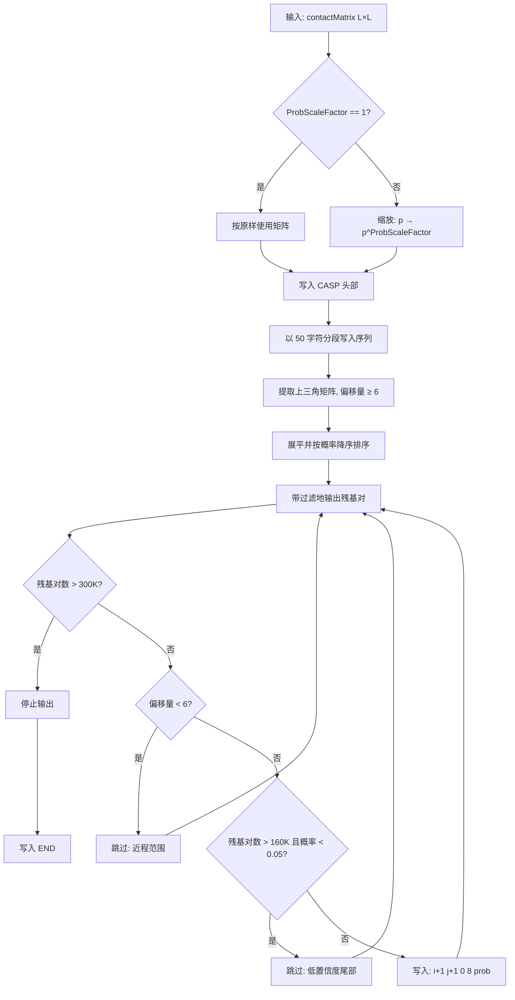
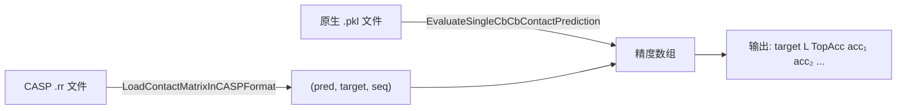

---
slug:15-casp-format-output
blog_type:normal
---

RaptorX-Contact 实现了 **CASP RR（残基-残基）格式** —— 这是结构预测关键评估（CASP）实验中用于残基间接触预测的社区标准交换格式。该系统提供了一个完整的往返流水线：将预测的接触矩阵**序列化**为 CASP `.rr` 文件，将这些文件**反序列化**并验证还原为程序可用的接触矩阵，以及将 CASP 格式的预测结果与真实距离矩阵进行**精度评估**。本页详细介绍了格式规范、序列化/反序列化契约、概率缩放机制，以及控制哪些残基对被输出的过滤启发式规则。

来源：[ContactUtils.py](DL4DistancePrediction2/ContactUtils.py#L1-L383), [CalcCASPContactPredAccuracy.py](DL4DistancePrediction2/CalcCASPContactPredAccuracy.py#L1-L26)

## CASP RR 文件规范

CASP RR 格式是一种面向行的文本文件，具有严格的头部-主体结构。RaptorX-Contact 生成和读取的文件均符合此规范，该规范定义了五条必需的头部行，其后是序列和预测数据行，最后以 `END` 标记结束。

| 行 | 内容 | 示例 | 生成方 |
|------|---------|---------|-------------|
| 1 | `PFRMAT RR` | `PFRMAT RR` | `SaveContactMatrixInCASPFormat` |
| 2 | `TARGET <name>` | `TARGET T0953` | `SaveContactMatrixInCASPFormat` |
| 3 | `AUTHOR <group>` | `AUTHOR RaptorX-Contact` | `SaveContactMatrixInCASPFormat` |
| 4 | `METHOD <description>` | `METHOD deep dilated residual networks...` | `SaveContactMatrixInCASPFormat` |
| 5 | `MODEL <N>` | `MODEL 1` | `SaveContactMatrixInCASPFormat` |
| 6+ | 序列（50字符分段） | `MERRVQVEEVP...` | `SaveContactMatrixInCASPFormat` |
| k+ | `<i> <j> 0 8 <prob>` | `5 42 0 8 0.9872341` | `SaveContactMatrixInCASPFormat` |
| 末行 | `END` | `END` | `SaveContactMatrixInCASPFormat` |

每条预测行包含五个字段：**残基索引 i**（从 1 开始）、**残基索引 j**（从 1 开始，j > i）、**距离下界**（始终为 0）、**距离上界**（始终为 8，代表以埃为单位的 Cβ–Cβ 接触截断值），以及 [0, 1] 范围内的**置信度分数**。距离界限 `0 8` 编码了二值接触定义：Cβ–Cβ 距离小于 8Å 即构成接触。

来源：[ContactUtils.py](DL4DistancePrediction2/ContactUtils.py#L106-L186), [ContactUtils.py](DL4DistancePrediction2/ContactUtils.py#L27-L102)

## 序列化：SaveContactMatrixInCASPFormat

`SaveContactMatrixInCASPFormat` 函数将内存中的预测接触概率矩阵转换为 CASP `.rr` 文件。其签名和完整逻辑包含四个不同阶段：**概率缩放**、**头部输出**、**序列分段**，以及**带过滤的排序对输出**。

### 概率缩放

在输出之前，每个预测概率 `p` 会通过 `p → p^ProbScaleFactor` 进行转换，其中 `ProbScaleFactor = log(0.5) / log(0.4) ≈ 1.16`。这种缩放使分布变得更陡峭 —— 缩放前的原始预测值 0.4 在缩放后变为 0.5 —— 当使用 0.5 阈值时，这会移动二分类的有效决策边界，从而在 CASP 评估中优化 MCC 和 F1 分数。缩放因子仅在生成 CASP 文件期间应用，而不在训练或内部精度评估期间应用。它补偿了损失函数的权重分布，如果训练权重发生变化，必须重新校准。

来源：[ContactUtils.py](DL4DistancePrediction2/ContactUtils.py#L106-L112), [config.py](DL4DistancePrediction2/config.py#L4-L9)

### 残基对过滤与排序

输出算法应用**三层过滤器**来决定哪些残基对出现在输出文件中：

1. **序列间隔过滤器** —— 完全排除满足 |i − j| < 6 的残基对。这移除了那些容易预测且对结构评估无意义的近程残基对。

2. **全局残基对限制** —— 输出残基对的总数上限为 **300,000**，即 CASP 提交的最大值。残基对按概率降序（最高置信度优先）访问，因此该上限仅裁剪掉最低置信度的尾部。

3. **长尾置信度阈值** —— 超过 **160,000** 个输出残基对后，任何缩放概率低于 **0.05** 的残基对都将被抑制。这种双阈值策略确保了高置信度的中/短程接触得以保留，同时防止文件被噪声主导。

通过 `np.triu(contactMatrix2, 6)` 提取上三角矩阵，同时强制实行 j > i 以及最小序列间隔为 6 的要求；然后对取反后的矩阵进行展平并执行 argsort，从而产生全局概率降序的遍历顺序。

来源：[ContactUtils.py](DL4DistancePrediction2/ContactUtils.py#L128-L186)

### 序列分段

主氨基酸序列以**每行 50 个字符**的分段写入，从 `MODEL 1` 行的位置开始。对于长度为 L 的蛋白质，这将产生 ⌈L/50⌉ 行序列。`LoadContactMatrixInCASPFormat` 解析器通过拼接在 MODEL 行之后遇到的所有单列行（即恰好包含一个由空格分隔的字段的行）来重建完整序列。

来源：[ContactUtils.py](DL4DistancePrediction2/ContactUtils.py#L124-L126), [ContactUtils.py](DL4DistancePrediction2/ContactUtils.py#L58-L64)

## 反序列化：LoadContactMatrixInCASPFormat

`LoadContactMatrixInCASPFormat` 函数解析 CASP `.rr` 文件并重建对称的 L×L 接触概率矩阵。它在填充矩阵之前的每个结构边界处执行**格式验证**。

### 验证契约

| 验证点 | 预期条件 | 失败模式 |
|------------------|-------------------|--------------|
| 文件长度 | ≥ 5 行 | 返回 `None` |
| 第 1 行 | 恰好为 `PFRMAT RR` | 返回 `False` |
| 第 2 行 | 以 `TARGET` 开头 | 返回 `None` |
| MODEL 行 | 模型编号 = 1 | `AssertionError` |
| 预测行 | 恰好 5 列 | 返回 `None`，打印错误 |
| 距离界限 | `[0, 8]` | 返回 `None`，打印错误 |
| 置信度分数 | ∈ [0, 1] | 返回 `None`，打印错误 |
| 残基索引 | 1 ≤ index ≤ L | 返回 `None`，打印错误 |
| 索引排序 | i < j | 返回 `None`，打印错误 |

验证通过后，每个概率被同时写入 `contactMatrix[i, j]` 和 `contactMatrix[j, i]` 以强制执行**对称性**。该函数返回三元组 `(contactMatrix, targetName, sequence)`。这种对称性强制意味着该函数仅适用于对称的接触类型（CbCb, CaCa, CgCg, Beta）—— 它无法正确表示如 CaCg、NO 或 HB 等非对称矩阵。

<CgxTip>反序列化器在内部使用从 0 开始的索引构建矩阵，但 CASP 格式要求残基索引从 1 开始。序列化器在写入时加 1（`i+1, j+1`），而解析器直接从文件中存储索引而不作减 1 调整 —— 如果加载的矩阵用于基于索引的操作而未考虑 0/1 不匹配，这可能是一个潜在的偏移一错误。</CgxTip>

来源：[ContactUtils.py](DL4DistancePrediction2/ContactUtils.py#L27-L102)

## 端到端评估流水线

`CalcCASPContactPredAccuracy.py` 脚本提供了命令行界面，用于针对真实距离矩阵评估 CASP 格式的预测文件。它分两步协调反序列化和评估：

评估在内部调用 `DataProcessor.LoadNativeDistMatrixFromFile` 读取真实的 Cβ–Cβ 距离矩阵，然后计算五个范围类别（超长程 ≥ 48、长程 ≥ 24、中程 12–23、中长程 ≥ 12、短程 6–11）和四个 Top-L 分数（L、L/2、L/5、L/10）的 `TopAccuracy`，生成一个 20 元素的精度数组。输出格式为：`<targetName> <sequenceLength> TopAcc <acc₁> <acc₂> ... <acc₂₀>`。

来源：[CalcCASPContactPredAccuracy.py](DL4DistancePrediction2/CalcCASPContactPredAccuracy.py#L7-L23), [ContactUtils.py](DL4DistancePrediction2/ContactUtils.py#L271-L312), [ContactUtils.py](DL4DistancePrediction2/ContactUtils.py#L330-L334)

## 预测流水线中的距离到接触转换

在 CASP 序列化发生之前，预测的**距离概率矩阵**（形状为 L × L × numBins 的 3D 张量）必须被折叠为 2D 的**接触概率矩阵**（L × L）。`RunDistancePredictor2` 流水线根据标签类型以不同方式执行此转换：

| 标签类型 | 转换方法 | 公式 |
|------------|-------------------|---------|
| `Discrete*`（如 `Discrete25C`） | 对接触截断值以下的区间求和 | `Σ(distProb[:, :, :labelOf8])` |
| `Normal1d2` | 拟合正态分布的 CDF | `Φ(ContactDefinition; μ, σ)` |
| `LogNormal1d2` | 拟合对数正态分布的 CDF | `Φ(log(ContactDefinition); μ, σ)` |

接触截断值 `labelOf8` 由 `LabelsOfOneDistance(config.ContactDefinition, distCutoffs)` 确定，该函数查找截断边界 ≤ 8.001Å 的最大区间索引。对于 HB 和 Beta 原子对类型，接触概率直接取自第一个概率通道（`[:, :, 0]`）。

来源：[RunDistancePredictor2.py](DL4DistancePrediction2/RunDistancePredictor2.py#L200-L231), [DistanceUtils.py](DL4DistancePrediction2/DistanceUtils.py#L234-L239), [config.py](DL4DistancePrediction2/config.py#L175-L176)

## 控制 CASP 输出的配置参数

| 参数 | 值 | 位置 | 作用 |
|-----------|-------|----------|------|
| `ProbScaleFactor` | `log(0.5)/log(0.4) ≈ 1.16` | `config.py` L9 | CASP 输出前概率缩放的指数 |
| `ContactDefinition` | `8.001` | `config.py` L176 | 定义接触的 Cβ–Cβ 距离截断值 |
| `InteractionLimit` | `15.001` | `config.py` L179 | 超出此距离的残基无相互作用 |
| `numAllowedPairs` | `300,000` | `ContactUtils.py` L141 | CASP 最大残基对数 |
| `segmentLen` | `50` | `ContactUtils.py` L124 | 每行序列的字符数 |
| `threshold4CASP` | `0.05` | `ContactUtils.py` L113 | 超过 160K 对残基的置信度下限 |
| 阈值适用的残基对限制 | `160,000` | `ContactUtils.py` L169 | 超过此数量后抑制低置信度残基对 |
| 最小序列间隔 | `6` | `ContactUtils.py` L130, L165 | 近程排除边界 |

来源：[config.py](DL4DistancePrediction2/config.py#L4-L9), [config.py](DL4DistancePrediction2/config.py#L175-L179), [ContactUtils.py](DL4DistancePrediction2/ContactUtils.py#L113-L186)

<CgxTip>硬编码常量 `numAllowedPairs=300000`、160K 置信度阈值以及 `threshold4CASP=0.05` 无法通过 `config.py` 配置。如果你需要针对非 CASP 用例或具有不同限制的 CASP 版本调整这些值，必须直接修改 `SaveContactMatrixInCASPFormat`。</CgxTip>

## 更广泛评估背景下的 CASP 输出

CASP 格式输出位于 RaptorX-Contact 中两条评估路径的交汇处。**批量评估流水线**（`BatchEvaluateContactAccuracy.py`）直接处理 PKL 序列化的预测接触矩阵和真实距离文件，完全绕过 CASP 格式。**CASP 评估流水线**（`CalcCASPContactPredAccuracy.py`）专门验证 CASP 序列化的往返保真度 —— 它读取 `.rr` 文件，重建接触矩阵，并针对真实距离评估精度。有关包括各范围类别 MCC 和 F1 在内的综合精度指标，请参见[距离精度与 MCC](14-distance-accuracy-and-mcc)。有关作为两条流水线基础的 Top-L 精度计算，请参见[接触精度评估](13-contact-accuracy-evaluation)。