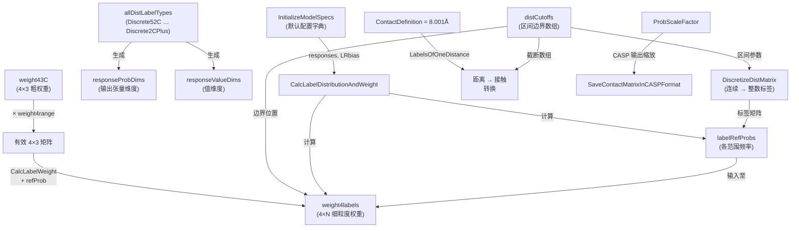

---
slug:16-configuration-and-distance-bins
blog_type:normal
---


RaptorX-Contact 将所有可配置常量、距离离散化方案和标签权重矩阵集中在一个模块中 —— `config.py` —— 并由 `DistanceUtils.py` 提供运行时逻辑支持。它们共同定义了**连续的原子间距离如何量化为离散区间**、**训练期间每个区间分配的权重**，以及**推理过程中如何解析预测的概率张量**。对于任何希望修改预测粒度、重平衡损失函数或将模型扩展至新原子对类型的人来说，理解该子系统至关重要。

## 全局物理常量

三个物理阈值构成了整个区间划分与权重系统的基石。`ContactDefinition`（8.001 Å）定义了将距离概率矩阵转换为二值接触图时使用的 Cβ–Cβ 接触边界。`InteractionLimit`（15.001 Å）标记了假定两个残基不再存在物理相互作用的距离界限；它将“中距”区间（8–15 Å）与“远距”尾部（>15 Å）分隔开来。`MaxBetaDistance`（8.0 Å）和 `MaxHBDistance`（9.5 Å）在 β-配对和氢键矩阵中发挥着类似的作用，超出这些阈值的矩阵元素将按照 `100 + real_distance` 的惯例对非键合距离进行编码。

| 常量 | 值 (Å) | 用途 |
|---|---|---|
| `ContactDefinition` | 8.001 | Cβ–Cβ 接触截断值 |
| `InteractionLimit` | 15.001 | 超过此距离假定无物理相互作用 |
| `MaxBetaDistance` | 8.0 | β-配对距离截断值 |
| `MaxHBDistance` | 9.5 | 氢键距离截断值 |

来源：[config.py](/DL4DistancePrediction2/config.py#L55-L56), [config.py](/DL4DistancePrediction2/config.py#L175-L179)

## 距离区间方案 (`distCutoffs`)

核心抽象是一个**距离截断数组** —— 一个以 0 起始的单调递增边界值序列。原始距离 `d` 会被分配到满足 `cutoffs[k] ≤ d < cutoffs[k+1]` 的区间 `k` 中。区间数量等于 `len(cutoffs)`，每种方案通过一个短字符串后缀（如 `25C`、`12CPlus`）进行标识。

### 命名约定

每种标签类型遵循 `Discrete{N}C` 或 `Discrete{N}CPlus` 的格式，其中 **N** 表示距离区间的数量，可选的 **Plus** 后缀控制如何处理无效距离（在原始矩阵中表示为 −1）：

- **不含 Plus**：无效距离 (−1) 被**合并**至最大距离区间。总输出标签数 = N。
- **含 Plus**：无效距离被**分离**到独立的专属区间。总输出标签数 = N + 1。

这一区别会传递至 `responseProbDims`，从而决定每个响应在神经网络 softmax 层的输出维度。

来源：[config.py](/DL4DistancePrediction2/config.py#L58-L60), [config.py](/DL4DistancePrediction2/config.py#L116-L138)

### 所有已定义的区间方案

下表列出了每个截断数组、其区间数量、范围和间隔策略：

| 方案 | 区间数 (N) | 范围 (Å) | 间隔 | 截断数组 |
|---|---|---|---|---|
| `52C` | 52 | 4.0–16.5 | 线性（linspace，51 个间隔） | `[0, 4.0, 4.25, …, 16.5]` |
| `36C` | 36 | 4.15–16.4 | 线性（linspace，35 个间隔） | `[0, 4.15, …, 16.4]` |
| `34CPlus` / `34C` | 34 | 4.0–20.0 | 线性（linspace，33 个间隔） | `[0, 4.0, …, 20.0]` |
| `25CPlus` / `25C` | 25 | 4.5–16.0 | 线性（linspace，24 个间隔） | `[0, 4.5, …, 16.0]` |
| `14CPlus` / `14C` | 14 | 4–16 | 整数步长 | `[0, 4, 5, 6, …, 16]` |
| `13CPlus` / `13C` | 13 | 5–16 | 整数步长 | `[0, 5, 6, 7, …, 16]` |
| `12CPlus` / `12C` | 12 | 5–15 | 整数步长 | `[0, 5, 6, 7, …, 15]` |
| `3CPlus` / `3C` | 3 | 0–8–15 | 粗粒度（接触 / 相互作用 / 远距） | `[0, 8, 15]` |
| `2CPlus` / `2C` | 2 | 0–8 | 二值（接触 / 非接触） | `[0, 8]` |

没有显式 `Plus` 变体的方案（例如 `34C`）直接作为其 `Plus` 对应方截断数组的别名 —— 它们之间的差异化发生在离散化阶段，通过 `invalidDistanceSeparated` 标志进行控制。

来源：[config.py](/DL4DistancePrediction2/config.py#L62-L86)

### 专用氢键距离区间

氢键响应使用独立的字典 `distCutoffs_HB`，其中包含单个 `2C` 条目：`[0, MaxHBDistance]` = `[0, 9.5]`。这反映了氢键接触距离略远于 Cβ–Cβ 接触距离的事实。

来源：[config.py](/DL4DistancePrediction2/config.py#L88-L90)

## 离散化流程

`DistanceUtils.py` 中的 `DiscretizeDistMatrix` 函数利用 `np.digitize` 将连续距离矩阵转换为整数标签矩阵：

```python
result = np.digitize(distm, bins) - 1
```

当 `invalidDistanceSeparated=True`（即 **Plus** 情况）时，`digitize` 返回 −1 的条目会被重新映射至 `len(bins)`，从而创建一个专用的无效距离区间。否则，它们会被合并至索引为 `len(bins) - 1` 的最后一个有效区间。该函数在 `DataProcessor.LoadDistanceFeatures` 的数据加载过程中被调用，标签类型字符串同时决定了截断数组和分离标志：

```python
labelMatrix, _, _ = DistanceUtils.DiscretizeDistMatrix(
    distm, config.distCutoffs[subType], subType.endswith('Plus')
)
```

逆向操作 —— **将细粒度区间合并为粗粒度区间** —— 由 `MergeDistanceBins` 执行，它在源截断数组中定位每个目标边界，并对相应的概率切片求和。这使得可以将 52 区间的预测结果事后粗化为 25 区间的表示，而无需重新运行推理。

来源：[DistanceUtils.py](/DL4DistancePrediction2/DistanceUtils.py#L156-L170), [DataProcessor.py](/DL4DistancePrediction2/DataProcessor.py#L298-L308), [DistanceUtils.py](/DL4DistancePrediction2/DistanceUtils.py#L133-L152)

## 响应规范系统

**响应** 是预测的原子单位 —— 它通过 `{LabelName}_{LabelType}` 格式将原子对类型与标签类型配对。例如，`CbCb_Discrete25C` 意为“预测离散化为 25 个区间的 Cβ–Cβ 距离”。

### 原子对类型

共定义了五种原子对类型，其中四种是对称的（`d(i,j) = d(j,i)`）：

| 类型 | 原子 | 对称 |
|---|---|---|
| `CbCb` | Cβ–Cβ（甘氨酸为 Cα） | 是 |
| `CaCa` | Cα–Cα | 是 |
| `CgCg` | Cγ–Cγ（依赖于上下文） | 是 |
| `CaCg` | Cα–Cγ | 否 |
| `NO` | N–O | 否 |

另外两种标签名 —— `HB`（氢键）和 `Beta`（β-配对） —— 使用二值（2C）方案，并携带特殊的权重矩阵。`SelectAtomPair` 函数根据残基解析实际的 PDB 原子名称，处理 `CbCb` 中甘氨酸的 Cβ→Cα 替换，以及通过 `SelectCG` 进行的依赖侧链的 Cγ 分配。

来源：[config.py](/DL4DistancePrediction2/config.py#L22-L24), [config.py](/DL4DistancePrediction2/config.py#L278-L301)

### 响应维度账目

两个字典控制着流经网络的张量形状：

- **`responseValueDims`**：预测*值*的维度（标量距离为 1，二维正态分布为 2）。
- **`responseProbDims`**：预测*概率参数*的维度（对于 `Discrete{N}C` 等于 N，对于 `Discrete{N}CPlus` 等于 N+1，一维正态/对数正态为 2，二维正态最高可达 5）。

这些值通过编程方式计算：对于 `Discrete{N}C`，`responseProbDims = N`；对于 `Discrete{N}CPlus`，`responseProbDims = N + 1`。在推理期间，`RunDistancePredictor2` 利用这些维度将拼接的输出张量切片为各响应的概率图。

来源：[config.py](/DL4DistancePrediction2/config.py#L105-L138), [RunDistancePredictor2.py](/DL4DistancePredictor2.py#L124-L129)

## 基于范围的权重系统

训练损失在所有残基对之间并非均匀分布 —— 它根据**序列间隔**被划分为四个范围，每个范围接收不同的权重。

### 范围边界

| 范围 | 序列间隔 | 权重 (`weight4range`) |
|---|---|---|
| 长距 | ≥ 24 | 3.0 |
| 中距 | 12–23 | 2.5 |
| 短距 | 6–11 | 1.0 |
| 近距 | 2–5 | 0.5 |

`GetRangeIndex` 将序列偏移量映射至其范围索引；小于 2 的偏移量返回 −1（默认不参与训练）。

来源：[config.py](/DL4DistancePrediction2/config.py#L141-L156)

### 三区间权重矩阵 (`weight43C`)

最粗的离散方案 `3C` 将距离划分为三个区间：**0–8 Å**（接触）、**8–15 Å**（中距）和 **>15 Å 或无效**（远距）。一个 4×3 的权重矩阵为每个（范围 × 距离区间）组合分配权重。共有五种预设矩阵可供选择，通过 `LRbias` 模型规范键进行选定：

| 预设 | 长距/接触 | 长距/中距 | 长距/远距 | 中距/接触 | 中距/中距 |
|---|---|---|---|---|---|
| `low` | 17 | 4 | 1 | 5 | 2 |
| `mid` | 20.5 | 5.4 | 1 | 5.4 | 1.89 |
| `high` | 23 | 6 | 1 | 6 | 2.5 |
| `veryhigh` | 25 | 6 | 1 | 7 | 2.5 |
| `exhigh` | 28 | 6 | 1 | 8 | 2.5 |

任何方案的**有效权重**为 `weight43C[preset] × weight4range`，生成一个 4×3 矩阵，随后通过 `CalcLabelWeight` 将其**扩展**至完整的区间数。此扩展过程利用参考概率分布：在三个粗粒度区间的每一个内，细粒度区间的权重与其参考频率成反比，同时保持粗粒度区间的平均值不变。这确保了难以预测的稀有距离区间能够获得更高的权重。

来源：[config.py](/DL4DistancePrediction2/config.py#L162-L167), [DistanceUtils.py](/DL4DistancePrediction2/DistanceUtils.py#L246-L261)

### 氢键与 β-配对的二值权重矩阵

氢键和 β-配对使用二区间（接触 / 非接触）方案，并对正类施加了激进的权重：

- **`weight4Beta2C`**：在长距/中距/短距/近距范围内的值为 `[360, 1], [70, 1], [50, 1], [120, 1]`
- **`weight4HB2C`**：在长距/中距/短距/近距范围内的值为 `[600, 1], [120, 1], [90, 1], [5, 1]`

这些极端的比率反映了严重的类别不平衡：仅有极少部分残基对会形成氢键或 β-配对。

来源：[config.py](/DL4DistancePrediction2/config.py#L170-L173)

## 权重扩展：从 3C 到细粒度区间

`DistanceUtils.py` 中的 `CalcLabelWeight` 是连接人类可读的 3C 权重预设与细粒度方案（如 25C 或 52C）所需的逐区间权重的桥梁。它分三步执行：

1. **识别边界区间**：`labelOf8 = LabelsOfOneDistance(ContactDefinition, distCutoffs)` 和 `labelOf15 = LabelsOfOneDistance(InteractionLimit, distCutoffs)` 将细粒度区间划分为与 0–8 / 8–15 / >15 区间相对应的三组。
2. **计算逐区间权重**：对于每个范围和每个粗粒度区间，分配给细粒度区间 `k` 的权重为 `w3C[coarse] × avg_ref_prob[coarse] / ref_prob[k]`，其中 `avg_ref_prob` 是该粗粒度区间内所有区间的平均参考频率。参考频率较低的区间将获得更高的权重。
3. **应用范围乘数**：通过在 `CalcLabelDistributionAndWeight` 中进行的预乘 `weight43C × weight4range`，生成的 4×N 矩阵已经按 `weight4range` 进行了缩放。

<CgxTip>权重扩展公式确保了每个粗粒度区间的**期望单样本损失贡献**与 3C 预设意图相符，无论该区间包含多少个细粒度区间。在不重新推导 `labelRefProbs` 的情况下更改 `distCutoffs` 将隐式破坏此不变性。</CgxTip>

来源：[DistanceUtils.py](/DL4DistancePrediction2/DistanceUtils.py#L246-L261), [DataProcessor.py](/DL4DistancePrediction2/DataProcessor.py#L345-L433)

## 模型规范默认值

`InitializeModelSpecs` 构建了贯穿训练和推理过程的默认配置字典。控制距离区间和权重的关键条目如下：

| 键 | 默认值 | 描述 |
|---|---|---|
| `responseStr` | `'CbCb:25C'` | 人类可读的响应描述符 |
| `responses` | `['CbCb_Discrete25C']` | 机器可读的响应列表 |
| `w4responses` | `[1.]` | 各响应的损失乘数 |
| `topRatios` | `[0.5]` | 用于准确率评估的 top-L 比例 |
| `LRbias` | `'mid'` | 3C 权重预设选择 |
| `rangeMode` | `'All'` | 在训练中包含近距残基对 |
| `UseSampleWeight` | `True` | 启用基于范围的标签加权 |
| `batchNorm` | `True` | ResNet 模块中的批归一化 |
| `L2reg` | `0.0001` | L2 正则化系数 |

`algorithm`、`numEpochs` 和 `lrs` 条目定义了两阶段学习率调度：19 个 epoch 采用 0.0002，随后 2 个 epoch 采用 0.00002（10 倍衰减）。

来源：[config.py](/DL4DistancePrediction2/config.py#L181-L259)

## 距离到接触的转换

在推理期间，预测的距离概率张量通过将低于接触阈值的所有区间的概率求和，坍缩为二值接触矩阵。在 `RunDistancePredictor2.PredictDistMatrix` 中：

```python
labelOf8 = DistanceUtils.LabelsOfOneDistance(
    config.ContactDefinition, config.distCutoffs[subType]
)
contactProb = np.sum(distProb[:, :, :labelOf8], axis=2)
```

对于正态分布预测，转换使用 CDF 计算：`normDistribution.cdf(ContactDefinition)`。对于对数正态分布，则使用 `normDistribution.cdf(log(ContactDefinition))`。当以 CASP `.rr` 格式保存时，生成的接触矩阵可以进一步通过 `ProbScaleFactor`（默认：`log(0.5)/log(0.4) ≈ 1.096`）进行缩放，这将在以 0.5 作为二分类阈值时最大化 MCC/F1 值。

来源：[RunDistancePredictor2.py](/DL4DistancePredictor2.py#L210-L225), [ContactUtils.py](/DL4DistancePrediction2/ContactUtils.py#L106-L111), [config.py](/DL4DistancePrediction2/config.py#L4-L9)

## 概率校正 (`FixDistProb`)

`FixDistProb` 对原始预测概率施加参考频率校正。它通过参考概率与经过标签权重调整的参考概率的比值，对每个预测分布重新加权：

```
fixedProb[i,j] = (originalProb[i,j] × refProb[rangeIndex]) / newRefProb[rangeIndex]
```

随后进行重归一化。这补偿了训练期间由非均匀标签权重引入的失真，将预测分布恢复为校准后的概率估计。

来源：[DistanceUtils.py](/DL4DistancePrediction2/DistanceUtils.py#L110-L129)

## 配置系统架构

下图展示了配置实体之间如何相互关联并在系统中流转：



来源：[config.py](/DL4DistancePrediction2/config.py#L1-L329), [DistanceUtils.py](/DL4DistancePrediction2/DistanceUtils.py#L1-L285), [DataProcessor.py](/DL4DistancePrediction2/DataProcessor.py#L345-L433)

<CgxTip>当添加新的距离区间方案时，你**必须**更新 `config.py` 中的**四个**位置：`distCutoffs` 字典、`allDistLabelTypes` 列表（它会自动生成 `Discrete` 前缀的条目），以及相应的 `responseProbDims` / `responseValueDims` 条目（`Discrete` 类型会自动计算，但 `Normal`/`LogNormal` 变体必须手动添加）。遗漏其中任何一项都会导致模型构建时出现形状不匹配错误。</CgxTip>

## 推荐阅读

- 关于这些区间如何馈入神经网络输出层：[模型构建与损失](10-model-building-and-loss)
- 关于训练期间离散化标签的加载与批处理：[数据加载与处理](8-data-loading-and-processing)
- 关于距离概率与真实值的评估方式：[距离准确率与 MCC](14-distance-accuracy-and-mcc)