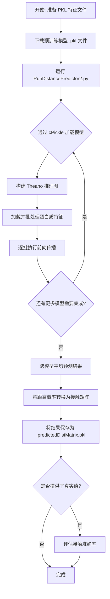

---
slug:2-quick-start
blog_type:normal
---


让 RaptorX-Contact 端到端运行起来：从环境配置到完成首次蛋白质距离预测。本指南将引导你完成从零开始到预测出接触图所需的每一个前置条件、数据准备步骤和执行命令。

## 前置条件与环境配置

RaptorX-Contact 基于 **Python 2.7** 构建，并使用 **Theano** 作为其深度学习后端。在接触代码之前，请确保你的环境满足下表中的每一项依赖。项目还要求环境变量 `ModelingHome` 指向仓库根目录，以便跨模块导入（例如 `Common/LoadHHM.py`）能够正确解析。

| 依赖 | 版本 | 用途 |
|---|---|---|
| Python | 2.7 | 运行时环境（推荐使用 Anaconda） |
| Theano | 最新兼容版 | 张量计算与 GPU 后端 |
| NumPy | ≥ 1.x | 数组操作，矩阵运算 |
| SciPy | ≥ 0.19 | 用于接触转换的统计分布 |
| cPickle | stdlib | 模型与特征序列化（PKL 格式） |
| BioPython | 可选 | 附加序列工具 |

使用 Anaconda 安装核心依赖栈：

```bash
# 创建 Python 2.7 环境
conda create -n raptorx python=2.7 numpy scipy
conda activate raptorx

# 安装 Theano（CPU 或 GPU 版本）
pip install theano

# 设置仓库根目录环境变量
export ModelingHome=/path/to/RaptorX-Contact
```

<CgxTip>必须通过 `~/.theanorc` 为 Theano 配置 CPU 或 GPU 模式。如需 GPU 加速，请确保已安装 CUDA 工具包，并在 Theano 配置文件的 `[global]` 部分设置 `device = gpu`。</CgxTip>

来源: [README.md](/README.md#L1-L38), [config.py](/DL4DistancePrediction2/config.py#L1-L10), [RunDistancePredictor2.py](/DL4DistancePrediction2/RunDistancePredictor2.py#L1-L15)

## 获取预训练模型与测试数据

RaptorX-Contact 需要**预训练的深度 ResNet 模型**以及格式正确的输入特征文件。两者均从 RaptorX 下载服务器分发。在 `http://raptorx.uchicago.edu/download/` 登录后，请查阅以下两个关键 README 文件：

- **`0README.data4contactPrediction.txt`** — 描述测试数据集和多重序列比对
- **`0README.models4ContactDistancePrediction.txt`** — 描述可用的预训练模型文件（PKL 格式）

每个模型文件都是一个 Python `cPickle` 导出文件，包含一个具有完整模型规格的字典：网络架构、参数值（`paramValues`）、响应类型、标签分布（`labelRefProbs`）以及权重配置（`weight4labels`）。预测流水线会通过 `cPickle.load()` 直接加载这些内容。

来源: [README.md](/README.md#L23-L28), [RunDistancePredictor2.py](/DL4DistancePrediction2/RunDistancePredictor2.py#L35-L42)

## 准备输入特征

每个蛋白质的输入特征都存储为一个**序列化为 PKL 格式的 Python `dict()`**。该字典必须包含与 `DataProcessor.LoadDistanceFeatures()` 期望相匹配的特定键。下表总结了每个必需和可选的特征、其形状以及生成方法。

| 特征键 | 形状 | 是否必需 | 生成方法 |
|---|---|---|---|
| `name` | 字符串 | 是 | 蛋白质标识符 |
| `sequence` | 字符串（大写） | 是 | 来自 FASTA 的主序列 |
| `PSSM` | L × 20 | 是 | 通过 `LoadHHM.py` 从 HHM 文件获取，或使用 PSI-BLAST/HHblits |
| `SS3` | L × 3 | 是 | DeepCNF_SS_Con 预测器 |
| `ACC` | L × 3 | 是 | AcconPred 溶剂可及性 |
| `ccmpredZ` | L × L | 是 | 添加 `-R -d GPU` 标志的 CCMpred，随后进行 Z-score 归一化 |
| `OtherPairs` | L × L × 3 | 是 | 来自 MetaPSICOV 的 `alnstats` |
| `DISO` | L × ? | 否 | 无序预测 |
| `psicovZ` | L × L | 否 | PSICOV Z-score 矩阵 |

**关键约束**：`SS3` 中 3 列的顺序必须为 **Helix, Beta, Loop**（索引分别为 0, 1, 2），并且 `ACC` 的标签顺序必须与示例数据保持一致。此处的不匹配将隐式降低预测准确率。

### 从 HHM 文件生成 PSSM

如果你使用 HHblits/HHpred 生成多重序列比对，可以使用 `LoadHHM.py` 工具将生成的 `.hhm` 文件同时转换为 PSSM 和 PSFM：

```python
import sys
sys.path.append('/path/to/RaptorX-Contact/Common')
import LoadHHM

# 读取 HHM 文件 — 填充 'PSFM' 和 'PSSM' 键
protein = LoadHHM.ReadHHM(lines, start_position, length, one_protein)
pssm = protein['PSSM']   # 位置特定得分矩阵 (L x 20)
psfm = protein['PSFM']   # 位置特定频率矩阵 (L x 20)
```

`ReadHHM` 函数在内部处理伪计数添加、重归一化以及基于 Gonnet 矩阵的平滑，从而从原始 HHM 发射分数生成可用于生产的 PSSM/PSFM 矩阵。

来源: [README.md](/README.md#L28-L36), [DataProcessor.py](/DL4DistancePrediction2/DataProcessor.py#L112-L195), [LoadHHM.py](/Common/LoadHHM.py#L1-L30), [LoadHHM.py](/Common/LoadHHM.py#L100-L200)

## 运行距离预测

主入口点是 `RunDistancePredictor2.py`，它负责加载一个或多个预训练模型，处理输入特征文件，并输出预测的距离概率矩阵。以下流程图展示了完整的预测流水线：



### 命令行调用

```bash
cd $ModelingHome/DL4DistancePrediction2

python RunDistancePredictor2.py \
  -m model1.pkl;model2.pkl;model3.pkl \
  -p proteinFeatures1.pkl;proteinFeatures2.pkl \
  -d /path/to/output_folder \
  -g /path/to/native_distance_matrices
```

| 标志 | 参数 | 描述 |
|---|---|---|
| `-m` | 以分号分隔的 PKL 路径 | 一个或多个预训练模型文件 |
| `-p` | 以分号分隔的 PKL 路径 | 一个或多个蛋白质特征文件 |
| `-d` | 目录路径 | 预测输出的保存路径 |
| `-g` | 目录路径 | 真实值文件夹（可选；指定后将触发准确率评估） |

### 理解输出结果

每个蛋白质会生成一个名为 `{proteinName}.predictedDistMatrix.pkl` 的文件，其中包含一个 5 元素元组：

| 元组索引 | 内容 | 形状/类型 |
|---|---|---|
| 0 | 蛋白质名称 | 字符串 |
| 1 | 主序列 | 字符串 |
| 2 | 预测的距离概率矩阵 | 字典: 响应 → L × L × numBins |
| 3 | 预测的接触概率矩阵 | 字典: 原子对类型 → L × L |
| 4 | 标签权重矩阵 | 字典 |
| 5 | 标签分布（参考概率） | 字典 |

预测的接触矩阵（元组索引 3）是通过将距离概率区间累加至**接触定义阈值 8.001 Å** 得出的，该阈值可通过 `config.ContactDefinition` 配置。

来源: [RunDistancePredictor2.py](/DL4DistancePrediction2/RunDistancePredictor2.py#L17-L30), [RunDistancePredictor2.py](/DL4DistancePrediction2/RunDistancePredictor2.py#L35-L65), [RunDistancePredictor2.py](/DL4DistancePrediction2/RunDistancePredictor2.py#L200-L270), [config.py](/DL4DistancePrediction2/config.py#L148-L150)

## 评估预测准确率

生成预测结果后，使用 `BatchEvaluateContactAccuracy.py` 计算蛋白质列表的准确率指标：

```bash
python BatchEvaluateContactAccuracy.py \
  proteinList.txt \
  /path/to/output_folder \
  /path/to/native_distance_matrices
```

该脚本加载每个 `{proteinName}.predictedDistMatrix.pkl`，提取预测的接触矩阵（元组索引 3），并与原生距离矩阵进行比对。它会输出长程、中程和短程接触的 top-L/k 精度——这是 CASP 竞赛中的标准基准。

来源: [BatchEvaluateContactAccuracy.py](/DL4DistancePrediction2/BatchEvaluateContactAccuracy.py#L21-L50), [BatchEvaluateContactAccuracy.py](/DL4DistancePrediction2/BatchEvaluateContactAccuracy.py#L60-L95)

## 默认配置参考

`config.InitializeModelSpecs()` 函数定义了默认的模型规格。在修改任何训练或推理行为之前，理解这些默认值至关重要。最具影响力的设置总结如下：

| 参数 | 默认值 | 含义 |
|---|---|---|
| `network` | `ResNet2D` | 网络架构（还包括：`DilatedResNet2D`、`ResNet2DV23`） |
| `responseStr` | `CbCb:25C` | 将 Cβ-Cβ 距离预测为 25 个离散区间 |
| `algorithm` | `Adam` | 优化器（`Adam`、`SGDM`、`AMSGrad` 等） |
| `numEpochs` | `[19, 2]` | 每个学习率调度阶段的轮次 |
| `lrs` | `[0.0002, 0.00002]` | 每个阶段的学习率 |
| `conv1d_hiddens` | `[30, 35, 40, 45]` | 1D 卷积层中的隐藏单元数 |
| `conv2d_hiddens` | `[50, 55, 60, 65, 70, 75]` | 2D 残差块中的隐藏单元数 |
| `conv2d_repeats` | `[4, 4, 4, 4, 4, 4]` | 每个 2D 层组的残差块数量 |
| `batchNorm` | `True` | 启用批归一化 |
| `ContactDefinition` | `8.001` | 接触的 Cβ-Cβ 距离阈值 (Å) |

来源: [config.py](/DL4DistancePrediction2/config.py#L130-L195), [config.py](/DL4DistancePrediction2/config.py#L148-L150)

## 常见问题排查

| 问题 | 原因 | 解决方案 |
|---|---|---|
| `FATAL ERROR: the model type or network architecture is not compatible` | 模型 PKL 是由不同版本的 `config.py` 保存的 | 重新下载与你的代码版本匹配的模型文件 |
| `unsupported network architecture` | 网络名称不在 `config.allNetworks` 中 | 使用以下之一：`ResNet2D`、`ResNet2DV21`、`ResNet2DV22`、`ResNet2DV23`、`DilatedResNet2D` |
| `inconsistent primary sequence for the same protein` | 输入 PKL 中存在具有不同序列的重复蛋白质名称 | 验证特征文件中的序列一致性 |
| 特征维度断言不匹配 | 输入特征与模型的 `n_in_seq` / `n_in_matrix` 不匹配 | 使用与训练时相同的工具版本重新生成特征 |
| `please set the environment variable ModelingHome` | 缺少环境变量 | `export ModelingHome=/path/to/RaptorX-Contact` |

来源: [RunDistancePredictor2.py](/DL4DistancePrediction2/RunDistancePredictor2.py#L35-L75), [RunDistancePredictor2.py](/DL4DistancePrediction2/RunDistancePredictor2.py#L80-L100), [DataProcessor.py](/DL4DistancePrediction2/DataProcessor.py#L112-L195)

## 接下来去哪

现在你已经能够运行预测了，以下页面将加深你对系统内部机制的理解：

1. **[架构概述](3-architecture-overview)** — 了解 1D 卷积、2D ResNet 和嵌入层如何组合成完整的预测流水线
2. **[输入特征规格](7-input-feature-specification)** — 蛋白质字典中每个特征键的详细格式规范
3. **[HHM 谱解析](9-hhm-profile-parsing)** — 深入探讨 `LoadHHM.py` 内部机制、伪计数处理以及 PSSM 推导
4. **[用于距离预测的深度 ResNet](4-deep-resnet-for-distance)** — 了解驱动预测准确率的残差块架构
5. **[配置与距离区间](16-configuration-and-distance-bins)** — 探索离散区间划分方案（`25C`、`12CPlus` 等）及其权衡