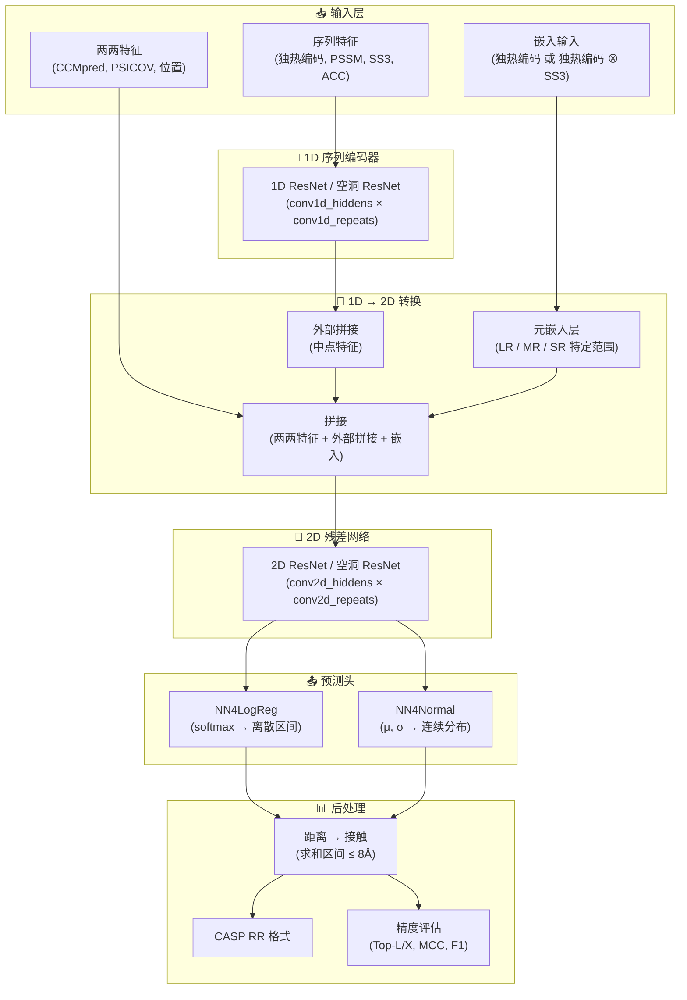

---
slug:3-architecture-overview
blog_type:normal
---


RaptorX-Contact 是一个深度学习系统，它使用深度卷积残差神经网络来预测蛋白质中的**残基间距离**和**接触**。该系统没有直接预测二值的接触，而是将实值的原子间距离离散化到多个区间中，并预测这些区间上的概率分布——这一策略已被证明能够产生比单纯二值接触预测好得多的 3D 结构折叠效果。整个代码库在 Python 2.7 和 **Theano** 符号计算框架上实现，并被组织成一个主软件包 `DL4DistancePrediction2/` 以及一个共享工具模块 `Common/`。

## 项目结构

```
RaptorX-Contact/
├── Common/
│   └── LoadHHM.py                  # HHM 特征解析器 (PSSM 提取)
├── DL4DistancePrediction2/
│   ├── config.py                    # 核心配置：区间、权重、标签类型
│   ├── RunDistancePredictor2.py     # 顶层推理管道入口点
│   ├── Model4DistancePrediction.py  # 模型组装：BuildModel() + ResNet4DistMatrix
│   ├── ResNet4Distance.py           # 带有批量归一化残差块的标准 2D ResNet
│   ├── DilatedResNet4Distance.py    # 空洞 ResNet 变体 (扩大感受野)
│   ├── EmbeddingLayer.py           # 残基对嵌入 (MetaEmbeddingLayer)
│   ├── Conv1d.py                    # 用于序列特征的 1D 卷积层
│   ├── DataProcessor.py            # 特征加载、组装和批次分割
│   ├── ReadProteinFeatures.py       # 单蛋白质特征文件读取器 (SS, ACC, PSSM…)
│   ├── DistanceUtils.py            # 距离 ↔ 接触转换，区间离散化
│   ├── ContactUtils.py             # 接触精度评估，CASP 格式 I/O
│   ├── NN4LogReg.py                # 输出头：离散距离区间上的 softmax
│   ├── NN4Normal.py                # 输出头：正态/对数正态分布
│   ├── Optimizers.py               # SGD-Momentum, AdaDelta, AdaGrad, Adam, Nesterov
│   ├── Metrics.py                   # MCC, F1, 精确率/召回率计算
│   └── ... (批量评估脚本)
└── README.md
```

来源: [README.md](/README.md#L1-L38), [config.py](/DL4DistancePrediction2/config.py#L1-L200)

## 系统架构图

下图展示了从原始蛋白质特征经过神经网络到预测距离和接触矩阵的端到端数据流。每个彩色区域对应一个独立的架构关注点。



来源: [Model4DistancePrediction.py](/DL4DistancePrediction2/Model4DistancePrediction.py#L246-L398), [RunDistancePredictor2.py](/DL4DistancePrediction2/RunDistancePredictor2.py#L1-L200)

## 核心管道阶段

### 阶段 1 — 特征加载与组装

原始蛋白质数据从 PKL 格式文件中加载，并分解为两个互补的特征流。**序列特征**（形状为 `L × n_in_seq`）拼接了独热编码、位置特异性评分矩阵 (PSSM)、预测的 3 状态二级结构 (SS3) 以及预测的溶剂可及性 (ACC)。**两两特征**（形状为 `L × L × n_in_matrix`）拼接了归一化的 CCMpred 共变矩阵、三个 MetaPSICOV alnstats 矩阵、位置特征 `min(1, |i−j|/30)` 以及立方根分离特征 `∛|i−j|`。可选的**嵌入输入**（形状为 `L × n_in_embed`）为残基对嵌入层做准备。所有组装逻辑位于 `DataProcessor.LoadDistanceFeatures()` 中，该函数读取模型规格以确定要包含的特征。

来源: [DataProcessor.py](/DL4DistancePrediction2/DataProcessor.py#L83-L200), [ReadProteinFeatures.py](/DL4DistancePrediction2/ReadProteinFeatures.py#L1-L200)

### 阶段 2 — 1D 序列编码

序列特征矩阵通过由重复残差块组成的 **1D ResNet**（或空洞 ResNet）。每个块包含：1D 卷积 → 批量归一化 → ReLU → 1D 卷积 → 批量归一化 → ReLU → 跳跃连接。隐藏通道数和块重复次数由模型规格中的 `conv1d_hiddens` 和 `conv1d_repeats` 控制。每次卷积后都会应用掩码，以抑制变长批次处理中来自零填充位置的噪声。

来源: [ResNet4Distance.py](/DL4DistancePrediction2/ResNet4Distance.py#L1-L200), [DilatedResNet4Distance.py](/DL4DistancePrediction2/DilatedResNet4Distance.py#L1-L200)

### 阶段 3 — 1D 到 2D 转换

这是将每个残基的表示转换为残基对表示的架构桥梁。两种机制并行运作：

| 机制 | 操作 | 输出形状 | 配置键 |
|-----------|-----------|-------------|------------|
| **外部拼接** | 对 1D 输出执行 `MidpointFeature` → 2D 压缩卷积 | `(B, L, L, OuterCat)` | `seq2matrixMode['OuterCat']` |
| **元嵌入** | 特定范围的 `EmbeddingLayer` (LR/MR/SR) | `(B, L, L, n_out_embed)` | `seq2matrixMode['SeqOnly']` 或 `['Seq+SS']` |

`MetaEmbeddingLayer` 值得注意：它实例化了**三个独立的嵌入层**——一个用于长程对 (|i−j| ≥ 24)，一个用于中程对 (12 ≤ |i−j| < 24)，一个用于短程对 (6 ≤ |i−j| < 12)——使模型能够学习依赖于范围的残基对相互作用。在进入 2D ResNet 之前，所有 2D 特征通道都与原始两两特征拼接在一起。

来源: [EmbeddingLayer.py](/DL4DistancePrediction2/EmbeddingLayer.py#L56-L131), [Model4DistancePrediction.py](/DL4DistancePrediction2/Model4DistancePrediction.py#L280-L340)

### 阶段 4 — 2D 残差网络 (核心预测器)

拼接后的 2D 特征张量进入深度的 **2D ResNet** 或 **空洞 ResNet**，这是核心预测引擎。每个残差块执行：2D 卷积（带有可配置的半窗口大小）→ 批量归一化 → ReLU → 2D 卷积 → 批量归一化 → ReLU → 跳跃加法。空洞 ResNet 变体引入了 `filter_dilation=(d, d)`，以在不增加参数量的情况下指数级扩大感受野，这对于捕获蛋白质距离矩阵中的长程相互作用至关重要。

| 变体 | 感受野增长 | 关键配置 |
|---------|----------------------|------------|
| **ResNet2D** | 随深度 × 窗口大小线性增长 | `halfWinSize_matrix` |
| **DilatedResNet2D** | 随空洞调度指数级增长 | `conv2d_hwszs`, `conv2d_dilations` |

来源: [ResNet4Distance.py](/DL4DistancePrediction2/ResNet4Distance.py#L100-L200), [DilatedResNet4Distance.py](/DL4DistancePrediction2/DilatedResNet4Distance.py#L100-L200)

### 阶段 5 — 多响应预测头

2D ResNet 的输出被展平并输入到**每个响应变量**的一个预测头中。响应变量的格式为 `{AtomPairType}_{LabelType}`（例如，`CbCb_Discrete25C`）。支持两种头类型：

- **NN4LogReg** — 用于离散距离区间。一个小型全连接网络后接 softmax，生成 `N` 个距离区间（例如，`Discrete25C` 的 25 个区间）上的概率分布。
- **NN4Normal** — 用于连续距离。预测正态或对数正态分布的参数 (μ, σ)。

可以通过单次前向传播同时预测多个响应（例如，CbCb 距离 + 氢键 + β 配对），它们的输出概率张量沿最后一个维度拼接。

来源: [Model4DistancePrediction.py](/DL4DistancePrediction2/Model4DistancePrediction.py#L340-L398)

### 阶段 6 — 距离到接触的转换与输出

预测后，系统通过将上限 ≤ 8.0 Å（接触定义阈值）的所有区间的概率求和，将距离概率矩阵转换为接触概率矩阵。对于正态/对数正态响应，则计算 8.0 Å 处的 CDF。然后，预测的接触矩阵针对对称原子对类型 (CbCb, CaCa, CgCg) 进行对称化。结果保存为包含 `(name, sequence, distProb, contactProb, labelWeights, labelDistributions)` 的 PKL 文件，并可选择以 **CASP RR 格式** 导出用于社区评估。

来源: [RunDistancePredictor2.py](/DL4DistancePrediction2/RunDistancePredictor2.py#L200-L290), [ContactUtils.py](/DL4DistancePrediction2/ContactUtils.py#L90-L200)

## 距离离散化方案

系统支持丰富的距离区间配置集合，每种配置都在粒度与预测难度之间进行权衡。配置集中在 `config.py` 中：

| 标签类型 | 区间数 | 范围 | 区间宽度 | 备注 |
|-----------|--------|-------|-----------|-------|
| `Discrete52C` | 52 | 4.0 – 16.5 Å | ~0.25 Å | 最细粒度 |
| `Discrete36C` | 35 | 4.15 – 16.4 Å | ~0.35 Å | |
| `Discrete25C` | 24 | 4.5 – 16.0 Å | ~0.48 Å | 常见默认值 |
| `Discrete14C` | 13 | 4 – 16 Å | 1 Å | 粗粒度 |
| `Discrete12C` | 11 | 5 – 15 Å | 1 Å | |
| `Discrete3C` | 2 | 8, 15 Å | — | 接触 / 中程 / 远程 |
| `Normal` / `LogNormal` | — | 连续 | — | 参数化 (μ, σ) |

`Plus` 后缀（例如，`25CPlus`）表示无效距离标记 (−1) 被分离到其自己的区间中，而不是与最大距离区间合并。

来源: [config.py](/DL4DistancePrediction2/config.py#L33-L105)

## 范围加权损失函数

该架构的一个显著特点是它的**依赖范围的、标签加权的交叉熵损失**。残基对按序列分离度划分为四个范围，每个范围在距离标签上接收不同的权重向量：

| 范围 | 分离度 | 权重配置 (3C 的示例) | 依据 |
|-------|-----------|--------------------------------|-----------|
| 长程 | \|i−j\| ≥ 24 | `[17, 4, 1]` — 极大的接触权重 | 长程接触对折叠最具信息量 |
| 中程 | 12 ≤ \|i−j\| < 24 | `[5, 2, 1]` | |
| 短程 | 6 ≤ \|i−j\| < 12 | `[2.5, 0.6, 1]` | |
| 近程 | 2 ≤ \|i−j\| < 6 | `[0.2, 0.3, 1]` | 近程对大多是平凡的接触 |

这种加权方案确保网络优先学习**长程接触**，这些接触既更难预测，又对 3D 结构确定更有价值。

来源: [config.py](/DL4DistancePrediction2/config.py#L135-L175)

## 模型规格模式

系统没有使用单独的配置文件格式，而是将**完整的模型规格序列化为 Python 字典**并通过 `cPickle` 保存。`config.py` 中的 `InitializeModelSpecs()` 函数定义了规范模式，`Model4DistancePrediction.BuildModel()` 读取此字典以构建 Theano 计算图。关键规格字段包括：

```
modelSpecs = {
    'network':           'ResNet2DV23' | 'DilatedResNet2D',
    'responses':         ['CbCb_Discrete25C', ...],
    'n_in_seq':          # 序列特征维度,
    'n_in_matrix':       # 两两特征维度,
    'conv1d_hiddens':    [N1, N2, ...],    # 1D ResNet 通道宽度
    'conv1d_repeats':    R,                 # 1D 块重复次数
    'conv2d_hiddens':    [M1, M2, ...],    # 2D ResNet 通道宽度
    'conv2d_repeats':    S,                 # 2D 块重复次数
    'algorithm':         'Adam' | 'SGDM' | ...,
    'paramValues':       [W1, b1, W2, ...] # 学习到的参数值
}
```

这种自包含的模型文件模式支持**集成预测**——推理管道加载多个模型文件，独立运行每个模型，并平均预测的概率矩阵，从而显著提高准确性。

来源: [config.py](/DL4DistancePrediction2/config.py#L180-L220), [Model4DistancePrediction.py](/DL4DistancePrediction2/Model4DistancePrediction.py#L246-L280)

## 掩码与变长批次处理

蛋白质的长度差异很大，但 Theano 要求批次内的张量形状固定。系统通过**在批次内右对齐所有序列**并在左侧零填充较短序列来解决此问题。一个二值掩码张量跟踪哪些位置是真实的，哪些是填充的。在每次卷积和批量归一化操作后，重新应用掩码将填充位置重置为零，防止填充噪声污染预测。`DataProcessor.SplitData2Batches()` 函数将长度相近的蛋白质分组到批次中（每批最多 624 个蛋白质），以最小化计算浪费。

<CgxTip>在扩展代码库时，理解掩码约定至关重要：掩码抑制 1D 张量的左侧填充和 2D 张量的左上填充。任何新层都必须在其操作后传播并重新应用掩码以保持正确性。</CgxTip>

来源: [DataProcessor.py](/DL4DistancePrediction2/DataProcessor.py#L1-L200), [ResNet4Distance.py](/DL4DistancePrediction2/ResNet4Distance.py#L40-L99)

## 优化器目录

系统实现了多种优化算法，可通过 `algorithm` 字段按模型选择：

| 优化器 | 键 | 参考 |
|-----------|-----|-----------|
| 带动量的 SGD | `SGDM` | 经典，动量=0.95 |
| 带动量的 SGD (替代形式) | `SGDM2` | 更流行的实现 |
| Nesterov SGD | `SGNA` | Nesterov 加速梯度 |
| Adam | `Adam` | 默认；自适应的逐参数学习率 |
| 带解耦权重衰减的 Adam | `AdamW` | L2 正则化的 Adam 变体 |
| AMSGrad | `AMSGrad` | 保证收敛的 Adam 变体 |
| AdaDelta | — | 自适应，无学习率 |
| AdaGrad | — | 历史梯度累积 |

两阶段学习率调度是标准的：在第一组周期使用较高的学习率，然后降低 10 倍用于微调（通过 `numEpochs` 和 `lrs` 数组配置）。

来源: [Optimizers.py](/DL4DistancePrediction2/Optimizers.py#L1-L200), [config.py](/DL4DistancePrediction2/config.py#L42-L48)

## 接下来去哪

上面的架构概述提供了结构图。要深入了解特定子系统，请遵循此推荐阅读顺序：

1. **[用于距离预测的深度 ResNet](4-deep-resnet-for-distance)** — 2D 残差块、批量归一化和跳跃连接的内部结构
2. **[空洞 ResNet 变体](5-dilated-resnet-variants)** — 空洞调度如何为长程相互作用扩大感受野
3. **[嵌入与配对表示](6-embedding-and-pair-representation)** — MetaEmbeddingLayer 和外部拼接机制
4. **[输入特征规格](7-input-feature-specification)** — 所有输入特征的精确格式与来源
5. **[距离预测管道](12-distance-prediction-pipeline)** — 逐步推理演练
6. **[配置与距离区间](16-configuration-and-distance-bins)** — 所有可配置参数的完整参考