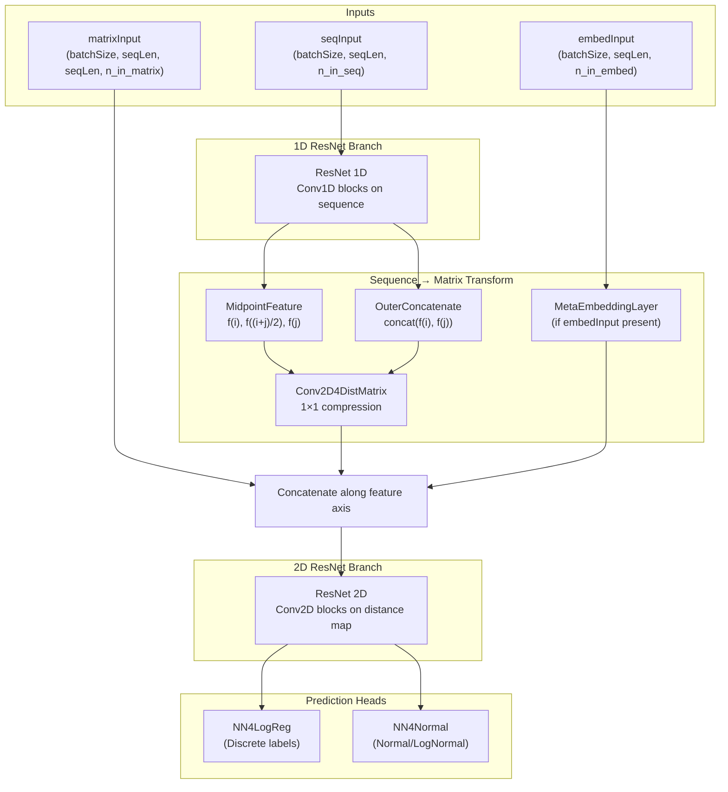
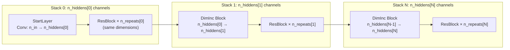

---
slug:4-deep-resnet-for-distance
blog_type:normal
---


**用于距离预测的深度 ResNet** 是 RaptorX-Contact 中的核心神经网络架构，专为从蛋白质序列特征预测残基间距离（以及派生属性，如接触、氢键和 beta 配对）而设计。它实现了一个**双分支 ResNet**——一个从序列谱中提取残基表征的 1D ResNet，随后接一个细化成对距离图的 2D ResNet——两者通过一种新颖的 **MidpointFeature** 变换进行连接。整个架构使用 Theano 实现，支持多种残差块变体、支持掩码的批归一化，以及可配置的快捷连接维度增加策略。

来源: [ResNet4Distance.py](DL4DistancePrediction2/ResNet4Distance.py#L1-L1008), [Model4DistancePrediction.py](DL4DistancePrediction2/Model4DistancePrediction.py#L1-L399), [config.py](DL4DistancePrediction2/config.py#L1-L329)

## 架构概述

完整的预测模型——封装在 `ResNet4DistMatrix` 中——遵循三阶段流水线：**1D 序列卷积 → 序列到矩阵的变换 → 2D 矩阵卷积 → 逐响应预测头**。1D 和 2D 阶段均使用 `ResNet` 类（或配置时的 `DilatedResNet`），但输入维度和通道调度不同。



1D 分支处理逐残基特征（PSSM、二级结构、溶剂可及性），生成增强的序列表征。序列到矩阵的变换通过 **MidpointFeature** 将此 1D 信号转换为成对特征——它为每个残基对 (i, j) 编码三元组 `(f(i), f(⌊(i+j)/2⌋), f(j))`——并可选地通过嵌入层进行转换。这些成对特征与原始矩阵输入（如 CCM 等共进化特征）拼接，随后由 2D ResNet 进行细化。最后，特定任务的头将每个空间位置映射到距离区间概率或实值距离分布。

来源: [Model4DistancePrediction.py](DL4DistancePrediction2/Model4DistancePrediction.py#L219-L399), [utils.py](DL4DistancePrediction2/utils.py#L23-L73)

## 卷积层

ResNet 架构依赖于两个自定义卷积层类，它们通过右对齐填充和基于掩码的噪声抑制来处理**变长输入**。

### ResConv1DLayer

通过具有奇数大小卷积核（由 `halfWinSize` 决定：`windowSize = 2 * halfWinSize + 1`）的 1D 卷积，处理形状为 `(batchSize, n_in, seqLen)` 的 3D 输入张量。在内部，输入被重塑为 4D `(batchSize, n_in, 1, seqLen)`，以利用 Theano 的 `conv2d` 并设置 `border_mode='half'` 来实现 same-padding 输出。关键实现细节如下：

- 针对ReLU激活的 **He-normal 初始化**：`scale = √(2 / (n_in × windowSize + n_out))`
- 针对其他激活的 **Xavier-uniform 初始化**，对 sigmoid 有 ×4 的缩放
- **偏置默认初始化为零**
- **掩码应用**：卷积后，使用形状为 `(batchSize, #positions_to_be_masked)` 的二值掩码将零填充位置重置为零，以防止卷积从填充区域泄漏信息

来源: [ResNet4Distance.py](DL4DistancePrediction2/ResNet4Distance.py#L6-L71)

### ResConv2DLayer

通过具有大小为 `(wSize, wSize)` 的方形卷积核的 2D 卷积，处理形状为 `(batchSize, n_in, nRows, nCols)` 的 4D 输入张量。其掩码处理更为复杂：掩码的形状为 `(batchSize, #rows_to_be_masked, nCols)`，并且**双向**应用——首先沿水平（行）方向，然后沿垂直（列）方向——以正确地将每个右下对齐距离矩阵左上角 L 形填充区域置零。

来源: [ResNet4Distance.py](DL4DistancePrediction2/ResNet4Distance.py#L74-L146)

## 支持掩码的批归一化

`batch_norm` 函数及其包装器 `BatchNormLayer` 实现了**从统计计算中排除填充位置**的批归一化。这一点至关重要，因为批次中的蛋白质具有不同的长度，对整个填充张量直接计算均值/方差会引入系统性偏差。

对于带掩码的 4D 输入，有效元素数计算如下：

```
x_num = mask.sum() × 2 + batchSize × (nRows − maskRows) × (nCols − maskCols) − overlap_adjustment
```

重叠调整项减去了水平掩码区域和垂直掩码区域相交处被重复计算的位置。归一化后，填充位置再次被重置为零。可学习参数为 `gamma`（缩放）和 `bias`（偏移），形状均为 `(n_in,)`。一个小的 epsilon（`1e-6`）用于防止标准差计算中出现除零错误。

来源: [ResNet4Distance.py](DL4DistancePrediction2/ResNet4Distance.py#L148-L235)

## 残差块变体

代码库提供了**四种不同的残差块实现**，每种对应一个不同的网络版本字符串。块类型的选择由传递给 `ResNet` 类的 `version` 参数决定。

| 块类 | 版本后缀 | 结构 | 每个块的 BN 层数 | 激活放置位置 |
|---|---|---|---|---|
| **ResBlockV1** | (默认) | Conv→Act→Conv + shortcut | 0 或 2 (卷积后) | 卷积后 (原始) |
| **ResBlockV2** | `ResNet2D`, `ResNet2DV21` | Act→Conv→Act→Conv + shortcut | 0 或 1 (卷积间) | 预激活 |
| **ResBlockV23** | `ResNet2DV23` | Act→Conv→BN→Act→Conv + shortcut | 0 或 1 | 预激活 (精简) |
| **ResBlockV22** | `ResNet2DV22` | BN→Act→Conv→BN→Act→Conv + shortcut | 0 或 2 (全预激活) | 预激活 (全 BN) |
| **BottleneckBlock** | — | 1×1→3×3→1×1 + shortcut | 0 或 3 | 卷积后 (瓶颈) |

来源: [ResNet4Distance.py](DL4DistancePrediction2/ResNet4Distance.py#L342-L817), [config.py](DL4DistancePrediction2/config.py#L11-L16)

### ResBlockV2 和 ResBlockV23 (推荐)

`ResBlockV23` 是**推荐的变体**——它与 `ResBlockV2` 几乎相同，但移除了块输入上未使用的 `BatchNormLayer`（及其参数），在不牺牲精度的情况下减小了模型尺寸。两者均实现了**预激活残差单元**模式：

```
output = Conv2D( activation( BatchNorm( Conv2D( activation(input) ) ) ) ) + shortcut(input)
```

当禁用批归一化时，结构简化为：

```
output = Conv2D( activation( Conv2D( activation(input) ) ) ) + shortcut(input)
```

每个块通过动态选择 `ResConv1DLayer` 或 `ResConv2DLayer` 作为卷积类，同时支持 1D（`ndim=3`）和 2D（`ndim=4`）输入。

来源: [ResNet4Distance.py](DL4DistancePrediction2/ResNet4Distance.py#L442-L535), [ResNet4Distance.py](DL4DistancePrediction2/ResNet4Distance.py#L537-L631)

### BottleneckBlock

`BottleneckBlock` 实现了经典的 1×1 → 3×3 → 1×1 瓶颈设计，以提高参数效率。瓶颈宽度由 `n_bottleneck` 控制（默认为 `n_in / 2`）。启用批归一化时，三个卷积中的每一个后都跟有自己的 `BatchNormLayer`，从而在每个块中产生三个 BN 层——这是最重的归一化配置。

来源: [ResNet4Distance.py](DL4DistancePrediction2/ResNet4Distance.py#L342-L441)

## 快捷连接策略

当 `n_out > n_in` 时，所有块变体都支持三种方法来处理输入和残差路径之间的**维度不匹配**：

| 策略 | 行为 | 新增参数 |
|---|---|---|
| **`partial_projection`** | 将恒等映射的输入通道与针对额外通道的学习到的 1×1 投影拼接：`output + concat(input, LinearProjection(input))` | 1 个大小为 `(n_out − n_in, n_in, 1, 1)` 的卷积层 |
| **`full_projection`** | 学习从输入到输出维度的完整 1×1 投影：`output + LinearProjection(input)` | 1 个大小为 `(n_out, n_in, 1, 1)` 的卷积层 |
| **`identity`** | 直接恒等映射（仅在 `n_out == n_in` 时有效） | 0 |

当 `n_out == n_in` 时，`partial_projection` 和 `full_projection` 都退化为简单的恒等快捷连接：`output + input`。**`partial_projection`** 策略是默认策略，对于渐进式通道扩展而言参数效率最高，因为它原样保留原始输入通道，仅学习额外的通道。

来源: [ResNet4Distance.py](DL4DistancePrediction2/ResNet4Distance.py#L391-L424), [ResNet4Distance.py](DL4DistancePrediction2/ResNet4Distance.py#L494-L522)

## ResNet 类

`ResNet` 类是顶层容器，用于从上述构建块组装**多堆栈残差网络**。其架构由两个并行列表定义：

- **`n_hiddens`**：每个堆栈的通道宽度（必须单调递增）
- **`n_repeats`**：每个堆栈内额外残差块的数量（不包括处理维度增加的第一个块）



**构造逻辑**：第一个堆栈以一个 `ConvLayer` 开始，将维度从 `n_in` 投影到 `n_hiddens[0]`，随后是 `n_repeats[0]` 个维持该通道宽度的块。每个后续堆栈以一个**维度增加块**开始（使用 `partial_projection` 从 `n_hiddens[i-1]` 增长到 `n_hiddens[i]`），然后追加 `n_repeats[i]` 个相同维度的块。块类型由 `version` 参数选择——`ResNet2D`/`ResNet2DV21` 对应 `ResBlockV2`，`ResNet2DV23` 对应 `ResBlockV23`，`ResNet2DV22` 对应 `ResBlockV22`。

输入/输出形状约定随维度而异：对于 1D 输入 `(batchSize, seqLen, n_in)`，内部表征转置为 `(batchSize, n_in, seqLen)` 以进行卷积，并在输出时转置回去；对于 2D 输入 `(batchSize, nRows, nCols, n_in)`，内部格式为 `(batchSize, n_in, nRows, nCols)`。

来源: [ResNet4Distance.py](DL4DistancePrediction2/ResNet4Distance.py#L819-L908)

## 默认配置

`config.py` 中的 `InitializeModelSpecs()` 函数定义了完整距离预测模型的默认超参数。下表总结了与 ResNet 相关设置：

| 参数 | 默认值 | 描述 |
|---|---|---|
| `network` | `ResNet2D` | 网络变体（选择块类型） |
| `conv1d_hiddens` | `[30, 35, 40, 45]` | 1D ResNet 每个堆栈的通道宽度 |
| `conv1d_repeats` | `[0, 0, 0, 0]` | 1D ResNet 每个堆栈的重复次数（仅维度增加） |
| `conv1d_hwsz` | `7` | 1D 卷积半窗口大小 (kernel=15) |
| `conv2d_hiddens` | `[50, 55, 60, 65, 70, 75]` | 2D ResNet 每个堆栈的通道宽度 |
| `conv2d_repeats` | `[4, 4, 4, 4, 4, 4]` | 2D ResNet 每个堆栈的重复次数 |
| `halfWinSize_matrix` | `2` | 2D 卷积半窗口大小 (kernel=5) |
| `logreg_hiddens` | `[80]` | 最终预测头中的隐藏单元数 |
| `activation` | `relu` | 全局激活函数 |
| `batchNorm` | `True` | 启用批归一化 |
| `L2reg` | `0.0001` | L2 正则化系数 |

使用这些默认值，**1D 分支**有 4 个堆栈且无重复（共 4 个块，每个块增加维度），**2D 分支**有 6 个堆栈且每个堆栈重复 4 次（共 30 个块），从而形成一个从 50 到 75 个通道逐步扩展的深层 2D ResNet。

来源: [config.py](DL4DistancePrediction2/config.py#L181-L259), [config.py](DL4DistancePrediction2/config.py#L11-L16)

## 序列到矩阵的变换

1D 和 2D 分支之间的桥接依赖于 `utils.py` 中定义的两个操作：

**MidpointFeature** 接收形状为 `(batchSize, seqLen, n_in)` 的 1D 特征图 `f`，并生成形状为 `(batchSize, seqLen, seqLen, 3 × n_in)` 的 4D 成对张量，其中每个位置 `(i, j)` 包含拼接 `[f(i), f(⌊(i+j)/2⌋), f(j)]`。中点特征捕获了残基对几何中心的局部结构上下文，这对于预测残基间距离特别有信息量。

**OuterConcatenate** 执行更简单的成对扩展：对于每个对 `(i, j)`，它拼接 `[f(i), f(j)]`，产生形状为 `(batchSize, seqLen, seqLen, 2 × n_in)` 的张量。

在 MidpointFeature 扩展之后，结果通过带有 `halfWinSize=0`（即 1×1 卷积）的 `Conv2D4DistMatrix` 层进行压缩，以在与其他成对输入拼接之前将 `3 × n_in` 通道维度减小到可管理的大小。

来源: [utils.py](DL4DistancePrediction2/utils.py#L23-L73), [Model4DistancePrediction.py](DL4DistancePrediction2/Model4DistancePrediction.py#L278-L293)

## ResNet4DistMatrix：完整模型

`Model4DistancePrediction.py` 中的 `ResNet4DistMatrix` 类是编排完整流水线的**顶层模型**。其构造函数接受：

- `seqInput`：序列特征（PSSM, SS, ACC）——形状 `(batchSize, seqLen, n_in_seq)`
- `matrixInput`：成对特征（CCM，互信息，接触势）——形状 `(batchSize, seqLen, seqLen, n_in_matrix)`
- `embedInput`：可选的嵌入输入（主序列 + SS）——形状 `(batchSize, seqLen, n_in_embed)`
- `mask_seq` / `mask_matrix`：变长蛋白质的填充掩码
- `modelSpecs`：配置字典

前向传播过程如下：(1) 在 `seqInput` 上运行 1D ResNet，(2) 通过 MidpointFeature + 压缩以及可选的 MetaEmbeddingLayer 生成成对特征，(3) 沿特征轴拼接所有成对输入，(4) 运行 2D ResNet（或 DilatedResNet），(5) 对于 `modelSpecs['responses']` 中的每个响应，实例化 `NN4LogReg`（用于离散距离区间）或 `NN4Normal`（用于连续距离分布），(6) 将所有预测收集到拼接的输出张量中。

来源: [Model4DistancePrediction.py](DL4DistancePrediction2/Model4DistancePrediction.py#L219-L399)

<CgxTip>`ResNet` 类是**维度无关的**——它会自动检测输入是 3D（1D 模式）还是 4D（2D 模式），并相应地选择 `ResConv1DLayer` 或 `ResConv2DLayer`。同一个类驱动序列和距离图分支，仅在 `n_hiddens`、`n_repeats` 和 `halfWinSize` 上有所不同。</CgxTip>

<CgxTip>当 `batchNorm=True` 且存在掩码时，批归一化统计量（均值、方差）**仅在有效（非填充）位置上计算**。这对于批次中蛋白质序列长度不同的距离预测至关重要——朴素的 BN 会被填充的零值污染统计量。</CgxTip>

## 接下来阅读什么

用于距离预测的深度 ResNet 是更大系统的一部分。要了解扩张卷积如何扩展此架构，请参见 [Dilated ResNet Variants](5-dilated-resnet-variants)。有关输入特征在进入 ResNet 之前如何组装的详细信息，请参见 [Embedding and Pair Representation](6-embedding-and-pair-representation) 和 [Input Feature Specification](7-input-feature-specification)。要了解模型如何训练以及如何在预测头上计算损失，请参见 [Model Building and Loss](10-model-building-and-loss)。有关端到端推理工作流，请参见 [Distance Prediction Pipeline](12-distance-prediction-pipeline)。