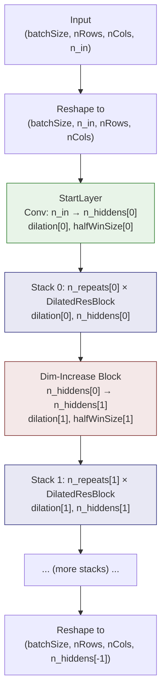

---
slug:5-dilated-resnet-variants
blog_type:normal
---


**DilatedResNet4Distance** 模块通过引入**空洞（膨胀）卷积**对标准 ResNet 架构进行了扩展，在不增加参数量或计算成本的前提下，实现了指数级扩大的感受野。作为 RaptorX-Contact 神经网络家族中架构截然不同的变体，它是专为捕捉蛋白质距离矩阵预测中的长程残基-残基依赖关系而量身定制的。

## 架构基础：感知膨胀的卷积层

该模块的核心创新在于向 1D 和 2D 卷积层引入了 `dilation` 参数。标准 ResNet 模块（`ResNet4Distance`）始终在膨胀率为 1 的情况下应用卷积，这意味着每个滤波器元素仅在空间上相邻的位置进行运算。而膨胀变体则在**卷积核元素之间插入了间隔**，因此窗口大小为 `k`、膨胀率为 `d` 的滤波器，其有效覆盖的感受野范围将扩展至 `k + (k-1)(d-1)` 个位置。

`ResConv1DLayer` 类接受一个 `dilation` 参数（出于向后兼容性默认值为 1）。当 `dilation > 1` 时，它会调用 Theano 的 `conv2d` 函数并传入 `filter_dilation=(1, dilation)`，将输入数据路由至空洞卷积路径；当 `dilation == 1` 时，则回退至标准卷积——这使得该层成为基础层的严格泛化。2D 变体 `ResConv2DLayer` 则通过 `filter_dilation=(dilation, dilation)` 应用对称膨胀，从而保持距离矩阵的结构对称性。

```python
# ResConv1DLayer 中的关键分支逻辑 (第 45-48 行)
if dilation > 1:
    conv_out = T.nnet.conv2d(in4conv2D, self.W, filter_shape=w_shp,
                             border_mode='half', filter_dilation=(1, dilation))
else:
    conv_out = T.nnet.conv2d(in4conv2D, self.W, filter_shape=w_shp,
                             border_mode='half')
```

权重初始化策略会根据激活函数进行适配：针对 ReLU 采用 **He 初始化**（正态分布，`scale = sqrt(2 / fan_in)`），针对其他激活函数则采用 **Xavier 初始化**（均匀分布，`bounds = sqrt(6 / fan_in)`），其中 1D 卷积的 `fan_in = n_in * windowSize`，2D 卷积的 `fan_in = n_in * wSize * wSize`。所有偏置项均初始化为零。

来源: [DilatedResNet4Distance.py](/DL4DistancePrediction2/DilatedResNet4Distance.py#L6-L75), [DilatedResNet4Distance.py](/DL4DistancePrediction2/DilatedResNet4Distance.py#L78-L154)

## 对比：标准卷积与空洞卷积

下表在卷积层级别精确隔离了两种模块变体之间的架构差异：

| 方面 | ResNet4Distance (标准) | DilatedResNet4Distance (空洞) |
|---|---|---|
| **ResConv1DLayer 签名** | `(rng, input, n_in, n_out, halfWinSize, activation, mask)` | `(rng, input, n_in, n_out, halfWinSize, dilation, activation, mask)` |
| **ResConv2DLayer 签名** | `(rng, input, n_in, n_out, halfWinSize, mask, activation)` | `(rng, input, n_in, n_out, halfWinSize, dilation, activation, mask)` |
| **conv2d 调用** | `T.nnet.conv2d(..., border_mode='half')` | `T.nnet.conv2d(..., border_mode='half', filter_dilation=(d, d))` |
| **感受野 (1D)** | `2 * halfWinSize + 1` | `(2 * halfWinSize + 1) + (2 * halfWinSize) * (d - 1)` |
| **感受野 (2D)** | `k × k` 其中 `k = 2*hws+1` | `k_eff × k_eff` 其中 `k_eff = k + (k-1)(d-1)` |
| **参数量** | 相同 | 相同 (膨胀不引入额外参数) |
| **网络级 halfWinSize** | 标量 (在所有堆栈间共享) | 列表 (每个堆栈一个值) |
| **网络级 dilation** | 不适用 | 列表 (每个堆栈一个膨胀率) |

<CgxTip>膨胀是一个纯粹的结构参数——它改变的是滤波器从输入中采样的*位置*，而非滤波器包含的*参数数量*。这就是为什么 dilation=2 的 3×3 滤波器与 dilation=1 的 3×3 滤波器具有相同的参数量，却能覆盖与标准 5×5 滤波器相同的区域。</CgxTip>

来源: [ResNet4Distance.py](/DL4DistancePrediction2/ResNet4Distance.py#L6-L71), [DilatedResNet4Distance.py](/DL4DistancePrediction2/DilatedResNet4Distance.py#L6-L75)

## DilatedResBlock：启用膨胀的残差单元

`DilatedResBlock` 类是膨胀变体独有的核心构建块。它仿照了 `ResBlockV23` 的结构（带有单个 BatchNorm 的预激活 ResNet），但会将 `dilation` 参数贯穿传递至块内的两个卷积层：

```
Input → ReLU → Conv(dilation) → [BatchNorm → ReLU → Conv(dilation)] + Shortcut → Output
```

具体而言，该块依次应用：(1) 对输入进行 ReLU 激活（预激活风格），(2) 以指定 `dilation` 率进行卷积，(3) 可选的批归一化与 ReLU 激活，(4) 以相同的 `dilation` 率进行第二次卷积，以及 (5) 加上快捷连接。当 `batchNorm=True` 时，会在两次卷积之间插入一个 `BatchNormLayer`。当 `n_out > n_in` 时，快捷路径会使用三种维度增加方法之一——**partial_projection**（默认）、**full_projection** 或 **identity**——来对齐通道维度。

与标准 `ResBlockV2`/`ResBlockV23` 的关键区别在于，`l1` 和 `l2` 卷积层均接收了 `dilation` 关键字参数，而标准块从不传递膨胀率（隐式使用率为 1）。

来源: [DilatedResNet4Distance.py](/DL4DistancePrediction2/DilatedResNet4Distance.py#L826-L920)

## DilatedResNet：多堆栈网络架构

`DilatedResNet` 类由 `DilatedResBlock` 单元组装成完整的网络，并被组织为**多堆栈架构**，其中每个堆栈都可以拥有独立的膨胀率和窗口大小。这种逐堆栈配置是关键的设计决策——不同的网络深度可以捕捉不同的空间尺度。

### 堆栈结构

该网络由三个等长的并行列表进行参数化：`n_hiddens`（每个堆栈的通道宽度）、`n_repeats`（每个堆栈的块重复次数）和 `dilation`（每个堆栈的膨胀率），以及 `halfWinSize`（每个堆栈的窗口大小）。架构遵循以下模式：



每个堆栈以一个**维度增加块**开始（当 `i > 0` 时），将通道数从 `n_hiddens[i-1]` 转换为 `n_hiddens[i]`，随后是 `n_repeats[i]` 个保持恒定通道宽度的重复块。起始层是一个从 `n_in` 到 `n_hiddens[0]` 的单次卷积。堆栈 `i` 中的所有块共享相同的 `dilation[i]` 和 `halfWinSize[i]`。

### 断言约束

构造函数强制执行严格的不变量：`len(n_hiddens) == len(n_repeats) == len(halfWinSize) == len(dilation)`，所有列表必须非空，且 `version` 必须以 `'DilatedResNet'` 开头。这些保证确保了每个堆栈都有一个明确定义的膨胀调度。

来源: [DilatedResNet4Distance.py](/DL4DistancePrediction2/DilatedResNet4Distance.py#L922-L1007)

## 共享基础设施：感知掩码的批归一化

标准模块和膨胀模块共享完全相同的 `batch_norm` 函数和 `BatchNormLayer` 类，它们实现了**感知掩码的批归一化**。这对于蛋白质结构预测至关重要，因为批次内的序列长度各异，较短的序列会被零填充至最大长度。若不使用掩码，填充的零将会破坏均值和方差统计量。

感知掩码的归一化过程：(1) 使用 `mask.sum()` 计算所有非填充元素的总和以得出有效元素数量，(2) 调整 2D 情况下双重计算的位置（即行掩码和列掩码同时生效的重叠区域），以及 (3) 在归一化后将零填充位置重置为零。对于 4D 张量（2D 卷积），掩码会同时应用于水平和垂直维度；对于 3D 张量（1D 卷积），则仅应用于列维度。

来源: [DilatedResNet4Distance.py](/DL4DistancePrediction2/DilatedResNet4Distance.py#L156-L243)

## 膨胀策略与感受野分析

膨胀架构的强大之处在于**层级膨胀调度**——为更深的堆栈分配逐渐增大的膨胀率。考虑一个具体示例，设定 `dilation=[1, 2, 4, 8]` 且 `halfWinSize=[1, 1, 1, 1]`（均为 3×3 滤波器）：

| 堆栈 | 膨胀率 | 滤波器大小 | 有效感受野 | 累积感受野 (近似) |
|---|---|---|---|---|
| 0 | 1 | 3×3 | 3×3 | 3 |
| 1 | 2 | 3×3 (空洞) | 5×5 | 7 |
| 2 | 4 | 3×3 (空洞) | 9×9 | 15 |
| 3 | 8 | 3×3 (空洞) | 17×17 | 31 |

指数级增长的膨胀调度在每个堆栈中将感受野翻倍，同时保持参数量与同等深度的标准 ResNet 完全一致。这对于蛋白质距离预测极具价值，因为在序列上相隔数百个位置的残基对可能在空间上非常接近——网络必须整合跨越广泛序列间隔的信息，而无需诉诸于不切实际的大型滤波器或激进的池化操作。

<CgxTip>`DilatedResNet` 中的 `halfWinSize` 列表允许将窗口大小变化与膨胀相结合。一个 `halfWinSize=2`（5×5 滤波器）且 `dilation=2` 的堆栈，能够实现与 `dilation=1` 的标准 9×9 滤波器相同的感受野，但其参数量仅为 25 对 81——减少了 69%。</CgxTip>

来源: [DilatedResNet4Distance.py](/DL4DistancePrediction2/DilatedResNet4Distance.py#L922-L984)

## 与距离预测模型的集成

`DilatedResNet` 在 [Model4DistancePrediction.py](/DL4DistancePrediction2/Model4DistancePrediction.py#L17) 中被导入，并与标准 `ResNet` 配合使用，使模型构建者在构建网络时可以在两种架构之间进行选择。共享的接口（相同的 `output` 张量形状，`params`、`paramL1`、`paramL2` 属性）使它们成为可直接替换的组件——唯一的配置差异是增加了 `dilation` 列表参数，以及将 `halfWinSize` 从标量切换为列表。

`version` 参数充当判别器：`DilatedResNet` 要求 `version.startswith('DilatedResNet')`，而标准 `ResNet` 则使用 `version` 在 `ResBlockV2`、`ResBlockV22` 和 `ResBlockV23` 变体之间进行选择。这种基于版本的派发模式，使得 `Model4DistancePrediction` 中的网络构建代码能够在两种模块类型之间保持清晰的分支结构。

来源: [Model4DistancePrediction.py](/DL4DistancePrediction2/Model4DistancePrediction.py#L1-L19), [DilatedResNet4Distance.py](/DL4DistancePrediction2/DilatedResNet4Distance.py#L922-L944)

## 类清单

`DilatedResNet4Distance.py` 中的完整类集合，按架构角色组织：

| 类 | 行数 | 角色 | 膨胀变体独有 |
|---|---|---|---|
| `ResConv1DLayer` | 6–75 | 支持膨胀的 1D 卷积 | ✗ (共享结构, ✓ 膨胀参数) |
| `ResConv2DLayer` | 78–154 | 支持膨胀的 2D 卷积 | ✗ (共享结构, ✓ 膨胀参数) |
| `batch_norm` / `BatchNormLayer` | 156–243 | 感知掩码的批归一化 | ✗ (完全相同) |
| `BottleneckBlock` | 350–449 | 1×1 → 3×3 → 1×1 瓶颈单元 | ✗ (从 ConvLayer 继承膨胀) |
| `ResBlockV2` | 450–543 | 预激活残差块 (2 个 BN) | ✗ (从 ConvLayer 继承膨胀) |
| `ResBlockV23` | 546–638 | 预激活残差块 (1 个 BN) | ✗ (从 ConvLayer 继承膨胀) |
| `ResBlockV22` | 641–733 | 预激活残差块 (2 个 BN, 变体) | ✗ (从 ConvLayer 继承膨胀) |
| `ResBlockV1` | 735–824 | 原始残差块 (卷积后 BN) | ✗ (从 ConvLayer 继承膨胀) |
| **`DilatedResBlock`** | **826–920** | **贯穿膨胀的残差块** | **✓** |
| **`DilatedResNet`** | **922–1007** | **带有逐堆栈膨胀的多堆栈网络** | **✓** |

来源: [DilatedResNet4Distance.py](/DL4DistancePrediction2/DilatedResNet4Distance.py#L1-L1007)

## 接下来去哪

膨胀架构是完整预测流水线的一部分。要了解它如何与更广泛的系统相连接：

- **[用于距离预测的深度 ResNet](4-deep-resnet-for-distance)** — 标准（非膨胀）的对应模块，有助于比较架构选择
- **[嵌入与配对表示](6-embedding-and-pair-representation)** — 输入特征在进入 ResNet 前是如何转换的
- **[模型构建与损失](10-model-building-and-loss)** — `DilatedResNet` 如何在完整模型中被实例化，以及损失函数如何驱动训练
- **[距离预测流水线](12-distance-prediction-pipeline)** — 从原始蛋白质特征到预测距离矩阵的端到端执行流程