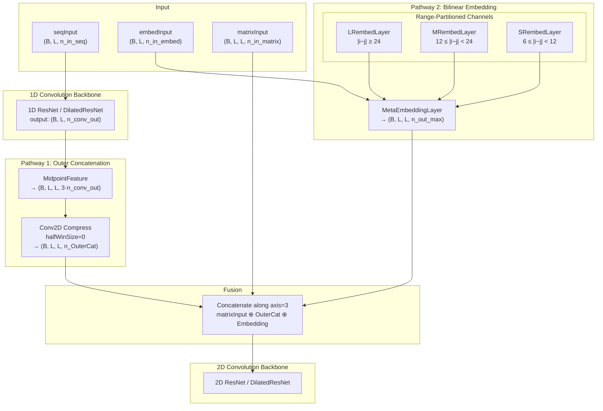

---
slug:6-embedding-and-pair-representation
blog_type:normal
---


RaptorX-Contact 采用**双通道对表示**策略，将逐残基（1D）特征转换为适用于残基间距离预测的逐残基对（2D）特征。第一个通道——**双线性嵌入**——学习一个可训练张量，通过双线性外积运算将独热残基编码映射为稠密的对表示，并为长、中、短程残基分离距离设置独立的通道。第二个通道——**带中点的外部拼接**——对残基 *i*、*j* 及其中点 *(i+j)/2* 的 1D 卷积输出进行确定性拼接，生成显式的对特征，随后通过 2D 卷积进行压缩。在进入 2D ResNet 骨干网络之前，这两个通道都会与预计算的对特征（共进化矩阵、接触势）进行融合。本页将剖析每一层的数学公式、张量形状代数、范围分区选择逻辑，以及它们在全模型中的集成方式。

来源: [EmbeddingLayer.py](DL4DistancePrediction2/EmbeddingLayer.py#L1-L169), [utils.py](DL4DistancePrediction2/utils.py#L1-L200), [Model4DistancePrediction.py](DL4DistancePrediction2/Model4DistancePrediction.py#L219-L324)

## 架构概述

嵌入与对表示子系统位于 1D 序列卷积骨干网络和 2D 矩阵卷积骨干网络之间。它的职责是弥合维度差距：将形状为 `(batchSize, seqLen, n_in)` 的逐残基特征转换为形状为 `(batchSize, seqLen, seqLen, n_out)` 的逐对特征。该系统实现了两种互补的策略，在与原始对输入特征拼接后，一同输入到 2D ResNet 中。



`ResNet4DistMatrix` 类负责统筹此组装过程。在 1D 序列卷积产生输出后，两个对表示通道会根据 `modelSpecs` 中的 `seq2matrixMode` 字典被条件性地激活。最终的 2D 输入是 `[matrixInput, OuterCat_output, Embedding_output]` 沿特征轴的拼接。

来源: [Model4DistancePrediction.py](DL4DistancePrediction2/Model4DistancePrediction.py#L269-L324), [config.py](DL4DistancePrediction2/config.py#L226-L228)

## EmbeddingLayer: 双线性对表示

`EmbeddingLayer` 是双线性嵌入通道的基础构建模块。它实现了一个**可学习的双线性形式**，通过形状为 `(n_in, n_in, n_out)` 的 3D 权重张量 **W**，将两个残基特征向量映射为稠密的对表示。

### 数学公式

给定形状为 `(B, L, n_in)` 的输入张量 **X**，其中每行对应一个残基位置的特征向量（通常是独热编码或独热×SS3 外积编码），该层计算如下：

1. **首次投影** — 通过 `tensordot(X, W, axes=1)` 计算 `out1 = X ⊙₁ W`，生成形状 `(B, L, n_in, n_out)`。此操作将 X 的最后一轴与 W 的第一轴进行缩并。
2. **为批量点积转置** — `out2 = out1.dimshuffle(0, 3, 1, 2)` → 形状 `(B, n_out, L, n_in)`。
3. **输入转置** — `input2 = X.dimshuffle(0, 2, 1)` → 形状 `(B, n_in, L)`。
4. **批量双线性乘积** — `out3 = batched_tensordot(out2, input2, axes=1)` → 形状 `(B, n_out, L, L)`。此操作缩并了 `n_in` 维度，有效地在每一对残基特征向量之间计算双线性形式。
5. **最终重塑** — `output = out3.dimshuffle(0, 2, 3, 1)` → 形状 `(B, L, L, n_out)`。

对于批次 b 中的单个残基对 (i, j)，输出为：**output[b, i, j, :] = X[b,i,:]ᵀ · W · X[b,j,:]**，这是一个由学习张量 W 参数化的双线性形式。这在结构上类似于计算残基嵌入之间的广义外积，但其交互权重是显式学习的，而非固定的。

### 权重初始化

权重张量 W 在 `[-√(6/(n_in² + n_out)), √(6/(n_in² + n_out))]` 范围内进行均匀采样初始化，这是一种适配 3D 张量结构的类 Xavier 方案。分母中的 `n_in` 平方项反映了该操作的双线性本质——有效的扇入包含了来自两个残基向量的贡献。

### 正则化

该层暴露出三个正则化量：`paramL1 = |W|.sum()`，`paramL2 = (W²).sum()`，以及 `pcenters = (mean(W, axis=[0,1])²).sum()`。`pcenters` 项对沿输出维度的所有嵌入向量的平方均值进行惩罚，促使学习到的嵌入以零为中心——不过该正则化项目前在主模型组装代码中已被注释掉。

来源: [EmbeddingLayer.py](DL4DistancePrediction2/EmbeddingLayer.py#L8-L42)

## MetaEmbeddingLayer: 范围分区多通道嵌入

`MetaEmbeddingLayer` 是一个组合包装器，它实例化**三个独立的 `EmbeddingLayer` 实例**——每个对应一个残基间分离距离范围——并使用二值选择掩码组合它们的输出。这种范围分区设计认识到，残基-残基相互作用的统计特性会因其序列分离距离的不同而产生显著差异。

### 范围边界与选择掩码

这三个范围由分离距离 6、12 和 24 的边界定义，产生四个区域（尽管近程 |i−j| < 6 被排除在嵌入之外）：

| 通道 | 范围名称 | 序列分离距离 | 选择矩阵 |
|---------|-----------|-------------------|-----------------|
| `LRembedLayer` | 长程 | \|i−j\| ≥ 24 | `Sep24Mat = triu(M, 24) + tril(M, −24)` |
| `MRembedLayer` | 中程 | 12 ≤ \|i−j\| < 24 | `Sep12Mat − Sep24Mat` |
| `SRembedLayer` | 短程 | 6 ≤ \|i−j\| < 12 | `Sep6Mat − Sep12Mat` |

选择矩阵由 `triu`（从偏移量 *k* 开始的严格上三角）和 `tril`（从偏移量 *−k* 开始的严格下三角）构建，以确保对称性：当 |i−j| 落在指定范围内时，掩码对于 (i,j) 和 (j,i) 均为 1。然后每个掩码通过 `dimshuffle('x', 0, 1, 'x')` 变为广播兼容的，以匹配 4D 输出张量。

### 可变输出维度

当 `n_out` 是一个序列（例如 `[4, 6, 12]`）时，每个通道接收不同的输出维度：`SRembedLayer` 获得 `n_out[0]=4`，`MRembedLayer` 获得 `n_out[1]=6`，`LRembedLayer` 获得 `n_out[2]=12`。这反映了一个设计洞察：**长程相互作用受益于更丰富的表示**，而短程相互作用则需要更少的参数。最终输出张量在所有通道上的宽度为 `n_out_max = max(n_out)`；具有较小 `n_out` 的通道在未使用的特征维度上进行零填充。

### 输出组装

输出是增量累加的：对于每个（层，选择）对，层的输出与其选择掩码进行逐元素相乘（将范围外的位置置零），然后通过 `T.inc_subtensor` 累加到输出张量的前 `l_n_out` 个特征通道中。这确保了在 |i−j| = 30 的位置 (i, j) 处，只有 `LRembedLayer` 的输出是活跃的；在 |i−j| = 15 处，只有 `MRembedLayer` 活跃；在 |i−j| = 8 处，只有 `SRembedLayer` 活跃。

<CgxTip>具有非对称输出维度 `[4, 6, 12]` 的范围分区嵌入是一个关键的架构归纳偏置：它为长程对（最难预测但结构信息最丰富）分配了 12 个通道，中程分配了 6 个，短程仅分配了 4 个。这与默认配置 `seq2matrixMode['SeqOnly'] = [4, 6, 12]` 相匹配。</CgxTip>

来源: [EmbeddingLayer.py](DL4DistancePrediction2/EmbeddingLayer.py#L44-L88), [config.py](DL4DistancePrediction2/config.py#L227)

## ProfileEmbeddingLayer: Softmax 归一化谱嵌入

`ProfileEmbeddingLayer` 封装了一个 `MetaEmbeddingLayer`，并附加了一个可学习的**缩放因子**和对输入谱在嵌入前应用的 **softmax 归一化**。该层专为嵌入连续值进化谱（PSSM）而非独热编码而设计。

### 处理流程

1. **缩放** — 输入乘以一个共享的标量权重 `W`（初始化为 1.0）。
2. **为 softmax 重塑** — 将形状为 `(B, L, n_in)` 的缩放后输入转置为 `(n_in, B, L)`，展平为 `(n_in, B·L)`，然后再转置为 `(B·L, n_in)`，以便 softmax 在每个残基位置的特征维度上独立操作。
3. **Softmax** — 应用 `T.nnet.softmax`，将原始谱值转换为每个位置上 `n_in` 个特征类别的概率分布。
4. **重塑回原状** — softmax 的输出被重塑为 `(B, L, n_in)`。
5. **MetaEmbeddingLayer** — 归一化后的输入被传递给 `MetaEmbeddingLayer` 进行实际的双线性对表示。

softmax 归一化确保了双线性嵌入的输入是一个有效的概率分布，这稳定了双线性计算并防止了由巨大 PSSM 值引起的梯度爆炸。然而，该层目前在模型中**已被弃用**——`ResNet4DistMatrix` 中的代码将其放在一个被注释掉的块中，并附有注释 "we do not use this profile embedding any more."。

来源: [EmbeddingLayer.py](DL4DistancePrediction2/EmbeddingLayer.py#L90-L112), [Model4DistancePrediction.py](DL4DistancePrediction2/Model4DistancePrediction.py#L311-L319)

## OuterConcatenate 和 MidpointFeature: 确定性对特征

虽然双线性嵌入学习对交互权重，**外部拼接**通道则提供了从 1D 特征到 2D 对特征的显式、确定性变换。该通道由 `seq2matrixMode` 中的 `OuterCat` 键控制。

### OuterConcatenate

`OuterConcatenate` 函数通过拼接位置 *i* 和 *j* 处的特征向量，将形状为 `(B, L, n_in)` 的 1D 特征张量转换为形状为 `(B, L, L, 2·n_in)` 的对张量：

**output[b, i, j, :] = [conv_out[b, i, :], conv_out[b, j, :]]**

这使用 `T.mgrid` 创建索引数组，然后对转置后的输入进行索引来实现。与双线性嵌入不同，此操作是**无参数的**——它仅复制并拼接现有特征。其优势在于保留了来自两个残基表示的完整信息，而无需通过学习的权重张量进行压缩。

### MidpointFeature

`MidpointFeature` 函数扩展了外部拼接，还包含了**中点位置** `(i+j)/2` 处的特征向量：

**output[b, i, j, :] = [conv_out[b, i, :], conv_out[b, (i+j)/2, :], conv_out[b, j, :]]**

这生成了一个形状为 `(B, L, L, 3·n_in)` 的张量。中点特征对距离预测特别具有信息量，因为序列空间中两个位置的中点处的残基通常在空间上与两者都很邻近，特别是在 β-折叠和环区。中点索引使用整数除法 `(i+j)//2`。

### 通过 2D 卷积压缩

中点特征随后通过一个 `halfWinSize=0`（即 1×1 逐点卷积）的 `Conv2D4DistMatrix` 层进行压缩，将特征维度从 `3·n_conv_out` 降低到 `seq2matrixMode['OuterCat']` 中指定的值（默认为 `[70, 35]`，意味着两个 1×1 卷积层分别输出 70 和 35 个通道）。在压缩之前，中点特征会使用 `mask_matrix` 进行掩码处理，将填充位置置零，以防止零填充区域产生噪声。

来源: [utils.py](DL4DistancePrediction2/utils.py#L19-L73), [Model4DistancePrediction.py](DL4DistancePrediction2/Model4DistancePrediction.py#L279-L293)

## 嵌入输入构建

嵌入通道接收一个专用的输入张量 `embedInput`，它在数据加载阶段由 `DataProcessor.LoadDistanceFeatures` 准备。其构建取决于嵌入模式：

| 模式 | 配置键 | 嵌入输入 | 每残基形状 |
|------|-----------|----------------|-------------------|
| 仅序列 | `SeqOnly` | 氨基酸的独热编码 | `(20,)` |
| 序列 + 二级结构 | `Seq+SS` | 独热 AA × SS3 的逐行外积 | `(20×3,)` = `(60,)` |

### SeqOnly 模式

当指定 `SeqOnly` 时，嵌入输入仅为 `config.SeqOneHotEncoding(sequence)` 生成的独热氨基酸编码，该函数使用 `AAVectors` 查找表将每个残基映射为一个 20 维的二进制向量。参数 `n_in_embed` 被设置为 20。

### Seq+SS 模式

当指定 `Seq+SS` 时，嵌入输入是独热编码（维度 20）和预测的 3 态二级结构概率（维度 3）的**逐行外积**，为每个残基生成一个 60 维的特征向量。这通过 `RowWiseOuterProduct(oneHotEncoding, d['SS3'])` 计算，该函数重塑这两个向量以创建它们的外积并将其展平：`(A[:, :, newaxis] * B[:, newaxis, :]).reshape(n, A.shape[1] * B.shape[1])`。

`Seq+SS` 编码为双线性嵌入提供了更丰富的输入，该输入已经编码了氨基酸-二级结构的相关性，使得学习到的张量 **W** 能够捕获更细微的交互模式（例如，位置 *i* 处的螺旋形成残基如何与位置 *j* 处的折叠形成残基相互作用）。

<CgxTip>`Seq+SS` 外积输入意味着 `EmbeddingLayer` 的有效 `n_in` 为 60，使得权重张量 W 的形状为 (60, 60, n_out)——这是一个庞大的参数量。而 `SeqOnly` 模式下 n_in=20 生成的 W 形状为 (20, 20, n_out)，参数量小了 9 倍。当训练数据或 GPU 内存受限时，请选择 `SeqOnly`。</CgxTip>

来源: [DataProcessor.py](DL4DistancePrediction2/DataProcessor.py#L130-L140), [config.py](DL4DistancePrediction2/config.py#L304-L326)

## 在 ResNet4DistMatrix 中的集成

`ResNet4DistMatrix` 类在其构造函数中集成了两个对表示通道。下表总结了条件激活逻辑及其对 2D 输入特征维度的贡献：

| 条件 | 通道 | 配置键 | 输出形状 | 对 `n_input2d` 的贡献 |
|-----------|---------|-----------|-------------|---------------------------|
| `'OuterCat' in seq2matrixMode` 且 `useSequentialFeatures` | MidpointFeature → Conv2D 压缩 | `OuterCat: [70, 35]` | `(B, L, L, 35)` | 35 |
| `embedInput is not None` 且 `'Seq+SS' in seq2matrixMode` | MetaEmbeddingLayer | `Seq+SS: [4, 6, 12]` | `(B, L, L, 12)` | 12 |
| `embedInput is not None` 且 `'SeqOnly' in seq2matrixMode` | MetaEmbeddingLayer | `SeqOnly: [4, 6, 12]` | `(B, L, L, 12)` | 12 |

最终的 2D 输入通过沿特征轴的拼接进行组装：

```python
input_2d = T.concatenate([matrixInput] + [layer.output for layer in seq2matrixLayers], axis=3)
n_input2d = n_in_matrix + sum([layer.n_out for layer in seq2matrixLayers])
```

`matrixInput` 已包含预计算的对特征（位置特征、立方根特征、CCMpred Z 分数、接触势），因此嵌入和外部拼接的输出会被追加到这些特征之后。组合后的张量随后进入 2D ResNet 或 DilatedResNet 骨干网络进行进一步处理。

### 参数收集

嵌入层的所有参数都被收集到模型的全局参数列表中。L1 和 L2 正则化项被累加。`pcenters` 正则化（促使嵌入中心趋向于零）目前在主模型中**已被注释掉**，正如源代码中所述：`"we do not use it temporarily"`。

来源: [Model4DistancePrediction.py](DL4DistancePrediction2/Model4DistancePrediction.py#L296-L324), [Model4DistancePrediction.py](DL4DistancePrediction2/Model4DistancePrediction.py#L384-L398)

## 对比: 双线性嵌入 vs. 外部拼接

| 方面 | 双线性嵌入 | 外部拼接 + 中点 |
|--------|-------------------|-------------------------------|
| **可训练参数** | 有 — 每个范围通道一个 3D 权重张量 W | 无（确定性）+ 用于压缩的逐点卷积 |
| **输入类型** | 独热编码 或 独热×SS3 (Seq+SS) | 1D ResNet 卷积输出（连续值） |
| **范围特化** | 每个范围 (LR/MR/SR) 有独立的 W 张量 | 单一统一表示 |
| **信息压缩** | 高 — 双线性形式将 (n_in, n_in) 压缩为 n_out | 低 — 拼接保留了完整向量 |
| **中点感知** | 无 — 仅考虑残基 i 和 j | 有 — 包含位置 (i+j)/2 的特征 |
| **输出维度 (默认)** | [SR, MR, LR] 为 [4, 6, 12] → 最大 12 | [70, 35] 压缩 → 35 |
| **计算开销** | tensordot 操作为 O(L² · n_in² · n_out) | 拼接为 O(L² · n_in) + 卷积为 O(L² · K) |
| **激活条件** | `embedInput is not None` | `useSequentialFeatures is True` |

这两个通道在**设计上是互补的**：双线性嵌入通过范围相关的参数化学习任务特定的交互模式，而外部拼接则保留了来自 1D 卷积骨干网络（包括进化谱特征）的完整信息，并添加了几何中点上下文。它们的组合为 2D ResNet 同时提供了学习到的和确定性的对信号。

来源: [EmbeddingLayer.py](DL4DistancePrediction2/EmbeddingLayer.py#L8-L88), [utils.py](DL4DistancePrediction2/utils.py#L19-L73), [Model4DistancePrediction.py](DL4DistancePrediction2/Model4DistancePrediction.py#L269-L324)

## 默认配置

默认的 `modelSpecs` 配置（来自 `config.InitializeModelSpecs`）如下设置嵌入和对表示：

```python
modelSpecs['seq2matrixMode'] = {}
modelSpecs['seq2matrixMode']['SeqOnly'] = [4, 6, 12]    # SR=4, MR=6, LR=12
modelSpecs['seq2matrixMode']['OuterCat'] = [70, 35]      # 两个 1×1 卷积层
modelSpecs['UseSequentialFeatures'] = True                # 激活 OuterCat 通道
modelSpecs['UseSS'] = True                                # 在序列特征中启用 SS3
```

当指定 `SeqOnly`（且不存在 `Seq+SS`）时，嵌入输入为 20 维的独热编码，分别为短、中、长程通道生成三个形状为 (20, 20, 4)、(20, 20, 6) 和 (20, 20, 12) 的权重张量。`OuterCat` 通道在经过两层 1×1 压缩后贡献 35 个特征。`config.py` 中的 `EmbeddingUsed()` 辅助函数在 `seq2matrixMode` 中存在 `SeqOnly` 或 `Seq+SS` 时返回 `True`。

来源: [config.py](DL4DistancePrediction2/config.py#L226-L258), [config.py](DL4DistancePrediction2/config.py#L304-L307)

## 后续步骤

嵌入和对表示层生成输入到矩阵卷积骨干网络的 2D 输入特征张量。要了解从原始蛋白质特征到嵌入输入的完整数据流，请参阅[输入特征规范](7-input-feature-specification)和[数据加载与处理](8-data-loading-and-processing)。有关处理这些输出的 1D 和 2D 卷积架构，请参阅[距离预测深度 ResNet](4-deep-resnet-for-distance)和[膨胀 ResNet 变体](5-dilated-resnet-variants)。有关模型如何端到端组装和训练的更多信息，请参阅[模型构建与损失](10-model-building-and-loss)。