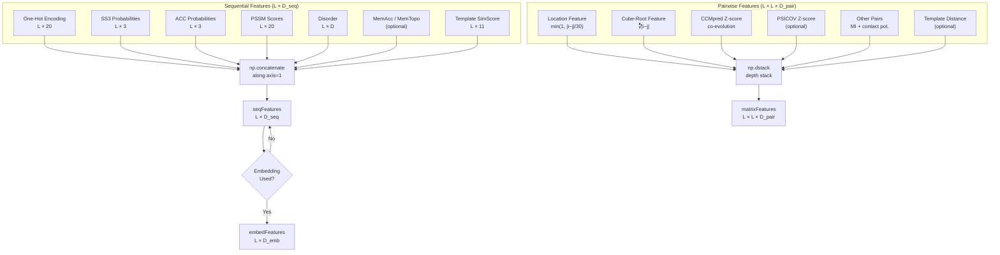
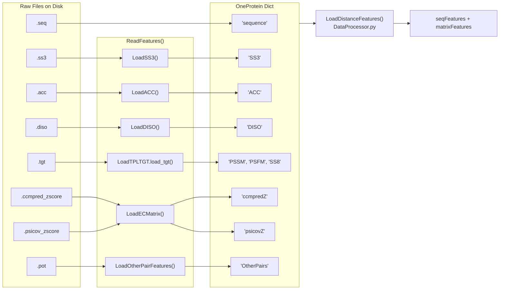

---
slug:7-input-feature-specification
blog_type:normal
---

RaptorX-Contact 从丰富的**序列**和**成对**输入特征中预测残基间距离（和接触）。理解有哪些可用特征、如何从磁盘加载它们，以及它们如何流入神经网络，对于任何使用此代码库的人来说都至关重要。本页编录了每个输入特征、其源文件格式、张量形状、控制它的配置标志，以及将它们组装成最终模型输入的装配逻辑。

## 特征架构一览

模型消耗两类输入——**序列特征**（每个残基一个向量）和**成对特征**（每个残基对一个向量）。序列特征沿特征轴拼接成单一的 `L × D_seq` 矩阵。成对特征沿深度堆叠成 `L × L × D_pair` 张量。可选地，**嵌入层**在序列特征与成对通道合并前，将其转换为成对表示。

来源: [DataProcessor.py](/DL4DistancePrediction2/DataProcessor.py#L111-L281), [config.py](/DL4DistancePrediction2/config.py#L236-L248)

## 序列特征（按残基）

序列特征描述了蛋白质链上单个残基的属性。每个特征都是形状为 `L × d` 的矩阵，其中 `L` 是序列长度，`d` 是特征维度。它们按列拼接以生成最终的 `seqFeatures` 矩阵。

### 特征清单

| # | 特征 | 字典中的键 | 维度 | 源文件 | 配置标志 | 默认值 |
|---|---------|-------------|-----------|-------------|-------------|---------|
| 1 | **One-Hot 氨基酸** | — (内联计算) | L × 20 | `.seq` | `UseSequentialFeatures` | `True` |
| 2 | **3-状态二级结构** | `SS3` | L × 3 | `.ss3` | `UseSS` | `True` |
| 3 | **溶剂可及性** | `ACC` | L × 3 | `.acc` | `UseACC` | `True` |
| 4 | **PSSM (位置特异性评分矩阵)** | `PSSM` | L × 20 | `.tgt` | `UsePSSM` | `True` |
| 5 | **无序概率** | `DISO` | L × D | `.diso` | `UseDisorder` | `False` |
| 6 | **膜可及性** | `MemAcc` | L × D | — | `UseMPSpecificFeatures` | off |
| 7 | **膜拓扑** | `MemTopo` | L × D | — | `UseMPSpecificFeatures` | off |
| 8 | **模板相似度得分** | `tplSimScore` | L × 11 | — | `UseTemplate` | off |

来源: [DataProcessor.py](/DL4DistancePrediction2/DataProcessor.py#L129-L187), [config.py](/DL4DistancePrediction2/config.py#L236-L248)

### One-Hot 氨基酸编码

主序列通过 `SeqOneHotEncoding()` 被编码为二进制的 `L × 20` 矩阵。每个残基被映射到 20 种标准氨基酸之一（按单字母码的字母顺序排列：A, R, N, D, C, Q, E, G, H, I, L, K, M, F, P, S, T, W, Y, V）。此编码**始终**作为第一个序列特征包含——它构成了嵌入层的基础，且永远不会被关闭。

来源: [config.py](/DL4DistancePrediction2/config.py#L314-L326)

### 3-状态二级结构 (SS3)

通过 `LoadSS3()` 从 `.ss3` 文件加载。该文件有 3 行头部；随后的每行包含残基名称和螺旋 (H)、折叠 (E) 和卷曲 (C) 的三个概率值。在每个位置上这些概率之和为 1。在序列特征拼接中，**SS3 始终紧接在 one-hot 编码之后**——此顺序很重要，因为嵌入层的 `Seq+SS` 模式会计算 one-hot 与 SS3 的外积。

来源: [ReadProteinFeatures.py](/DL4DistancePrediction2/ReadProteinFeatures.py#L15-L38)

### 溶剂可及性 (ACC)

通过 `LoadACC()` 从 `.acc` 文件加载。该文件有 5 行头部；每个数据行提供三个概率值（通常对应埋藏、中间和暴露状态）。仅提取前 3 列 (`line.split()[3:6]`)。

来源: [ReadProteinFeatures.py](/DL4DistancePrediction2/ReadProteinFeatures.py#L40-L62)

### 来自 HHM Profile 的 PSSM 和 PSFM

**位置特异性评分矩阵**（PSSM，L × 20）和**位置特异性频率矩阵**（PSFM，L × 20）源自存储在 `.tgt` 文件中的 HHpred/HHblits profile HMM。`LoadTPLTGT.load_tgt()` 函数解析此文件并返回包含键 `PSFM`、`PSSM` 和 `SS8` 的字典。在内部，HMM 发射分数通过 `2^(score)` 转换为概率，然后使用 Gonnet 替换矩阵添加伪计数，并将结果重新归一化。PSSM 计算为 `log2(PSFM) + HMMNull/1000`。只有 **PSSM** 被用作序列特征；PSFM 在数据字典中可用，但默认不追加到 `seqFeatures`。

来源: [ReadProteinFeatures.py](/DL4DistancePrediction2/ReadProteinFeatures.py#L267-L274), [LoadHHM.py](/Common/LoadHHM.py#L148-L190)

### 无序概率 (DISO)

通过 `LoadDISO()` 从 `.diso` 文件加载。该文件有 4 行头部；每行提供每个位置的无序概率值。**默认禁用** (`UseDisorder: False`)，但对于内在无序性有信息量的蛋白质可以启用。

来源: [ReadProteinFeatures.py](/DL4DistancePrediction2/ReadProteinFeatures.py#L64-L86), [config.py](/DL4DistancePrediction2/config.py#L240)

### 膜特异性与模板特征

**MemAcc** 和 **MemTopo** 是跨膜蛋白质的专用特征，由 `UseMPSpecificFeatures` 激活。**模板相似度得分**（`tplSimScore`，每个位置恰好 11 个特征）由 `UseTemplate` 激活，适用于有序列-模板比对可用时的同源建模场景。两者默认均关闭。

来源: [DataProcessor.py](/DL4DistancePrediction2/DataProcessor.py#L159-L185)

## 成对特征（按残基对）

成对特征捕获残基对之间的关系，并表示为 `L × L × d` 张量（每个特征一个通道）。它们通过 `np.dstack()` 沿深度堆叠成最终的 `matrixFeatures` 张量。

### 特征清单

| # | 特征 | 字典中的键 | 通道数 | 源文件 | 配置标志 | 默认值 |
|---|---------|-------------|----------|-------------|-------------|---------|
| 1 | **位置特征** | 从 `ccmpredZ` 形状计算 | 1 | — | 始终开启 | `True` |
| 2 | **立方根特征** | 从序列长度计算 | 1 | — | 始终开启 | `True` |
| 3 | **CCMpred Z-score** | `ccmpredZ` | 1 | `.ccmpred_zscore` | `UseCCM` | `True` |
| 4 | **PSICOV Z-score** | `psicovZ` | 1 | `.psicov_zscore` | `UsePSICOV` | `False` |
| 5 | **其他成对特征** | `OtherPairs` | D | `.pot` | `UseOtherPairs` | `True` |
| 6 | **模板距离** | `tplDistMatrix` | 可变 | — | `UseTemplate` | off |

来源: [DataProcessor.py](/DL4DistancePrediction2/DataProcessor.py#L190-L276), [config.py](/DL4DistancePrediction2/config.py#L241-L247)

### 位置特征

单通道 `L × L` 矩阵，编码归一化的序列间隔：`posFeature[i, j] = min(1, |i−j| / 30)`。间隔等于或超过 30 个残基的残基对饱和值为 1.0。此特征**始终包含**，并且是添加的第一个成对特征。它仅利用 `ccmpredZ` 矩阵来确定序列长度——其计算过程中不使用任何实际的共进化数据。

来源: [DataProcessor.py](/DL4DistancePrediction2/DataProcessor.py#L60-L76), [DataProcessor.py](/DL4DistancePrediction2/DataProcessor.py#L193-L195)

### 立方根特征

单通道 `L × L` 矩阵：`cbrtFeature[i, j] = ∛|i − j|`。立方根变换源于物理直觉，即蛋白质的半径与残基数量的立方根成正比，使得此特征成为残基间距离的几何先验。**始终包含**。

来源: [DataProcessor.py](/DL4DistancePrediction2/DataProcessor.py#L78-L86), [DataProcessor.py](/DL4DistancePrediction2/DataProcessor.py#L197-L198)

### CCMpred Z-score (共进化)

通过 `LoadECMatrix()` 从 `.ccmpred_zscore` 文件加载。这是**主要的共进化信号**——一个来自 CCMpred 直接耦合分析的 z-归一化接触分数对称 `L × L` 矩阵。为了内存效率，值存储为 `np.float16`。**默认启用** (`UseCCM: True`)。

来源: [ReadProteinFeatures.py](/DL4DistancePrediction2/ReadProteinFeatures.py#L140-L159), [ReadProteinFeatures.py](/DL4DistancePrediction2/ReadProteinFeatures.py#L276-L277)

### PSICOV Z-score (共进化, 可选)

使用相同的 `LoadECMatrix()` 解析器从 `.psicov_zscore` 加载的次要共进化矩阵。与 CCMpred（伪似然最大化）相比，PSICOV 使用不同的统计估计方法（稀疏逆协方差）。**默认禁用** (`UsePSICOV: False`)——仅当文件存在于磁盘且标志被设置时才加载。

来源: [ReadProteinFeatures.py](/DL4DistancePrediction2/ReadProteinFeatures.py#L279-L281), [config.py](/DL4DistancePrediction2/config.py#L247)

### 其他成对特征 (互信息 + 接触势)

通过 `LoadOtherPairFeatures()` 从 `.pot` 文件加载。此文件使用稀疏格式——每行包含两个从 1 开始的残基索引，后跟浮点特征值。该函数构造一个密集的 `L × L × D` 张量（对称），其中 `D` 是每行的值列数。这通常编码**互信息**和**接触势**项。**默认启用** (`UseOtherPairs: True`)。

来源: [ReadProteinFeatures.py](/DL4DistancePrediction2/ReadProteinFeatures.py#L161-L194), [ReadProteinFeatures.py](/DL4DistancePrediction2/ReadProteinFeatures.py#L283-L284)

### 基于模板的距离特征

当 `UseTemplate` 启用时，模板派生的距离矩阵被处理为成对特征。对于每种原子对类型 (CbCb, CgCg, CaCg, CaCa, NO)，计算一个**强度矩阵**：`strength = 3.5 / max(tplDist, 3.5)`，空缺编码为 `3.5/50`。强度及其平方均被追加（除非激活了 `TPLMemorySave` 模式，该模式省略平方）。此外，还从 CaCa 模板中添加一个**空缺标志矩阵**（无效条目的二进制指示器）。

来源: [DataProcessor.py](/DL4DistancePrediction2/DataProcessor.py#L225-L269)

## 嵌入层：序列到成对的转换

在 2D ResNet 处理成对特征之前，可选的**嵌入层**将序列特征转换为成对表示，然后与原始成对通道合并。

### 嵌入模式

| 模式 | 配置键 | 嵌入输入 | 转换 | 输出形状 |
|------|-----------|----------------|----------|-------------|
| **SeqOnly** | `seq2matrixMode['SeqOnly']` | One-hot 编码 (L × 20) | `MetaEmbeddingLayer` (学习到的 W) | L × L × [4,6,12] |
| **Seq+SS** | `seq2matrixMode['Seq+SS']` | RowWiseOuterProduct(oneHot, SS3) | `MetaEmbeddingLayer` (学习到的 W) | L × L × D |
| **OuterCat** | `seq2matrixMode['OuterCat']` | One-hot 编码 | `OuterConcatenate` (无参数) | L × L × 2×20 |

当 `Seq+SS` 模式激活时，one-hot 编码和 SS3 概率通过**行向外积**组合：对于每个残基 `i`，20 维的 one-hot 向量和 3 维的 SS3 向量产生一个 60 维向量 (`20 × 3 = 60`)。这种丰富的表示捕获了氨基酸/结构的相关性。

`MetaEmbeddingLayer` 应用**范围特异性嵌入**——为长程 (|i−j| ≥ 24)、中程 (12 ≤ |i−j| < 24) 和短程 (6 ≤ |i−j| < 12) 残基对提供独立的学习权重张量，通过上/下三角掩码进行选择。

来源: [DataProcessor.py](/DL4DistancePrediction2/DataProcessor.py#L134-L140), [EmbeddingLayer.py](/DL4DistancePrediction2/EmbeddingLayer.py#L8-L88), [utils.py](/DL4DistancePrediction2/utils.py#L63-L73), [utils.py](/DL4DistancePrediction2/utils.py#L93-L97)

## 特征加载流水线

下图展示了磁盘上的原始文件如何被解析到特征字典中，然后组装成模型就绪的张量：

`ReadProteinFeatures.py` 中的 `ReadFeatures()` 函数是核心 I/O 例程。它从特征目录读取单个蛋白质的所有文件，验证跨文件的序列一致性，并返回包含所有原始特征的字典。对于批处理，`ReadOneProteinFeatures.py` 封装此函数以加载多个特征集并将它们序列化为 PKL 文件。

来源: [ReadProteinFeatures.py](/DL4DistancePrediction2/ReadProteinFeatures.py#L197-L286), [ReadOneProteinFeatures.py](/DL4DistancePrediction2/ReadOneProteinFeatures.py#L18-L39)

## 默认特征配置

`config.py` 中的 `InitializeModelSpecs()` 函数建立默认的特征选择。下表展示了开箱即用的配置：

| 标志 | 值 | 效果 |
|------|-------|--------|
| `UseSequentialFeatures` | `True` | 包含 one-hot 编码 |
| `UseSS` | `True` | 追加 SS3 (L × 3) |
| `UseACC` | `True` | 追加 ACC (L × 3) |
| `UsePSSM` | `True` | 追加 PSSM (L × 20) |
| `UseDisorder` | `False` | 省略 DISO |
| `UseCCM` | `True` | 包含 CCMpred Z-score |
| `UseOtherPairs` | `True` | 包含 MI + 接触势 |
| `UsePSICOV` | `False` | 省略 PSICOV Z-score |
| `UsePriorDistancePotential` | `False` | 省略先验距离势 |
| `UseMPSpecificFeatures` | off | 省略膜特征 |
| `UseTemplate` | off | 省略模板特征 |

在默认配置下，**序列特征维度**为 `20 (oneHot) + 3 (SS3) + 3 (ACC) + 20 (PSSM) = 46`，**成对特征通道**为 `2 (location + cbrt) + 1 (ccmpred) + D (OtherPairs)`。

来源: [config.py](/DL4DistancePrediction2/config.py#L236-L257)

<CgxTip>添加新的序列特征时，你必须 (1) 在 `ReadProteinFeatures.py` 中添加加载器，(2) 将其存储在 `OneProtein` 字典中的唯一键下，(3) 在 `InitializeModelSpecs()` 中添加 `Use*` 标志，以及 (4) 在 `LoadDistanceFeatures()` 中将其追加到 `seqMatrices`。缺少任何步骤都将默认跳过该特征或在运行时导致崩溃。</CgxTip>

<CgxTip>成对特征 `OtherPairs`（`.pot` 文件）在磁盘上使用稀疏格式，但在内存中会扩展为密集的 L×L×D 张量。对于长序列，这可能会主导内存使用——如果遇到内存不足错误，请检查 `D`（每行的值列数）。</CgxTip>

## 接下来去哪

- 要全面详细了解数据加载流水线，请参阅[数据加载与处理](8-data-loading-and-processing)。
- 有关 HHM profile 解析内部机制（PSFM、PSSM 计算），请参阅 [HHM Profile 解析](9-hhm-profile-parsing)。
- 要查看这些特征如何输入神经网络架构，请参阅[嵌入与成对表示](6-embedding-and-pair-representation)和[用于距离预测的深度 ResNet](4-deep-resnet-for-distance)。