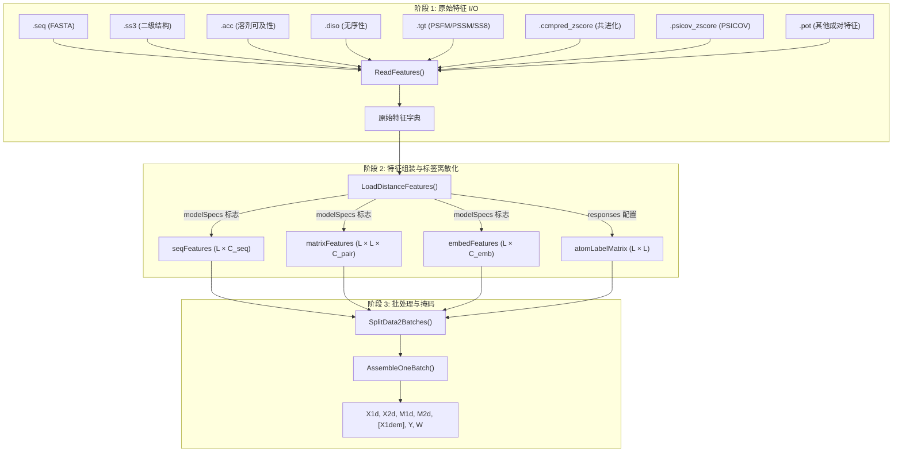

---
slug:8-data-loading-and-processing
blog_type:normal
---


RaptorX-Contact 实现了一个三阶段的数据流水线，将磁盘上的原始单蛋白特征文件转换为经过填充和批处理的 NumPy 张量，以供基于 Theano 的神经网络使用。该流水线涵盖**原始特征 I/O**（[ReadProteinFeatures.py](DL4DistancePrediction2/ReadProteinFeatures.py)）、**特征组装与标签离散化**（[DataProcessor.py](DL4DistancePrediction2/DataProcessor.py)）以及**带掩码的批处理构建**（[DataProcessor.py](DL4DistancePrediction2/DataProcessor.py#L558-L667)）。配置层（[config.py](DL4DistancePrediction2/config.py)）控制着哪些特征处于激活状态、距离如何离散化为区间，以及基于范围的样本权重如何分配。

来源: [ReadProteinFeatures.py](DL4DistancePrediction2/ReadProteinFeatures.py#L1-L339), [DataProcessor.py](DL4DistancePrediction2/DataProcessor.py#L1-L337), [config.py](DL4DistancePrediction2/config.py#L1-L329)

## 流水线架构

端到端的数据流经过三个边界清晰的阶段，每个阶段都会生成结构化程度逐步提升的蛋白质输入数据表示：



**阶段 1** 从单蛋白特征目录中读取各个平面文件，验证跨文件的序列一致性，并检查 NaN 污染。**阶段 2** 将选定的序列特征和成对特征拼接为统一矩阵，应用距离离散化以生成分类标签，并计算派生的位置特征。**阶段 3** 按序列长度将蛋白质分组为对 GPU 友好的批次，对较短的序列进行零填充至批次最大长度，并构建二进制掩码张量，以便网络能忽略填充位置。

来源: [ReadProteinFeatures.py](DL4DistancePrediction2/ReadProteinFeatures.py#L197-L286), [DataProcessor.py](DL4DistancePrediction2/DataProcessor.py#L111-L337), [DataProcessor.py](DL4DistancePrediction2/DataProcessor.py#L558-L667)

## 阶段 1: 原始特征文件读取器

`ReadProteinFeatures` 模块为每种输入模态提供了专用的解析器。所有解析器共享一个通用契约：它们接受一个文件路径和可选的序列验证参数，返回一个 NumPy 数组，并在遇到 NaN 污染时中止执行。

### 文件格式解析器

| 解析器函数 | 文件后缀 | 输出形状 | 描述 |
|---|---|---|---|
| `LoadSS3` | `.ss3` | (L, 3) | 3 状态二级结构概率（螺旋、折叠、卷曲） |
| `LoadACC` | `.acc` | (L, 3) | 溶剂可及性概率（来自行字段的 3 列） |
| `LoadDISO` | `.diso` | (L, variable) | 无序性预测概率 |
| `LoadProfile` | `.tgt` (通过 `LoadTPLTGT`) | PSFM (L,20), PSSM (L,20), SS8 (L,8) | 位置特异性频率/评分矩阵 + 8 状态 SS |
| `LoadECMatrix` | `.ccmpred_zscore` / `.psicov_zscore` | (L, L) | Z-score 标准化的共进化耦合矩阵 |
| `LoadOtherPairFeatures` | `.pot` | (L, L, K) | 稀疏成对特征（互信息 + 接触势），加载时进行对称化 |

每个解析器会跳过固定数量的头部行（SS3 为 3 行，ACC 为 5 行，DISO 为 4 行），按残基解析数值字段，并在提供参考序列时断言序列长度的一致性。`LoadECMatrix` 解析器为节省内存使用 `np.float16` 读取密集的 L×L 矩阵，然后向上转型为 `np.float32` 后验证是否存在 NaN。`LoadOtherPairFeatures` 解析器读取稀疏的索引-值格式，并将其具体化为密集的 L×L×K 张量，通过赋值 `allPairs[j,i] = allPairs[i,j]` 进行显式对称化。

来源: [ReadProteinFeatures.py](DL4DistancePrediction2/ReadProteinFeatures.py#L15-L194)

### ReadFeatures 协调器

`ReadFeatures(p, DataSourceDir)` 是核心协调器，从目录 `DataSourceDir` 中读取单个蛋白质 `p` 的**所有**特征文件。它构建一个字典，包含键 `name`、`sequence`、`SS3`、`ACC`、`DISO`、`PSFM`、`PSSM`、`SS8`、`ccmpredZ`，以及可选的 `psicovZ` 和 `OtherPairs`。序列首先从 `.seq` FASTA 文件中读取，然后传递给每个后续解析器进行验证。PSFM/PSSM/SS8 通过 `LoadTPLTGT.load_tgt()` 从 `.tgt` 文件加载，随后对所有三个矩阵进行 NaN 检查。

来源: [ReadProteinFeatures.py](DL4DistancePrediction2/ReadProteinFeatures.py#L197-L286)

### 批量读取: ReadOneProteinFeatures 与 main

批量特征读取存在两个入口点。`ReadProteinFeatures.py` 中的 `main()` 函数读取蛋白质列表文件，遍历名称并按 `featureMetaDir + 'feat_' + proteinName + '_contact/'` 构建单蛋白目录，对每个蛋白调用 `ReadFeatures()`，并将完整列表序列化为单个 PKL 文件。`ReadOneProteinFeatures.py` 提供了一个更简单的 CLI，从多个特征目录中读取单个蛋白质，并将特征字典列表（每个目录一个）保存到 `<proteinName>.distanceFeatures.pkl`。

来源: [ReadOneProteinFeatures.py](DL4DistancePrediction2/ReadOneProteinFeatures.py#L1-L45), [ReadProteinFeatures.py](DL4DistancePrediction2/ReadProteinFeatures.py#L295-L338)

## 阶段 2: 特征组装与标签离散化

`LoadDistanceFeatures(files, modelSpecs, forTrainValidation)` 是关键函数，将原始特征 PKL 文件列表转换为已处理的蛋白质字典，以备批处理使用。它对每个蛋白质分三个阶段操作：**序列特征拼接**、**成对特征堆叠**和**标签矩阵生成**。

### 序列特征组装

序列特征是沿通道轴拼接的 1D 单残基向量。组装顺序是固定且重要的：

1. 主序列的 **独热编码** (L × 20)，始终通过 `config.SeqOneHotEncoding()` 包含
2. **SS3** (L × 3) — 若 `modelSpecs['UseSS']` 为 True
3. **ACC** (L × 3) — 若 `modelSpecs['UseACC']` 为 True
4. **PSSM** (L × 20) — 若 `modelSpecs['UsePSSM']` 为 True
5. **DISO** (L × variable) — 若 `modelSpecs['UseDisorder']` 为 True
6. **MemAcc / MemTopo** — 若 `modelSpecs['UseMPSpecificFeatures']` 为 True（膜蛋白特征）
7. **模板相似度得分** (L × 11) — 若 `modelSpecs['UseTemplate']` 为 True

结果为 `seqFeature = np.concatenate(seqMatrices, axis=1)`，其数据类型为 `np.float32`，存储在键 `seqFeatures` 下。

来源: [DataProcessor.py](DL4DistancePrediction2/DataProcessor.py#L111-L187)

### 成对特征组装

成对特征是沿通道轴使用 `np.dstack()` 堆叠的 2D 单残基对矩阵。始终包含两个**派生位置特征**：

- **LocationFeature**: `posFeature[i,j] = min(1, |i−j| / 30.0)` — 归一化并截断至 1.0 的序列分离度，通过对角偏移迭代而非双重循环高效实现
- **CubeRootFeature**: `cbrtFeature[i,j] = ∛|i−j|` — 残基分离距离的立方根，与蛋白质的物理半径相关

额外的成对特征根据 `modelSpecs` 标志有条件地追加：

| 特征 | 键 | 标志 | 每通道形状 |
|---|---|---|---|
| CCMpred Z-score | `ccmpredZ` | `UseCCM` | (L, L, 1) |
| PSICOV Z-score | `psicovZ` | `UsePSICOV` | (L, L, 1) |
| 互信息 + 接触势 | `OtherPairs` | `UseOtherPairs` | (L, L, K) |
| 模板距离矩阵 | `tplDistMatrix` | `UseTemplate` | (L, L, 2) 每原子对 |

使用模板信息时，每种原子对类型（CbCb, CgCg, CaCg, CaCa, NO）会贡献一个**强度矩阵**，计算方式为 `3.5 / max(tplDist, 3.5)`（无效条目映射为 `3.5/50 ≈ 0.07`），并在 `TPLMemorySaveMode` 未激活时加上其逐元素平方。来自 CaCa 通道的二进制**标志矩阵**指示哪些条目因空位或无序性而无效。

来源: [DataProcessor.py](DL4DistancePrediction2/DataProcessor.py#L190-L276), [DataProcessor.py](DL4DistancePrediction2/DataProcessor.py#L60-L86)

### 嵌入特征

若 `config.EmbeddingUsed(modelSpecs)` 返回 True，则会为嵌入层准备一个额外的 `embedFeatures` 矩阵。存在两种模式：

- **SeqOnly**: `embedFeatures = oneHotEncoding` (L × 20)
- **Seq+SS**: `embedFeatures = RowWiseOuterProduct(oneHotEncoding, SS3)` (L × 60) — 逐行外积将序列和二级结构信息组合成更丰富的单残基表示

来源: [DataProcessor.py](DL4DistancePrediction2/DataProcessor.py#L134-L140), [utils.py](DL4DistancePrediction2/utils.py#L93-L97)

### 标签离散化

在训练和验证阶段，原生 `atomDistMatrix` 会根据 `modelSpecs['responses']` 中的每个响应规范转换为标签矩阵。响应字符串的格式为 `<LabelName>_<LabelType>`（例如 `CbCb_Discrete25C`）。支持三种标签类型族：

| 标签类型 | 处理方式 | 输出 |
|---|---|---|
| `Discrete{N}C` / `Discrete{N}CPlus` | 使用 `config.distCutoffs[subType]` 的 `DistanceUtils.DiscretizeDistMatrix()` | 整数区间索引 (L × L) |
| `LogNormal` | `DistanceUtils.LogDistMatrix()` | log(distance)，截断至 −1 (L × L) |
| `Normal` | 直接使用原始距离矩阵 | 浮点距离 (L × L) |

`DiscretizeDistMatrix` 函数使用 `np.digitize()` 对距离进行分箱。当子类型以 `Plus` 结尾时，无效距离（表示为 −1）会被分配到超出最大距离区间的**独立区间**；否则，它们将与最大距离区间**合并**。HB 和 Beta 配对响应作为二进制矩阵处理，完全绕过离散化。

来源: [DataProcessor.py](DL4DistancePrediction2/DataProcessor.py#L283-L322), [DistanceUtils.py](DL4DistancePrediction2/DistanceUtils.py#L156-L170)

## 标签分布与权重计算

在特征和标签组装完成后，`CalcLabelDistributionAndWeight(data, modelSpecs)` 计算经验标签分布并推导出每个标签、每个范围的权重。这对于处理距离预测中严重的类别不平衡（大多数残基对相距较远）至关重要。

### 基于范围的加权

残基对按序列分离度 |i−j| 划分为四个范围，边界阈值定义在 `config.RangeBoundaries = [24, 12, 6, 2]` 中：

| 范围 | 分离度 | 默认权重 | 依据 |
|---|---|---|---|
| 长程 | ≥ 24 | 3.0 | 对 3D 结构最有价值；最难预测 |
| 中程 | 12–23 | 2.5 | 包含中等信息量 |
| 短程 | 6–11 | 1.0 | 从局部序列较易预测 |
| 近程 | 2–5 | 0.5 | 主要由骨架几何决定 |

这些基础范围权重进一步受距离区间权重调节。对于 3 区间情况（0–8Å 接触，8–15Å 中距，>15Å 或无效），`weight43C` 表提供了五种偏置预设（`low`、`mid`、`high`、`veryhigh`、`exhigh`），逐步提高接触的权重。例如，当 `LRbias='mid'` 时，长程接触接收权重 20.5，而长程非接触接收权重 1.0——比例为 20:1。

来源: [DataProcessor.py](DL4DistancePrediction2/DataProcessor.py#L345-L433), [config.py](DL4DistancePrediction2/config.py#L140-L167)

### 标签权重矩阵计算

`CalcLabelWeightMatrix(LabelMatrix, modelSpecs)` 为单个蛋白质的标签矩阵生成逐条目权重矩阵。它使用带有对角偏移的 `np.triu`/`np.tril` 构建四个布尔范围掩码（LRmask, MRmask, SRmask, NRmask），然后组合它们：

```
labelWeightMatrix = LRmask * LRw + MRmask * MRw + SRmask * SRw + NRmask * NRw
```

对于离散标签，`LRw = wMatrix[0][LabelMatrix[response]]` — 每个条目的权重通过其标签索引从权重表中查找。对于连续标签，权重是每个范围的标量，且无效距离（标签 < 0）的条目被置零以从损失中排除。

来源: [DataProcessor.py](DL4DistancePrediction2/DataProcessor.py#L440-L487)

## 阶段 3: 批处理与掩码

### SplitData2Batches

`SplitData2Batches(data, numDataPoints, modelSpecs)` 将蛋白质分组为能适应 GPU 内存限制的批次。它首先**按序列长度降序排列蛋白质**，然后贪婪地将连续的蛋白质分配到同一批次。每批次的序列数计算如下：

```
numSeqs = min(remaining_proteins, max(1, numDataPoints / currentSeqLen²))
```

这确保每批次的残基对数据点总数（约 `numSeqs × seqLen²`）保持在 `numDataPoints` 附近，从而平衡不同大小蛋白质对 GPU 的利用率。

来源: [DataProcessor.py](DL4DistancePrediction2/DataProcessor.py#L635-L667)

### AssembleOneBatch

`AssembleOneBatch(data, modelSpecs)` 将蛋白质字典列表转换为填充后的 NumPy 数组元组。填充策略为**右/底部对齐**：较短的序列在张量的起始处（左上方）进行零填充，因此有效数据占据右下方区域。

输出元组包含：

| 索引 | 变量 | 形状 | 描述 |
|---|---|---|---|
| 0 | `X1d` | (N, maxL, C_seq) | 填充后的序列特征 |
| 1 | `X2d` | (N, maxL, maxL, C_pair) | 填充后的成对特征 |
| 2 | `M1d` | (N, maxL − minL) | 1D 掩码：有效位置为 1，填充位置为 0 |
| 3 | `M2d` | (N, maxL − minL, maxL) | 2D 掩码：有效对位置为 1 |
| 4 | `X1dem` | (N, maxL, C_emb) | 填充后的嵌入特征（若存在） |
| 5+ | `Y[k]` | (N, maxL, maxL) | 填充后的标签矩阵（每个响应一个） |
| 5+len(Y)+ | `W[k]` | (N, maxL, maxL) | 填充后的权重矩阵（每个响应一个） |

1D 掩码 `M1d` 是一个扁平向量，标记 `maxL − minL` 个填充位置中哪些是有效的。2D 掩码 `M2d` 将其扩展到成对域。标签和权重矩阵被放置在各自填充张量的右下方区域，与特征对齐方式相呼应。

<CgxTip>右对齐填充约定（有效数据在右下方）对正确的掩码构建至关重要：`M1d[j, maxSeqLen-seqLen:].fill(1)` 从实际数据起始的偏移处开始设置有效标志。所有下游网络操作必须遵守这些掩码，以避免通过零填充位置传播信号。</CgxTip>

来源: [DataProcessor.py](DL4DistancePrediction2/DataProcessor.py#L558-L632)

### 批次权重归一化

`CalcAvgWeightPerBatch(batches, modelSpecs)` 从每个批次的权重矩阵中采样一个边界框（使用 `SampleBoundingBox`），并计算跨批次每个响应的平均总权重。该平均值存储为 `modelSpecs['batchWeightBase']`，用于归一化不同大小批次的权重幅度，防止因损失缩放不均导致的训练不稳定。

来源: [DataProcessor.py](DL4DistancePrediction2/DataProcessor.py#L669-L694)

## 原生距离矩阵加载

两个函数支持加载用于评估的真实距离矩阵：`LoadNativeDistMatrixFromFile(filename)` 从显式路径加载，而 `LoadNativeDistMatrix(name, location)` 将路径构建为 `location + name + '.atomDistMatrix.pkl'`。两者均使用 `cPickle` 反序列化，若基于名称的变体缺少文件则返回 `None`（并发出警告），若显式路径变体缺少文件则中止执行。

来源: [DataProcessor.py](DL4DistancePrediction2/DataProcessor.py#L88-L109)

## 通过模型规格控制特征

由 `config.InitializeModelSpecs()` 初始化的 `modelSpecs` 字典充当核心特征开关。默认配置启用：

| 标志 | 默认值 | 控制的特征 |
|---|---|---|
| `UseSequentialFeatures` | True | 1D 特征的主开关 |
| `UseSS` | True | 3 状态二级结构 |
| `UseACC` | True | 溶剂可及性 |
| `UsePSSM` | True | 位置特异性评分矩阵 |
| `UseDisorder` | False | 无序性预测 |
| `UseCCM` | True | CCMpred 共进化矩阵 |
| `UseOtherPairs` | True | 互信息 + 接触势 |
| `UsePSICOV` | False | PSICOV 共进化矩阵 |
| `UsePriorDistancePotential` | False | 先验距离势（已弃用） |
| `UseTemplate` | 缺失 | 基于模板的距离特征 |
| `UseMPSpecificFeatures` | 缺失 | 膜蛋白特征（MemAcc, MemTopo） |

`seq2matrixMode` 子字典控制嵌入：若包含键 `'SeqOnly'` 或 `'Seq+SS'`，则 `EmbeddingUsed()` 返回 True 并生成 `embedFeatures`。`'OuterCat'` 模式控制网络中一条独立的外部拼接路径。

来源: [config.py](DL4DistancePrediction2/config.py#L181-L259), [config.py](DL4DistancePrediction2/config.py#L304-L312)

## 预测流水线中的数据流

在推理模式下，`RunDistancePredictor2.PredictDistMatrix()` 演示了完整的流水线集成：它加载模型 PKL 文件，调用 `DataProcessor.LoadDistanceFeatures()` 并设 `forTrainValidation=False`（跳过标签生成），通过随机抽查验证特征维度是否符合模型预期，调用 `DataProcessor.SplitData2Batches()` 构建预测批次，将每个批次送入 Theano 编译的预测函数，并通过求和与平均跨模型累积概率矩阵。对于对称的原子对类型（CbCb, CaCa, CgCg, Beta），最终预测概率矩阵通过与其转置取平均进行对称化。

来源: [RunDistancePredictor2.py](DL4DistancePrediction2/RunDistancePredictor2.py#L37-L199)

---

**下一步阅读**: 本页的原始文件解析器直接连接到 [HHM Profile Parsing](9-hhm-profile-parsing) 中记录的 HHM 概况格式。由 `AssembleOneBatch` 生成的特征张量流入 [Deep ResNet for Distance](4-deep-resnet-for-distance) 和 [Embedding and Pair Representation](6-embedding-and-pair-representation) 中描述的模型。标签离散化区间在 [Configuration and Distance Bins](16-configuration-and-distance-bins) 中配置，此处计算的权重矩阵由 [Model Building and Loss](10-model-building-and-loss) 中的损失函数消费。