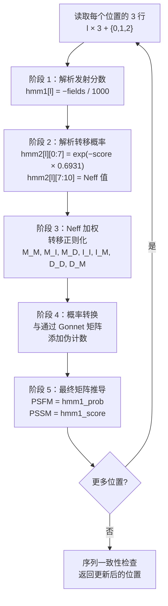
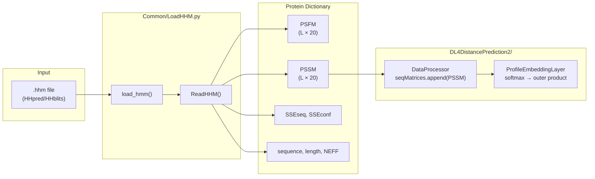

---
slug:9-hhm-profile-parsing
blog_type:normal
---


**HHM 配置文件解析器**（`Common/LoadHHM.py`）是 RaptorX-Contact 摄取由 HHpred/HHblits 生成的 `.hhm` 文件中进化信息的唯一入口。它通过 Gonnet 替换矩阵应用伪计数校正后，将原始 HMM 发射分数和转移概率转换为两个可供下游使用的矩阵——**PSFM**（位置特异性频率矩阵）和 **PSSM**（位置特异性得分矩阵）。在生成的矩阵中，每个残基位置均按单字母码的字母顺序编码 20 个氨基酸通道，使得输出结果能够直接与神经网络流水线中的其他序列特征进行堆叠。

来源：[LoadHHM.py](Common/LoadHHM.py#L1-L15)

## HHM 文件格式与段落

由 HHpred/HHblits 软件包生成的 `.hhm` 文件是一个纯文本的 profile HMM 文件，具有明确定义的段落结构。`load_hmm()` 函数执行单趟线性扫描，基于前缀匹配将每一行分派给相应的段落处理器。文件首行必须以 `HHsearch` 开头；否则解析器将立即拒绝该文件。下表总结了所有被解析的段落及其填充的字典键：

| 段落前缀 | 字典键 | 数据类型 | 描述 |
|---|---|---|---|
| `NAME ` | `name` | `str` | 蛋白质标识符 |
| `DATE ` | `DateCreated` | `str` | 文件创建时间戳 |
| `NEFF ` | `NEFF` | `np.float32` | 有效序列同源物数量 |
| `LENG ` | `length` | `np.int32` | 序列长度 |
| `>ss_pred` | `SSEseq` | `str` | 预测的 8 状态二级结构（C→L 重映射） |
| `>ss_conf` | `SSEconf` | `list[np.int16]` | 各位置的 SS 置信度得分 |
| `><name>` | `sequence` | `str` | 完整的氨基酸序列 |
| `#` + `NULL` + `HMM` | `hmm1`, `hmm2`, `hmm1_prob`, `hmm1_score`, `PSFM`, `PSSM` | `np.ndarray` | 发射与转移 HMM 数据（见下文） |

解析完成后，该函数会验证所有**必需段落**——`name`、`length`、`sequence`、`NEFF`、`hmm1`、`hmm2`、`hmm1_prob`、`hmm1_score`、`PSFM`、`PSSM`、`DateCreated`——是否均存在，若缺失任何一项则报错退出。这种严格验证可防止静默损坏或格式不兼容的输入文件混入。

来源：[LoadHHM.py](Common/LoadHHM.py#L207-L317)

## 氨基酸字母表与排序

一个关键的架构细节是氨基酸的**双重排序系统**。HHM 文件的发射分数按单字母码的字母顺序排列，而 Gonnet 替换矩阵则采用三字母码的字母顺序。解析器维护了显式映射表来弥合这一差异：

- **`AAOrderBy1Letter`** — 从单字母字母表位置映射到标准的 20 氨基酸索引，稀有残基 B 和 Z 映射到索引 20（排除在 20 个有效列之外）。
- **`AAOrderBy3Letter`** — 从三字母字母表位置映射到标准索引。
- **`AA1LetterOrder23LetterOrder`** / **`AA3LetterOrder21LetterOrder`** — 双向交叉排序映射，在伪计数计算期间用于正确索引 Gonnet 矩阵。

**有效氨基酸**集合定义为 20 种标准残基：`{A, R, N, D, C, E, Q, G, H, I, L, K, M, F, P, S, T, W, Y, V}`。在一致性检查期间，序列中遇到的任何非标准残基均被视为 `X`。

来源：[LoadHHM.py](Common/LoadHHM.py#L22-L61)

## ReadHHM 核心算法

`ReadHHM()` 函数是解析器的计算核心。给定行数组、起始位置和蛋白质长度，它读取包含 4 行头部及随后每个残基位置 **3 行**（发射分数、转移分数 + Neff、一致性行）的 HMM 块。对于每个位置 `l`，算法依次执行以下五个阶段：



### 阶段 1 — 发射分数解析

每个残基的首行 HMM 包含 23 个由空格分隔的字段：氨基酸字母、残基索引、20 个发射分数和一个末尾字段。分数以负整数存储，单位为 1/1000 比特，因此解析器将其取负并除以 1000 以获得以 log₂ 为标度的分数：`hmm1[l] = −int32(fields[2:22]) / 1000.0`。星号通配符 `*`（代表无穷大）在解析前被替换为 `99999`。

### 阶段 2 — 转移概率解析

每个残基的第二行编码了 7 个转移分数（M→M, M→I, M→D, I→M, I→I, D→M, D→D），随后是 3 个 Neff 值（匹配、插入、删除）。转移分数通过 `exp(−score/1000 × 0.6931)` 转换为概率，其中 `0.6931 ≈ ln(2)` 用于将 log₂ 空间转换为自然对数空间。Neff 值直接按 `int32/1000.0` 解析。

### 阶段 3 — Neff 加权转移正则化

原始转移概率使用带有类狄利克雷伪计数的 Neff 加权平均进行正则化。对于匹配状态转移，正则化强度 `rm = 0.1` 与先验 `{0.6, 0.2, 0.2}`（对应 {M_M, M_I, M_D}）配合使用。对于插入和删除状态，`ri = rd = 0.1`，先验分别为 `{0.75, 0.25}` 和 `{0.75, 0.25}`：

```
hmm2[l][M_M] = (Neff_M × raw_M_M + rm × 0.6) / (rm + Neff_M)
```

这防止了在具有少量同源物的位置出现零概率转移，同时在充分采样的位置保留观测到的分布。

来源：[LoadHHM.py](Common/LoadHHM.py#L99-L146)

## 伪计数校正与矩阵推导

### 阶段 4 — 伪计数添加

原始发射概率（通过 `2^(hmm1[l])` 计算并重新归一化至总和为 1）使用 **Gonnet 250 替换矩阵**进行校正，以解释未观测到的氨基酸替换。对于每个位置 `l` 和目标氨基酸 `j`：

1. 计算 Gonnet 加权背景：`g[j] = Σ_k hmm1_prob[l,k] × gonnet[3letterOrder(k), 3letterOrder(j)] × 2^(−HMMNull[j]/1000)`
2. 将 `g` 重新归一化至总和精确为 1。
3. 使用 Neff 相关加权进行混合：`hmm1[l] = ((Neff−1) × hmm1_prob[l] + g × 10) / (Neff−1 + 10)`

`HMMNull` 数组提供背景氨基酸频率（以 1/1000 log₂ 为单位），因子 10 作为伪计数强度，控制观测分布与背景分布之间的混合比例。

### 阶段 5 — 最终 PSFM 和 PSSM

添加伪计数后，推导出两个输出矩阵：

| 矩阵 | 键 | 公式 | 形状 | 解释 |
|---|---|---|---|---|
| **PSFM** | `hmm1_prob` | `hmm1[l]`（伪计数后） | `(L, 20)` | 位置特异性氨基酸频率 |
| **PSSM** | `hmm1_score` | `log₂(hmm1_prob[l]) + HMMNull[:20]/1000` | `(L, 20)` | 相对于背景的对数似然得分 |

PSFM 值是真正的概率（每个位置的总和约为 1），而 PSSM 值表示对数似然得分，可直接用作神经网络的输入特征。

来源：[LoadHHM.py](Common/LoadHHM.py#L148-L191)

## 序列一致性验证

遍历所有位置后，解析器在从 HMM 块重建的序列（`seqStr`）与存储在蛋白质字典中的序列之间执行两级一致性检查：

1. **长度检查** — 序列必须具有相同的长度；任何不匹配都会导致立即退出。
2. **字符检查** — 每个位置必须完全匹配，但任一序列中的 `X` 残基可作为通配符被接受。这适应了 HMM 与原始 FASTA 序列仅在模糊位置存在差异的情况。

来源：[LoadHHM.py](Common/LoadHHM.py#L193-L202)

## 下游集成：从 PSFM/PSSM 到神经网络特征

HHM 衍生矩阵通过两条路径流入预测流水线。在**特征组装阶段**（`DataProcessor.LoadDistanceFeatures`），当 `modelSpecs['UsePSSM']` 为 `True`（根据 `config.InitializeModelSpecs` 的默认设置）时，PSSM 会被有条件地追加到序列特征栈中。PSSM 的 20 个通道与独热序列编码（20 通道）、3 状态二级结构（3 通道）和溶剂可及性（3 通道）拼接，形成每个位置的序列特征向量。

PSFM 虽然被解析和存储，但在当前默认的流水线配置中**并未直接使用**作为序列特征。然而，它仍然保留在蛋白质字典中，供替代模型配置或事后分析潜在使用。

<CgxTip>当 PSSM 被输入到 `ProfileEmbeddingLayer` 时，它首先经过 softmax 归一化（`T.nnet.softmax`），然后再进行外积嵌入。这意味着原始的对数似然得分在嵌入阶段被有效地重新转换为类似概率的表示，尽管在概念上与 PSFM 值相似，但这是一种截然不同的变换。</CgxTip>

来源：[DataProcessor.py](DL4DistancePrediction2/DataProcessor.py#L143-L153), [config.py](DL4DistancePrediction2/config.py#L236-L239)

## 数据流总结



来源：[LoadHHM.py](Common/LoadHHM.py#L188-L191), [DataProcessor.py](DL4DistancePrediction2/DataProcessor.py#L143-L153)

## 独立使用与序列化

该模块支持直接通过命令行执行以进行测试和预处理。当作为 `python LoadHHM.py <file>.hhm` 运行时，它会解析 HHM 文件，并使用最高可用协议将生成的蛋白质字典序列化为 Python pickle 文件（`<basename>.hhm.pkl`）。这种序列化格式使下游工具能够加载预解析的配置文件，而无需重新运行解析器。

<CgxTip>此处使用的 `cPickle` 模块是 Python 2 中经 C 优化的 pickle 实现。Python 3 用户必须将 `import cPickle` 替换为 `import pickle`（纯 Python 的 `pickle` 模块在 Python 3 中默认已获得 C 加速）。</CgxTip>

来源：[LoadHHM.py](Common/LoadHHM.py#L322-L339)

## 关键设计常量参考

| 常量 | 值 | 用途 |
|---|---|---|
| `M_M, M_I, M_D, I_M, I_I, D_M, D_D` | 0–6 | `hmm2` 转移概率列的索引 |
| `_NEFF, I_NEFF, D_NEFF` | 7, 8, 9 | `hmm2` Neff 列的索引 |
| `rm`（匹配正则化） | 0.1 | 匹配转移的伪计数强度 |
| `ri`, `rd`（插入/删除正则化） | 0.1 | 插入/删除转移的伪计数强度 |
| Gonnet 伪计数乘数 | 10 | Neff 混合公式中背景分布的权重 |
| `99999` | — | 替换 HHM 分数字段中的 `*`（无穷大） |
| `0.6931` | ≈ ln(2) | 对数底数转换因子（log₂ → 自然对数） |

来源：[LoadHHM.py](Common/LoadHHM.py#L90-L90), [LoadHHM.py](Common/LoadHHM.py#L115-L115), [LoadHHM.py](Common/LoadHHM.py#L128-L145)

## 后续步骤

在理解了 HHM 配置文件解析机制之后，下一步顺理成章是了解这些 PSFM/PSSM 矩阵如何与其他特征组装在一起，构成神经网络消耗的完整输入张量：

- [输入特征规范](7-input-feature-specification) — 记录了包括 PSSM 在内的所有序列和成对特征通道
- [数据加载与处理](8-data-loading-and-processing) — 涵盖了 `DataProcessor` 中的完整特征组装流水线
- [嵌入与配对表示](6-embedding-and-pair-representation) — 解释了 PSSM 如何输入到 `ProfileEmbeddingLayer`