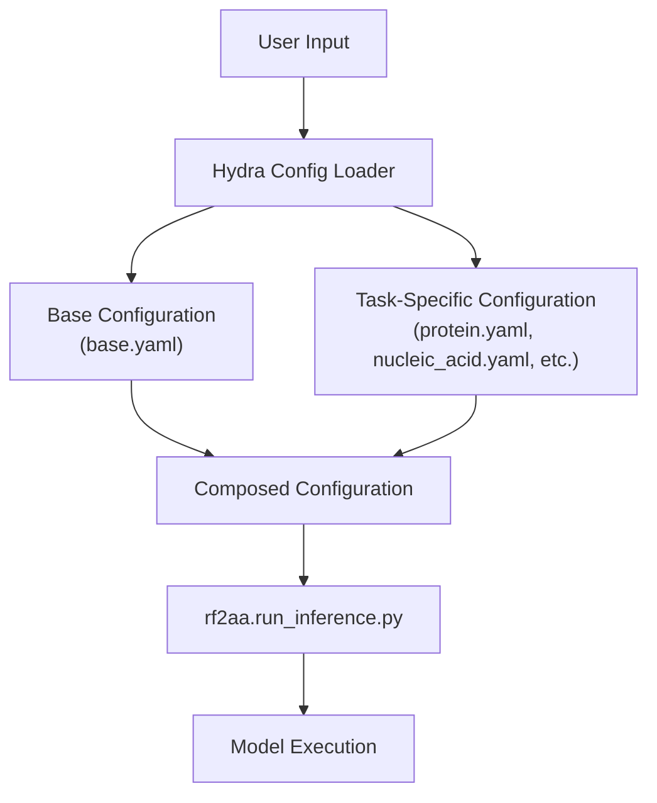
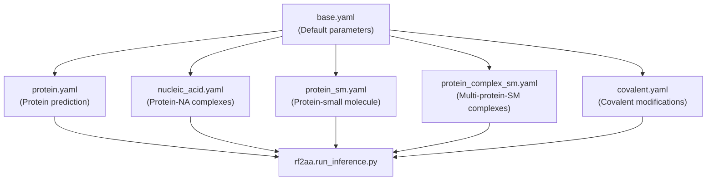
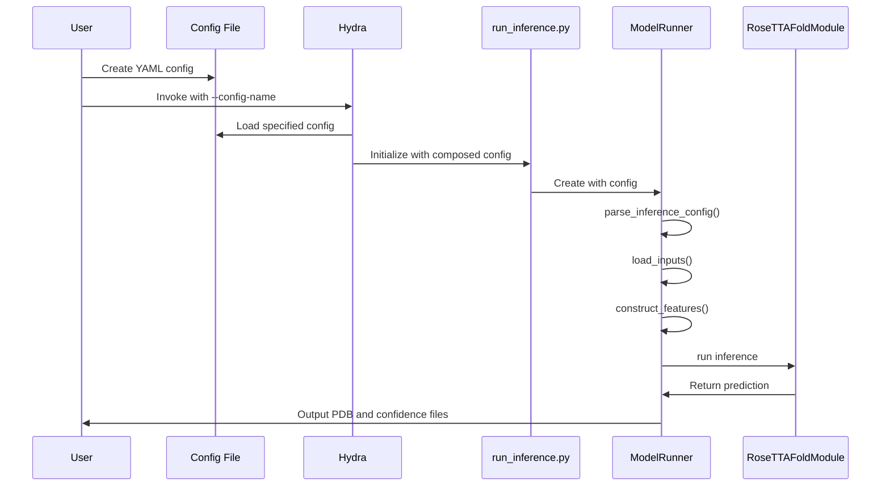

# Configuration System

> **Relevant source files**
> * [README.md](https://github.com/baker-laboratory/RoseTTAFold-All-Atom/blob/6c851405/README.md?plain=1)
> * [rf2aa/config/inference/protein_complex_sm.yaml](https://github.com/baker-laboratory/RoseTTAFold-All-Atom/blob/6c851405/rf2aa/config/inference/protein_complex_sm.yaml)

This document explains RoseTTAFold All-Atom's (RFAA) configuration system, which uses the Hydra framework to manage parameters for structure prediction runs. Understanding this system is essential for running prediction tasks with different types of molecules. For preparing specific input files, see [Input File Preparation](/baker-laboratory/RoseTTAFold-All-Atom/4.2-input-file-preparation).

## Hydra Configuration Overview

RFAA uses [Hydra](https://hydra.cc/), a configuration management framework that enables hierarchical, composable configurations. This allows for flexibility in specifying different prediction tasks while maintaining consistent interfaces.



Sources: [README.md L86-L90](https://github.com/baker-laboratory/RoseTTAFold-All-Atom/blob/6c851405/README.md?plain=1#L86-L90)

### Configuration Hierarchy

RFAA configurations follow a hierarchical structure, where task-specific configurations inherit from and extend the base configuration.



Sources: [README.md L87-L89](https://github.com/baker-laboratory/RoseTTAFold-All-Atom/blob/6c851405/README.md?plain=1#L87-L89)

 [rf2aa/config/inference/protein_complex_sm.yaml L1-L3](https://github.com/baker-laboratory/RoseTTAFold-All-Atom/blob/6c851405/rf2aa/config/inference/protein_complex_sm.yaml#L1-L3)

## Core Configuration Components

Every RFAA configuration file includes these main components:

Sources: [README.md L92-L101](https://github.com/baker-laboratory/RoseTTAFold-All-Atom/blob/6c851405/README.md?plain=1#L92-L101)

 [README.md L112-L116](https://github.com/baker-laboratory/RoseTTAFold-All-Atom/blob/6c851405/README.md?plain=1#L112-L116)

### Configuration Parameters

| Component | Purpose | Required Format |
| --- | --- | --- |
| `defaults` | Lists base configurations to inherit from | List with base YAML filename |
| `job_name` | Name for output files | String (default: "structure_prediction") |
| `protein_inputs` | Protein chain specifications | Dictionary with chain IDs as keys |
| `na_inputs` | Nucleic acid chain specifications | Dictionary with chain IDs as keys |
| `sm_inputs` | Small molecule specifications | Dictionary with chain IDs as keys |
| `covale_inputs` | Covalent bond specifications | String with special syntax (see below) |
| `loader_params` | Model parameters | Dictionary of parameter name/value pairs |

Sources: [README.md L92-L101](https://github.com/baker-laboratory/RoseTTAFold-All-Atom/blob/6c851405/README.md?plain=1#L92-L101)

 [README.md L108-L144](https://github.com/baker-laboratory/RoseTTAFold-All-Atom/blob/6c851405/README.md?plain=1#L108-L144)

## Input Specification

### Protein Inputs

Each protein chain requires a chain ID (e.g., "A") and input specification:

```yaml
protein_inputs:  A:  # Chain ID is required    fasta_file: path/to/fasta_file.fasta  # Required
```

Sources: [README.md L112-L116](https://github.com/baker-laboratory/RoseTTAFold-All-Atom/blob/6c851405/README.md?plain=1#L112-L116)

### Nucleic Acid Inputs

Nucleic acid chains require a chain ID, sequence, and type:

```yaml
na_inputs:  B:  # Chain ID    fasta: path/to/dna.fasta    input_type: "dna"  # Must be "dna" or "rna"
```

Sources: [README.md L135-L143](https://github.com/baker-laboratory/RoseTTAFold-All-Atom/blob/6c851405/README.md?plain=1#L135-L143)

### Small Molecule Inputs

Small molecules require a chain ID, input file/string, and input type:

```yaml
sm_inputs:  C:  # Chain ID    input: path/to/molecule.sdf  # or SMILES string    input_type: "sdf"  # Must be "sdf" or "smiles"
```

Sources: [README.md L168-L172](https://github.com/baker-laboratory/RoseTTAFold-All-Atom/blob/6c851405/README.md?plain=1#L168-L172)

### Covalent Bond Specification

Covalent bonds between proteins and small molecules use a special syntax:

```yaml
covale_inputs: "[((\"CHAIN_ID\", \"RESIDUE_NUM\", \"ATOM_NAME\"), (\"SM_CHAIN\", \"ATOM_INDEX\"), (\"CHIRALITY1\", \"CHIRALITY2\"))]"
```

Where:

* `CHAIN_ID`: Protein chain identifier (e.g., "A")
* `RESIDUE_NUM`: Protein residue number (1-indexed)
* `ATOM_NAME`: Protein atom name (e.g., "ND2")
* `SM_CHAIN`: Small molecule chain identifier
* `ATOM_INDEX`: Small molecule atom index (1-indexed)
* `CHIRALITY1`, `CHIRALITY2`: New chirality specifications, can be "CW", "CCW", or "null"

Sources: [README.md L217-L262](https://github.com/baker-laboratory/RoseTTAFold-All-Atom/blob/6c851405/README.md?plain=1#L217-L262)

## Model Parameters

The most commonly adjusted model parameter is `MAXCYCLE`, which controls the number of recycling iterations:

```yaml
loader_params:  MAXCYCLE: 10  # Default is 4, but 10 works better for difficult cases
```

Sources: [README.md L89-L90](https://github.com/baker-laboratory/RoseTTAFold-All-Atom/blob/6c851405/README.md?plain=1#L89-L90)

## Configuration Workflow



Sources: [README.md L86-L90](https://github.com/baker-laboratory/RoseTTAFold-All-Atom/blob/6c851405/README.md?plain=1#L86-L90)

## Configuration Examples

### Protein Monomer

```yaml
defaults:  - base job_name: "7u7w_protein"protein_inputs:   A:    fasta_file: examples/protein/7u7w_A.fasta
```

Sources: [README.md L108-L116](https://github.com/baker-laboratory/RoseTTAFold-All-Atom/blob/6c851405/README.md?plain=1#L108-L116)

### Protein-Nucleic Acid Complex

```yaml
defaults:  - base job_name: "7u7w_protein_nucleic"protein_inputs:   A:     fasta_file: examples/protein/7u7w_A.fastana_inputs:   B:     fasta: examples/nucleic_acid/7u7w_B.fasta    input_type: "dna"  C:     fasta: examples/nucleic_acid/7u7w_C.fasta    input_type: "dna"
```

Sources: [README.md L129-L144](https://github.com/baker-laboratory/RoseTTAFold-All-Atom/blob/6c851405/README.md?plain=1#L129-L144)

### Protein-Small Molecule Complex

```yaml
defaults:  - base job_name: "3fap"protein_inputs:  A:    fasta_file: examples/protein/3fap_A.fasta  B:     fasta_file: examples/protein/3fap_B.fastasm_inputs:  C:    input: examples/small_molecule/ARD_ideal.sdf    input_type: "sdf"
```

Sources: [README.md L156-L172](https://github.com/baker-laboratory/RoseTTAFold-All-Atom/blob/6c851405/README.md?plain=1#L156-L172)

 [rf2aa/config/inference/protein_complex_sm.yaml L1-L14](https://github.com/baker-laboratory/RoseTTAFold-All-Atom/blob/6c851405/rf2aa/config/inference/protein_complex_sm.yaml#L1-L14)

### Covalently Modified Protein

```yaml
defaults:  - base job_name: "7s69_A"protein_inputs:   A:     fasta_file: examples/protein/7s69_A.fastasm_inputs:  B:     input: examples/small_molecule/7s69_glycan.sdf    input_type: sdfcovale_inputs: "[((\"A\", \"74\", \"ND2\"), (\"B\", \"1\"), (\"CW\", \"null\"))]"loader_params:  MAXCYCLE: 10
```

Sources: [README.md L233-L252](https://github.com/baker-laboratory/RoseTTAFold-All-Atom/blob/6c851405/README.md?plain=1#L233-L252)

## Running Inference

To run a structure prediction with a configuration file:

```
python -m rf2aa.run_inference --config-name <config_name>
```

Where `<config_name>` is the filename (without .yaml) in the `rf2aa/config/inference/` directory.

Sources: [README.md L93-L94](https://github.com/baker-laboratory/RoseTTAFold-All-Atom/blob/6c851405/README.md?plain=1#L93-L94)