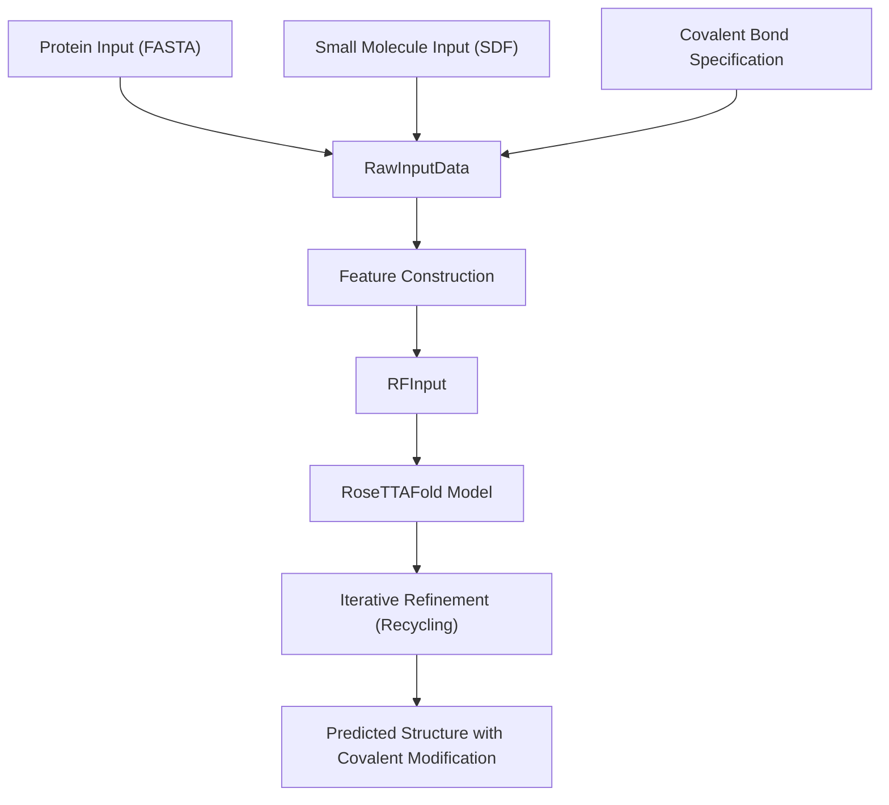
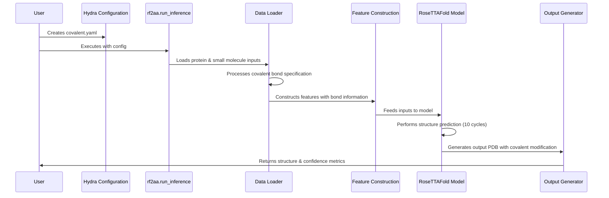

# Covalent Modification Example

> **Relevant source files**
> * [README.md](https://github.com/baker-laboratory/RoseTTAFold-All-Atom/blob/6c851405/README.md?plain=1)
> * [examples/protein/7s69_A.fasta](https://github.com/baker-laboratory/RoseTTAFold-All-Atom/blob/6c851405/examples/protein/7s69_A.fasta)
> * [examples/small_molecule/7s69_glycan.sdf](https://github.com/baker-laboratory/RoseTTAFold-All-Atom/blob/6c851405/examples/small_molecule/7s69_glycan.sdf)

This page provides a detailed walkthrough of how to predict the structure of a covalently modified protein using RoseTTAFold All-Atom (RFAA). Specifically, we will demonstrate the process using an example of N-linked glycosylation from PDB ID 7S69, where a glycan is attached to asparagine 74 of the N-acetylglucosamine-1-phosphotransferase gamma subunit.

For general information about configuring covalent modifications in RFAA, see [Covalent Modifications](/baker-laboratory/RoseTTAFold-All-Atom/4.3-covalent-modifications).

## 1. Overview of Covalent Modification Prediction

Covalent modifications involve the formation of a chemical bond between a protein and another molecule. RFAA can predict structures with such modifications by specifying the exact atoms involved in the covalent bond.

Title: Covalent Modification Prediction Workflow



Sources: README.md:208-266

## 2. Input Files for the Example

For this glycosylation example, we need two primary input files:

### 2.1 Protein Input

The protein sequence for N-acetylglucosamine-1-phosphotransferase gamma subunit:

```
>7S69_1|Chains A, B|N-acetylglucosamine-1-phosphotransferase gamma subunit|Xenopus laevis (8355)
DRHHHHHHKLGKMKIVEEPNSFGLNNPFLSQTNKLQPRVQPSPVSGPSHLFRLAGKCFNLVESTYKYELCPFHNVTQHEQTFRWNAYSGILGIWQEWDIENNTFSGMWMREGDSCGNKNRQTKVLLVCGKANKLSSVSEPSTCLYSLTFETPLVCHPHSLLVYPTLSEGLQEKWNEAEQALYDELITEQGHGKILKEIFREAGYLKTTKPDGEGKETQDKPKEFDSLEKCNKGYTELTSEIQRLKKMLNEHGISYVTNGTSRSEGQPAEVNTTFARGEDKVHLRGDTGIRDGQ
```

File path: `examples/protein/7s69_A.fasta`

### 2.2 Small Molecule Input

The glycan structure is provided in SDF format, which contains the 3D coordinates and connectivity information for a complex oligosaccharide with 72 atoms and 77 bonds.

File path: `examples/small_molecule/7s69_glycan.sdf`

Sources: examples/protein/7s69_A.fasta:1-3, examples/small_molecule/7s69_glycan.sdf:1-156

## 3. Specifying the Covalent Bond

The critical part of setting up a covalent modification prediction is correctly specifying the bond between the protein and small molecule.

Title: Covalent Bond Specification Format

Sources: README.md:215-227

### 3.1 Bond Specification Format

In RFAA, covalent bonds are specified using a triplet format:

```
((protein_chain, residue_number, atom_name), (small_molecule_chain, atom_index), (new_chirality_atom_1, new_chirality_atom_2))
```

Where:

* First tuple: Identifies the protein atom (chain, residue number, atom name)
* Second tuple: Identifies the small molecule atom (chain, atom index)
* Third tuple: Specifies chirality changes (if any)

For our example, we're connecting the ND2 atom of residue 74 in chain A of the protein to atom 1 in chain B of the glycan. The first atom in the glycan maintains clockwise (CW) chirality, while the second position has no chirality specification:

```
((\"A\", \"74\", \"ND2\"), (\"B\", \"1\"), (\"CW\", \"null\"))
```

Sources: README.md:215-227

### 3.2 Important Notes on Chirality

1. Both the protein residue number and the small molecule atom index are 1-indexed.
2. When chirality doesn't change, use `("null", "null")` for the chirality tuple.
3. The options for chirality are `CCW` (counterclockwise) and `CW` (clockwise).
4. RFAA uses OpenBabel to identify chiral centers, which may not always match chemical intuition.
5. The code will raise an exception if there is a chiral center detected by OpenBabel that you didn't specify.

Sources: README.md:223-227

## 4. Configuration for Prediction

The configuration for predicting a covalently modified protein structure uses the standard RFAA Hydra configuration format with the addition of the `covale_inputs` parameter.

### 4.1 Example Configuration

```yaml
defaults:  - base job_name: 7s69_A protein_inputs:   A:     fasta_file: examples/protein/7s69_A.fasta sm_inputs:  B:     input: examples/small_molecule/7s69_glycan.sdf    input_type: sdf covale_inputs: "[((\"A\", \"74\", \"ND2\"), (\"B\", \"1\"), (\"CW\", \"null\"))]" loader_params:  MAXCYCLE: 10
```

Title: Configuration Components for Covalent Modification

Sources: README.md:233-252

### 4.2 Special Notes on Configuration

1. For covalently modified proteins, the small molecule must be provided as an SDF file, not a SMILES string.
2. The syntax for `covale_inputs` requires escaping the quotation marks with backslashes due to Hydra's parsing.
3. Increasing `MAXCYCLE` to 10 (from the default 4) is recommended for better results with complex structures.
4. You must remove any leaving groups from your input molecules before providing them to RFAA.

Sources: README.md:252-265

## 5. Running the Prediction

To run the covalent modification prediction:

1. Save the configuration above to a file (e.g., `covalent.yaml`) in the `rf2aa/config/inference/` directory
2. Execute the following command:

```
python -m rf2aa.run_inference --config-name covalent
```

Title: Data Flow During Covalent Modification Prediction



Sources: README.md:234-252

## 6. Understanding the Output

The prediction produces two main output files:

1. A PDB file containing the predicted structure with the covalent bond formed
2. A PyTorch (.pt) file containing confidence metrics

### 6.1 Output Structure

The PDB file will contain the protein structure with the covalently attached glycan. B-factors in the PDB file represent the predicted local distance difference test (pLDDT) values at each position, which indicate confidence in local structure.

### 6.2 Confidence Metrics

The PyTorch file contains several confidence metrics:

| Metric | Description | Interpretation |
| --- | --- | --- |
| plddts | Per-residue confidence scores | Higher values (>70) indicate higher confidence |
| pae | Predicted aligned error between positions | Lower values indicate higher confidence |
| pae_inter | Mean error between protein and small molecule | Values <10 indicate high-quality docking |
| mean_plddt | Average confidence across structure | Higher values are better |
| mean_pae | Average predicted aligned error | Lower values are better |
| pae_prot | Mean error among protein residues | Lower values indicate better protein structure |

The `pae_inter` metric is particularly important for assessing the quality of the covalent interface.

Sources: README.md:267-282

## 7. Troubleshooting and Tips

When working with covalent modifications in RFAA, keep these points in mind:

1. **Chirality issues**: If you receive an error about unspecified chiral centers, check the atom indices in your SDF file and add all required chirality specifications.
2. **Bond specification syntax**: Double-check the escaping of quotation marks in the `covale_inputs` parameter. The nested quotes and backslashes can be error-prone.
3. **Input preparation**: Make sure all leaving groups are removed from your small molecule input.
4. **Performance**: Increasing `MAXCYCLE` to 10 generally gives better results but increases computation time.
5. **Low confidence predictions**: If your `pae_inter` value is >10, consider refining your input molecules or trying alternative binding modes if applicable.

Sources: README.md:210-265

## Summary

This example demonstrates the process of predicting a glycosylated protein structure using RFAA's covalent modification capabilities. The key steps are:

1. Preparing protein (FASTA) and small molecule (SDF) input files
2. Correctly specifying the covalent bond with proper atom indices and chirality information
3. Configuring the prediction with appropriate parameters
4. Running the inference
5. Analyzing the output structure and confidence metrics

For more examples of RFAA predictions, see:

* [Protein-Only Prediction](/baker-laboratory/RoseTTAFold-All-Atom/6.1-protein-only-prediction)
* [Protein-Nucleic Acid Complex](/baker-laboratory/RoseTTAFold-All-Atom/6.2-protein-nucleic-acid-complex)
* [Protein-Small Molecule Complex](/baker-laboratory/RoseTTAFold-All-Atom/6.3-protein-small-molecule-complex)

Sources: README.md:1-286