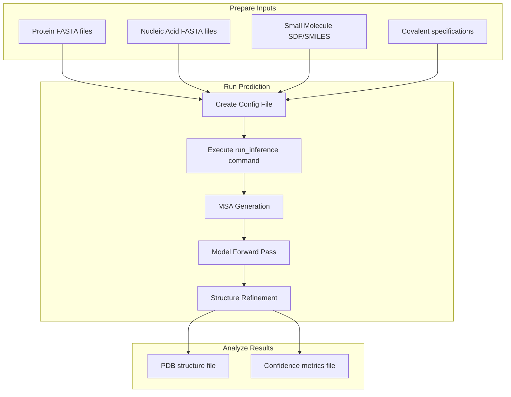
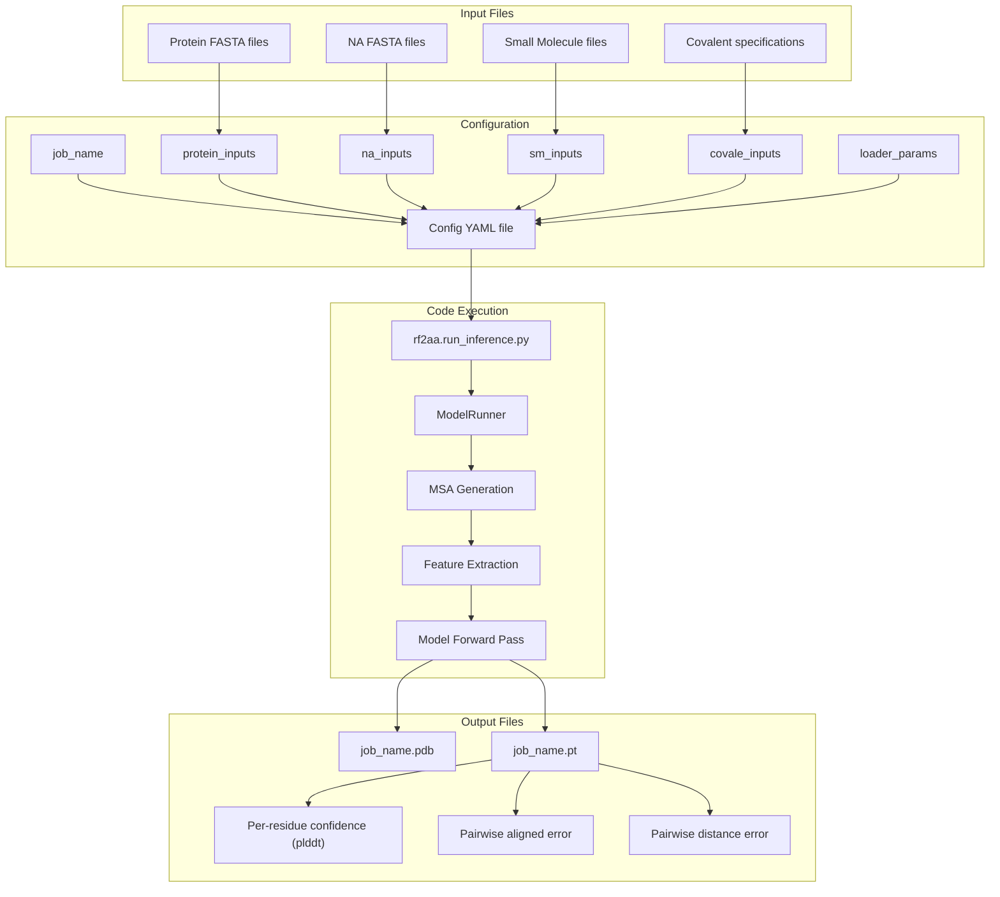
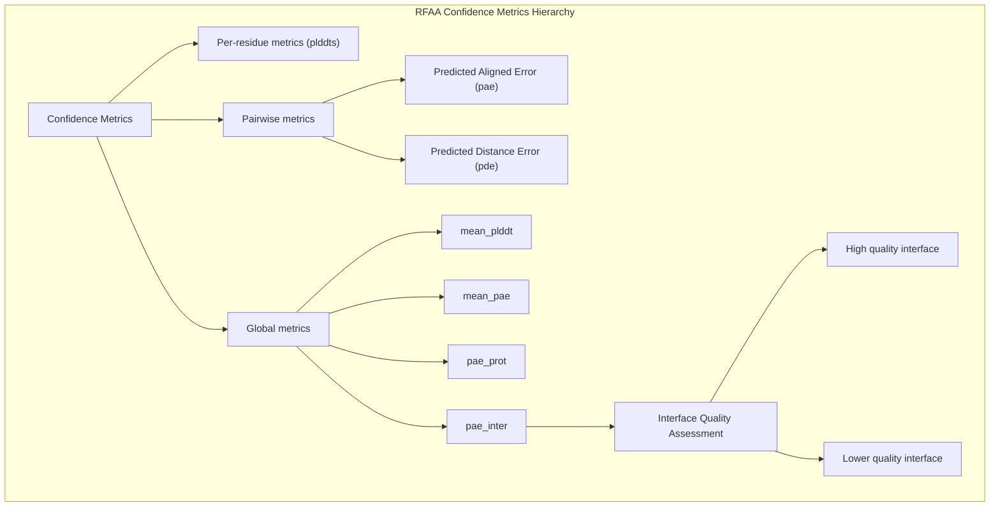

# Examples

> **Relevant source files**
> * [README.md](https://github.com/baker-laboratory/RoseTTAFold-All-Atom/blob/6c851405/README.md?plain=1)
> * [examples/nucleic_acid/7u7w_B.fasta](https://github.com/baker-laboratory/RoseTTAFold-All-Atom/blob/6c851405/examples/nucleic_acid/7u7w_B.fasta)
> * [examples/nucleic_acid/7u7w_C.fasta](https://github.com/baker-laboratory/RoseTTAFold-All-Atom/blob/6c851405/examples/nucleic_acid/7u7w_C.fasta)
> * [examples/protein/3fap_A.fasta](https://github.com/baker-laboratory/RoseTTAFold-All-Atom/blob/6c851405/examples/protein/3fap_A.fasta)
> * [examples/protein/3fap_B.fasta](https://github.com/baker-laboratory/RoseTTAFold-All-Atom/blob/6c851405/examples/protein/3fap_B.fasta)
> * [examples/protein/7qxr.fasta](https://github.com/baker-laboratory/RoseTTAFold-All-Atom/blob/6c851405/examples/protein/7qxr.fasta)
> * [examples/small_molecule/ARD_ideal.sdf](https://github.com/baker-laboratory/RoseTTAFold-All-Atom/blob/6c851405/examples/small_molecule/ARD_ideal.sdf)
> * [examples/small_molecule/NSW_ideal.sdf](https://github.com/baker-laboratory/RoseTTAFold-All-Atom/blob/6c851405/examples/small_molecule/NSW_ideal.sdf)

This page provides worked examples of using RoseTTAFold All-Atom (RFAA) for different types of biomolecular structure prediction tasks. These examples demonstrate how to set up and run predictions for various molecular systems, from single proteins to complex assemblies. For information about the underlying architecture, see [System Architecture](/baker-laboratory/RoseTTAFold-All-Atom/5-system-architecture).

## Overview of Prediction Workflow

Each prediction task in RFAA follows a similar workflow, regardless of the complexity of the molecular system being modeled:



Sources: [README.md L86-L102](https://github.com/baker-laboratory/RoseTTAFold-All-Atom/blob/6c851405/README.md?plain=1#L86-L102)

## Input-to-Output Relationship



Sources: [README.md L86-L284](https://github.com/baker-laboratory/RoseTTAFold-All-Atom/blob/6c851405/README.md?plain=1#L86-L284)

## 1. Protein-Only Prediction

This example shows how to predict the structure of a single protein chain.

### Input Files

For protein-only prediction, you need a FASTA file containing the protein sequence:

**examples/protein/3fap_A.fasta**

```
>3FAP_1|Chain A|FK506-BINDING PROTEIN|Homo sapiens (9606)
GVQVETISPGDGRTFPKRGQTCVVHYTGMLEDGKKFDSSRDRNKPFKFMLGKQEVIRGWEEGVAQMSVGQRAKLTISPDYAYGATGHPGIIPPHATLVFDVELLKLE
```

### Configuration File

Create a configuration file (or use the provided `protein.yaml`):

```yaml
defaults:  - base job_name: "7u7w_protein"protein_inputs:   A:    fasta_file: examples/protein/3fap_A.fasta
```

The configuration specifies:

* `job_name`: Name for output files
* `protein_inputs`: Dictionary of protein chains, with chain IDs as keys
* Chain `A`: A protein chain with sequence provided in the specified FASTA file

### Running the Prediction

```
python -m rf2aa.run_inference --config-name protein
```

### Output Analysis

The model generates two output files:

1. A PDB file (`7u7w_protein.pdb`) with the predicted structure
2. A PyTorch file (`7u7w_protein.pt`) containing confidence metrics

The B-factors in the PDB file represent the predicted LDDT (local distance difference test) scores for each residue, indicating the confidence in local structural quality.

Sources: [README.md L104-L125](https://github.com/baker-laboratory/RoseTTAFold-All-Atom/blob/6c851405/README.md?plain=1#L104-L125)

 [examples/protein/3fap_A.fasta L1-L3](https://github.com/baker-laboratory/RoseTTAFold-All-Atom/blob/6c851405/examples/protein/3fap_A.fasta#L1-L3)

## 2. Protein-Nucleic Acid Complex

This example demonstrates predicting a protein bound to double-stranded DNA.

### Input Files

You'll need three FASTA files:

1. One for the protein
2. Two for the DNA strands (one for each strand of the double helix)

**examples/nucleic_acid/7u7w_B.fasta**

```
>7U7W_2|Chain B[auth T]|DNA (5'-D(*CP*AP*TP*TP*AP*TP*GP*AP*CP*GP*CP*T)-3')|synthetic construct (32630)
CATTATGACGCT
```

**examples/nucleic_acid/7u7w_C.fasta**

```
>7U7W_3|Chain C[auth P]|DNA (5'-D(*AP*GP*CP*GP*TP*CP*AP*T)-3')|synthetic construct (32630)
AGCGTCAT
```

### Configuration File

```yaml
defaults:  - base job_name: "7u7w_protein_nucleic"protein_inputs:   A:     fasta_file: examples/protein/7u7w_A.fastana_inputs:   B:     fasta: examples/nucleic_acid/7u7w_B.fasta    input_type: "dna"  C:     fasta: examples/nucleic_acid/7u7w_C.fasta    input_type: "dna"
```

The configuration adds:

* `na_inputs`: Dictionary of nucleic acid chains
* For each chain, specify the `fasta` file and `input_type` ("dna" or "rna")

### Running the Prediction

```
python -m rf2aa.run_inference --config-name nucleic_acid
```

### Output Analysis

For protein-nucleic acid complexes, pay special attention to the `pae_inter` value in the confidence metrics, which represents the predicted aligned error between the protein and nucleic acid chains. Values below 10 indicate high-quality interactions.

Sources: [README.md L126-L152](https://github.com/baker-laboratory/RoseTTAFold-All-Atom/blob/6c851405/README.md?plain=1#L126-L152)

 [examples/nucleic_acid/7u7w_B.fasta L1-L3](https://github.com/baker-laboratory/RoseTTAFold-All-Atom/blob/6c851405/examples/nucleic_acid/7u7w_B.fasta#L1-L3)

 [examples/nucleic_acid/7u7w_C.fasta L1-L3](https://github.com/baker-laboratory/RoseTTAFold-All-Atom/blob/6c851405/examples/nucleic_acid/7u7w_C.fasta#L1-L3)

## 3. Protein-Small Molecule Complex

This example shows how to predict a protein complex with a small molecule ligand.

### Input Files

You'll need:

1. FASTA files for protein chains
2. SDF file or SMILES string for the small molecule

**examples/protein/3fap_B.fasta**

```
>3FAP_2|Chain B|FKBP12-RAPAMYCIN ASSOCIATED PROTEIN|Homo sapiens (9606)
VAILWHEMWHEGLEEASRLYFGERNVKGMFEVLEPLHAMMERGPQTLKETSFNQAYGRDLMEAQEWCRKYMKSGNVKDLTQAWDLYYHVFRRIS
```

**examples/small_molecule/ARD_ideal.sdf**: (SDF file defining the small molecule)

### Configuration File

```yaml
defaults:  - basejob_name: "3fap" protein_inputs:  A:    fasta_file: examples/protein/3fap_A.fasta  B:     fasta_file: examples/protein/3fap_B.fasta sm_inputs:  C:    input: examples/small_molecule/ARD_ideal.sdf    input_type: "sdf"
```

The configuration adds:

* `sm_inputs`: Dictionary of small molecule chains
* For each small molecule, specify the `input` file and `input_type` ("sdf" or "smiles")

### Running the Prediction

```
python -m rf2aa.run_inference --config-name protein_sm
```

### Output Analysis

For protein-small molecule complexes, examine both the overall structure and the specific binding mode of the small molecule. The `pae_inter` metric is particularly useful for assessing the confidence in the predicted binding interface.

Sources: [README.md L152-L178](https://github.com/baker-laboratory/RoseTTAFold-All-Atom/blob/6c851405/README.md?plain=1#L152-L178)

 [examples/protein/3fap_A.fasta L1-L3](https://github.com/baker-laboratory/RoseTTAFold-All-Atom/blob/6c851405/examples/protein/3fap_A.fasta#L1-L3)

 [examples/protein/3fap_B.fasta L1-L3](https://github.com/baker-laboratory/RoseTTAFold-All-Atom/blob/6c851405/examples/protein/3fap_B.fasta#L1-L3)

 [examples/small_molecule/ARD_ideal.sdf L1-L322](https://github.com/baker-laboratory/RoseTTAFold-All-Atom/blob/6c851405/examples/small_molecule/ARD_ideal.sdf#L1-L322)

## 4. Covalent Modification Example

This example demonstrates how to predict a covalently modified protein, where a small molecule is chemically bonded to a protein residue.

### Input Files

You'll need:

1. FASTA file for the protein
2. SDF file for the small molecule (SMILES is not recommended for covalent modifications)
3. Specification of the covalent bond

### Configuration File

```yaml
defaults:  - base job_name: "7s69_A" protein_inputs:   A:     fasta_file: examples/protein/7s69_A.fasta sm_inputs:  B:     input: examples/small_molecule/7s69_glycan.sdf    input_type: sdf covale_inputs: "[((\"A\", \"74\", \"ND2\"), (\"B\", \"1\"), (\"CW\", \"null\"))]" loader_params:  MAXCYCLE: 10
```

The configuration adds:

* `covale_inputs`: Specification of covalent bonds
* The syntax is `[(("ProteinChain", "ResidueNumber", "AtomName"), ("SmallMoleculeChain", "AtomIndex"), ("Chirality1", "Chirality2"))]`
* Atom indices in small molecules are 1-indexed
* Chirality options are "CW" (clockwise), "CCW" (counterclockwise), or "null" (no change)
* `loader_params.MAXCYCLE`: Increasing recycling steps from default 4 to 10 for better refinement

### Running the Prediction

```
python -m rf2aa.run_inference --config-name covalent
```

### Important Considerations for Covalent Modifications

1. You must provide small molecule inputs as SDF files for covalent modifications
2. You must remove any leaving groups from your input molecules
3. Specify chirality for any atoms that Openbabel identifies as chiral centers
4. The code will handle leaving groups on the protein sidechain automatically

Sources: [README.md L208-L263](https://github.com/baker-laboratory/RoseTTAFold-All-Atom/blob/6c851405/README.md?plain=1#L208-L263)

## 5. Higher-Order Complex Example

This example shows how to predict a complex containing protein, nucleic acid, and small molecule components.

### Configuration File

```yaml
defaults:  - base job_name: "7u7w_protein_nucleic_sm"protein_inputs:   A:     fasta_file: examples/protein/7u7w_A.fastana_inputs:   B:     fasta: examples/nucleic_acid/7u7w_B.fasta    input_type: "dna"  C:     fasta: examples/nucleic_acid/7u7w_C.fasta    input_type: "dna"sm_inputs:   D:    input: examples/small_molecule/XG4.sdf    input_type: "sdf"
```

This configuration combines all the input types demonstrated in the previous examples.

### Running the Prediction

```
python -m rf2aa.run_inference --config-name protein_na_sm
```

Sources: [README.md L178-L207](https://github.com/baker-laboratory/RoseTTAFold-All-Atom/blob/6c851405/README.md?plain=1#L178-L207)

## Understanding Confidence Metrics

All examples produce confidence metrics stored in the PyTorch output file. These metrics are crucial for assessing prediction quality:

| Metric | Description | Interpretation |
| --- | --- | --- |
| `plddts` | Per-residue predicted LDDT | 0-100 scale, higher is better |
| `pae` | Predicted aligned error matrix | Lower values indicate more accurate relative positioning |
| `pde` | Predicted distance error matrix | Uncertainty in pairwise distances |
| `mean_plddt` | Average confidence across all residues | Overall structure quality |
| `mean_pae` | Average predicted aligned error | Overall structural consistency |
| `pae_prot` | Mean PAE for protein residues only | Protein structure quality |
| `pae_inter` | Mean PAE between different molecule types | Quality of interfaces (<10 indicates high quality) |



Sources: [README.md L266-L282](https://github.com/baker-laboratory/RoseTTAFold-All-Atom/blob/6c851405/README.md?plain=1#L266-L282)