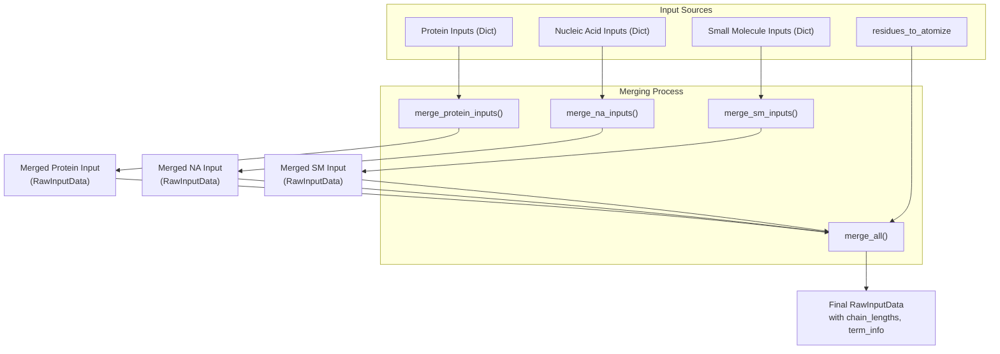
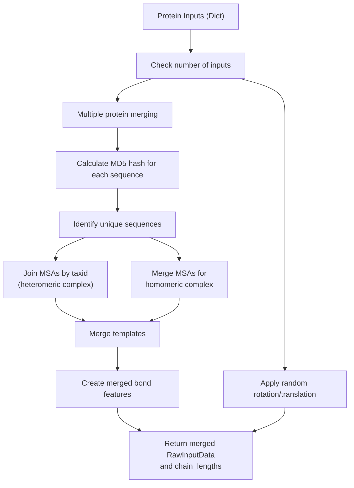
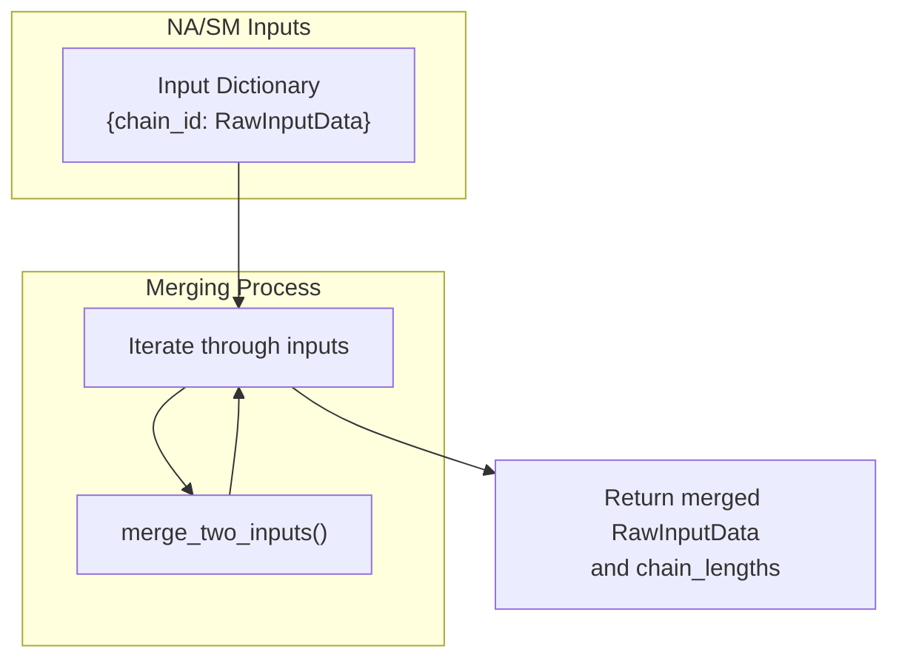
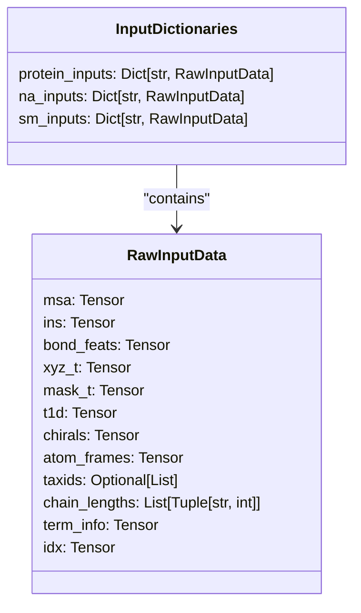

# Input Merging

> **Relevant source files**
> * [rf2aa/data/merge_inputs.py](https://github.com/baker-laboratory/RoseTTAFold-All-Atom/blob/6c851405/rf2aa/data/merge_inputs.py)
> * [rf2aa/data/protein.py](https://github.com/baker-laboratory/RoseTTAFold-All-Atom/blob/6c851405/rf2aa/data/protein.py)

## Purpose and Scope

Input merging is a critical component of the RoseTTAFold All-Atom (RFAA) pipeline that consolidates different types of biomolecular inputs into a unified data structure for model processing. This document explains how RFAA combines protein, nucleic acid, and small molecule inputs to prepare a comprehensive input representation for structure prediction.

For information about how this data is initially loaded, see [Data Loading and Parsing](/baker-laboratory/RoseTTAFold-All-Atom/5.3-data-loading-and-parsing). For details on what happens after input merging, see [Inference Pipeline](/baker-laboratory/RoseTTAFold-All-Atom/5.4-inference-pipeline).

Sources: [rf2aa/data/merge_inputs.py L161-L204](https://github.com/baker-laboratory/RoseTTAFold-All-Atom/blob/6c851405/rf2aa/data/merge_inputs.py#L161-L204)

## Input Merging Workflow

The input merging process takes separate inputs for proteins, nucleic acids, and small molecules, and combines them into a single `RawInputData` object that contains all the necessary information for feature construction.



Sources: [rf2aa/data/merge_inputs.py L161-L204](https://github.com/baker-laboratory/RoseTTAFold-All-Atom/blob/6c851405/rf2aa/data/merge_inputs.py#L161-L204)

## Type-Specific Merging

The merging process handles each biomolecule type differently, due to their unique characteristics.

### Protein Input Merging

Protein input merging is the most complex process and involves:

1. Identifying identical sequences using MD5 hashing
2. Merging Multiple Sequence Alignments (MSAs)
3. Merging templates
4. Combining bond features

For single protein inputs, a random rotation and translation is applied. For multiple protein inputs, the system analyzes sequence identity to determine how to merge MSAs appropriately.



Sources: [rf2aa/data/merge_inputs.py L9-L86](https://github.com/baker-laboratory/RoseTTAFold-All-Atom/blob/6c851405/rf2aa/data/merge_inputs.py#L9-L86)

### Nucleic Acid and Small Molecule Input Merging

Nucleic acid and small molecule inputs are merged using a simpler process that sequentially combines inputs using the `merge_two_inputs` helper function:



Sources: [rf2aa/data/merge_inputs.py L88-L104](https://github.com/baker-laboratory/RoseTTAFold-All-Atom/blob/6c851405/rf2aa/data/merge_inputs.py#L88-L104)

 [rf2aa/data/merge_inputs.py L106-L159](https://github.com/baker-laboratory/RoseTTAFold-All-Atom/blob/6c851405/rf2aa/data/merge_inputs.py#L106-L159)

## Two-Input Merging

The `merge_two_inputs` function is the fundamental building block for merging any two `RawInputData` objects. It handles several key aspects:

| Feature | Merging Approach |
| --- | --- |
| MSAs | Uses `merge_a3m_hetero` to combine MSAs |
| Bond Features | Creates a block-diagonal matrix from individual bond features |
| Templates | Concatenates coordinates, masks and features |
| Chirals | Updates indices and concatenates |
| Atom Frames | Simple concatenation |

Sources: [rf2aa/data/merge_inputs.py L106-L159](https://github.com/baker-laboratory/RoseTTAFold-All-Atom/blob/6c851405/rf2aa/data/merge_inputs.py#L106-L159)

## Final Input Merging

The `merge_all` function orchestrates the entire merging process:

1. Merges protein inputs using `merge_protein_inputs`
2. Merges nucleic acid inputs using `merge_na_inputs`
3. Merges small molecule inputs using `merge_sm_inputs`
4. Combines all merged inputs using `merge_two_inputs`
5. Stores chain information and updates terminal residue information
6. Centers and realigns the coordinates
7. Updates protein features for any residues that need to be atomized

```mermaid
sequenceDiagram
  participant merge_all()
  participant merge_protein_inputs()
  participant merge_na_inputs()
  participant merge_sm_inputs()
  participant merge_two_inputs()

  note over merge_all(): Start with separate inputs
  merge_all()->>merge_protein_inputs(): Merge protein inputs
  merge_protein_inputs()-->>merge_all(): Return merged protein data
  merge_all()->>merge_na_inputs(): Merge nucleic acid inputs
  merge_na_inputs()-->>merge_all(): Return merged NA data
  merge_all()->>merge_sm_inputs(): Merge small molecule inputs
  merge_sm_inputs()-->>merge_all(): Return merged SM data
  merge_all()->>merge_two_inputs(): Merge protein and NA
  merge_two_inputs()-->>merge_all(): Return protein+NA data
  merge_all()->>merge_two_inputs(): Merge (protein+NA) with SM
  merge_two_inputs()-->>merge_all(): Return complete merged data
  note over merge_all(): Process merged data
  merge_all()->>merge_all(): Store chain_lengths
  merge_all()->>merge_all(): Generate term_info
  merge_all()->>merge_all(): Center and realign coordinates
  merge_all()->>merge_all(): Update features for atomized residues
  note over merge_all(): Return final RawInputData
```

Sources: [rf2aa/data/merge_inputs.py L161-L204](https://github.com/baker-laboratory/RoseTTAFold-All-Atom/blob/6c851405/rf2aa/data/merge_inputs.py#L161-L204)

## Data Structures

### Input Types

The merging system handles three main types of inputs, all represented as dictionaries where keys are chain identifiers and values are `RawInputData` objects:



### Chain Length Tracking

The merging process maintains information about chain lengths throughout, returning tuples of chain identifiers and sequence lengths. This information is essential for later stages that need to know which residues belong to which chains.

```markdown
chain_lengths = [('A', 150), ('B', 150), ('C', 75), ('D', 30)]  # example format
```

Sources: [rf2aa/data/merge_inputs.py L73-L74](https://github.com/baker-laboratory/RoseTTAFold-All-Atom/blob/6c851405/rf2aa/data/merge_inputs.py#L73-L74)

 [rf2aa/data/merge_inputs.py L92-L94](https://github.com/baker-laboratory/RoseTTAFold-All-Atom/blob/6c851405/rf2aa/data/merge_inputs.py#L92-L94)

 [rf2aa/data/merge_inputs.py L101-L103](https://github.com/baker-laboratory/RoseTTAFold-All-Atom/blob/6c851405/rf2aa/data/merge_inputs.py#L101-L103)

 [rf2aa/data/merge_inputs.py L178-L179](https://github.com/baker-laboratory/RoseTTAFold-All-Atom/blob/6c851405/rf2aa/data/merge_inputs.py#L178-L179)

## Technical Considerations

### Handling Homomeric Complexes

For protein inputs with identical sequences (homomeric complexes), the system detects duplicates using MD5 hashing and applies special MSA merging logic to ensure proper representation of the repeated sequences.

### Coordinate Processing

After merging, the system centers and realigns the coordinates using the `center_and_realign_missing` function, which helps prepare the structure for model processing.

### Bond Features

Bond features are represented as block-diagonal matrices, where each block corresponds to the bonds within a specific chain. The merging process preserves this structure by placing individual bond matrices along the diagonal of the combined matrix.

Sources: [rf2aa/data/merge_inputs.py L127-L134](https://github.com/baker-laboratory/RoseTTAFold-All-Atom/blob/6c851405/rf2aa/data/merge_inputs.py#L127-L134)

 [rf2aa/data/merge_inputs.py L190-L197](https://github.com/baker-laboratory/RoseTTAFold-All-Atom/blob/6c851405/rf2aa/data/merge_inputs.py#L190-L197)

## Special Case: Covalent Modifications

When residues need to be atomized (converted to all-atom representation), the final step in the merging process calls `update_protein_features_after_atomize` to ensure that the features are correctly updated to reflect the atomized representation.

Sources: [rf2aa/data/merge_inputs.py L201-L202](https://github.com/baker-laboratory/RoseTTAFold-All-Atom/blob/6c851405/rf2aa/data/merge_inputs.py#L201-L202)