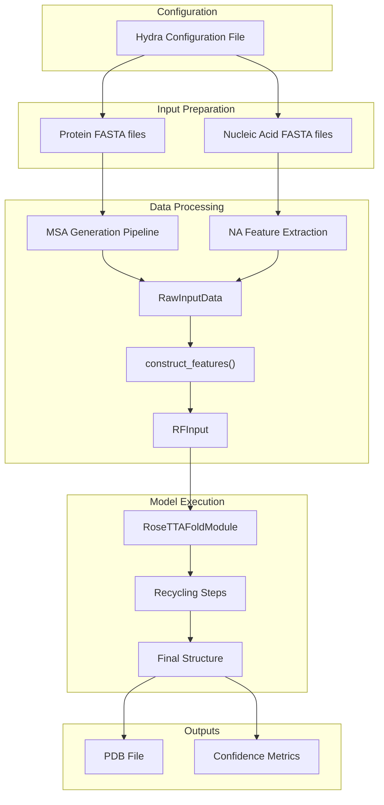

# Protein-Nucleic Acid Complex

> **Relevant source files**
> * [README.md](https://github.com/baker-laboratory/RoseTTAFold-All-Atom/blob/6c851405/README.md?plain=1)
> * [examples/nucleic_acid/7u7w_B.fasta](https://github.com/baker-laboratory/RoseTTAFold-All-Atom/blob/6c851405/examples/nucleic_acid/7u7w_B.fasta)
> * [examples/nucleic_acid/7u7w_C.fasta](https://github.com/baker-laboratory/RoseTTAFold-All-Atom/blob/6c851405/examples/nucleic_acid/7u7w_C.fasta)
> * [examples/protein/7u7w_A.fasta](https://github.com/baker-laboratory/RoseTTAFold-All-Atom/blob/6c851405/examples/protein/7u7w_A.fasta)

This page demonstrates how to use RoseTTAFold All-Atom (RFAA) to predict structures of complexes containing proteins bound to nucleic acids such as DNA or RNA. We will walk through the process of preparing inputs, configuring the model, running the prediction, and interpreting the results. For protein-small molecule complexes, see [Protein-Small Molecule Complex](/baker-laboratory/RoseTTAFold-All-Atom/6.3-protein-small-molecule-complex), and for protein-only predictions, see [Protein-Only Prediction](/baker-laboratory/RoseTTAFold-All-Atom/6.1-protein-only-prediction).

## Overview

RFAA can model protein-nucleic acid interactions by taking protein sequences alongside nucleic acid sequences as inputs. The system handles the three-dimensional arrangement of these molecules and predicts their binding interfaces. This capability is particularly valuable for studying transcription factors, polymerases, nucleases, and other DNA/RNA-binding proteins.

Sources: [README.md L126-L152](https://github.com/baker-laboratory/RoseTTAFold-All-Atom/blob/6c851405/README.md?plain=1#L126-L152)

## Input Preparation

### Required Files

To predict a protein-nucleic acid complex, you'll need:

1. **Protein FASTA file**: Contains the amino acid sequence of your protein(s)
2. **Nucleic acid FASTA file(s)**: Contains the nucleotide sequence(s) of your DNA or RNA molecules

### Example Input Files

For this example, we'll use the 7u7w complex, which consists of DNA polymerase eta bound to double-stranded DNA:

#### Protein (Chain A)

```
>7U7W_1|Chain A|DNA polymerase eta|Homo sapiens (9606)
GPHMATGQDRVVALVDMDCFFVQVEQRQNPHLRNKPCAVVQYKSWKGGGIIAVSYEARAFGVTRSMWADDAKKLCPDLLLAQVRESRGKANLTKYREASVEVMEIMSRFAVIERASIDEAYVDLTSAVQERLQKLQGQPISADLLPSTYIEGLPQGPTTAEETVQKEGMRKQGLFQWLDSLQIDNLTSPDLQLTVGAVIVEEMRAAIERETGFQCSAGISHNKVLAKLACGLNKPNRQTLVSHGSVPQLFSQMPIRKIRSLGGKLGASVIEILGIEYMGELTQFTESQLQSHFGEKNGSWLYAMCRGIEHDPVKPRQLPKTIGCSKNFPGKTALATREQVQWWLLQLAQELEERLTKDRNDNDRVATQLVVSIRVQGDKRLSSLRRCCALTRYDAHKMSHDAFTVIKNCNTSGIQTEWSPPLTMLFLCATKFSAS
```

#### DNA Strand 1 (Chain B)

```
>7U7W_2|Chain B[auth T]|DNA (5'-D(*CP*AP*TP*TP*AP*TP*GP*AP*CP*GP*CP*T)-3')|synthetic construct (32630)
CATTATGACGCT
```

#### DNA Strand 2 (Chain C)

```
>7U7W_3|Chain C[auth P]|DNA (5'-D(*AP*GP*CP*GP*TP*CP*AP*T)-3')|synthetic construct (32630)
AGCGTCAT
```

Sources: [examples/protein/7u7w_A.fasta L1-L2](https://github.com/baker-laboratory/RoseTTAFold-All-Atom/blob/6c851405/examples/protein/7u7w_A.fasta#L1-L2)

 [examples/nucleic_acid/7u7w_B.fasta L1-L2](https://github.com/baker-laboratory/RoseTTAFold-All-Atom/blob/6c851405/examples/nucleic_acid/7u7w_B.fasta#L1-L2)

 [examples/nucleic_acid/7u7w_C.fasta L1-L2](https://github.com/baker-laboratory/RoseTTAFold-All-Atom/blob/6c851405/examples/nucleic_acid/7u7w_C.fasta#L1-L2)

## Configuration Setup

To predict a protein-nucleic acid complex, you need to create a configuration file that specifies:

1. The protein input(s) with chain IDs
2. The nucleic acid input(s) with chain IDs and types (DNA or RNA)

### Sample Configuration

Here's the configuration for our 7u7w example:

```yaml
defaults:  - base job_name: "7u7w_protein_nucleic"protein_inputs:   A:     fasta_file: examples/protein/7u7w_A.fastana_inputs:   B:     fasta: examples/nucleic_acid/7u7w_B.fasta    input_type: "dna"  C:     fasta: examples/nucleic_acid/7u7w_C.fasta    input_type: "dna"
```

This configuration:

* Inherits default parameters from the base configuration
* Names the job "7u7w_protein_nucleic"
* Specifies protein chain A with its FASTA file path
* Specifies two DNA chains (B and C) with their respective FASTA file paths
* Indicates that both nucleic acid chains are DNA (`input_type: "dna"`)

Sources: [README.md L130-L143](https://github.com/baker-laboratory/RoseTTAFold-All-Atom/blob/6c851405/README.md?plain=1#L130-L143)

## Workflow Diagram

The following diagram illustrates how protein and nucleic acid inputs flow through RFAA's prediction pipeline:



Sources: [README.md L126-L152](https://github.com/baker-laboratory/RoseTTAFold-All-Atom/blob/6c851405/README.md?plain=1#L126-L152)

## Data Flow Within the System

This diagram shows how protein and nucleic acid data are processed and merged within the RFAA system:


Sources: [README.md L126-L152](https://github.com/baker-laboratory/RoseTTAFold-All-Atom/blob/6c851405/README.md?plain=1#L126-L152)

## Running the Prediction

To predict our protein-nucleic acid complex, run:

```
python -m rf2aa.run_inference --config-name nucleic_acid
```

If you've created a custom configuration file, you can specify it like this:

```
python -m rf2aa.run_inference --config-path path/to/config --config-name your_config_name
```

Sources: [README.md L149-L152](https://github.com/baker-laboratory/RoseTTAFold-All-Atom/blob/6c851405/README.md?plain=1#L149-L152)

## Output Interpretation

RFAA produces two main output files:

1. **PDB file** with the predicted 3D structure * Contains the predicted coordinates for all atoms in the complex * B-factors in the PDB represent the predicted local distance difference test (pLDDT) values, indicating confidence at each position
2. **PyTorch file** with detailed confidence metrics * Contains tensors with various confidence measures * Can be loaded with `torch.load(file, map_location="cpu")`

### Key Confidence Metrics

| Metric | Description | Interpretation |
| --- | --- | --- |
| plddts | Per-residue confidence scores | Higher values (>70) indicate well-predicted regions |
| pae | Predicted aligned error | Lower values indicate higher confidence in relative positioning |
| pde | Predicted distance error | Error in pairwise distances between residues |
| pae_inter | Interface confidence | Values <10 indicate high-quality interfaces between protein and nucleic acid |

The `pae_inter` metric is particularly important for protein-nucleic acid complexes as it measures the quality of the predicted binding interface.

Sources: [README.md L266-L281](https://github.com/baker-laboratory/RoseTTAFold-All-Atom/blob/6c851405/README.md?plain=1#L266-L281)

## Limitations and Considerations

When working with protein-nucleic acid complexes in RFAA, be aware of these limitations:

1. **RNA Multiple Sequence Alignments (MSAs)**: RFAA currently does not support: * Creating RNA MSAs * Pairing protein MSAs with RNA MSAs
2. **Alternative Tool for RNA Complexes**: For cases requiring paired protein-RNA MSAs, it's recommended to use the specialized RF-NA tool instead.
3. **Confidence Assessment**: Always check the confidence metrics, especially `pae_inter`, to evaluate the quality of your predicted complex. Values below 10 for `pae_inter` generally indicate reliable predictions.
4. **Challenging Complexes**: For difficult-to-predict complexes, increasing the recycling steps parameter (`loader_params.MAXCYCLE=10`) can improve results, though this will increase computation time.

Sources: [README.md L146-L147](https://github.com/baker-laboratory/RoseTTAFold-All-Atom/blob/6c851405/README.md?plain=1#L146-L147)

## Example Application: 7u7w DNA Polymerase Complex

The example shown throughout this guide (7u7w) is a human DNA polymerase eta bound to a DNA substrate. This enzyme is involved in DNA damage repair, specifically in bypassing UV-induced DNA damage. The prediction shows how the protein interacts with both strands of the DNA double helix, providing insight into the structural basis of its function.

Sources: [examples/protein/7u7w_A.fasta L1](https://github.com/baker-laboratory/RoseTTAFold-All-Atom/blob/6c851405/examples/protein/7u7w_A.fasta#L1-L1)

 [examples/nucleic_acid/7u7w_B.fasta L1](https://github.com/baker-laboratory/RoseTTAFold-All-Atom/blob/6c851405/examples/nucleic_acid/7u7w_B.fasta#L1-L1)

 [examples/nucleic_acid/7u7w_C.fasta L1](https://github.com/baker-laboratory/RoseTTAFold-All-Atom/blob/6c851405/examples/nucleic_acid/7u7w_C.fasta#L1-L1)