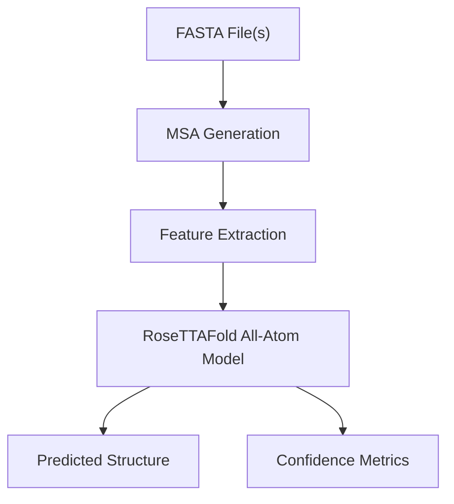
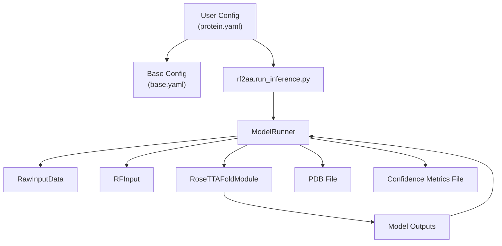
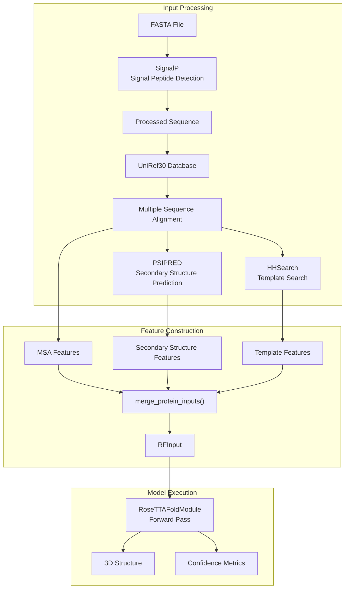

# Protein-Only Prediction

> **Relevant source files**
> * [README.md](https://github.com/baker-laboratory/RoseTTAFold-All-Atom/blob/6c851405/README.md?plain=1)
> * [examples/protein/3fap_A.fasta](https://github.com/baker-laboratory/RoseTTAFold-All-Atom/blob/6c851405/examples/protein/3fap_A.fasta)

## Purpose and Scope

This document explains how to use RoseTTAFold All-Atom (RFAA) to predict the 3D structure of individual protein molecules. This page focuses specifically on protein-only predictions without any nucleic acids, small molecules, or covalent modifications. For multi-component prediction examples, see [Protein-Nucleic Acid Complex](/baker-laboratory/RoseTTAFold-All-Atom/6.2-protein-nucleic-acid-complex), [Protein-Small Molecule Complex](/baker-laboratory/RoseTTAFold-All-Atom/6.3-protein-small-molecule-complex), or [Covalent Modification Example](/baker-laboratory/RoseTTAFold-All-Atom/6.4-covalent-modification-example).

## Overview of Protein-Only Prediction

Protein-only prediction in RFAA represents the fundamental use case of the system - predicting the 3D structure of a single protein chain or multiple interacting protein chains from amino acid sequences. This capability builds on the original RoseTTAFold model but with the enhanced all-atom representation.



Sources: [README.md L104-L125](https://github.com/baker-laboratory/RoseTTAFold-All-Atom/blob/6c851405/README.md?plain=1#L104-L125)

## Input Requirements

For protein-only prediction, you need:

1. **Protein sequence(s)** - Provided as FASTA file(s)
2. **Configuration file** - Specifies the prediction task using Hydra

### FASTA File Format

The FASTA file should contain the protein sequence in standard amino acid single-letter code format:

```
>Protein_Name|Additional_Information
MQIFTGYQVLSDPEVLKQQNEAIKVYIEYYGIFGGYAYFITLDGWKQGTREILNIGLGIEKVNPSMKEVVRKPFEELKEIGSLPKILGVYLGNVDAEYGIDRVEIQKNNGKITYKNGFWRCMVFTSEEELKEVLEIMPVKGEGDTLHVEQRKLQAIEEDIAQIIHKLH
```

Your FASTA files should be properly formatted and use standard amino acid codes. RFAA will process these sequences to generate multiple sequence alignments (MSAs) during the prediction process.

Sources: [examples/protein/3fap_A.fasta L1-L2](https://github.com/baker-laboratory/RoseTTAFold-All-Atom/blob/6c851405/examples/protein/3fap_A.fasta#L1-L2)

## Configuration Setup

RFAA uses Hydra to manage configuration. For protein-only prediction, you need a configuration file that specifies:

1. The job name
2. The protein input(s) with chain IDs
3. Optional parameters for the prediction process

Here's the basic structure of a protein-only prediction configuration:

```yaml
defaults:  - base job_name: "protein_prediction_name"protein_inputs:   A:    fasta_file: path/to/protein_chain_A.fasta  B:     fasta_file: path/to/protein_chain_B.fasta
```

Key points about the configuration:

* The `defaults` section inherits settings from the base configuration
* `job_name` will be used to name output files
* Each protein chain is specified under `protein_inputs` with a unique chain ID (A, B, etc.)
* Multiple chains can be specified for multi-chain protein complexes

Sources: [README.md L109-L116](https://github.com/baker-laboratory/RoseTTAFold-All-Atom/blob/6c851405/README.md?plain=1#L109-L116)

## Relationship Between Configuration and Code



Sources: [README.md L86-L95](https://github.com/baker-laboratory/RoseTTAFold-All-Atom/blob/6c851405/README.md?plain=1#L86-L95)

## Running a Protein-Only Prediction

To run a protein-only prediction with RFAA, follow these steps:

1. **Prepare your protein FASTA file(s)**
2. **Create or modify a configuration file** based on the example above
3. **Run the prediction** using the following command:

```
python -m rf2aa.run_inference --config-name protein
```

Where `protein` refers to the configuration file name (without the .yaml extension) in the `rf2aa/config/inference/` directory.

For custom configuration files located elsewhere, use:

```
python -m rf2aa.run_inference --config-path /path/to/config/dir --config-name your_config
```

Sources: [README.md L123-L124](https://github.com/baker-laboratory/RoseTTAFold-All-Atom/blob/6c851405/README.md?plain=1#L123-L124)

## Protein-Only Prediction Data Flow



Sources: [README.md L104-L125](https://github.com/baker-laboratory/RoseTTAFold-All-Atom/blob/6c851405/README.md?plain=1#L104-L125)

## Example: Predicting a Protein Monomer

Let's walk through a complete example of predicting a single protein chain structure:

1. Create a FASTA file containing your protein sequence:

```
>Example_Protein|Chain A
GVQVETISPGDGRTFPKRGQTCVVHYTGMLEDGKKFDSSRDRNKPFKFMLGKQEVIRGWEEGVAQMSVGQRAKLTISPDYAYGATGHPGIIPPHATLVFDVELLKLE
```

1. Create a configuration file named `my_protein.yaml` in the `rf2aa/config/inference/` directory:

```yaml
defaults:  - base job_name: "my_protein_prediction"protein_inputs:   A:    fasta_file: path/to/your/protein.fasta
```

1. Run the prediction:

```
python -m rf2aa.run_inference --config-name my_protein
```

1. The prediction will create two output files: * `my_protein_prediction.pdb` - The predicted 3D structure * `my_protein_prediction.pt` - Confidence metrics in PyTorch format

Sources: [README.md L108-L125](https://github.com/baker-laboratory/RoseTTAFold-All-Atom/blob/6c851405/README.md?plain=1#L108-L125)

 [README.md L266-L281](https://github.com/baker-laboratory/RoseTTAFold-All-Atom/blob/6c851405/README.md?plain=1#L266-L281)

## Predicted Structure and Confidence Metrics

RFAA produces two main output files:

1. **PDB file** containing the predicted 3D structure * B-factors in the PDB represent the predicted local distance difference test (pLDDT) values * Higher pLDDT values (typically >70) indicate more reliable regions
2. **PyTorch file (.pt)** containing detailed confidence metrics * Can be loaded with `torch.load(file, map_location="cpu")` * Contains several metrics: * `plddts`: Per-residue confidence scores * `pae`: Predicted aligned error matrix * `pde`: Predicted distance error matrix * `mean_plddt`: Average confidence across the structure * `mean_pae`: Average predicted aligned error * `pae_prot`: Mean PAE across protein residues * `pae_inter`: Mean interface PAE (not relevant for single-chain predictions)

A predicted structure with high mean pLDDT (>70) is generally considered reliable.

Sources: [README.md L266-L281](https://github.com/baker-laboratory/RoseTTAFold-All-Atom/blob/6c851405/README.md?plain=1#L266-L281)

## Advanced Options

For more challenging protein structure predictions, you might want to adjust some parameters:

### Increasing Recycling Steps

Increasing the number of recycling steps can improve prediction quality for difficult cases:

```yaml
defaults:  - base job_name: "complex_protein"protein_inputs:   A:    fasta_file: path/to/complex_protein.fasta loader_params:  MAXCYCLE: 10  # Default is 4
```

The RFAA paper noted that increasing to 10 recycling steps can give better results for hard cases.

### Multi-Chain Prediction

For protein complexes with multiple chains, simply add each chain with a unique chain ID:

```yaml
defaults:  - base job_name: "protein_complex"protein_inputs:   A:    fasta_file: path/to/protein_chain_A.fasta  B:     fasta_file: path/to/protein_chain_B.fasta  C:    fasta_file: path/to/protein_chain_C.fasta
```

This will predict the structure of all chains together as a complex.

Sources: [README.md L88-L90](https://github.com/baker-laboratory/RoseTTAFold-All-Atom/blob/6c851405/README.md?plain=1#L88-L90)

 [README.md L109-L116](https://github.com/baker-laboratory/RoseTTAFold-All-Atom/blob/6c851405/README.md?plain=1#L109-L116)

## Table of Common Issues and Solutions

| Issue | Possible Cause | Solution |
| --- | --- | --- |
| Low confidence scores | Poor MSA depth | Try a different protein construct or add templates |
| Disorganized structure | Complex fold or intrinsically disordered region | Increase recycling steps (MAXCYCLE) to 10 |
| Missing structure regions | Poor local confidence | Check pLDDT values; low-confidence regions may be flexible |
| Error reading FASTA | Incorrect FASTA format | Ensure proper formatting with header line starting with ">" |
| Memory issues | Large protein or complex | Try splitting into domains or reducing MSA depth |

Sources: [README.md L8](https://github.com/baker-laboratory/RoseTTAFold-All-Atom/blob/6c851405/README.md?plain=1#L8-L8)

 [README.md L88-L90](https://github.com/baker-laboratory/RoseTTAFold-All-Atom/blob/6c851405/README.md?plain=1#L88-L90)