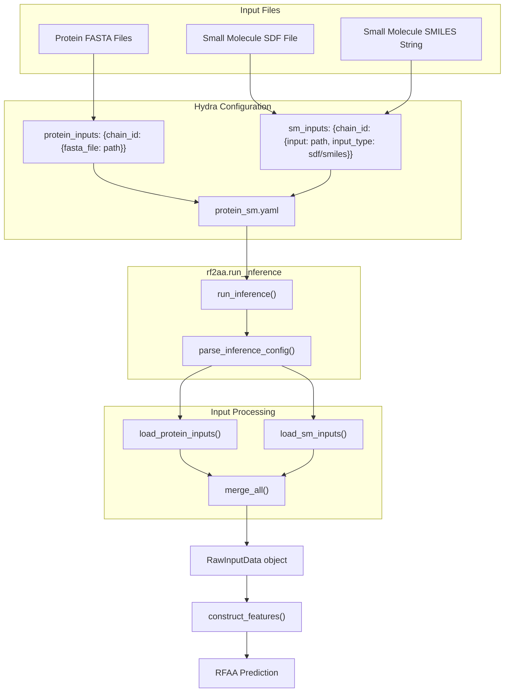
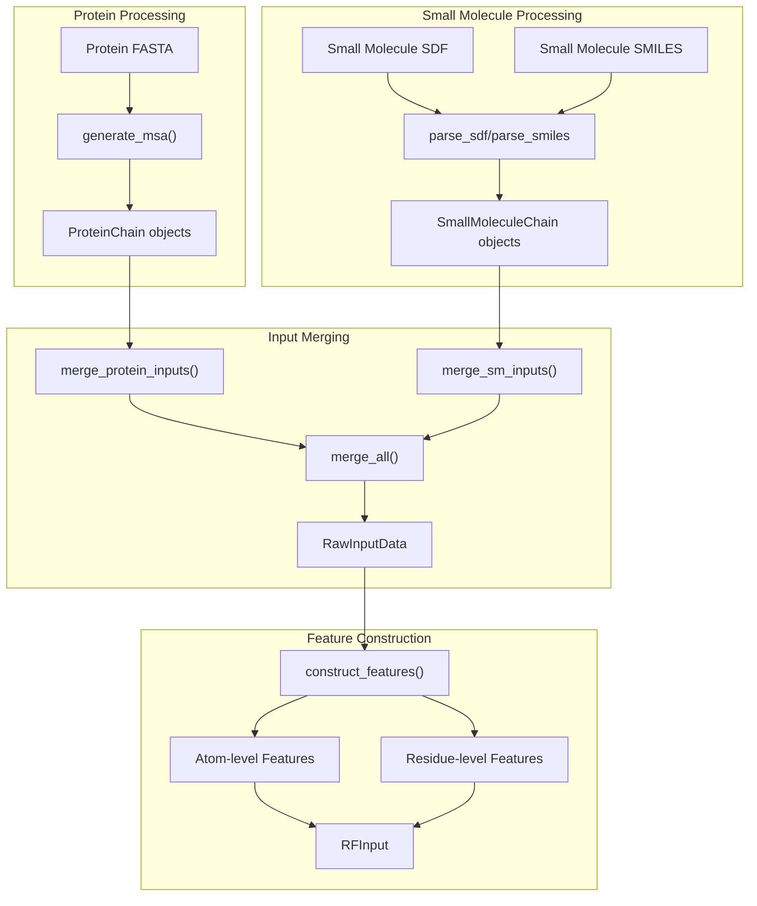
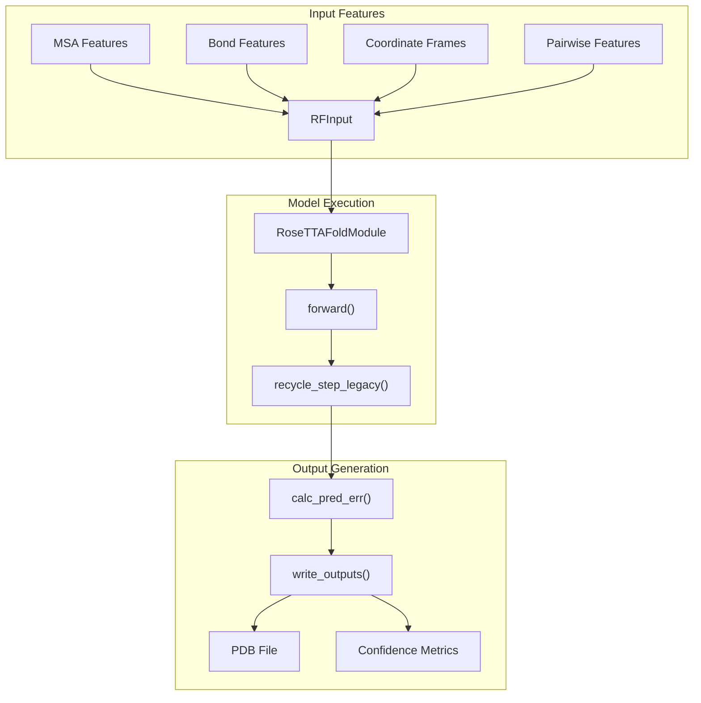

# Protein-Small Molecule Complex

> **Relevant source files**
> * [README.md](https://github.com/baker-laboratory/RoseTTAFold-All-Atom/blob/6c851405/README.md?plain=1)
> * [examples/protein/3fap_A.fasta](https://github.com/baker-laboratory/RoseTTAFold-All-Atom/blob/6c851405/examples/protein/3fap_A.fasta)
> * [examples/protein/3fap_B.fasta](https://github.com/baker-laboratory/RoseTTAFold-All-Atom/blob/6c851405/examples/protein/3fap_B.fasta)
> * [examples/small_molecule/ARD_ideal.sdf](https://github.com/baker-laboratory/RoseTTAFold-All-Atom/blob/6c851405/examples/small_molecule/ARD_ideal.sdf)

## Purpose and Scope

This page explains how to use RoseTTAFold All-Atom (RFAA) to predict the structures of protein-small molecule complexes. It covers input preparation, configuration setup, prediction process, and result interpretation specifically for interactions between proteins and small molecules (drugs, cofactors, metabolites, etc.). For covalently bound small molecules, see [Covalent Modification Example](/baker-laboratory/RoseTTAFold-All-Atom/6.4-covalent-modification-example).

## Input Requirements

To predict a protein-small molecule complex structure, you need:

1. **Protein inputs**: FASTA files for each protein chain
2. **Small molecule inputs**: SDF file or SMILES string for each small molecule

Small molecule input formats:

* **SDF** (Structure Data File): Contains 3D structural information
* **SMILES**: String notation representing the molecule's 2D structure

## Configuration Setup

Protein-small molecule complex prediction uses Hydra's YAML configuration system. Here's a basic example:

```yaml
defaults:  - base job_name: "3fap" protein_inputs:  A:    fasta_file: examples/protein/3fap_A.fasta  B:     fasta_file: examples/protein/3fap_B.fasta sm_inputs:  C:    input: examples/small_molecule/ARD_ideal.sdf    input_type: "sdf"
```

Key configuration elements:

* `job_name`: Identifier for this prediction job
* `protein_inputs`: Dictionary mapping chain IDs to protein input files
* `sm_inputs`: Dictionary mapping chain IDs to small molecule inputs, with both `input` and `input_type` required

Sources: [README.md L157-L172](https://github.com/baker-laboratory/RoseTTAFold-All-Atom/blob/6c851405/README.md?plain=1#L157-L172)

## Protein-Small Molecule Prediction Workflow

The following diagram illustrates the overall workflow:



Sources: [README.md L154-L178](https://github.com/baker-laboratory/RoseTTAFold-All-Atom/blob/6c851405/README.md?plain=1#L154-L178)

## Small Molecule Integration Process

Small molecules are integrated with proteins through the following process:



Key aspects of small molecule integration:

1. Small molecules are parsed to extract atom types, bonds, and 3D coordinates
2. When using SMILES, initial 3D coordinates are generated
3. Atom-level features are created for small molecules
4. The model simultaneously handles residue-level features for proteins and atom-level features for small molecules

Sources: [README.md L168-L172](https://github.com/baker-laboratory/RoseTTAFold-All-Atom/blob/6c851405/README.md?plain=1#L168-L172)

## Prediction Process and Output Generation

The following diagram shows the flow from feature construction to structure prediction and output generation:



Sources: [README.md L267-L281](https://github.com/baker-laboratory/RoseTTAFold-All-Atom/blob/6c851405/README.md?plain=1#L267-L281)

## Running a Prediction

To run a protein-small molecule complex prediction:

1. Prepare your protein FASTA files and small molecule files
2. Create or modify a configuration YAML file
3. Run the prediction using: ``` python -m rf2aa.run_inference --config-name protein_sm ```

Sources: [README.md L177-L178](https://github.com/baker-laboratory/RoseTTAFold-All-Atom/blob/6c851405/README.md?plain=1#L177-L178)

## Output and Confidence Metrics

The prediction generates two main output files:

1. **PDB file**: Contains the predicted 3D structure with b-factors representing predicted local distance difference test (plddt) scores
2. **PyTorch file**: Contains confidence metrics that can be loaded with `torch.load(file, map_location="cpu")`

### Key Confidence Metrics

| Metric | Description | Interpretation |
| --- | --- | --- |
| plddts | Node-wise plddt for each node | Higher values (>70) indicate more confident local structure |
| pae | Error of position j when i is aligned | Lower values indicate more confident relative positions |
| pde | Predicted error of each pairwise distance | Lower values indicate more confident distances |
| mean_plddt | Average of all plddts | Higher values indicate better overall structure |
| mean_pae | Average of all pairwise aligned errors | Lower values indicate better overall structure |
| pae_prot | Mean over all pairwise protein residues | Lower values indicate better protein structure |
| pae_inter | Mean errors between protein residues and atoms | **Primary metric for protein-small molecule interfaces** |

The `pae_inter` metric is particularly important for evaluating protein-small molecule interactions. Cases with `pae_inter < 10` are expected to have high-quality docking predictions.

Sources: [README.md L267-L281](https://github.com/baker-laboratory/RoseTTAFold-All-Atom/blob/6c851405/README.md?plain=1#L267-L281)

## Example: 3FAP Protein-Small Molecule Complex

The example provided in the repository predicts the structure of the 3FAP complex, which consists of:

1. Chain A: FK506-BINDING PROTEIN (FKBP)
2. Chain B: FKBP12-RAPAMYCIN ASSOCIATED PROTEIN
3. Chain C: A small molecule (ARD) defined in ARD_ideal.sdf

This exemplifies a drug-protein interaction where the small molecule (rapamycin derivative) mediates an interaction between two protein chains.

Sources: [examples/protein/3fap_A.fasta L1-L2](https://github.com/baker-laboratory/RoseTTAFold-All-Atom/blob/6c851405/examples/protein/3fap_A.fasta#L1-L2)

 [examples/protein/3fap_B.fasta L1-L2](https://github.com/baker-laboratory/RoseTTAFold-All-Atom/blob/6c851405/examples/protein/3fap_B.fasta#L1-L2)

 [examples/small_molecule/ARD_ideal.sdf L1-L323](https://github.com/baker-laboratory/RoseTTAFold-All-Atom/blob/6c851405/examples/small_molecule/ARD_ideal.sdf#L1-L323)

## Best Practices

When predicting protein-small molecule complexes:

1. **Small Molecule Format**: SDF files are preferred as they provide explicit 3D coordinates and precise atomic details.
2. **Chain IDs**: Each protein chain and small molecule must have a unique chain identifier.
3. **Multiple Small Molecules**: You can include multiple small molecules by adding additional entries to the `sm_inputs` section with different chain IDs.
4. **Metal Ions**: Metal ions can also be provided as small molecules using SDF files or SMILES strings.
5. **Recycling**: For challenging cases, consider increasing the recycling parameter: `loader_params.MAXCYCLE=10` (default is 4).
6. **Confidence Assessment**: Always check the `pae_inter` value to assess the quality of the predicted protein-small molecule interface.

Sources: [README.md L154-L178](https://github.com/baker-laboratory/RoseTTAFold-All-Atom/blob/6c851405/README.md?plain=1#L154-L178)

 [README.md L267-L281](https://github.com/baker-laboratory/RoseTTAFold-All-Atom/blob/6c851405/README.md?plain=1#L267-L281)

## Related Pages

* For protein-only prediction, see [Protein-Only Prediction](/baker-laboratory/RoseTTAFold-All-Atom/6.1-protein-only-prediction)
* For protein-nucleic acid complexes, see [Protein-Nucleic Acid Complex](/baker-laboratory/RoseTTAFold-All-Atom/6.2-protein-nucleic-acid-complex)
* For covalently modified proteins, see [Covalent Modification Example](/baker-laboratory/RoseTTAFold-All-Atom/6.4-covalent-modification-example)