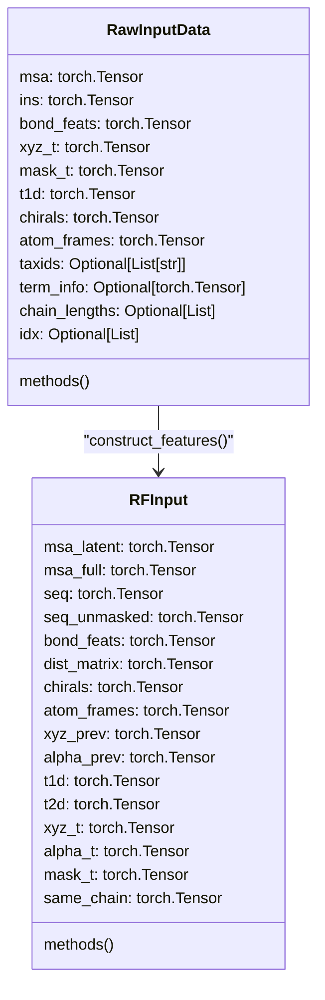
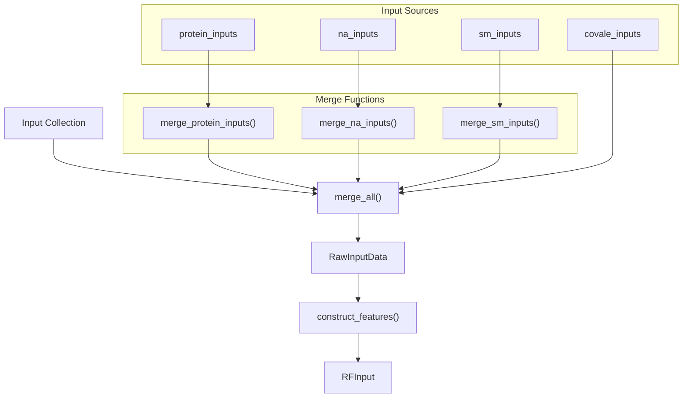
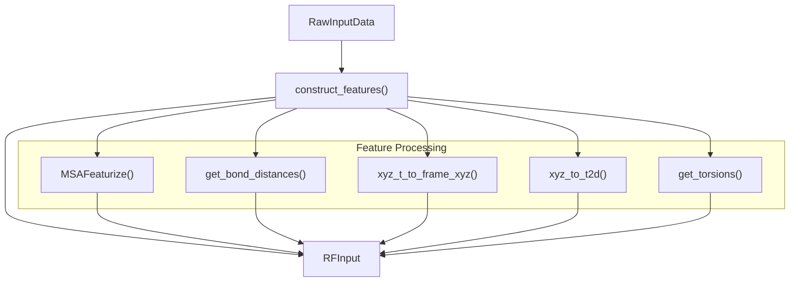
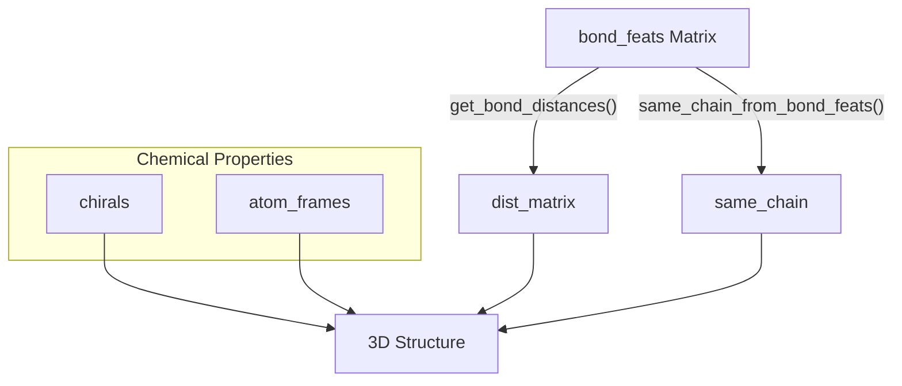

# Core Concepts

# Core Concepts

> **Relevant source files**
> - [README\.md](https://github.com/baker-laboratory/RoseTTAFold-All-Atom/blob/6c851405/README.md?plain=1)
> - [rf2aa/data/data\_loader\.py](https://github.com/baker-laboratory/RoseTTAFold-All-Atom/blob/6c851405/rf2aa/data/data_loader.py)
> - [rf2aa/data/merge\_inputs\.py](https://github.com/baker-laboratory/RoseTTAFold-All-Atom/blob/6c851405/rf2aa/data/merge_inputs.py)

 This page explains the fundamental concepts, terminology, and data structures used in RoseTTAFold All\-Atom \(RFAA\)\. Understanding these concepts is essential for effectively using the system and interpreting its outputs\. For information about using RFAA for specific tasks, see [Using RFAA](https://deepwiki.com/baker-laboratory/RoseTTAFold-All-Atom/4-using-rfaa), and for details on the system architecture, see [System Architecture](https://deepwiki.com/baker-laboratory/RoseTTAFold-All-Atom/5-system-architecture)\.

## Data Structures

 RFAA employs two primary data structures for representing biomolecular information during prediction:

 Sources: [data\_loader\.py L13-L163](https://github.com/baker-laboratory/RoseTTAFold-All-Atom/blob/6c851405/rf2aa/data/data_loader.py#L13-L163)

### RawInputData

 `RawInputData` is the initial representation of input data after parsing and initial processing:

 - `msa`: Multiple Sequence Alignment tensor
- `ins`: Insertion information for the MSA
- `bond_feats`: Bond connectivity matrix between residues/atoms
- `xyz_t`: Template coordinates \(shape: \[templates, residues, atoms, 3\]\)
- `mask_t`: Template coordinate mask \(valid/invalid positions\)
- `t1d`: 1D template features
- `chirals`: Chirality information for chemical groups
- `atom_frames`: Coordinate frames for atoms
- `chain_lengths`: List of \(chain\_id, length\) tuples for each chain

 Important methods include:

 - `length()`: Returns the sequence length
- `sequence_string()`: Returns the amino acid sequence as a string
- `construct_features()`: Transforms raw data into model\-ready `RFInput`

 Sources: [data\_loader\.py L13-L106](https://github.com/baker-laboratory/RoseTTAFold-All-Atom/blob/6c851405/rf2aa/data/data_loader.py#L13-L106)

### RFInput

 `RFInput` is the fully processed, model\-ready data structure:

 - `msa_latent` and `msa_full`: Processed MSA features
- `seq`: Sequence features \(potentially masked for training\)
- `seq_unmasked`: Original unmasked sequence
- `dist_matrix`: Matrix of bond distances
- `t1d` and `t2d`: 1D and 2D template features
- `xyz_t`: Template backbone coordinates
- `alpha_t`: Template torsion angles
- Recycling states \(`msa_prev`, `pair_prev`, `state_prev`\)

 Sources: [data\_loader\.py L166-L202](https://github.com/baker-laboratory/RoseTTAFold-All-Atom/blob/6c851405/rf2aa/data/data_loader.py#L166-L202)

## Input Types and Merging

 RFAA can process multiple types of biomolecular inputs that need to be merged before prediction:

 Sources: [merge\_inputs\.py L9-L204](https://github.com/baker-laboratory/RoseTTAFold-All-Atom/blob/6c851405/rf2aa/data/merge_inputs.py#L9-L204)

### Protein Inputs

 Protein inputs are provided as FASTA files and processed into MSAs \(Multiple Sequence Alignments\)\. When multiple protein chains are present, the system can:

 1. Detect identical sequences and avoid redundant MSA generation
2. Merge MSAs by taxonomy IDs when sequences are different
3. Combine template information across chains

 Sources: [merge\_inputs\.py L9-L86](https://github.com/baker-laboratory/RoseTTAFold-All-Atom/blob/6c851405/rf2aa/data/merge_inputs.py#L9-L86)

### Nucleic Acid Inputs

 Nucleic acid inputs \(DNA or RNA\) are provided as FASTA files\. They don't undergo MSA generation but are incorporated into the merged structure with appropriate bond features\.

 Sources: [merge\_inputs\.py L88-L95](https://github.com/baker-laboratory/RoseTTAFold-All-Atom/blob/6c851405/rf2aa/data/merge_inputs.py#L88-L95)

### Small Molecule Inputs

 Small molecule inputs are provided as SDF files or SMILES strings\. Their features are merged into the overall structure with appropriate atom types and bond connectivity\.

 Sources: [merge\_inputs\.py L97-L104](https://github.com/baker-laboratory/RoseTTAFold-All-Atom/blob/6c851405/rf2aa/data/merge_inputs.py#L97-L104)

### Input Merging Process

 The `merge_all()` function coordinates the merging of all input types:

 1. Merge protein inputs with `merge_protein_inputs()`
2. Merge nucleic acid inputs with `merge_na_inputs()`
3. Merge small molecule inputs with `merge_sm_inputs()`
4. Combine all inputs into a single `RawInputData` object
5. Update bond features if covalent modifications are present

 Sources: [merge\_inputs\.py L161-L204](https://github.com/baker-laboratory/RoseTTAFold-All-Atom/blob/6c851405/rf2aa/data/merge_inputs.py#L161-L204)

## Feature Construction

 Once inputs are merged, the `construct_features()` method transforms `RawInputData` into `RFInput`:

 Sources: [data\_loader\.py L107-L163](https://github.com/baker-laboratory/RoseTTAFold-All-Atom/blob/6c851405/rf2aa/data/data_loader.py#L107-L163)

 Key feature construction steps include:

 1. **MSA Featurization**: Converts raw MSA data into embeddings suitable for the model
2. **Bond Feature Processing**: Calculates distance matrices from bond connectivity
3. **Template Processing**: Prepares template coordinates and angles for use by the model
4. **Coordinate Frame Conversion**: Transforms absolute coordinates into local frames

 Sources: [data\_loader\.py L107-L163](https://github.com/baker-laboratory/RoseTTAFold-All-Atom/blob/6c851405/rf2aa/data/data_loader.py#L107-L163)

## Multiple Sequence Alignments \(MSAs\)

 MSAs are a core concept in protein structure prediction:

| Term | Description |
| --- | --- |
| MSA | A collection of similar protein sequences aligned to show evolutionary relationships |
| Insertion | Regions where the aligned sequences have insertions relative to the query sequence |
| Taxa ID | Taxonomic identifier used to cluster sequences by evolutionary distance |

 MSAs provide evolutionary information that helps predict protein structure by revealing which positions are conserved \(functionally/structurally important\) versus variable\.

 Sources: [README\.md?plain=1 L63-L76](https://github.com/baker-laboratory/RoseTTAFold-All-Atom/blob/6c851405/README.md?plain=1#L63-L76)

## Templates

 Templates are known protein structures that can guide prediction:

| Term | Description |
| --- | --- |
| xyz\_t | 3D coordinates from template structures |
| mask\_t | Binary mask indicating valid template positions |
| t1d | 1D template features \(sequence profile\) |
| t2d | 2D template features \(distance maps\) |

 Templates provide structural information from homologous proteins that can improve prediction accuracy, especially for proteins with known structural homologs\.

 Sources: [data\_loader\.py L107-L163](https://github.com/baker-laboratory/RoseTTAFold-All-Atom/blob/6c851405/rf2aa/data/data_loader.py#L107-L163)

## Bond Features and Chemical Properties

 Bond features represent connectivity between residues and atoms:

 Sources: [data\_loader\.py L107-L163](https://github.com/baker-laboratory/RoseTTAFold-All-Atom/blob/6c851405/rf2aa/data/data_loader.py#L107-L163)

 Key chemical concepts include:

 1. **Bond Features**: Matrix encoding covalent connectivity between residues/atoms
2. **Chirality**: Information about stereochemistry of chiral centers
3. **Atom Frames**: Local coordinate systems for atoms in small molecules or modified residues

 Sources: [README\.md?plain=1 L214-L263](https://github.com/baker-laboratory/RoseTTAFold-All-Atom/blob/6c851405/README.md?plain=1#L214-L263)

## Confidence Metrics

 RFAA provides several metrics to assess prediction quality:

| Metric | Description |
| --- | --- |
| pLDDT | Per\-residue Local Distance Difference Test \- measures local structure confidence |
| pAE | Predicted Aligned Error \- predicts error if one part of the structure is aligned |
| pDE | Predicted Distance Error \- predicts error in pairwise distances between positions |
| pAE\_inter | Mean pAE between different molecule types \- key metric for interface quality |

 Higher pLDDT values and lower pAE/pDE values indicate more confident predictions\.

 Sources: [README\.md?plain=1 L266-L282](https://github.com/baker-laboratory/RoseTTAFold-All-Atom/blob/6c851405/README.md?plain=1#L266-L282)

## Chain Management

 RFAA handles multiple chains through several mechanisms:

 1. **Chain IDs**: Each input is assigned a chain identifier \(A, B, C, etc\.\)
2. **Chain Lengths**: Tracked in a list of \(chain\_id, length\) tuples
3. **Same Chain Indicator**: Binary matrix indicating positions in the same chain
4. **Chain Bins**: Track the start and end indices of each chain in the merged sequence

 These mechanisms enable RFAA to properly model interactions between different chains and molecules\.

 Sources: [merge\_inputs\.py L161-L207](https://github.com/baker-laboratory/RoseTTAFold-All-Atom/blob/6c851405/rf2aa/data/merge_inputs.py#L161-L207) [data\_loader\.py L37-L50](https://github.com/baker-laboratory/RoseTTAFold-All-Atom/blob/6c851405/rf2aa/data/data_loader.py#L37-L50)

## Recycling

 RFAA employs an iterative refinement process called "recycling":

| Term | Description |
| --- | --- |
| msa\_prev | MSA embedding from previous cycle |
| pair\_prev | Pairwise features from previous cycle |
| state\_prev | Hidden state from previous cycle |
| MAXCYCLE | Maximum number of recycling iterations |

 Recycling improves prediction quality by feeding outputs from previous iterations back as inputs, allowing the model to refine its predictions iteratively\.

 Sources: [README\.md?plain=1 L87-L90](https://github.com/baker-laboratory/RoseTTAFold-All-Atom/blob/6c851405/README.md?plain=1#L87-L90)

---
*Source: [https://deepwiki.com/baker-laboratory/RoseTTAFold-All-Atom/3-core-concepts](https://deepwiki.com/baker-laboratory/RoseTTAFold-All-Atom/3-core-concepts) on DeepWiki*