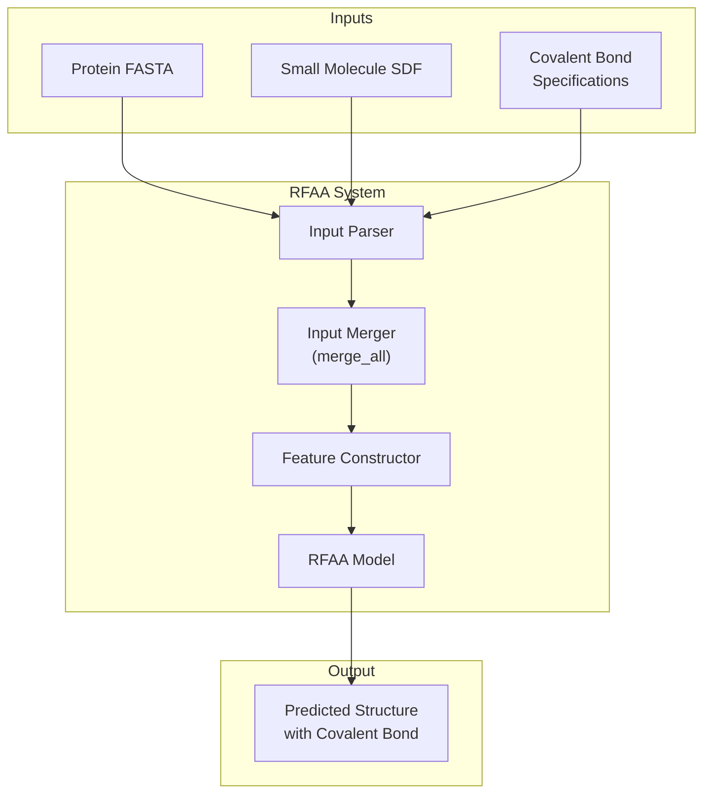
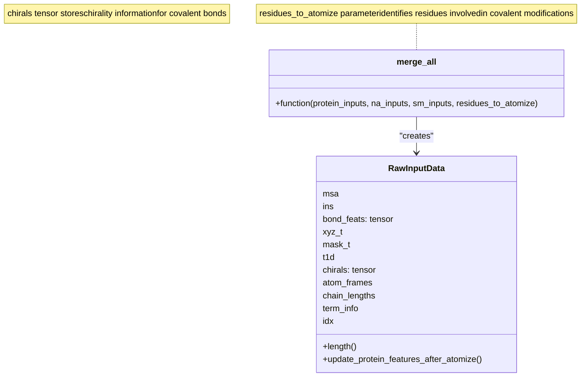
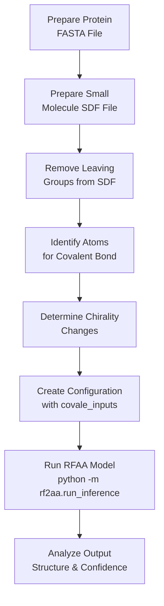

# Covalent Modifications

# Covalent Modifications

> **Relevant source files**
> - [README\.md](https://github.com/baker-laboratory/RoseTTAFold-All-Atom/blob/6c851405/README.md?plain=1)
> - [rf2aa/data/merge\_inputs\.py](https://github.com/baker-laboratory/RoseTTAFold-All-Atom/blob/6c851405/rf2aa/data/merge_inputs.py)

## Purpose and Scope

 This document explains how to specify and model covalent bonds between proteins and small molecules in RoseTTAFold All\-Atom \(RFAA\)\. It covers the syntax for specifying covalent bonds, how chirality is handled, important considerations for preparing input files, and a complete example configuration\. For information about handling small molecules without covalent bonds, see [Protein\-Small Molecule Complex](https://deepwiki.com/baker-laboratory/RoseTTAFold-All-Atom/6.3-protein-small-molecule-complex)\.

## Overview of Covalent Modifications in RFAA

 RFAA can predict structures of proteins with covalent modifications, such as glycosylation, lipidation, and other post\-translational modifications\. These involve forming new bonds between specific atoms on a protein and atoms on a small molecule\.



 Sources: [README\.md?plain=1 L208-L264](https://github.com/baker-laboratory/RoseTTAFold-All-Atom/blob/6c851405/README.md?plain=1#L208-L264)

## Covalent Bond Specification Syntax

 To specify covalent bonds in RFAA, you use the `covale_inputs` parameter in your configuration file\. The syntax requires three components:

```
(protein_chain, residue_number, atom_name), (small_molecule_chain, atom_index), (new_chirality_atom_1, new_chirality_atom_2)
```

 Where:

 - `protein_chain`: Chain identifier for the protein \(e\.g\., "A"\)
- `residue_number`: 1\-indexed residue number in the protein
- `atom_name`: Name of the atom in the residue \(e\.g\., "ND2" for asparagine's delta nitrogen\)
- `small_molecule_chain`: Chain identifier for the small molecule \(e\.g\., "B"\)
- `atom_index`: 1\-indexed atom index in the small molecule
- `new_chirality_atom_1` and `new_chirality_atom_2`: Chirality specifications

 Due to Hydra's parsing rules, you must escape the quotes with backslashes:

```
covale_inputs: "[((\"A\", \"74\", \"ND2\"), (\"B\", \"1\"), (\"CW\", \"null\"))]"
```

 Sources: [README\.md?plain=1 L208-L264](https://github.com/baker-laboratory/RoseTTAFold-All-Atom/blob/6c851405/README.md?plain=1#L208-L264)

## Handling Chirality

 Forming covalent bonds can create or modify chiral centers\. RFAA needs explicit information about these changes to predict the correct structure\.

### Chirality Options:

 - `"CW"`: Clockwise chirality
- `"CCW"`: Counterclockwise chirality
- `"null"`: No change in chirality

 When chirality doesn't change, specify:

```
(protein_chain, residue_number, atom_name), (small_molecule_chain, atom_index), ("null", "null")
```

 Sources: [README\.md?plain=1 L214-L227](https://github.com/baker-laboratory/RoseTTAFold-All-Atom/blob/6c851405/README.md?plain=1#L214-L227)

## Implementation Details

 When covalent bonds are specified, the bond information is integrated during input merging:



 The `merge_all` function in `merge_inputs.py` handles integrating data from proteins, nucleic acids, and small molecules, including covalent bond information\. When covalent modifications are present, affected protein residues may need to be "atomized" \(represented at the atomic level rather than residue level\)\.

 Sources: [merge\_inputs\.py L161-L204](https://github.com/baker-laboratory/RoseTTAFold-All-Atom/blob/6c851405/rf2aa/data/merge_inputs.py#L161-L204)

## Important Considerations

 When working with covalent modifications in RFAA, be aware of these requirements:

 1. **SDF format requirement**: For covalently modified proteins, you must provide the input molecule as an SDF file, not a SMILES string, since atom ordering matters\.
2. **No bonds between small molecules**: You cannot define bonds between two small molecule chains\. If a PDB defines a molecule across multiple residues, merge them into a single SDF file first\.
3. **Leaving groups handling**: You must remove any leaving groups from your input small molecules before input\. The code will automatically handle leaving groups on the protein sidechain being modified\.
4. **Complete chirality specification**: The code will raise an exception if there's a chiral center that OpenBabel identified but you didn't specify\. Even if you believe OpenBabel is wrong, specify chirality at those positions for best results\.

 Sources: [README\.md?plain=1 L222-L233](https://github.com/baker-laboratory/RoseTTAFold-All-Atom/blob/6c851405/README.md?plain=1#L222-L233)

## Example Configuration

 Below is a complete example configuration for predicting a glycosylated protein structure:

```yaml
defaults:  - base job_name: 7s69_A protein_inputs:   A:     fasta_file: examples/protein/7s69_A.fasta sm_inputs:  B:     input: examples/small_molecule/7s69_glycan.sdf    input_type: sdf covale_inputs: "[((\"A\", \"74\", \"ND2\"), (\"B\", \"1\"), (\"CW\", \"null\"))]" loader_params:  MAXCYCLE: 10
```

 This configuration:

 1. Uses the base parameters
2. Sets a job name
3. Specifies protein chain A from a FASTA file
4. Specifies small molecule chain B from an SDF file
5. Creates a covalent bond between ND2 atom of residue 74 in chain A and atom 1 in chain B
6. Indicates that the first atom's chirality changes to "CW" while the second atom's chirality doesn't change
7. Increases the recycling cycles from the default 4 to 10 for better results

 Sources: [README\.md?plain=1 L233-L253](https://github.com/baker-laboratory/RoseTTAFold-All-Atom/blob/6c851405/README.md?plain=1#L233-L253)

## Workflow Summary



 Sources: [README\.md?plain=1 L208-L264](https://github.com/baker-laboratory/RoseTTAFold-All-Atom/blob/6c851405/README.md?plain=1#L208-L264)

---
*Source: [https://deepwiki.com/baker-laboratory/RoseTTAFold-All-Atom/4.3-covalent-modifications](https://deepwiki.com/baker-laboratory/RoseTTAFold-All-Atom/4.3-covalent-modifications) on DeepWiki*