# Data Loading and Parsing

# Data Loading and Parsing

> **Relevant source files**
> - [rf2aa/data/data\_loader\_utils\.py](https://github.com/baker-laboratory/RoseTTAFold-All-Atom/blob/6c851405/rf2aa/data/data_loader_utils.py)
> - [rf2aa/data/parsers\.py](https://github.com/baker-laboratory/RoseTTAFold-All-Atom/blob/6c851405/rf2aa/data/parsers.py)
> - [rf2aa/data/protein\.py](https://github.com/baker-laboratory/RoseTTAFold-All-Atom/blob/6c851405/rf2aa/data/protein.py)

 This page documents the data loading and parsing subsystem of RoseTTAFold All\-Atom \(RFAA\), which is responsible for processing various input files into standardized formats suitable for structure prediction\. The subsystem handles multiple types of biomolecular data including proteins, nucleic acids, and small molecules, converting raw inputs into feature representations required by the neural network models\.

 For information about how inputs are merged after loading, see [Input Merging](https://deepwiki.com/baker-laboratory/RoseTTAFold-All-Atom/5.2-input-merging)\. For details on the inference pipeline that uses these parsed inputs, see [Inference Pipeline](https://deepwiki.com/baker-laboratory/RoseTTAFold-All-Atom/5.4-inference-pipeline)\.

## System Overview

 The data loading and parsing system converts various biological data formats into structured representations that can be used by the RFAA neural network\. This process involves several key stages:

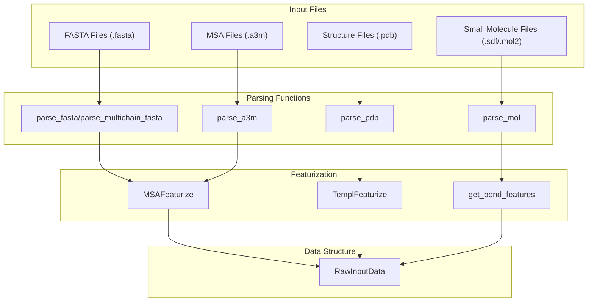

 Sources: [parsers\.py L1-L813](https://github.com/baker-laboratory/RoseTTAFold-All-Atom/blob/6c851405/rf2aa/data/parsers.py#L1-L813) [data\_loader\_utils\.py L1-L910](https://github.com/baker-laboratory/RoseTTAFold-All-Atom/blob/6c851405/rf2aa/data/data_loader_utils.py#L1-L910) [protein\.py L1-L94](https://github.com/baker-laboratory/RoseTTAFold-All-Atom/blob/6c851405/rf2aa/data/protein.py#L1-L94)

## File Format Parsing

 RFAA supports several standard biological file formats, each parsed by specialized functions to extract relevant information\.

### A3M Files \(Multiple Sequence Alignments\)

 A3M files contain multiple sequence alignments \(MSAs\) which provide evolutionary information crucial for structure prediction\. The `parse_a3m` function handles these files:

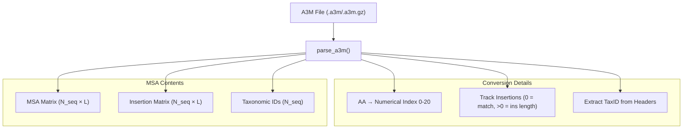

 Sources: [parsers\.py L401-L480](https://github.com/baker-laboratory/RoseTTAFold-All-Atom/blob/6c851405/rf2aa/data/parsers.py#L401-L480)

### PDB Files \(3D Structures\)

 PDB files contain 3D structural coordinates used primarily for template information\. The `parse_pdb` function extracts atom positions and other structural details:

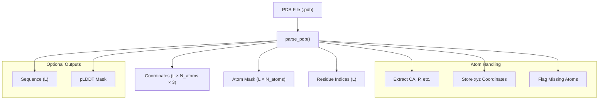

 Sources: [parsers\.py L485-L548](https://github.com/baker-laboratory/RoseTTAFold-All-Atom/blob/6c851405/rf2aa/data/parsers.py#L485-L548)

### FASTA Files \(Sequences\)

 FASTA files provide the primary sequence information\. RFAA includes several parsing functions for different FASTA variants:

 - `parse_fasta`: Basic FASTA parser
- `parse_multichain_fasta`: Handles multiple chains separated by '/'
- `parse_mixed_fasta`: Processes protein/nucleic acid combinations

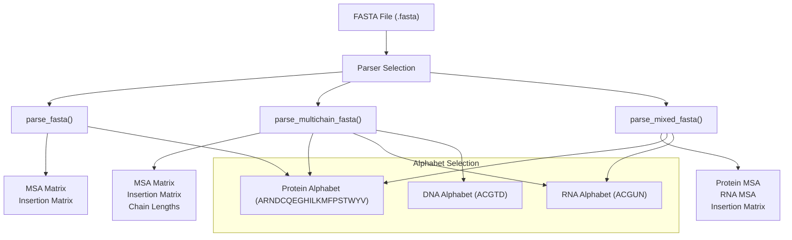

 Sources: [parsers\.py L152-L313](https://github.com/baker-laboratory/RoseTTAFold-All-Atom/blob/6c851405/rf2aa/data/parsers.py#L152-L313)

### Small Molecule Files \(SDF/MOL2\)

 Small molecule structures are parsed from SDF or MOL2 files using the `parse_mol` function, which leverages OpenBabel for chemical structure handling:

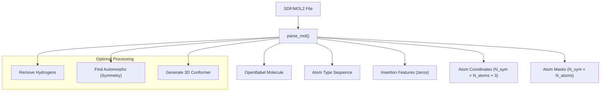

 Sources: [parsers\.py L744-L812](https://github.com/baker-laboratory/RoseTTAFold-All-Atom/blob/6c851405/rf2aa/data/parsers.py#L744-L812)

## MSA Processing and Featurization

 Once MSAs are parsed from files, they undergo extensive processing to extract features for the neural network model\.

### MSA Featurization

 The `MSAFeaturize` function transforms raw MSA data into feature representations:

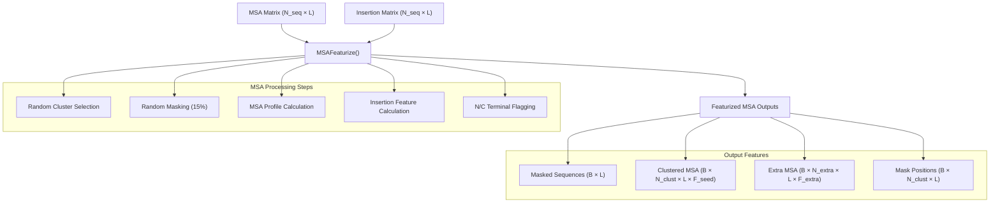

 Sources: [data\_loader\_utils\.py L55-L246](https://github.com/baker-laboratory/RoseTTAFold-All-Atom/blob/6c851405/rf2aa/data/data_loader_utils.py#L55-L246)

### MSA Merging

 For multi\-chain proteins, MSAs for individual chains need to be merged\. RFAA provides specialized functions:

 - `merge_a3m_hetero`: Merges MSAs from different proteins \(heteromers\)
- `merge_a3m_homo`: Handles repeated units in homo\-oligomers
- `join_msas_by_taxid`: Pairs sequences in different MSAs by taxonomic ID

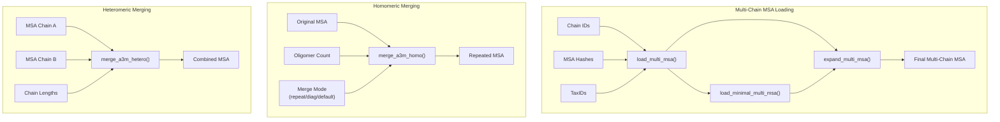

 Sources: [data\_loader\_utils\.py L370-L458](https://github.com/baker-laboratory/RoseTTAFold-All-Atom/blob/6c851405/rf2aa/data/data_loader_utils.py#L370-L458) [data\_loader\_utils\.py L506-L840](https://github.com/baker-laboratory/RoseTTAFold-All-Atom/blob/6c851405/rf2aa/data/data_loader_utils.py#L506-L840)

## Template Processing

 Templates provide structural information that guides the prediction process\. RFAA includes functions for processing template structures:

### Template Featurization

 The `TemplFeaturize` function converts template structures into features for the model:

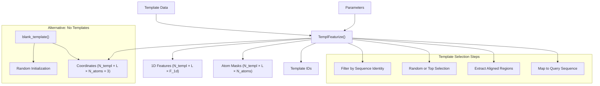

 Sources: [data\_loader\_utils\.py L264-L319](https://github.com/baker-laboratory/RoseTTAFold-All-Atom/blob/6c851405/rf2aa/data/data_loader_utils.py#L264-L319) [data\_loader\_utils\.py L248-L261](https://github.com/baker-laboratory/RoseTTAFold-All-Atom/blob/6c851405/rf2aa/data/data_loader_utils.py#L248-L261)

### Template Parsing

 Template information is typically extracted from HHR/ATAB files generated by HHsearch:

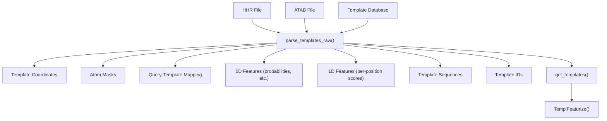

 Sources: [parsers\.py L624-L726](https://github.com/baker-laboratory/RoseTTAFold-All-Atom/blob/6c851405/rf2aa/data/parsers.py#L624-L726) [protein\.py L10-L52](https://github.com/baker-laboratory/RoseTTAFold-All-Atom/blob/6c851405/rf2aa/data/protein.py#L10-L52)

## Data Structure Integration

 The parsed and processed data is integrated into a `RawInputData` structure that is used by the rest of the system:

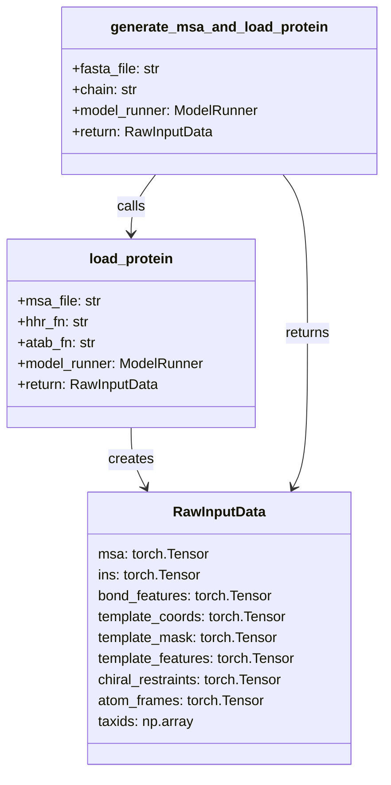

 Sources: [protein\.py L55-L94](https://github.com/baker-laboratory/RoseTTAFold-All-Atom/blob/6c851405/rf2aa/data/protein.py#L55-L94)

## Data Transformation Flow

 The complete data flow from input files to model\-ready features follows this path:

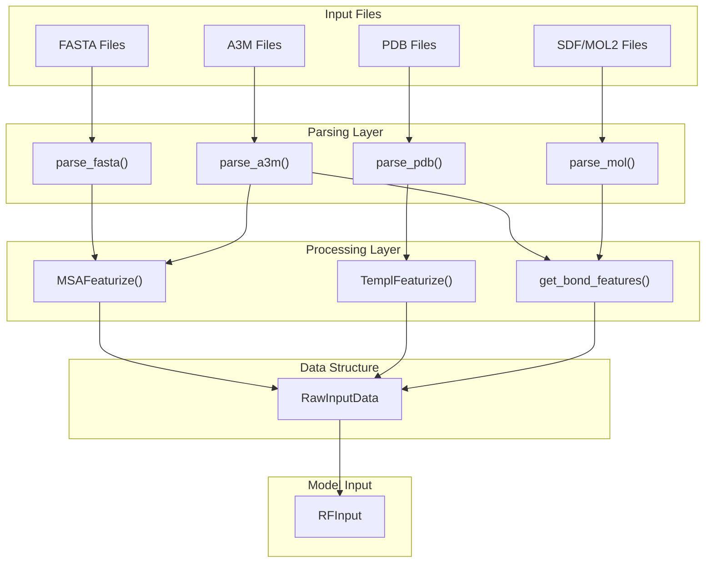

 Sources: [parsers\.py L1-L813](https://github.com/baker-laboratory/RoseTTAFold-All-Atom/blob/6c851405/rf2aa/data/parsers.py#L1-L813) [data\_loader\_utils\.py L1-L910](https://github.com/baker-laboratory/RoseTTAFold-All-Atom/blob/6c851405/rf2aa/data/data_loader_utils.py#L1-L910) [protein\.py L1-L94](https://github.com/baker-laboratory/RoseTTAFold-All-Atom/blob/6c851405/rf2aa/data/protein.py#L1-L94)

## Key Implementation Details

### A3M Parsing

 The `parse_a3m` function handles the extraction of MSA information from A3M files:

 1. Reads the file line by line \(supporting gzipped files\)
2. Extracts taxonomic IDs from headers
3. Processes sequence lines and records insertion information
4. Converts amino acid letters to numeric indices \(0\-20\)
5. Returns MSA matrix, insertion matrix, and taxonomic IDs

 Sources: [parsers\.py L401-L480](https://github.com/baker-laboratory/RoseTTAFold-All-Atom/blob/6c851405/rf2aa/data/parsers.py#L401-L480)

### MSA Featurization

 The `MSAFeaturize` function transforms raw MSA data into features:

 1. Takes MSA and insertion matrices as input
2. Performs block deletion for data augmentation
3. Clusters sequences and applies random masking
4. Calculates profiles and insertion statistics
5. Returns multiple feature representations for the model

 Sources: [data\_loader\_utils\.py L55-L246](https://github.com/baker-laboratory/RoseTTAFold-All-Atom/blob/6c851405/rf2aa/data/data_loader_utils.py#L55-L246)

### Template Processing

 Template processing involves:

 1. Parsing template files \(HHR/ATAB\) to extract alignments and scores
2. Selecting templates based on sequence identity and coverage
3. Extracting coordinates, masks, and features from template structures
4. Mapping template residues to query sequence positions
5. Creating blank templates when no suitable templates are available

 Sources: [parsers\.py L624-L726](https://github.com/baker-laboratory/RoseTTAFold-All-Atom/blob/6c851405/rf2aa/data/parsers.py#L624-L726) [data\_loader\_utils\.py L264-L319](https://github.com/baker-laboratory/RoseTTAFold-All-Atom/blob/6c851405/rf2aa/data/data_loader_utils.py#L264-L319)

## Summary

 The data loading and parsing subsystem in RFAA provides a sophisticated framework for processing diverse biomolecular input formats and converting them into standardized feature representations\. This system handles:

 - Protein sequences and multiple sequence alignments
- Nucleic acid sequences
- Small molecule structures
- Template structures
- Multi\-chain complexes \(both heteromers and homomers\)

 The processed data feeds into the structure prediction pipeline, providing the neural network models with the features needed for accurate structure prediction\.

 Sources: [parsers\.py L1-L813](https://github.com/baker-laboratory/RoseTTAFold-All-Atom/blob/6c851405/rf2aa/data/parsers.py#L1-L813) [data\_loader\_utils\.py L1-L910](https://github.com/baker-laboratory/RoseTTAFold-All-Atom/blob/6c851405/rf2aa/data/data_loader_utils.py#L1-L910) [protein\.py L1-L94](https://github.com/baker-laboratory/RoseTTAFold-All-Atom/blob/6c851405/rf2aa/data/protein.py#L1-L94)

---
*Source: [https://deepwiki.com/baker-laboratory/RoseTTAFold-All-Atom/5.3-data-loading-and-parsing](https://deepwiki.com/baker-laboratory/RoseTTAFold-All-Atom/5.3-data-loading-and-parsing) on DeepWiki*