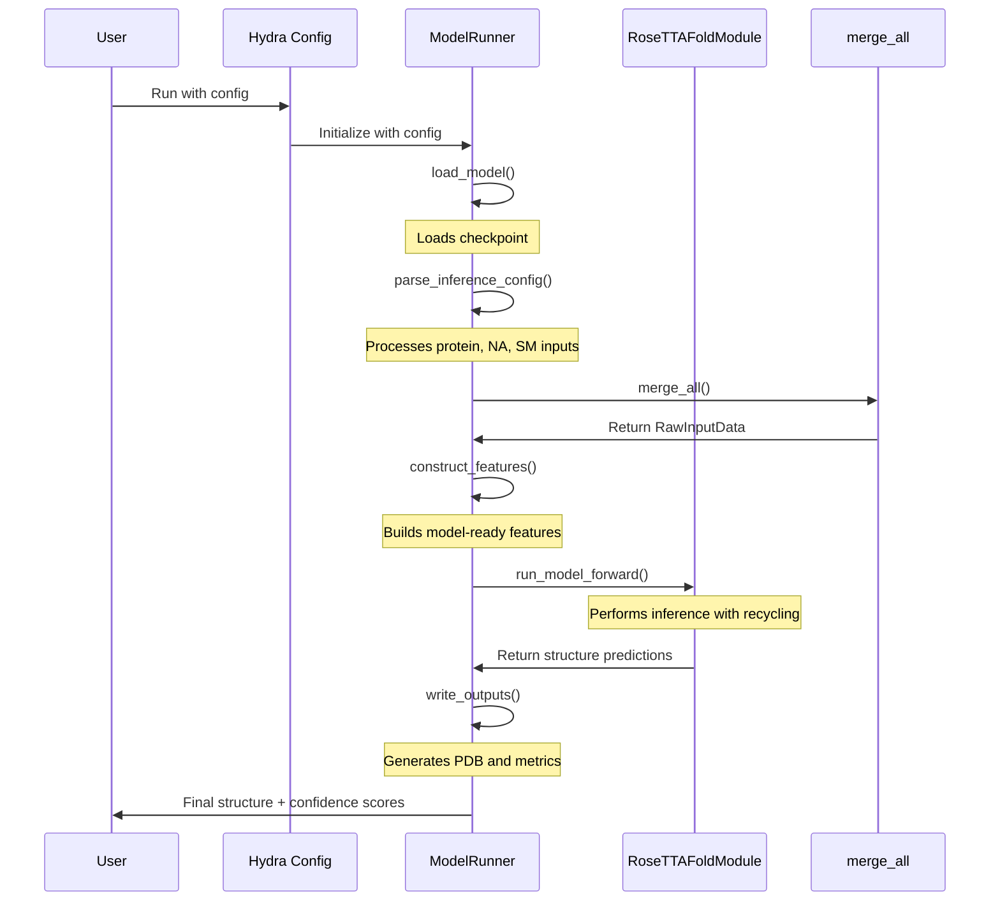
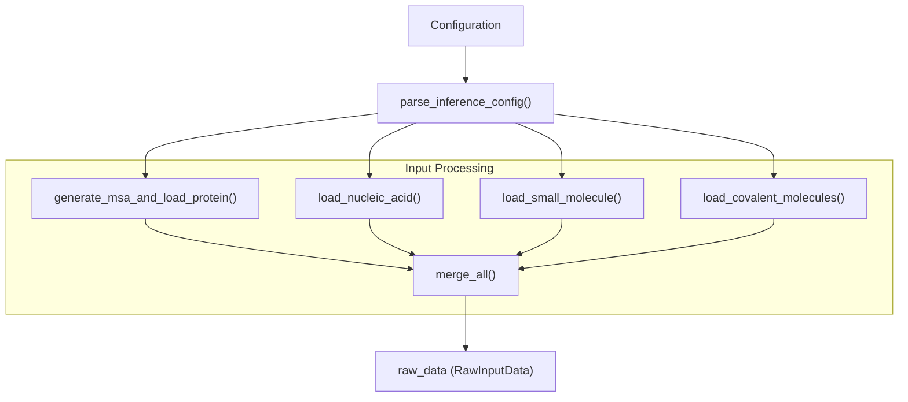
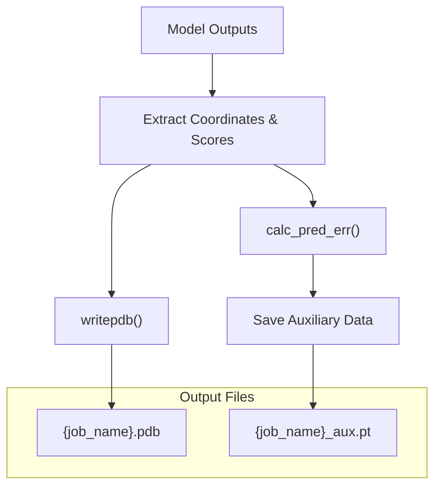

# Inference Pipeline

# Inference Pipeline

> **Relevant source files**
> - [rf2aa/run\_inference\.py](https://github.com/baker-laboratory/RoseTTAFold-All-Atom/blob/6c851405/rf2aa/run_inference.py)

## Purpose and Overview

 The Inference Pipeline is the core execution pathway in RoseTTAFold All\-Atom \(RFAA\) that transforms input biomolecular data into predicted 3D structures\. This page documents the pipeline's implementation, workflow, and components\. For information about preparing inputs for the pipeline, see [Input File Preparation](https://deepwiki.com/baker-laboratory/RoseTTAFold-All-Atom/4.2-input-file-preparation)\. For understanding the output files, see [Understanding Output Files](https://deepwiki.com/baker-laboratory/RoseTTAFold-All-Atom/4.4-understanding-output-files)\.

 The pipeline handles the complete inference process, including:

 - Loading and parsing diverse biomolecular inputs
- Constructing features suitable for the neural network
- Running the RoseTTAFold model with iterative refinement
- Calculating confidence metrics
- Generating output files

 Sources: [run\_inference\.py L20-L208](https://github.com/baker-laboratory/RoseTTAFold-All-Atom/blob/6c851405/rf2aa/run_inference.py#L20-L208)

## Pipeline Architecture

```mermaid
flowchart TD

User["User Input"]
Config["Hydra Configuration"]
Runner["ModelRunner"]
Load["load_model()"]
Parse["parse_inference_config()"]
Features["construct_features()"]
Forward["run_model_forward()"]
Write["write_outputs()"]
Protein["Protein FASTA"]
NA["Nucleic Acid FASTA"]
SM["Small Molecules (SDF/SMILES)"]
Covalent["Covalent Specifications"]
PDB["PDB Structure"]
Metrics["Confidence Metrics (PT file)"]

User --> Config
Config --> Runner
Runner --> Load
Protein --> Parse
NA --> Parse
SM --> Parse
Covalent --> Parse
Write --> PDB
Write --> Metrics

subgraph Outputs ["Outputs"]
    PDB
    Metrics
end

subgraph Inputs ["Inputs"]
    Protein
    NA
    SM
    Covalent
end

subgraph ModelRunner.infer() ["ModelRunner.infer()"]
    Load
    Parse
    Features
    Forward
    Write
    Load --> Parse
    Parse --> Features
    Features --> Forward
    Forward --> Write
end
```

 Sources: [run\_inference\.py L151-L156](https://github.com/baker-laboratory/RoseTTAFold-All-Atom/blob/6c851405/rf2aa/run_inference.py#L151-L156)

## Pipeline Workflow

 The inference pipeline is implemented in the `ModelRunner` class, which orchestrates the entire process from input to output\. The main workflow is executed through the `infer()` method, which calls the following sequence of operations:



 Sources: [run\_inference\.py L151-L156](https://github.com/baker-laboratory/RoseTTAFold-All-Atom/blob/6c851405/rf2aa/run_inference.py#L151-L156)

## Pipeline Components

### 1\. ModelRunner Initialization

 When the `ModelRunner` is first created, it:

 1. Stores the configuration
2. Initializes chemical data
3. Sets up FFindex database for templates
4. Determines the computation device \(CUDA GPU or CPU\)
5. Loads the molecular database

```
# Key initialization componentsinitialize_chemdata(self.config.chem_params)self.ffdb = FFindexDB(read_index(config.database_params.hhdb+'_pdb.ffindex'),                      read_data(config.database_params.hhdb+'_pdb.ffdata'))self.device = "cuda:0" if torch.cuda.is_available() else "cpu"
```

 Sources: [run\_inference\.py L21-L32](https://github.com/baker-laboratory/RoseTTAFold-All-Atom/blob/6c851405/rf2aa/run_inference.py#L21-L32)

### 2\. Model Loading

 The `load_model()` method initializes the neural network model:

 1. Creates a `RoseTTAFoldModule` instance with parameters from the config
2. Provides chemical data needed for structure prediction
3. Loads weights from a checkpoint file

| Chemical Data Parameters | Purpose |
| --- | --- |
| allatom\_mask | Masks for different atom types |
| atom\_type\_index | Mapping of atoms to indices |
| ljlk\_parameters | Lennard\-Jones parameters |
| num\_bonds | Bond count information |
| cb\_len, cb\_ang, cb\_tor | Backbone geometry parameters |

 Sources: [run\_inference\.py L96-L111](https://github.com/baker-laboratory/RoseTTAFold-All-Atom/blob/6c851405/rf2aa/run_inference.py#L96-L111)

### 3\. Input Processing

 The `parse_inference_config()` method processes all inputs specified in the configuration:



 Key features of input processing:

 - Ensures chain IDs are unique and valid
- Generates MSAs for protein sequences
- Handles covalent modifications between proteins and small molecules
- Creates a unified data representation through `merge_all()`

 Sources: [run\_inference\.py L34-L94](https://github.com/baker-laboratory/RoseTTAFold-All-Atom/blob/6c851405/rf2aa/run_inference.py#L34-L94)

### 4\. Feature Construction

 The `construct_features()` method transforms the raw input data into features suitable for the neural network model\. This is done by calling the `construct_features()` method on the `RawInputData` object:

```python
def construct_features(self):    return self.raw_data.construct_features(self)
```

 The feature construction process creates an `RFInput` object containing:

 - MSA features
- Template features
- Bond features
- Coordinate frames
- Chain relationship information

 Sources: [run\_inference\.py L112-L114](https://github.com/baker-laboratory/RoseTTAFold-All-Atom/blob/6c851405/rf2aa/run_inference.py#L112-L114)

### 5\. Model Forward Pass

 The `run_model_forward()` method handles the execution of the neural network:

 1. Prepares input features by adding batch dimension and moving to the correct device
2. Converts data types as needed \(e\.g\., bond features to long tensors\)
3. Runs the model with recycling for iterative refinement
4. Returns the model's predictions

```
# Key recycling implementationoutputs = recycle_step_legacy(self.model,                              input_dict,                              self.config.loader_params.MAXCYCLE,                              use_amp=False,                             nograds=True,                             force_device=self.device)
```

 The recycling process is a critical component that improves prediction accuracy by repeatedly feeding structure information back into the network\.

 Sources: [run\_inference\.py L115-L127](https://github.com/baker-laboratory/RoseTTAFold-All-Atom/blob/6c851405/rf2aa/run_inference.py#L115-L127)

### 6\. Output Generation

 The `write_outputs()` method processes the model predictions and generates the final outputs:

 1. Extracts structure coordinates and confidence scores from model outputs
2. Calculates prediction error metrics using `calc_pred_err()`
3. Writes the predicted structure to a PDB file
4. Saves auxiliary data including confidence metrics



 Sources: [run\_inference\.py L130-L149](https://github.com/baker-laboratory/RoseTTAFold-All-Atom/blob/6c851405/rf2aa/run_inference.py#L130-L149)

## Confidence Metrics Calculation

 The pipeline calculates several confidence metrics that assess prediction quality:

### pLDDT \(predicted Local Distance Difference Test\)

 The `lddt_unbin()` method calculates per\-residue confidence scores:

 - Converts softmax probabilities across bins to a single value
- Higher values \(closer to 1\.0\) indicate higher confidence
- Written as B\-factors in the output PDB file

 Sources: [run\_inference\.py L158-L165](https://github.com/baker-laboratory/RoseTTAFold-All-Atom/blob/6c851405/rf2aa/run_inference.py#L158-L165)

### PAE \(Predicted Aligned Error\)

 The `pae_unbin()` method calculates predicted errors in the alignment of residue pairs:

 - Represents the expected error in angstroms between residue pairs
- Lower values indicate higher confidence in the relative positioning
- Useful for assessing domain arrangements and interfaces

 Sources: [run\_inference\.py L167-L172](https://github.com/baker-laboratory/RoseTTAFold-All-Atom/blob/6c851405/rf2aa/run_inference.py#L167-L172)

### PDE \(Predicted Distance Error\)

 The `pde_unbin()` method calculates predicted errors in distances between residue pairs:

 - Similar to PAE but focuses specifically on distance errors
- Particularly useful for assessing interface quality

 Sources: [run\_inference\.py L174-L179](https://github.com/baker-laboratory/RoseTTAFold-All-Atom/blob/6c851405/rf2aa/run_inference.py#L174-L179)

### Summary Metrics

 The `calc_pred_err()` method calculates overall confidence statistics:

| Metric | Description |
| --- | --- |
| mean\_plddt | Average confidence across all residues |
| mean\_pae | Average alignment error across all residue pairs |
| pae\_prot | Average alignment error within protein regions |
| pae\_inter | Average alignment error at interfaces |

 The function also handles special cases for small molecules and interfaces:

 - Distinguishes between protein regions and small molecules
- Calculates interface\-specific metrics

 Sources: [run\_inference\.py L181-L200](https://github.com/baker-laboratory/RoseTTAFold-All-Atom/blob/6c851405/rf2aa/run_inference.py#L181-L200)

## Integration with Hydra Configuration

 The inference pipeline is configured through Hydra, which provides a flexible configuration system:

```python
@hydra.main(version_base=None, config_path='config/inference')def main(config):    runner = ModelRunner(config)    runner.infer()
```

 The configuration controls:

 - Input files and their types
- MSA generation parameters
- Model parameters
- Recycling iterations
- Output paths

 For details on the configuration options, see [Configuration System](https://deepwiki.com/baker-laboratory/RoseTTAFold-All-Atom/4.1-configuration-system)\.

 Sources: [run\_inference\.py L203-L206](https://github.com/baker-laboratory/RoseTTAFold-All-Atom/blob/6c851405/rf2aa/run_inference.py#L203-L206)

---
*Source: [https://deepwiki.com/baker-laboratory/RoseTTAFold-All-Atom/5.4-inference-pipeline](https://deepwiki.com/baker-laboratory/RoseTTAFold-All-Atom/5.4-inference-pipeline) on DeepWiki*