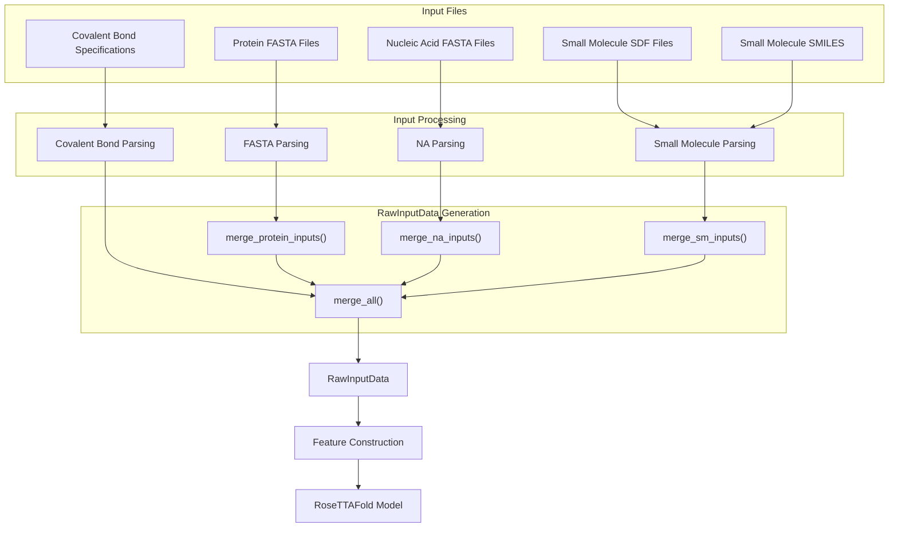

# Input File Preparation

# Input File Preparation

> **Relevant source files**
> - [README\.md](https://github.com/baker-laboratory/RoseTTAFold-All-Atom/blob/6c851405/README.md?plain=1)
> - [examples/nucleic\_acid/7u7w\_B\.fasta](https://github.com/baker-laboratory/RoseTTAFold-All-Atom/blob/6c851405/examples/nucleic_acid/7u7w_B.fasta)
> - [examples/protein/3fap\_A\.fasta](https://github.com/baker-laboratory/RoseTTAFold-All-Atom/blob/6c851405/examples/protein/3fap_A.fasta)
> - [examples/protein/3fap\_B\.fasta](https://github.com/baker-laboratory/RoseTTAFold-All-Atom/blob/6c851405/examples/protein/3fap_B.fasta)
> - [examples/small\_molecule/ARD\_ideal\.sdf](https://github.com/baker-laboratory/RoseTTAFold-All-Atom/blob/6c851405/examples/small_molecule/ARD_ideal.sdf)

 This page provides detailed information on how to prepare input files for RoseTTAFold All\-Atom \(RFAA\)\. Proper input file preparation is crucial for successful structure prediction with RFAA\. We will cover the preparation of FASTA files for proteins and nucleic acids, SDF/SMILES files for small molecules, and specifications for covalent bonds\.

 For information about the configuration system that references these input files, see [Configuration System](https://deepwiki.com/baker-laboratory/RoseTTAFold-All-Atom/4.1-configuration-system)\.

## Input Types Overview

 RFAA can predict structures for a variety of biomolecules and their complexes:

 - Protein monomers and complexes \(FASTA format\)
- Nucleic acids \- DNA and RNA \(FASTA format\)
- Small molecules and ligands \(SDF or SMILES format\)
- Covalent modifications between proteins and small molecules

 The following diagram illustrates the different input file types and how they flow through the RFAA system:



 Sources: [README\.md?plain=1 L86-L101](https://github.com/baker-laboratory/RoseTTAFold-All-Atom/blob/6c851405/README.md?plain=1#L86-L101)

## Protein Input Files

### FASTA Format Requirements

 Protein sequences should be provided in standard FASTA format:

 - The first line begins with `>` followed by an identifier/description
- Subsequent lines contain the protein sequence using standard one\-letter amino acid codes
- Multiple sequences \(for protein complexes\) require separate FASTA files

### Example Protein FASTA

```
>3FAP_1|Chain A|FK506-BINDING PROTEIN|Homo sapiens (9606)
GVQVETISPGDGRTFPKRGQTCVVHYTGMLEDGKKFDSSRDRNKPFKFMLGKQEVIRGWEEGVAQMSVGQRAKLTISPDYAYGATGHPGIIPPHATLVFDVELLKLE
```

 Note that the header format is flexible, but it's good practice to include information about the protein name, chain identifier, and organism\.

 Sources: [3fap\_A\.fasta L1-L2](https://github.com/baker-laboratory/RoseTTAFold-All-Atom/blob/6c851405/examples/protein/3fap_A.fasta#L1-L2)

## Nucleic Acid Input Files

### FASTA Format Requirements

 Nucleic acid sequences should also be provided in standard FASTA format:

 - The first line begins with `>` followed by an identifier/description
- Subsequent lines contain the nucleic acid sequence using standard nucleotide codes \(A, T, G, C for DNA; A, U, G, C for RNA\)
- When specifying in the configuration, you must indicate whether the sequence is DNA or RNA

### Example Nucleic Acid FASTA

```
>7U7W_2|Chain B[auth T]|DNA (5'-D(*CP*AP*TP*TP*AP*TP*GP*AP*CP*GP*CP*T)-3')|synthetic construct (32630)
CATTATGACGCT
```

 Sources: [7u7w\_B\.fasta L1-L2](https://github.com/baker-laboratory/RoseTTAFold-All-Atom/blob/6c851405/examples/nucleic_acid/7u7w_B.fasta#L1-L2)

## Small Molecule Input Files

 RFAA supports two formats for small molecule inputs:

### SDF Format

 Structure\-Data File \(SDF\) format is the preferred input format for small molecules, especially for complex structures and when covalent modifications are involved\.

 Key points about SDF files:

 - Contains 3D coordinates of atoms
- Includes bond information and connectivity
- May contain additional metadata \(e\.g\., SMILES string, InChI, etc\.\)
- Required for covalent modifications as atom indices must be precisely known

### SMILES Format

 Simplified Molecular Input Line Entry System \(SMILES\) is a string notation that represents the molecular structure\.

 Key points about SMILES:

 - Text\-based representation of chemical structures
- More compact than SDF
- Suitable for simple molecules
- Not recommended for covalent modifications due to potential atom ordering issues

### Example Small Molecule Input File

 Below is a simplified view of an SDF file structure\. Note that actual SDF files are more complex with specific formatting requirements:

```bash
ARD                             (Molecule name)
  -OEChem-02232415173D         (Program identifier)

150154  0     1  0  0  0  0  0999 V2000   (Counts line)
   -1.7790   -1.8400    2.4660 O   0  0  0  0  0  0  0  0  0  0  0  0  (Atom block)
   -0.5750   -1.3280    2.8030 C   0  0  0  0  0  0  0  0  0  0  0  0
   ...
  1  2  1  0  0  0  0                                     (Bond block)
  1 52  1  0  0  0  0
  ...
> <OPENEYE_ISO_SMILES>                                   (Property blocks)
Cc1ccc(s1)[C@@H]\2C[C@@H]3CC[C@H]...
> <OPENEYE_INCHI>
InChI=1S/C55H81NO12S/c1-32-16-12-11...
...
$$$$                                                      (End of record)
```

 Sources: [ARD\_ideal\.sdf L1-L322](https://github.com/baker-laboratory/RoseTTAFold-All-Atom/blob/6c851405/examples/small_molecule/ARD_ideal.sdf#L1-L322)

## Covalent Bond Specifications

 Covalent bonds between proteins and small molecules require specific formatting to correctly represent the bond formation\.

### Covalent Bond Syntax

 The format for specifying covalent bonds is:

```
[(("protein_chain", "residue_number", "atom_name"), ("small_molecule_chain", "atom_index"), ("new_chirality_atom_1", "new_chirality_atom_2"))]
```

 Important notes:

 - Protein chain refers to the chain identifier in the Hydra configuration \(e\.g\., "A"\)
- Residue number is 1\-indexed \(as in PDB files\)
- Atom name refers to standard PDB atom nomenclature \(e\.g\., "ND2" for the delta nitrogen in asparagine\)
- Small molecule chain refers to the chain identifier in the Hydra configuration
- Atom index is 1\-indexed \(as in the SDF file\)
- Chirality specifications can be "CW" \(clockwise\), "CCW" \(counterclockwise\), or "null" if chirality is unchanged

### Handling Chirality

 When forming covalent bonds, the chirality of atoms may change\. In most cases, you can specify \("null", "null"\) for unchanged chirality\. However, if chirality changes, you must specify the new chirality:

 - "CW" for clockwise chirality
- "CCW" for counterclockwise chirality

 The system will raise an exception if OpenBabel finds a chiral center that you didn't specify\.

### Example Covalent Bond Specification

 Here's an example of a covalent bond specification between residue 74 of protein chain A and atom 1 of small molecule chain B, with a change in chirality to clockwise:

```
[(("A", "74", "ND2"), ("B", "1"), ("CW", "null"))]
```

 When used in a Hydra configuration file, this needs to be properly escaped:

```
covale_inputs: "[((\"A\", \"74\", \"ND2\"), (\"B\", \"1\"), (\"CW\", \"null\"))]"
```

 Sources: [README\.md?plain=1 L209-L264](https://github.com/baker-laboratory/RoseTTAFold-All-Atom/blob/6c851405/README.md?plain=1#L209-L264)

## Special Considerations

### Leaving Groups

 When preparing input files for covalent modifications:

 - You must remove any leaving groups from the small molecule input
- The system will automatically handle leaving groups on the protein sidechain being modified
- Only specify the final structure of the small molecule after the leaving group has departed

### Multiple Chains and Molecules

 - Each protein chain requires a separate FASTA file
- Each strand of a double\-stranded DNA/RNA requires a separate FASTA file
- You cannot define covalent bonds between two small molecule chains
- For multi\-residue small molecules, merge them into a single SDF file before input

### MSA Generation

 RFAA automatically generates Multiple Sequence Alignments \(MSAs\) for protein inputs\. For details on this process, see [MSA Generation](https://deepwiki.com/baker-laboratory/RoseTTAFold-All-Atom/5.1-msa-generation)\.

 Sources: [README\.md?plain=1 L209-L264](https://github.com/baker-laboratory/RoseTTAFold-All-Atom/blob/6c851405/README.md?plain=1#L209-L264)

## Input Preparation Workflow

 The following diagram illustrates the typical workflow for preparing input files for RFAA:

  Sources: [README\.md?plain=1 L86-L101](https://github.com/baker-laboratory/RoseTTAFold-All-Atom/blob/6c851405/README.md?plain=1#L86-L101) [README\.md?plain=1 L209-L264](https://github.com/baker-laboratory/RoseTTAFold-All-Atom/blob/6c851405/README.md?plain=1#L209-L264)

## Summary

 Proper input file preparation is essential for successful structure prediction with RFAA\. This page covered:

 - Protein FASTA file requirements
- Nucleic acid FASTA file requirements
- Small molecule SDF/SMILES file preparation
- Covalent bond specification format and considerations

 After preparing all required input files, you'll need to reference them in a Hydra configuration file\. For information on creating these configuration files, see [Configuration System](https://deepwiki.com/baker-laboratory/RoseTTAFold-All-Atom/4.1-configuration-system)\.

---
*Source: [https://deepwiki.com/baker-laboratory/RoseTTAFold-All-Atom/4.2-input-file-preparation](https://deepwiki.com/baker-laboratory/RoseTTAFold-All-Atom/4.2-input-file-preparation) on DeepWiki*