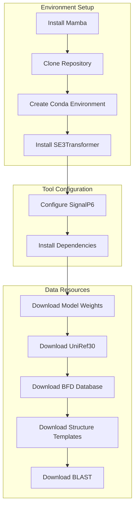
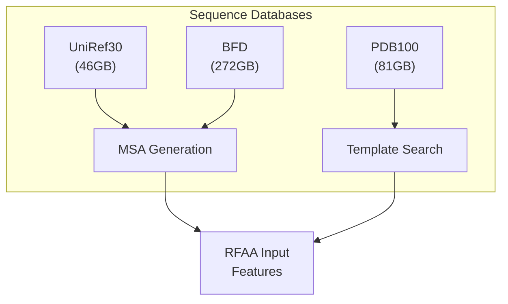
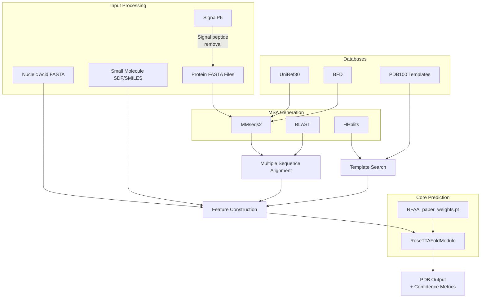

# Installation and Setup

# Installation and Setup

> **Relevant source files**
> - [\.gitignore](https://github.com/baker-laboratory/RoseTTAFold-All-Atom/blob/6c851405/.gitignore)
> - [README\.md](https://github.com/baker-laboratory/RoseTTAFold-All-Atom/blob/6c851405/README.md?plain=1)

 This page provides a comprehensive guide for installing RoseTTAFold All\-Atom \(RFAA\) and setting up the required environment, dependencies, and data resources\. For information about using the installed system, see [Using RFAA](https://deepwiki.com/baker-laboratory/RoseTTAFold-All-Atom/4-using-rfaa)\.

## Overview of Installation Process

 The installation of RFAA consists of several key steps, including environment setup, dependency installation, and downloading necessary data resources\. The diagram below illustrates the complete installation workflow\.



 Sources: [README\.md?plain=1 L21-L85](https://github.com/baker-laboratory/RoseTTAFold-All-Atom/blob/6c851405/README.md?plain=1#L21-L85)

## Environment Setup

### 1\. Install Mamba

 Mamba is a fast, cross\-platform package manager that we'll use to manage the RFAA environment\.

```
wget "https://github.com/conda-forge/miniforge/releases/latest/download/Mambaforge-$(uname)-$(uname -m).sh"bash Mambaforge-$(uname)-$(uname -m).sh  # accept all terms and install to the default locationrm Mambaforge-$(uname)-$(uname -m).sh    # (optionally) remove installer after using itsource ~/.bashrc                         # alternatively, restart your shell session
```

 Sources: [README\.md?plain=1 L24-L29](https://github.com/baker-laboratory/RoseTTAFold-All-Atom/blob/6c851405/README.md?plain=1#L24-L29)

### 2\. Clone the Repository

```
git clone https://github.com/baker-laboratory/RoseTTAFold-All-Atomcd RoseTTAFold-All-Atom
```

 Sources: [README\.md?plain=1 L31-L34](https://github.com/baker-laboratory/RoseTTAFold-All-Atom/blob/6c851405/README.md?plain=1#L31-L34)

### 3\. Create and Activate the Conda Environment

```
mamba env create -f environment.yamlconda activate RFAA  # NOTE: use conda to activate environments
```

 Sources: [README\.md?plain=1 L36-L38](https://github.com/baker-laboratory/RoseTTAFold-All-Atom/blob/6c851405/README.md?plain=1#L36-L38)

### 4\. Install SE3Transformer

```
cd rf2aa/SE3Transformer/pip3 install --no-cache-dir -r requirements.txtpython3 setup.py installcd ../../
```

 Sources: [README\.md?plain=1 L40-L44](https://github.com/baker-laboratory/RoseTTAFold-All-Atom/blob/6c851405/README.md?plain=1#L40-L44)

## Tool Configuration

### 1\. Configure SignalP6

 SignalP6 is used for signal peptide prediction and requires a licensed copy that you must download separately\.

```python
# Download from https://services.healthtech.dtu.dk/services/SignalP-6.0/signalp6-register signalp-6.0h.fast.tar.gz # Rename the model weightsmv $CONDA_PREFIX/lib/python3.10/site-packages/signalp/model_weights/distilled_model_signalp6.pt $CONDA_PREFIX/lib/python3.10/site-packages/signalp/model_weights/ensemble_model_signalp6.pt
```

 Sources: [README\.md?plain=1 L45-L52](https://github.com/baker-laboratory/RoseTTAFold-All-Atom/blob/6c851405/README.md?plain=1#L45-L52)

### 2\. Install Input Preparation Dependencies

```
bash install_dependencies.sh
```

 Sources: [README\.md?plain=1 L53-L56](https://github.com/baker-laboratory/RoseTTAFold-All-Atom/blob/6c851405/README.md?plain=1#L53-L56)

## Data Resources

### 1\. Download Model Weights

```
wget http://files.ipd.uw.edu/pub/RF-All-Atom/weights/RFAA_paper_weights.pt
```

 Sources: [README\.md?plain=1 L57-L60](https://github.com/baker-laboratory/RoseTTAFold-All-Atom/blob/6c851405/README.md?plain=1#L57-L60)

### 2\. Download Sequence Databases

 These databases are essential for MSA generation and template search\. Note that these are large files requiring significant disk space\.



#### UniRef30 Database \(46GB\)

```
wget http://wwwuser.gwdg.de/~compbiol/uniclust/2020_06/UniRef30_2020_06_hhsuite.tar.gzmkdir -p UniRef30_2020_06tar xfz UniRef30_2020_06_hhsuite.tar.gz -C ./UniRef30_2020_06
```

#### BFD Database \(272GB\)

```
wget https://bfd.mmseqs.com/bfd_metaclust_clu_complete_id30_c90_final_seq.sorted_opt.tar.gzmkdir -p bfdtar xfz bfd_metaclust_clu_complete_id30_c90_final_seq.sorted_opt.tar.gz -C ./bfd
```

#### Structure Templates \(81GB\)

```
wget https://files.ipd.uw.edu/pub/RoseTTAFold/pdb100_2021Mar03.tar.gztar xfz pdb100_2021Mar03.tar.gz
```

 Sources: [README\.md?plain=1 L61-L76](https://github.com/baker-laboratory/RoseTTAFold-All-Atom/blob/6c851405/README.md?plain=1#L61-L76)

### 3\. Download BLAST \(39MB\)

 BLAST is used for sequence similarity searches\.

```
wget https://ftp.ncbi.nlm.nih.gov/blast/executables/legacy.NOTSUPPORTED/2.2.26/blast-2.2.26-x64-linux.tar.gzmkdir -p blast-2.2.26tar -xf blast-2.2.26-x64-linux.tar.gz -C blast-2.2.26cp -r blast-2.2.26/blast-2.2.26/ blast-2.2.26_bkrm -r blast-2.2.26mv blast-2.2.26_bk/ blast-2.2.26
```

 Sources: [README\.md?plain=1 L77-L85](https://github.com/baker-laboratory/RoseTTAFold-All-Atom/blob/6c851405/README.md?plain=1#L77-L85)

## System Architecture Components

 The following diagram illustrates how the installed components connect to form the overall prediction system:



 Sources: [README\.md?plain=1 L6-L8](https://github.com/baker-laboratory/RoseTTAFold-All-Atom/blob/6c851405/README.md?plain=1#L6-L8)

## Installation Requirements

| Resource | Minimum Requirement | Recommended |
| --- | --- | --- |
| Disk Space | 400GB\+ | 500GB\+ |
| RAM | 16GB | 32GB\+ |
| GPU Memory | 8GB | 24GB\+ |
| CUDA Version | 11\.7\+ | 11\.7\+ |

## Verification of Installation

 To verify your installation, run a simple prediction test:

```
python -m rf2aa.run_inference --config-name protein
```

 If successful, you should see output files in the current directory, including a PDB file and confidence metrics\.

## Common Installation Issues

### 1\. SignalP6 Registration Problems

 If you encounter issues with SignalP6 registration:

 - Ensure you've correctly downloaded the licensed version
- Check that the path to the tarball is correct
- Verify that the model weight renaming step was successful

### 2\. Database Download Failures

 For large database downloads:

 - Consider using a download manager that supports resuming
- Verify disk space availability before starting downloads
- Ensure network stability for large transfers

### 3\. CUDA Compatibility Issues

 If you encounter CUDA\-related errors:

 - Check your NVIDIA driver version compatibility with CUDA 11\.7\+
- Verify that PyTorch was installed with CUDA support
- Run `nvidia-smi` to confirm GPU availability

 Sources: [README\.md?plain=1 L21-L85](https://github.com/baker-laboratory/RoseTTAFold-All-Atom/blob/6c851405/README.md?plain=1#L21-L85) [\.gitignore L1-L21](https://github.com/baker-laboratory/RoseTTAFold-All-Atom/blob/6c851405/.gitignore#L1-L21)

## Next Steps

 After completing the installation and setup process, you can proceed to learn about:

 - [Using RFAA](https://deepwiki.com/baker-laboratory/RoseTTAFold-All-Atom/4-using-rfaa) \- How to run predictions for different molecular types
- [Configuration System](https://deepwiki.com/baker-laboratory/RoseTTAFold-All-Atom/4.1-configuration-system) \- Details on Hydra configuration options
- [Input File Preparation](https://deepwiki.com/baker-laboratory/RoseTTAFold-All-Atom/4.2-input-file-preparation) \- How to prepare input files for predictions

---
*Source: [https://deepwiki.com/baker-laboratory/RoseTTAFold-All-Atom/2-installation-and-setup](https://deepwiki.com/baker-laboratory/RoseTTAFold-All-Atom/2-installation-and-setup) on DeepWiki*