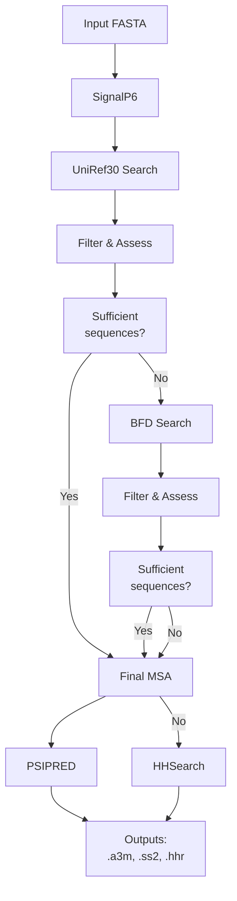
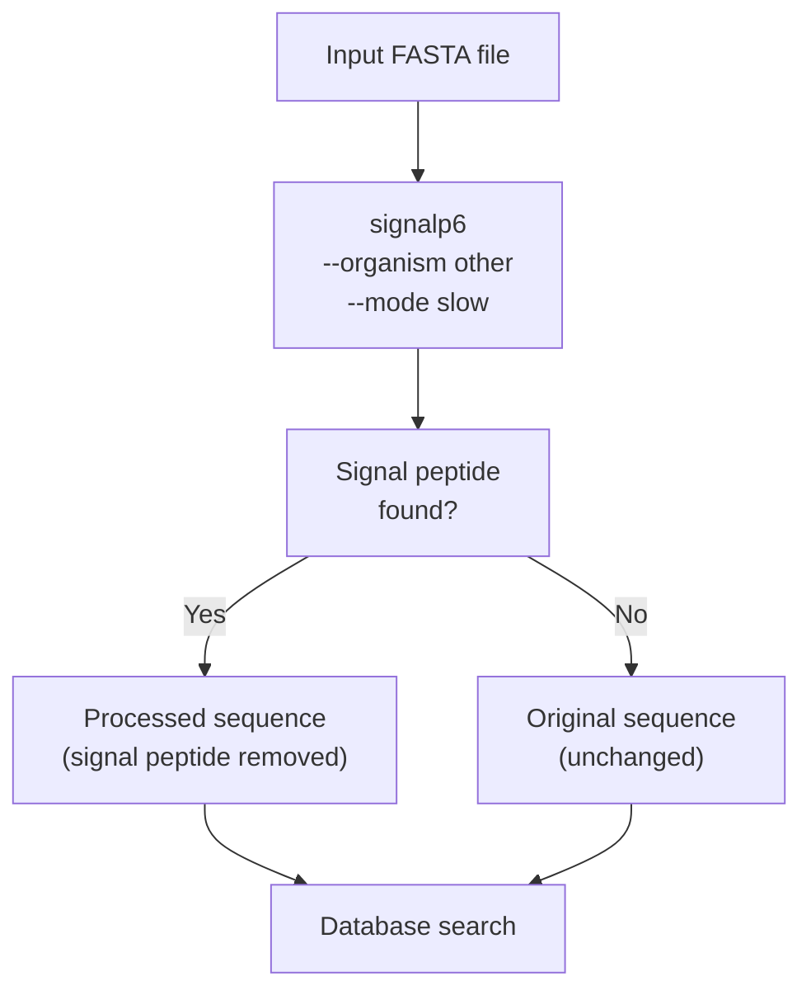
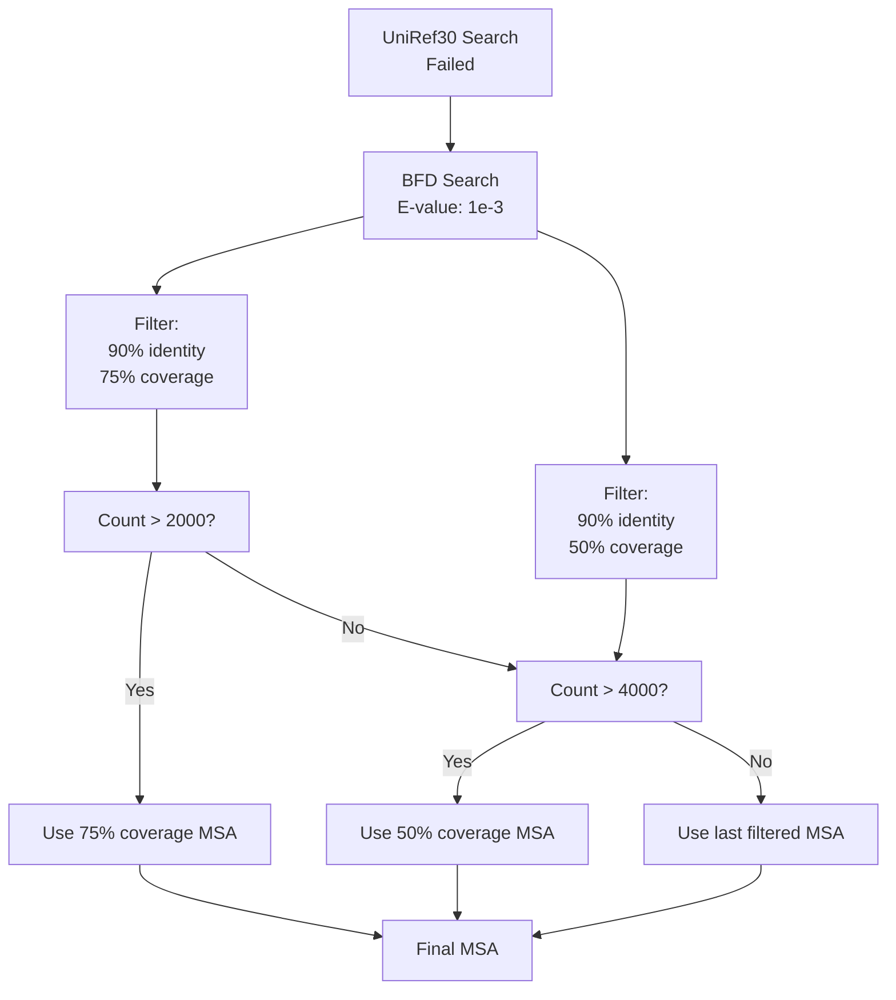
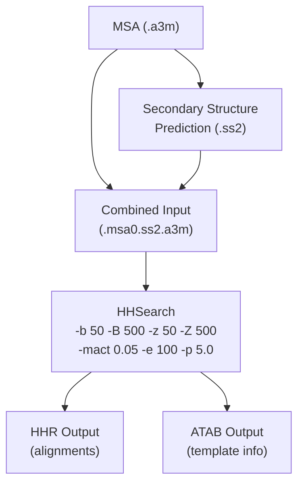
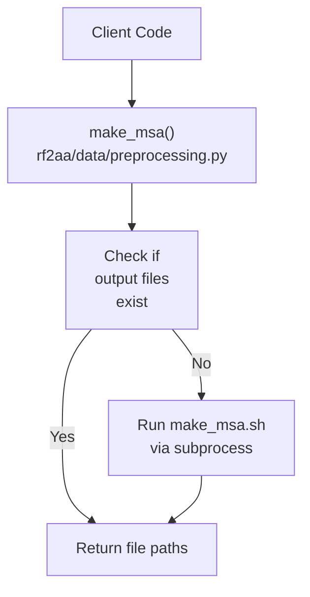

# MSA Generation

# MSA Generation

> **Relevant source files**
> - [input\_prep/make\_ss\.sh](https://github.com/baker-laboratory/RoseTTAFold-All-Atom/blob/6c851405/input_prep/make_ss.sh)
> - [make\_msa\.sh](https://github.com/baker-laboratory/RoseTTAFold-All-Atom/blob/6c851405/make_msa.sh)
> - [rf2aa/data/preprocessing\.py](https://github.com/baker-laboratory/RoseTTAFold-All-Atom/blob/6c851405/rf2aa/data/preprocessing.py)

 This document explains the Multiple Sequence Alignment \(MSA\) generation process in RoseTTAFold All\-Atom \(RFAA\)\. MSA generation is a critical preprocessing step that identifies evolutionarily related protein sequences, which are essential for accurate structure prediction\. For information about how these MSAs are used in feature construction, see [Feature Construction](https://deepwiki.com/baker-laboratory/RoseTTAFold-All-Atom/5.3-data-loading-and-parsing)\.

## Overview

 MSA generation in RFAA follows a carefully designed workflow that:

 1. Processes input sequences to remove signal peptides
2. Conducts progressive database searches to find homologous sequences
3. Filters results to obtain an optimal set of sequences
4. Generates secondary structure predictions
5. Performs template searching

 This process is implemented as a modular pipeline that can adapt to varying levels of sequence conservation\.

 Sources: [make\_msa\.sh L1-L126](https://github.com/baker-laboratory/RoseTTAFold-All-Atom/blob/6c851405/make_msa.sh#L1-L126)

## MSA Generation Steps

### 1\. SignalP Processing

 RFAA begins by using SignalP 6\.0 to identify and remove signal peptides from the input sequence\. Signal peptides are short sequences that direct proteins to their cellular destinations and are typically cleaved off in the mature protein\.

 Sources: [make\_msa\.sh L22-L30](https://github.com/baker-laboratory/RoseTTAFold-All-Atom/blob/6c851405/make_msa.sh#L22-L30)

### 2\. Database Search Strategy

 RFAA uses a progressive database search strategy, starting with UniRef30 and then moving to BFD if necessary:

#### 2\.1 UniRef30 Search

 The search begins with UniRef30, a clustered database of protein sequences with 30% sequence identity\. Three separate searches are performed with increasingly relaxed E\-value thresholds:

| Search Round | E\-value Threshold | Purpose |
| --- | --- | --- |
| 1 | 1e\-10 | Find close homologs |
| 2 | 1e\-6 | Find more distant homologs |
| 3 | 1e\-3 | Find remote homologs |

 After each search, results are filtered with two different criteria:

 - 90% identity / 75% coverage \(strict filter\)
- 90% identity / 50% coverage \(relaxed filter\)

 The search stops when sufficient sequences are found:

 - > 2000 sequences from the strict filter, or
- > 4000 sequences from the relaxed filter

 Sources: [make\_msa\.sh L35-L77](https://github.com/baker-laboratory/RoseTTAFold-All-Atom/blob/6c851405/make_msa.sh#L35-L77)

#### 2\.2 BFD Search

 If UniRef30 searches do not yield enough sequences, a search against the BFD \(Big Fantastic Database\) is performed:

 Sources: [make\_msa\.sh L79-L112](https://github.com/baker-laboratory/RoseTTAFold-All-Atom/blob/6c851405/make_msa.sh#L79-L112)

### 3\. Secondary Structure Prediction with PSIPRED

 Once the final MSA is generated, RFAA runs PSIPRED to predict secondary structure:

 1. The MSA is converted to a checkpoint file using CSBuild
2. A frequency profile is created with makemat
3. PSIPRED predicts secondary structure using neural networks
4. The results are formatted into a \.ss2 file

 Sources: [make\_msa\.sh L114-L116](https://github.com/baker-laboratory/RoseTTAFold-All-Atom/blob/6c851405/make_msa.sh#L114-L116) [make\_ss\.sh L1-L33](https://github.com/baker-laboratory/RoseTTAFold-All-Atom/blob/6c851405/input_prep/make_ss.sh#L1-L33)

### 4\. Template Search with HHSearch

 Finally, RFAA performs a template search using HHSearch:

 1. The secondary structure prediction is combined with the MSA
2. HHSearch searches against a template database
3. Results are stored in \.hhr and \.atab files

 Sources: [make\_msa\.sh L118-L125](https://github.com/baker-laboratory/RoseTTAFold-All-Atom/blob/6c851405/make_msa.sh#L118-L125)

## Code Integration

 RFAA provides a Python interface in `preprocessing.py` that calls the shell scripts:

 The Python function takes the following parameters:

 - `fasta_file`: Path to the input FASTA file
- `chain`: Chain identifier
- `model_runner`: The ModelRunner instance that contains configuration

 It returns paths to the generated MSA, HHR, and ATAB files\.

 Sources: [preprocessing\.py L9-L34](https://github.com/baker-laboratory/RoseTTAFold-All-Atom/blob/6c851405/rf2aa/data/preprocessing.py#L9-L34)

## Key Configuration Parameters

 MSA generation is controlled by several parameters in the configuration:

| Parameter | Description | Default |
| --- | --- | --- |
| command | Path to the MSA generation script | "make\_msa\.sh" |
| sequencedb | Path to sequence databases | Contains UniRef30 and BFD paths |
| num\_cpus | Number of CPU cores to use | Configurable |
| mem | RAM to allocate \(in GB\) | Configurable |
| hhdb | Path to template database | Configurable |

 These parameters are passed to the shell script when executing the MSA generation process\.

 Sources: [preprocessing\.py L19-L23](https://github.com/baker-laboratory/RoseTTAFold-All-Atom/blob/6c851405/rf2aa/data/preprocessing.py#L19-L23)

## Output Files

 The MSA generation process produces several important output files:

| File | Description | Used By |
| --- | --- | --- |
| t000\_\.msa0\.a3m | Multiple sequence alignment in A3M format | Feature construction, structure prediction |
| t000\_\.ss2 | Secondary structure prediction | Feature construction |
| t000\_\.hhr | HHSearch results with template alignments | Template feature construction |
| t000\_\.atab | HHSearch results in tabular format | Template feature construction |

 These files provide essential evolutionary information that guides the structure prediction process in later stages of the RFAA pipeline\.

 Sources: [make\_msa\.sh L61-L125](https://github.com/baker-laboratory/RoseTTAFold-All-Atom/blob/6c851405/make_msa.sh#L61-L125) [preprocessing\.py L25-L28](https://github.com/baker-laboratory/RoseTTAFold-All-Atom/blob/6c851405/rf2aa/data/preprocessing.py#L25-L28)

---
*Source: [https://deepwiki.com/baker-laboratory/RoseTTAFold-All-Atom/5.1-msa-generation](https://deepwiki.com/baker-laboratory/RoseTTAFold-All-Atom/5.1-msa-generation) on DeepWiki*