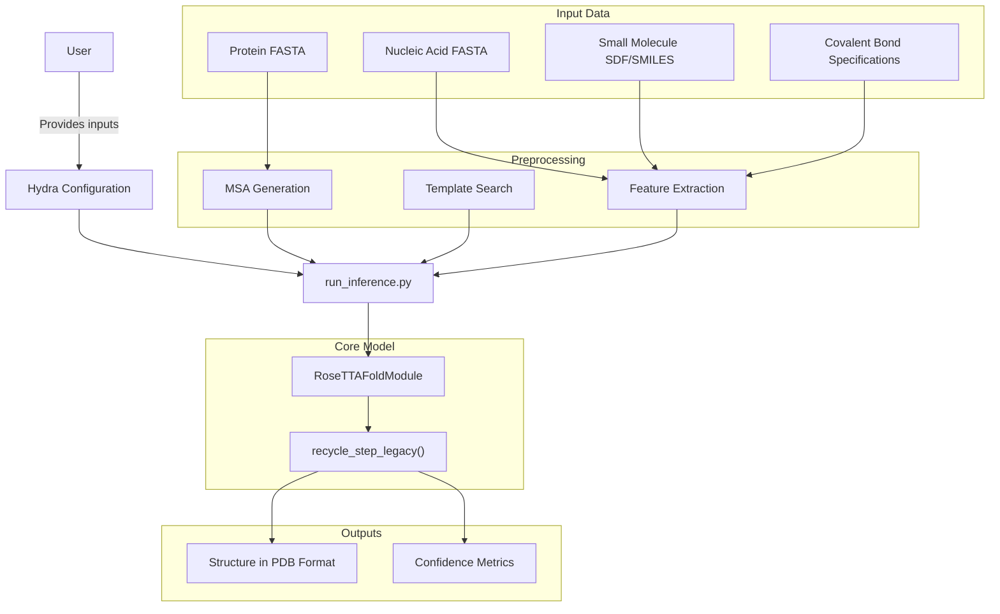
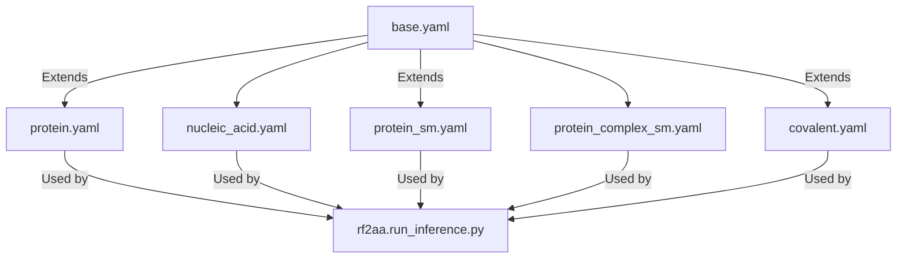
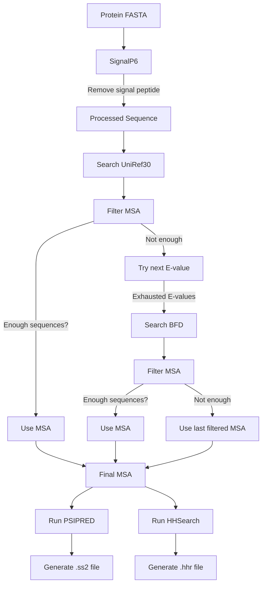
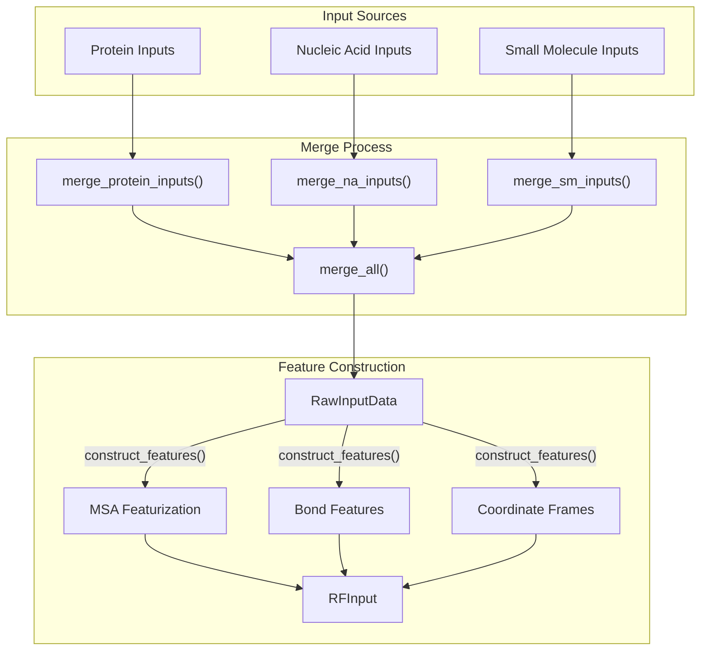

# Overview

# Overview

> **Relevant source files**
> - [README\.md](https://github.com/baker-laboratory/RoseTTAFold-All-Atom/blob/6c851405/README.md?plain=1)

 RoseTTAFold All\-Atom \(RFAA\) is a biomolecular structure prediction neural network developed to predict 3D structures of diverse biomolecular assemblies\. This document provides a comprehensive introduction to the system, its capabilities, and its architecture\.

 For detailed installation instructions, see [Installation and Setup](https://deepwiki.com/baker-laboratory/RoseTTAFold-All-Atom/2-installation-and-setup)\. For specific usage guides, see [Using RFAA](https://deepwiki.com/baker-laboratory/RoseTTAFold-All-Atom/4-using-rfaa)\.

## System Capabilities

 RFAA extends beyond traditional protein structure prediction to model a broad range of biomolecular assemblies:

 - Protein structures \(monomers and complexes\)
- Protein\-nucleic acid complexes
- Protein\-small molecule complexes
- Higher\-order biomolecular assemblies
- Covalently modified proteins
- Inclusion of metals and other non\-standard components

 The system not only predicts structures but also provides confidence metrics to assess prediction quality, allowing users to identify reliable regions of predicted structures\.

 Sources: [README\.md?plain=1 L6-L8](https://github.com/baker-laboratory/RoseTTAFold-All-Atom/blob/6c851405/README.md?plain=1#L6-L8)

## System Architecture

 RFAA employs a modular architecture that processes different input types through a unified prediction pipeline\.

### High\-Level Architecture Diagram



 Sources: [README\.md?plain=1 L87-L91](https://github.com/baker-laboratory/RoseTTAFold-All-Atom/blob/6c851405/README.md?plain=1#L87-L91)

## Data Flow Through The System

### Input Processing and Model Execution

```mermaid
sequenceDiagram
  participant User
  participant Hydra Config
  participant rf2aa.run_inference
  participant DataLoader
  participant construct_features()
  participant RoseTTAFoldModule
  participant OutputWriter

  User->>Hydra Config: Specify prediction task
  Hydra Config->>rf2aa.run_inference: Configure inference
  rf2aa.run_inference->>rf2aa.run_inference: parse_inference_config()
  rf2aa.run_inference->>DataLoader: Load inputs (protein, NA, SM)
  DataLoader->>rf2aa.run_inference: Return RawInputData
  rf2aa.run_inference->>construct_features(): Build features
  construct_features()->>rf2aa.run_inference: Return RFInput
  rf2aa.run_inference->>rf2aa.run_inference: load_model()
  rf2aa.run_inference->>RoseTTAFoldModule: run_model_forward(input_feats)
  loop [Recycling]
    RoseTTAFoldModule->>RoseTTAFoldModule: recycle_step_legacy()
  end
  RoseTTAFoldModule->>rf2aa.run_inference: Return predictions
  rf2aa.run_inference->>rf2aa.run_inference: calc_pred_err()
  rf2aa.run_inference->>OutputWriter: write_outputs()
  OutputWriter->>User: PDB file and confidence metrics
```

 Sources: [README\.md?plain=1 L87-L103](https://github.com/baker-laboratory/RoseTTAFold-All-Atom/blob/6c851405/README.md?plain=1#L87-L103)

## Key Components

### 1\. Input System

 RFAA accepts multiple types of inputs, each processed differently:

| Input Type | Format | Purpose |
| --- | --- | --- |
| Protein Inputs | FASTA files | Provide protein sequences for prediction |
| Nucleic Acid Inputs | FASTA files | Provide DNA or RNA sequences |
| Small Molecule Inputs | SDF files or SMILES strings | Provide ligand structures |
| Covalent Bond Specifications | JSON\-like syntax | Define covalent bonds between proteins and small molecules |

 Each input is specified through the Hydra configuration system and associated with a chain identifier \(A, B, C, etc\.\) that designates its position in the final structure\.

 Sources: [README\.md?plain=1 L95-L100](https://github.com/baker-laboratory/RoseTTAFold-All-Atom/blob/6c851405/README.md?plain=1#L95-L100)

### 2\. Configuration System

 RFAA uses Hydra for configuration management, allowing flexible specification of different prediction tasks while maintaining a consistent interface\.



 Configuration files define:

 - Input file paths and types
- Chain identifiers
- Model parameters
- Covalent bond specifications \(if applicable\)
- Output options

 Sources: [README\.md?plain=1 L86-L103](https://github.com/baker-laboratory/RoseTTAFold-All-Atom/blob/6c851405/README.md?plain=1#L86-L103)

### 3\. MSA Generation Pipeline

 For protein inputs, RFAA generates Multiple Sequence Alignments \(MSA\) to capture evolutionary information\.



 The MSA generation pipeline helps RFAA understand the evolutionary context of proteins, which is critical for accurate structure prediction\.

 Sources: [README\.md?plain=1 L62-L76](https://github.com/baker-laboratory/RoseTTAFold-All-Atom/blob/6c851405/README.md?plain=1#L62-L76)

### 4\. Feature Construction

 The system transforms raw inputs into structured features for the neural network model:



 Sources: [README\.md?plain=1 L95-L100](https://github.com/baker-laboratory/RoseTTAFold-All-Atom/blob/6c851405/README.md?plain=1#L95-L100)

### 5\. Neural Network Model

 The core of RFAA is the `RoseTTAFoldModule` which performs structure prediction through iterative refinement:

 - Takes the `RFInput` features
- Processes them through a series of neural network layers
- Performs multiple recycling steps to refine the prediction
- Outputs predicted coordinates and confidence metrics

 The model uses an iterative approach \(recycling\) that improves prediction accuracy by refining the structure over multiple iterations\.

 Sources: [README\.md?plain=1 L89-L90](https://github.com/baker-laboratory/RoseTTAFold-All-Atom/blob/6c851405/README.md?plain=1#L89-L90)

## Outputs and Confidence Metrics

 RFAA produces two main outputs:

 1. **PDB File**: Contains the predicted 3D structure \(with B\-factors representing confidence\)
2. **PyTorch File**: Contains detailed confidence metrics

 The confidence metrics include:

| Metric | Description | Interpretation |
| --- | --- | --- |
| plDDT | Per\-residue/atom confidence score | Higher values \(\>70\) indicate more reliable regions |
| PAE | Predicted aligned error between pairs of positions | Lower values indicate more reliable interactions |
| PDE | Predicted distance error for all pairwise distances | Lower values indicate more reliable distances |
| pae\_inter | Mean PAE for interactions between different molecule types | Values <10 indicate high\-quality interactions |

 These metrics help users assess the reliability of predictions, enabling informed decisions about the usefulness of the predicted structures\.

 Sources: [README\.md?plain=1 L266-L281](https://github.com/baker-laboratory/RoseTTAFold-All-Atom/blob/6c851405/README.md?plain=1#L266-L281)

## Prediction Types

 RFAA supports several types of structure prediction tasks:

 1. **Protein Monomers**: Single protein chain prediction
2. **Protein Complexes**: Multiple interacting protein chains
3. **Protein\-Nucleic Acid Complexes**: Proteins interacting with DNA or RNA
4. **Protein\-Small Molecule Complexes**: Proteins interacting with ligands
5. **Higher\-Order Complexes**: Combinations of proteins, nucleic acids, and small molecules
6. **Covalently Modified Proteins**: Proteins with chemical modifications

 Each prediction type has a specific configuration schema that specifies the inputs and their relationships\. For detailed usage examples, refer to [Using RFAA](https://deepwiki.com/baker-laboratory/RoseTTAFold-All-Atom/4-using-rfaa)\.

 Sources: [README\.md?plain=1 L104-L203](https://github.com/baker-laboratory/RoseTTAFold-All-Atom/blob/6c851405/README.md?plain=1#L104-L203)

## Summary

 RoseTTAFold All\-Atom represents a significant advancement in biomolecular structure prediction, offering a unified approach to modeling diverse molecular assemblies\. Its comprehensive capabilities, combined with accurate confidence metrics, make it a powerful tool for structural biology research\.

 For detailed installation instructions, see [Installation and Setup](https://deepwiki.com/baker-laboratory/RoseTTAFold-All-Atom/2-installation-and-setup)\. For specific usage guides, see [Using RFAA](https://deepwiki.com/baker-laboratory/RoseTTAFold-All-Atom/4-using-rfaa)\. For a deeper understanding of system architecture, see [System Architecture](https://deepwiki.com/baker-laboratory/RoseTTAFold-All-Atom/5-system-architecture)\.

 Sources: [README\.md?plain=1 L6-L8](https://github.com/baker-laboratory/RoseTTAFold-All-Atom/blob/6c851405/README.md?plain=1#L6-L8) [README\.md?plain=1 L283-L286](https://github.com/baker-laboratory/RoseTTAFold-All-Atom/blob/6c851405/README.md?plain=1#L283-L286)

---
*Source: [https://deepwiki.com/baker-laboratory/RoseTTAFold-All-Atom/1-overview](https://deepwiki.com/baker-laboratory/RoseTTAFold-All-Atom/1-overview) on DeepWiki*