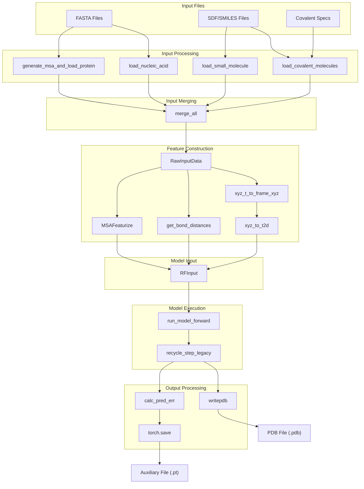
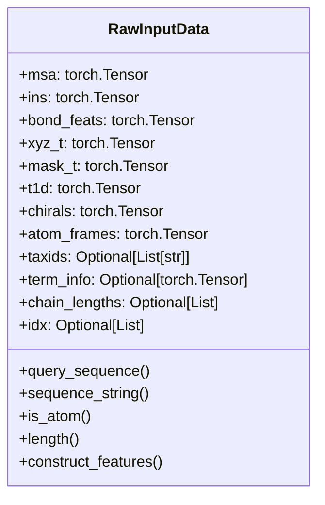
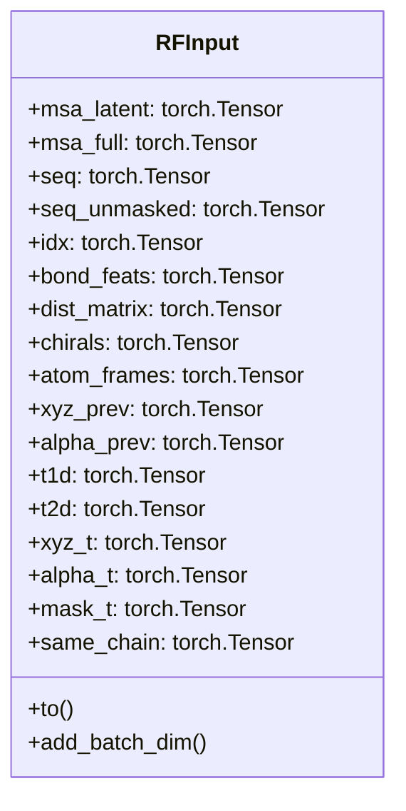
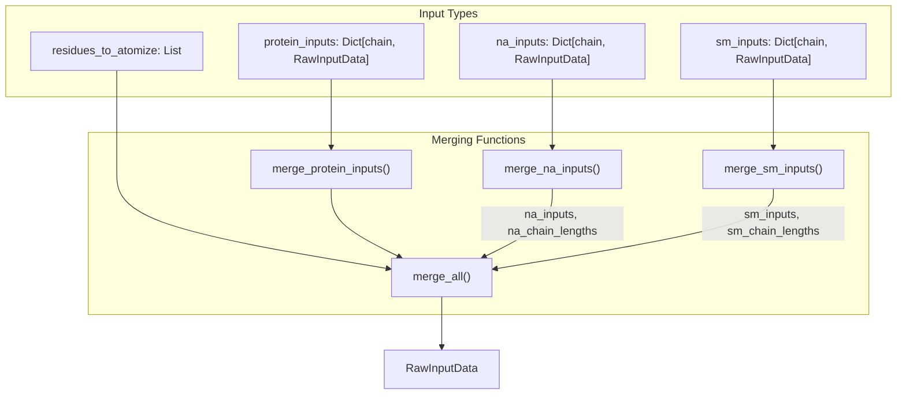
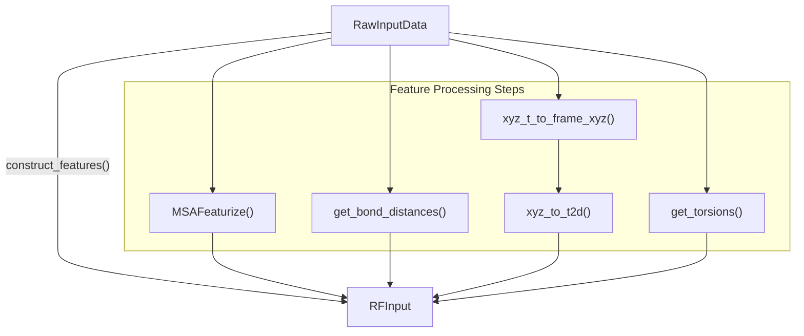
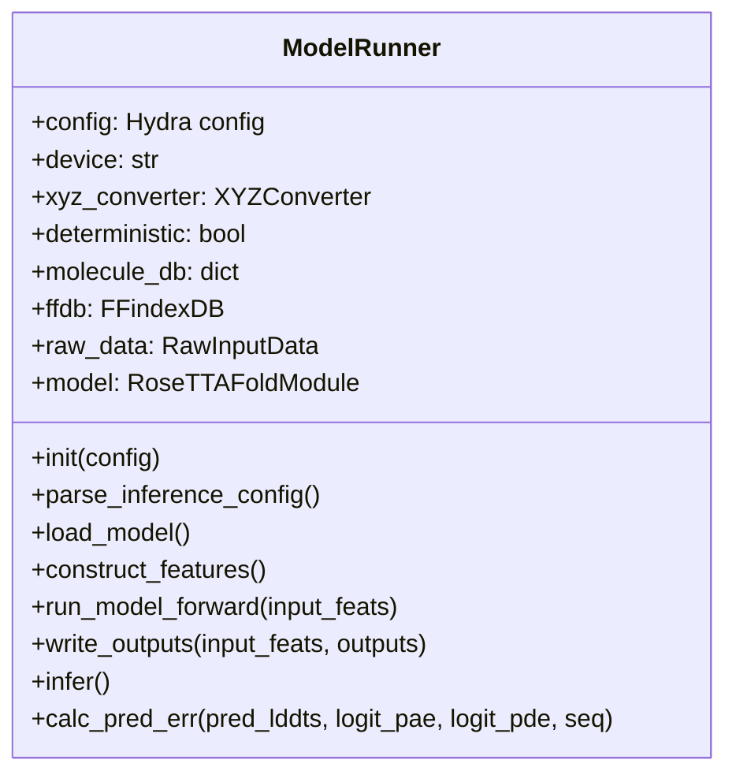
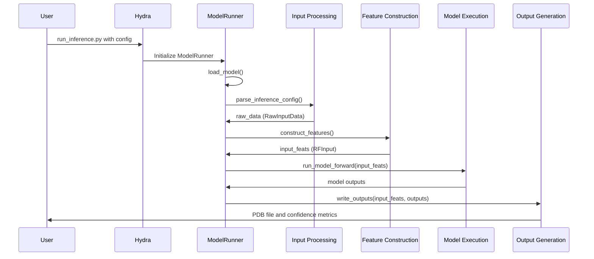
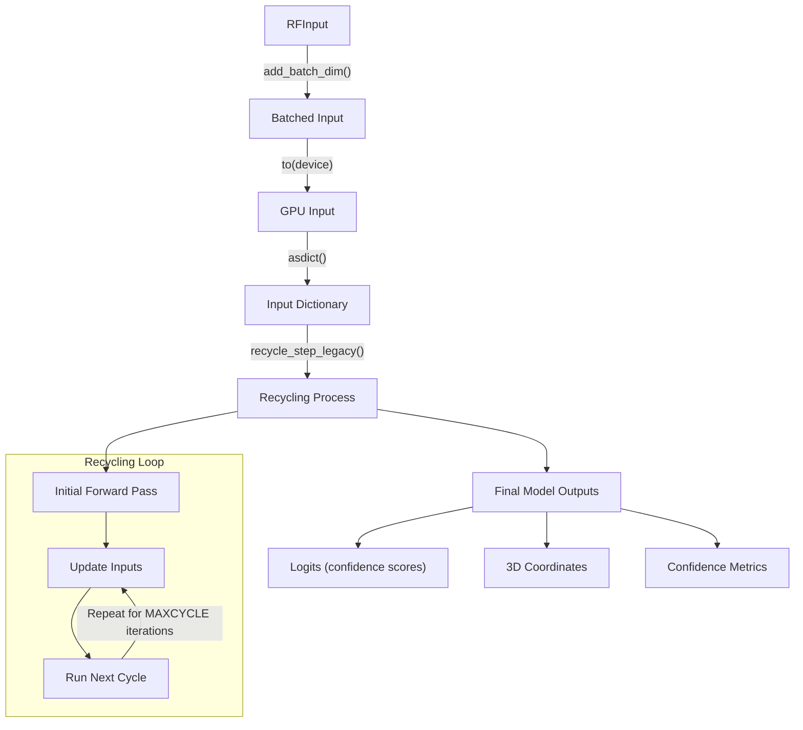
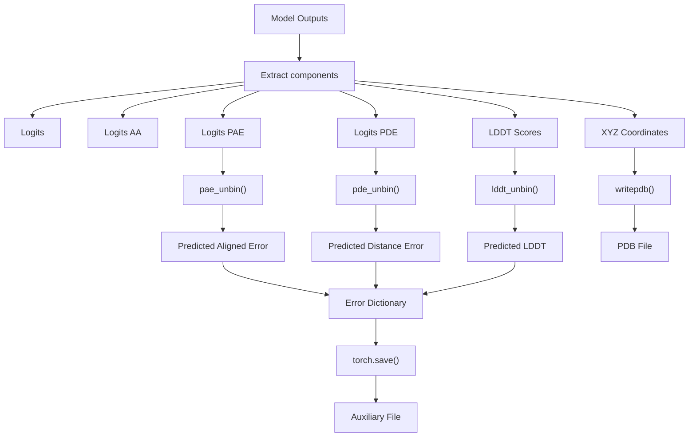
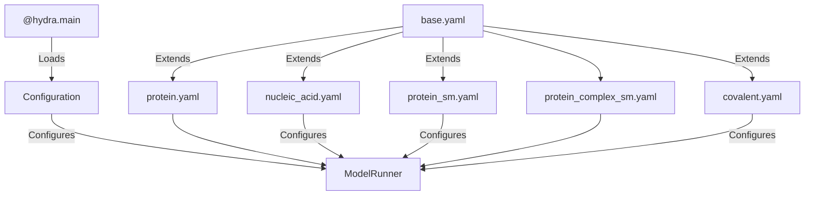

# System Architecture

# System Architecture

> **Relevant source files**
> - [rf2aa/data/data\_loader\.py](https://github.com/baker-laboratory/RoseTTAFold-All-Atom/blob/6c851405/rf2aa/data/data_loader.py)
> - [rf2aa/data/merge\_inputs\.py](https://github.com/baker-laboratory/RoseTTAFold-All-Atom/blob/6c851405/rf2aa/data/merge_inputs.py)
> - [rf2aa/run\_inference\.py](https://github.com/baker-laboratory/RoseTTAFold-All-Atom/blob/6c851405/rf2aa/run_inference.py)

 This document provides a comprehensive overview of the RoseTTAFold All\-Atom \(RFAA\) system architecture, detailing the key components, data flows, and processing pipeline\. For information about how to use RFAA, see [Using RFAA](https://deepwiki.com/baker-laboratory/RoseTTAFold-All-Atom/4-using-rfaa); for details on MSA generation specifically, see [MSA Generation](https://deepwiki.com/baker-laboratory/RoseTTAFold-All-Atom/5.1-msa-generation)\.

## Overview

 RFAA is a modular biomolecular structure prediction system that processes different types of inputs \(proteins, nucleic acids, small molecules\), constructs features, runs predictions through a neural network model, and generates structural outputs with confidence metrics\. The system is designed to handle complex biological assemblies, including covalent modifications\.

## High\-Level Architecture

  Sources:

 - [run\_inference\.py L21-L201](https://github.com/baker-laboratory/RoseTTAFold-All-Atom/blob/6c851405/rf2aa/run_inference.py#L21-L201)
- [merge\_inputs\.py L9-L208](https://github.com/baker-laboratory/RoseTTAFold-All-Atom/blob/6c851405/rf2aa/data/merge_inputs.py#L9-L208)

## Data Flow Architecture

 The following diagram illustrates how data flows through the RFAA system, from input files to predicted structures:

 Sources:

 - [run\_inference\.py L34-L94](https://github.com/baker-laboratory/RoseTTAFold-All-Atom/blob/6c851405/rf2aa/run_inference.py#L34-L94)
- [run\_inference\.py L151-L156](https://github.com/baker-laboratory/RoseTTAFold-All-Atom/blob/6c851405/rf2aa/run_inference.py#L151-L156)
- [data\_loader\.py L107-L163](https://github.com/baker-laboratory/RoseTTAFold-All-Atom/blob/6c851405/rf2aa/data/data_loader.py#L107-L163)

## Core Data Structures

 RFAA uses two primary data structures for representing molecular data during processing:

### RawInputData

 `RawInputData` represents the merged raw inputs after initial processing:

 The `RawInputData` structure contains:

 - MSA information \(`msa`, `ins`\)
- Bonding information \(`bond_feats`\)
- Template coordinates and features \(`xyz_t`, `mask_t`, `t1d`\)
- Special structure information \(`chirals`, `atom_frames`\)
- Chain organization information \(`chain_lengths`\)

 Sources:

 - [data\_loader\.py L14-L104](https://github.com/baker-laboratory/RoseTTAFold-All-Atom/blob/6c851405/rf2aa/data/data_loader.py#L14-L104)

### RFInput

 `RFInput` represents the fully processed features ready for model input:

 The `RFInput` structure contains processed features including:

 - MSA features \(`msa_latent`, `msa_full`\)
- Sequence information \(`seq`, `seq_unmasked`\)
- Geometric features \(`dist_matrix`, `t2d`\)
- Template information \(`xyz_t`, `alpha_t`, `mask_t`\)
- Prior structure information \(`xyz_prev`, `alpha_prev`\)

 Sources:

 - [data\_loader\.py L166-L202](https://github.com/baker-laboratory/RoseTTAFold-All-Atom/blob/6c851405/rf2aa/data/data_loader.py#L166-L202)

## Input Merging System

 The input merging system combines different types of biomolecular inputs into a unified data structure:

 The merging process handles several complex tasks:

 - For proteins: MSA merging, template merging, handling of homo\-oligomers
- For nucleic acids: Feature concatenation
- For small molecules: Feature concatenation
- For covalent modifications: Updating bond features and handling atomized residues

 Sources:

 - [merge\_inputs\.py L9-L86](https://github.com/baker-laboratory/RoseTTAFold-All-Atom/blob/6c851405/rf2aa/data/merge_inputs.py#L9-L86)
- [merge\_inputs\.py L161-L204](https://github.com/baker-laboratory/RoseTTAFold-All-Atom/blob/6c851405/rf2aa/data/merge_inputs.py#L161-L204)

### Key Merging Functions

| Function | Description |
| --- | --- |
| merge\_protein\_inputs | Merges multiple protein inputs, handling identical sequences for homo\-oligomers |
| merge\_na\_inputs | Merges nucleic acid inputs by concatenating features |
| merge\_sm\_inputs | Merges small molecule inputs by concatenating features |
| merge\_two\_inputs | Helper function to merge any two arbitrary inputs |
| merge\_all | Master function that combines all input types into a unified RawInputData |

 Sources:

 - [merge\_inputs\.py L9-L208](https://github.com/baker-laboratory/RoseTTAFold-All-Atom/blob/6c851405/rf2aa/data/merge_inputs.py#L9-L208)

## Feature Construction

 The feature construction process converts `RawInputData` into model\-ready `RFInput`:

 The feature construction involves:

 1. MSA featurization: Converting MSA sequences into embeddings
2. Bond distance calculation: Converting bond features to distance matrices
3. Template coordinate processing: Transforming template coordinates and generating frame\-based features
4. Torsion angle calculation: Computing backbone and sidechain torsion angles

 Sources:

 - [data\_loader\.py L107-L163](https://github.com/baker-laboratory/RoseTTAFold-All-Atom/blob/6c851405/rf2aa/data/data_loader.py#L107-L163)

## ModelRunner: Central Orchestrator

 The `ModelRunner` class orchestrates the entire inference pipeline:

 Key responsibilities:

 - Configuration parsing and validation
- Model loading and initialization
- Input processing and feature construction
- Model execution and recycling coordination
- Output processing and file writing

 Sources:

 - [run\_inference\.py L21-L201](https://github.com/baker-laboratory/RoseTTAFold-All-Atom/blob/6c851405/rf2aa/run_inference.py#L21-L201)

### Inference Pipeline Flow

 The complete inference pipeline is executed by the `infer()` method:

 Sources:

 - [run\_inference\.py L151-L156](https://github.com/baker-laboratory/RoseTTAFold-All-Atom/blob/6c851405/rf2aa/run_inference.py#L151-L156)

## Model Execution and Recycling

 The model execution involves running the RoseTTAFold model with recycling \(iterative refinement\):

 Sources:

 - [run\_inference\.py L115-L127](https://github.com/baker-laboratory/RoseTTAFold-All-Atom/blob/6c851405/rf2aa/run_inference.py#L115-L127)

## Output Processing

 The model outputs are processed and written to files:

 Sources:

 - [run\_inference\.py L130-L150](https://github.com/baker-laboratory/RoseTTAFold-All-Atom/blob/6c851405/rf2aa/run_inference.py#L130-L150)
- [run\_inference\.py L158-L200](https://github.com/baker-laboratory/RoseTTAFold-All-Atom/blob/6c851405/rf2aa/run_inference.py#L158-L200)

## Configuration System

 RFAA uses Hydra for configuration management:

 Sources:

 - [run\_inference\.py L203-L206](https://github.com/baker-laboratory/RoseTTAFold-All-Atom/blob/6c851405/rf2aa/run_inference.py#L203-L206)

## Summary Table of Key Components

| Component | Class/Function | Purpose |
| --- | --- | --- |
| ModelRunner | ModelRunner | Central orchestrator for inference pipeline |
| Input Merging | merge\_all, merge\_protein\_inputs, etc\. | Combines different input types |
| Raw Input Data | RawInputData | Stores merged raw inputs |
| Feature Construction | construct\_features | Converts raw data to model features |
| Model Input | RFInput | Stores model\-ready features |
| Model Execution | run\_model\_forward, recycle\_step\_legacy | Runs model with recycling |
| Output Processing | calc\_pred\_err, writepdb | Processes and writes outputs |
| Configuration | Hydra config system | Manages configuration parameters |

 Sources:

 - [run\_inference\.py L21-L201](https://github.com/baker-laboratory/RoseTTAFold-All-Atom/blob/6c851405/rf2aa/run_inference.py#L21-L201)
- [merge\_inputs\.py L9-L208](https://github.com/baker-laboratory/RoseTTAFold-All-Atom/blob/6c851405/rf2aa/data/merge_inputs.py#L9-L208)
- [data\_loader\.py L14-L202](https://github.com/baker-laboratory/RoseTTAFold-All-Atom/blob/6c851405/rf2aa/data/data_loader.py#L14-L202)

---
*Source: [https://deepwiki.com/baker-laboratory/RoseTTAFold-All-Atom/5-system-architecture](https://deepwiki.com/baker-laboratory/RoseTTAFold-All-Atom/5-system-architecture) on DeepWiki*