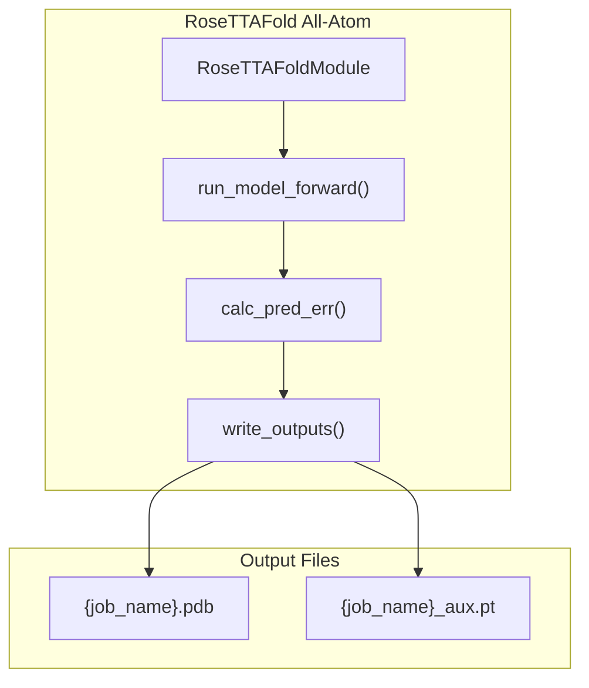
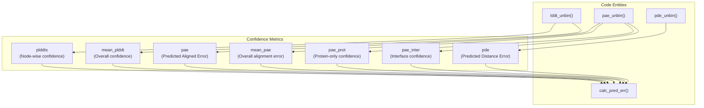
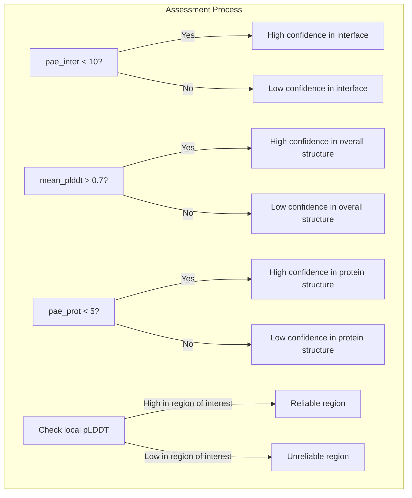

# Understanding Output Files

# Understanding Output Files

> **Relevant source files**
> - [README\.md](https://github.com/baker-laboratory/RoseTTAFold-All-Atom/blob/6c851405/README.md?plain=1)
> - [rf2aa/run\_inference\.py](https://github.com/baker-laboratory/RoseTTAFold-All-Atom/blob/6c851405/rf2aa/run_inference.py)

 This document explains the output files generated by RoseTTAFold All\-Atom \(RFAA\) and how to interpret them to assess prediction quality\. For information about preparing input files, see [Input File Preparation](https://deepwiki.com/baker-laboratory/RoseTTAFold-All-Atom/4.2-input-file-preparation)\.

## Output File Overview

 RoseTTAFold All\-Atom generates two main output files during structure prediction:

 1. **PDB file** \(`{job_name}.pdb`\): Contains the predicted 3D structure with B\-factors representing position\-specific confidence
2. **PyTorch file** \(`{job_name}_aux.pt`\): Contains detailed confidence metrics as tensors



 Sources: [README\.md?plain=1 L266-L281](https://github.com/baker-laboratory/RoseTTAFold-All-Atom/blob/6c851405/README.md?plain=1#L266-L281) [run\_inference\.py L130-L149](https://github.com/baker-laboratory/RoseTTAFold-All-Atom/blob/6c851405/rf2aa/run_inference.py#L130-L149)

## The PDB Output File

 The PDB file contains the predicted atomic coordinates for all atoms in the system\. This includes proteins, nucleic acids, small molecules, and any covalent modifications that were part of the input\.

 Key features of the PDB file:

 - Standard PDB format compatible with visualization tools like PyMOL, ChimeraX, and VMD
- Chain IDs matching those provided in the input configuration
- B\-factor column values represent the predicted local distance difference test \(pLDDT\) confidence at each position
- Higher B\-factor values indicate higher confidence in the local structure prediction

### Interpreting B\-factors as Confidence Values

 The B\-factors in the PDB file are set to the pLDDT values, which range from 0 to 1:

| pLDDT Range | Confidence Level | Interpretation |
| --- | --- | --- |
| 0\.9 \- 1\.0 | Very high | Atomic details likely correct |
| 0\.7 \- 0\.9 | High | Sidechain conformations generally reliable |
| 0\.5 \- 0\.7 | Medium | Backbone generally correct, sidechains may have errors |
| 0\.0 \- 0\.5 | Low | Overall fold may be incorrect |

 The code that writes the PDB file with pLDDT values as B\-factors:

```
writepdb(os.path.join(f"{self.config.output_path}", f"{self.config.job_name}.pdb"),          xyz_allatom,          seq_unmasked,          bond_feats=bond_feats,         bfacts=plddts,         chain_Ls=Ls         )
```

 Sources: [run\_inference\.py L141-L147](https://github.com/baker-laboratory/RoseTTAFold-All-Atom/blob/6c851405/rf2aa/run_inference.py#L141-L147)

## The PyTorch Auxiliary File

 The auxiliary PyTorch file contains detailed confidence metrics that provide a more comprehensive assessment of prediction quality than the PDB file alone\. You can load this file in Python using:

```python
import torchconfidence_metrics = torch.load("{job_name}_aux.pt", map_location="cpu")
```

### Confidence Metrics



 Sources: [run\_inference\.py L158-L200](https://github.com/baker-laboratory/RoseTTAFold-All-Atom/blob/6c851405/rf2aa/run_inference.py#L158-L200)

 The auxiliary file contains the following metrics:

| Metric | Description | Dimensionality | Interpretation |
| --- | --- | --- | --- |
| plddts | Per\-residue/atom confidence scores | \[L\] | Higher values indicate higher confidence |
| pae | Predicted aligned error matrix | \[L×L\] | Lower values indicate better structural alignment |
| pde | Predicted distance error matrix | \[L×L\] | Lower values indicate better distance predictions |
| mean\_plddt | Average pLDDT across all positions | scalar | Overall structure confidence |
| mean\_pae | Average PAE across all position pairs | scalar | Overall structural coherence |
| pae\_prot | Average PAE for protein residue pairs | scalar | Protein structure quality |
| pae\_inter | Average PAE for protein\-ligand interfaces | scalar | Interface prediction quality |
| same\_chain | Matrix indicating which nodes belong to same chain | \[L×L\] | Used to interpret PAE matrices |

 Where L is the total length of the system \(protein residues \+ nucleic acid residues \+ atoms in small molecules\)\.

 Sources: [README\.md?plain=1 L274-L281](https://github.com/baker-laboratory/RoseTTAFold-All-Atom/blob/6c851405/README.md?plain=1#L274-L281) [run\_inference\.py L181-L200](https://github.com/baker-laboratory/RoseTTAFold-All-Atom/blob/6c851405/rf2aa/run_inference.py#L181-L200)

### Detailed Explanation of Confidence Metrics

#### pLDDT \(Predicted Local Distance Difference Test\)

 The pLDDT score indicates the expected accuracy of local structural elements\. It's computed for each residue/atom in the structure:

```
plddts = self.lddt_unbin(pred_lddts)
```

 The `lddt_unbin()` function converts predicted logits into actual pLDDT values:

```python
def lddt_unbin(self, pred_lddt):    nbin = pred_lddt.shape[1]    bin_step = 1.0 / nbin    lddt_bins = torch.linspace(bin_step, 1.0, nbin, dtype=pred_lddt.dtype, device=pred_lddt.device)    pred_lddt = nn.Softmax(dim=1)(pred_lddt)    return torch.sum(lddt_bins[None,:,None]*pred_lddt, dim=1)
```

 Sources: [run\_inference\.py L158-L165](https://github.com/baker-laboratory/RoseTTAFold-All-Atom/blob/6c851405/rf2aa/run_inference.py#L158-L165)

#### PAE \(Predicted Aligned Error\)

 The PAE matrix represents the predicted error when aligning the structure\. For each pair of positions \(i,j\), it estimates how much position j would be misplaced if the structure were aligned using position i as reference:

```
pae = self.pae_unbin(logit_pae)
```

 The `pae_unbin()` function converts PAE logits into actual error values:

```python
def pae_unbin(self, logits_pae, bin_step=0.5):    nbin = logits_pae.shape[1]    bins = torch.linspace(bin_step*0.5, bin_step*nbin-bin_step*0.5, nbin,                           dtype=logits_pae.dtype, device=logits_pae.device)    logits_pae = torch.nn.Softmax(dim=1)(logits_pae)    return torch.sum(bins[None,:,None,None]*logits_pae, dim=1)
```

 Sources: [run\_inference\.py L167-L172](https://github.com/baker-laboratory/RoseTTAFold-All-Atom/blob/6c851405/rf2aa/run_inference.py#L167-L172)

#### PDE \(Predicted Distance Error\)

 The PDE matrix represents the expected error in pairwise distances between positions:

```
pde = self.pde_unbin(logit_pde)
```

 Like the PAE, it's computed using the `pde_unbin()` function:

```python
def pde_unbin(self, logits_pde, bin_step=0.3):    nbin = logits_pde.shape[1]    bins = torch.linspace(bin_step*0.5, bin_step*nbin-bin_step*0.5, nbin,                           dtype=logits_pde.dtype, device=logits_pde.device)    logits_pde = torch.nn.Softmax(dim=1)(logits_pde)    return torch.sum(bins[None,:,None,None]*logits_pde, dim=1)
```

 Sources: [run\_inference\.py L174-L179](https://github.com/baker-laboratory/RoseTTAFold-All-Atom/blob/6c851405/rf2aa/run_inference.py#L174-L179)

#### Aggregate Metrics

 To provide a more concise assessment of prediction quality, RFAA calculates summary statistics:

```
err_dict = dict(    plddts = plddts.cpu(),    pae = pae.cpu(),    pde = pde.cpu(),    mean_plddt = float(plddts.mean()),    mean_pae = float(pae.mean()) if pae is not None else None,    pae_prot = float(pae[0,prot_mask_2d].mean()) if pae is not None else None,    pae_inter = float(pae[0,inter_mask_2d].mean()) if pae is not None else None,)
```

 Sources: [run\_inference\.py L191-L199](https://github.com/baker-laboratory/RoseTTAFold-All-Atom/blob/6c851405/rf2aa/run_inference.py#L191-L199)

## Using Confidence Metrics to Assess Prediction Quality



 Sources: [README\.md?plain=1 L279-L281](https://github.com/baker-laboratory/RoseTTAFold-All-Atom/blob/6c851405/README.md?plain=1#L279-L281)

### Guidelines for Interpreting Confidence Metrics

 1. **Interface Quality**: The `pae_inter` metric was the primary confidence measure used in the RFAA paper:  - `pae_inter < 10`: High\-quality interfaces between proteins and other molecules - `pae_inter > 10`: Less reliable interfaces
2. **Overall Structure Quality**: Use `mean_plddt` to assess overall prediction quality:  - `mean_plddt > 0.7`: Generally reliable predictions - `mean_plddt < 0.5`: Predictions likely contain significant errors
3. **Protein Structure Quality**: The `pae_prot` metric assesses the internal consistency of protein structures:  - `pae_prot < 5`: Highly consistent protein structure - `pae_prot > 10`: Less reliable protein structure
4. **Visualizing Region\-Specific Confidence**: Display the structure colored by pLDDT values in molecular visualization software to identify regions of high and low confidence\.
5. **Visualizing PAE and PDE Matrices**: These matrices can be visualized as heatmaps to identify specific regions with high predicted errors:   ```python import matplotlib.pyplot as pltimport numpy as np # Load metricsmetrics = torch.load("prediction_aux.pt", map_location="cpu") # Plot PAE matrixplt.figure(figsize=(10, 8))plt.imshow(metrics["pae"][0].numpy(), cmap="viridis_r", vmin=0, vmax=30)plt.colorbar(label="Predicted Aligned Error (Å)")plt.title("PAE Matrix")plt.xlabel("Position j")plt.ylabel("Position i")plt.tight_layout()plt.savefig("pae_matrix.png") ```

 Sources: [README\.md?plain=1 L274-L281](https://github.com/baker-laboratory/RoseTTAFold-All-Atom/blob/6c851405/README.md?plain=1#L274-L281)

## Writing Custom Output Parsers

 The core function that generates the output files is `write_outputs()` in the `ModelRunner` class:

```python
def write_outputs(self, input_feats, outputs):    logits, logits_aa, logits_pae, logits_pde, p_bind, \            xyz, alpha_s, xyz_allatom, lddt, _, _, _ \        = outputs    seq_unmasked = input_feats.seq_unmasked    bond_feats = input_feats.bond_feats    err_dict = self.calc_pred_err(lddt, logits_pae, logits_pde, seq_unmasked)    err_dict["same_chain"] = input_feats.same_chain    plddts = err_dict["plddts"]    Ls = Ls_from_same_chain_2d(input_feats.same_chain)    plddts = plddts[0]    writepdb(os.path.join(f"{self.config.output_path}", f"{self.config.job_name}.pdb"),              xyz_allatom,              seq_unmasked,              bond_feats=bond_feats,             bfacts=plddts,             chain_Ls=Ls             )    torch.save(err_dict, os.path.join(f"{self.config.output_path}",                                       f"{self.config.job_name}_aux.pt"))
```

 If you need to customize the output or extract additional information, you can modify this function or create a post\-processing script that loads and processes the standard outputs\.

 Sources: [run\_inference\.py L130-L149](https://github.com/baker-laboratory/RoseTTAFold-All-Atom/blob/6c851405/rf2aa/run_inference.py#L130-L149)

## Summary

 RoseTTAFold All\-Atom provides two complementary output files:

 1. A PDB file containing the predicted 3D structure with confidence values as B\-factors
2. A PyTorch file containing detailed confidence metrics

 These outputs allow for both visualization of the structure and quantitative assessment of prediction quality\. The most important confidence metric is `pae_inter`, which specifically assesses the quality of interfaces between different molecular components \(e\.g\., protein\-ligand interactions\)\. Values of `pae_inter < 10` indicate high\-quality predictions of molecular interfaces\.

---
*Source: [https://deepwiki.com/baker-laboratory/RoseTTAFold-All-Atom/4.4-understanding-output-files](https://deepwiki.com/baker-laboratory/RoseTTAFold-All-Atom/4.4-understanding-output-files) on DeepWiki*