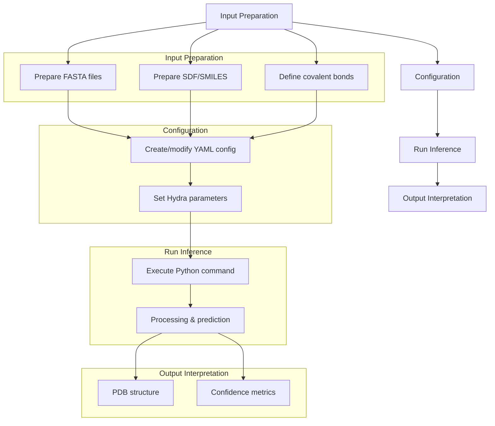
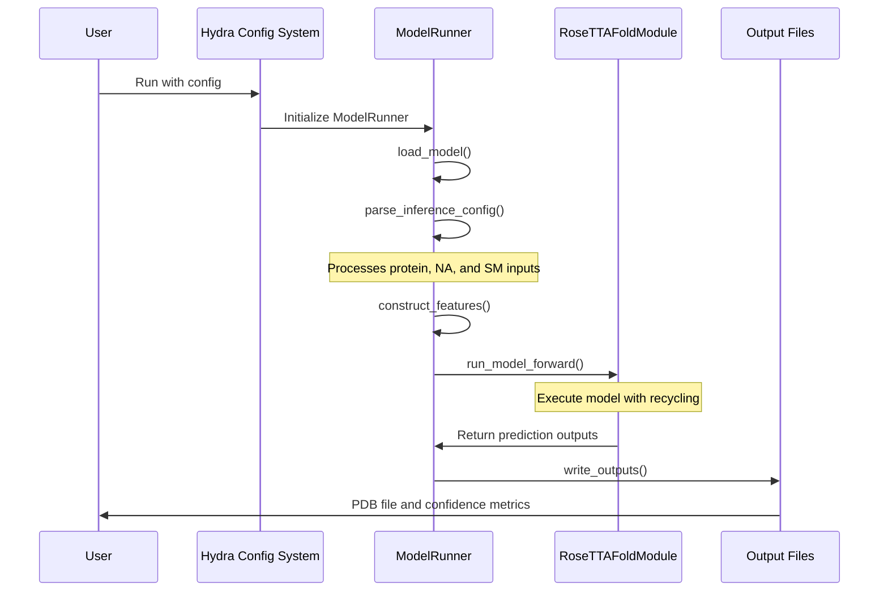
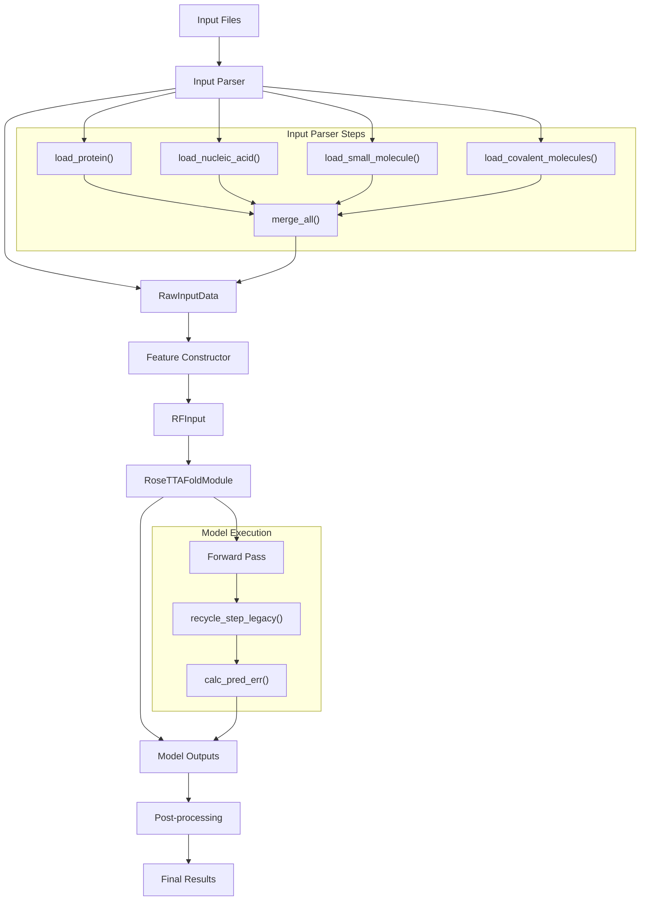
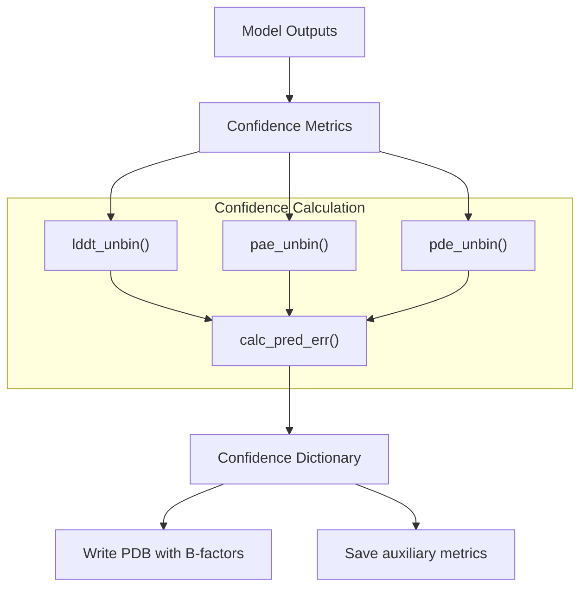

# Using RFAA

# Using RFAA

> **Relevant source files**
> - [README\.md](https://github.com/baker-laboratory/RoseTTAFold-All-Atom/blob/6c851405/README.md?plain=1)
> - [rf2aa/config/inference/protein\_complex\_sm\.yaml](https://github.com/baker-laboratory/RoseTTAFold-All-Atom/blob/6c851405/rf2aa/config/inference/protein_complex_sm.yaml)
> - [rf2aa/run\_inference\.py](https://github.com/baker-laboratory/RoseTTAFold-All-Atom/blob/6c851405/rf2aa/run_inference.py)

 This document provides a comprehensive guide on how to use RoseTTAFold All\-Atom \(RFAA\) for biomolecular structure prediction tasks\. It covers the basic workflow, configuration system, different prediction types, and interpretation of results\. For installation and setup instructions, see [Installation and Setup](https://deepwiki.com/baker-laboratory/RoseTTAFold-All-Atom/2-installation-and-setup)\.

## Basic Usage Workflow

 RFAA follows a straightforward workflow for structure prediction:



 Sources: [README\.md?plain=1 L12-L19](https://github.com/baker-laboratory/RoseTTAFold-All-Atom/blob/6c851405/README.md?plain=1#L12-L19) [run\_inference\.py L151-L156](https://github.com/baker-laboratory/RoseTTAFold-All-Atom/blob/6c851405/rf2aa/run_inference.py#L151-L156)

## Running the Model

 The general command to run RFAA is:

```
python -m rf2aa.run_inference --config-name {your_inference_config}
```

 Where `{your_inference_config}` refers to one of the predefined configuration files or a custom configuration you've created\. For more detailed information about the configuration system, see [Configuration System](https://deepwiki.com/baker-laboratory/RoseTTAFold-All-Atom/4.1-configuration-system)\.

 Sources: [README\.md?plain=1 L87-L93](https://github.com/baker-laboratory/RoseTTAFold-All-Atom/blob/6c851405/README.md?plain=1#L87-L93)

## Inference Process

 The inference process in RFAA is managed by the `ModelRunner` class, which handles input parsing, feature construction, model execution, and output generation:



 Sources: [run\_inference\.py L21-L33](https://github.com/baker-laboratory/RoseTTAFold-All-Atom/blob/6c851405/rf2aa/run_inference.py#L21-L33) [run\_inference\.py L151-L156](https://github.com/baker-laboratory/RoseTTAFold-All-Atom/blob/6c851405/rf2aa/run_inference.py#L151-L156)

## Types of Structure Prediction

 RFAA can predict various types of biomolecular structures\. Below are the main types with example configurations\.

### Protein Monomer Prediction

 For predicting a single protein structure:

```yaml
defaults:  - base job_name: "7u7w_protein"protein_inputs:   A:    fasta_file: examples/protein/7u7w_A.fasta
```

 Sources: [README\.md?plain=1 L104-L124](https://github.com/baker-laboratory/RoseTTAFold-All-Atom/blob/6c851405/README.md?plain=1#L104-L124)

### Protein\-Nucleic Acid Complex Prediction

 For predicting protein\-DNA or protein\-RNA complexes:

```yaml
defaults:  - base job_name: "7u7w_protein_nucleic"protein_inputs:   A:     fasta_file: examples/protein/7u7w_A.fastana_inputs:   B:     fasta: examples/nucleic_acid/7u7w_B.fasta    input_type: "dna"  # or "rna"  C:     fasta: examples/nucleic_acid/7u7w_C.fasta    input_type: "dna"
```

 Sources: [README\.md?plain=1 L126-L152](https://github.com/baker-laboratory/RoseTTAFold-All-Atom/blob/6c851405/README.md?plain=1#L126-L152)

### Protein\-Small Molecule Complex Prediction

 For predicting protein interactions with small molecules or ligands:

```yaml
defaults:  - basejob_name: "3fap" protein_inputs:  A:    fasta_file: examples/protein/3fap_A.fasta  B:     fasta_file: examples/protein/3fap_B.fasta sm_inputs:  C:    input: examples/small_molecule/ARD_ideal.sdf    input_type: "sdf"  # or "smiles"
```

 Sources: [README\.md?plain=1 L154-L178](https://github.com/baker-laboratory/RoseTTAFold-All-Atom/blob/6c851405/README.md?plain=1#L154-L178) [protein\_complex\_sm\.yaml L1-L14](https://github.com/baker-laboratory/RoseTTAFold-All-Atom/blob/6c851405/rf2aa/config/inference/protein_complex_sm.yaml#L1-L14)

### Higher\-Order Complex Prediction

 For predicting complex assemblies with proteins, nucleic acids, and small molecules:

```yaml
defaults:  - base job_name: "7u7w_protein_nucleic_sm"protein_inputs:   A:     fasta_file: examples/protein/7u7w_A.fastana_inputs:   B:     fasta: examples/nucleic_acid/7u7w_B.fasta    input_type: "dna"  C:     fasta: examples/nucleic_acid/7u7w_C.fasta    input_type: "dna"sm_inputs:   D:    input: examples/small_molecule/XG4.sdf    input_type: "sdf"
```

 Sources: [README\.md?plain=1 L180-L207](https://github.com/baker-laboratory/RoseTTAFold-All-Atom/blob/6c851405/README.md?plain=1#L180-L207)

### Covalently Modified Protein Prediction

 For predicting proteins with covalent modifications:

```yaml
defaults:  - base job_name: "7s69_A" protein_inputs:   A:     fasta_file: examples/protein/7s69_A.fasta sm_inputs:  B:     input: examples/small_molecule/7s69_glycan.sdf    input_type: sdf covale_inputs: "[((\"A\", \"74\", \"ND2\"), (\"B\", \"1\"), (\"CW\", \"null\"))]" loader_params:  MAXCYCLE: 10
```

 The `covale_inputs` parameter specifies bonds between protein residues and small molecules using the format:

```
(protein_chain, residue_number, atom_name), (small_molecule_chain, atom_index), (new_chirality_atom_1, new_chirality_atom_2)
```

 **Note**: For covalent modifications, you must provide the small molecule as an SDF file, and the residue numbers and atom indices are 1\-indexed\.

 Sources: [README\.md?plain=1 L209-L265](https://github.com/baker-laboratory/RoseTTAFold-All-Atom/blob/6c851405/README.md?plain=1#L209-L265)

## Data Flow During Inference

 The following diagram illustrates how data flows through the RFAA system during inference:



 Sources: [run\_inference\.py L34-L94](https://github.com/baker-laboratory/RoseTTAFold-All-Atom/blob/6c851405/rf2aa/run_inference.py#L34-L94) [run\_inference\.py L112-L133](https://github.com/baker-laboratory/RoseTTAFold-All-Atom/blob/6c851405/rf2aa/run_inference.py#L112-L133)

## Understanding Model Outputs

 RFAA produces two main output files:

 1. **PDB file**: Contains the predicted 3D structure with B\-factors representing predicted local confidence \(pLDDT\)
2. **Auxiliary file** \(`*_aux.pt`\): A PyTorch file containing additional confidence metrics

### Confidence Metrics

| Metric | Description |
| --- | --- |
| plddts | Node\-wise confidence values for each position |
| pae | Predicted aligned error between all pairs of positions |
| pde | Predicted distance error between all pairs of positions |
| mean\_plddt | Average confidence across all positions |
| mean\_pae | Average predicted aligned error |
| pae\_prot | Average predicted aligned error for protein residues only |
| pae\_inter | Average predicted aligned error for interfaces between different molecule types |

 The `pae_inter` metric is particularly important \- values below 10 generally indicate high\-quality predictions at interface regions between different molecules\.



 Sources: [README\.md?plain=1 L267-L281](https://github.com/baker-laboratory/RoseTTAFold-All-Atom/blob/6c851405/README.md?plain=1#L267-L281) [run\_inference\.py L158-L200](https://github.com/baker-laboratory/RoseTTAFold-All-Atom/blob/6c851405/rf2aa/run_inference.py#L158-L200) [run\_inference\.py L130-L149](https://github.com/baker-laboratory/RoseTTAFold-All-Atom/blob/6c851405/rf2aa/run_inference.py#L130-L149)

## Advanced Configuration Options

 For challenging prediction cases, you may want to increase the number of recycling steps by modifying the `loader_params.MAXCYCLE` parameter \(default is 4, but up to 10 can give better results for difficult cases\):

```yaml
loader_params:  MAXCYCLE: 10
```

 This increases the iterative refinement of the structure at the cost of longer computation time\.

 Sources: [README\.md?plain=1 L87-L93](https://github.com/baker-laboratory/RoseTTAFold-All-Atom/blob/6c851405/README.md?plain=1#L87-L93)

## Notes on Input Preparation

 - **Chain identifiers**: Each chain must have a unique single\-letter identifier
- **Protein inputs**: Require FASTA files
- **Nucleic acid inputs**: Require FASTA files and specification of type \(DNA or RNA\)
- **Small molecule inputs**: Can be provided as SDF files or SMILES strings
- **Covalent bonds**: Must be provided as SDF files with precise atom specifications

 For more details on preparing specific input files, see [Input File Preparation](https://deepwiki.com/baker-laboratory/RoseTTAFold-All-Atom/4.2-input-file-preparation)\.

 Sources: [README\.md?plain=1 L95-L101](https://github.com/baker-laboratory/RoseTTAFold-All-Atom/blob/6c851405/README.md?plain=1#L95-L101) [run\_inference\.py L34-L92](https://github.com/baker-laboratory/RoseTTAFold-All-Atom/blob/6c851405/rf2aa/run_inference.py#L34-L92)

---
*Source: [https://deepwiki.com/baker-laboratory/RoseTTAFold-All-Atom/4-using-rfaa](https://deepwiki.com/baker-laboratory/RoseTTAFold-All-Atom/4-using-rfaa) on DeepWiki*